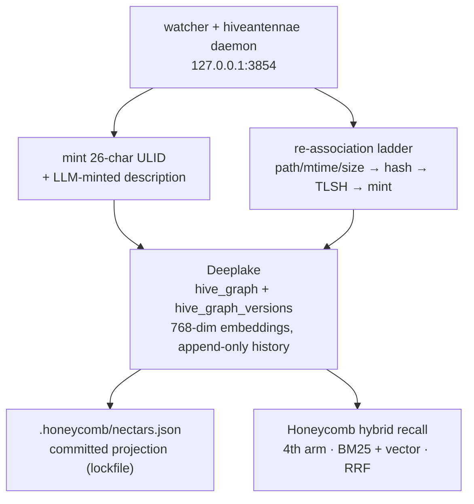

<!-- ───────────────────────────────  HERO  ─────────────────────────────── -->

<p align="center">
  <picture>
    <source media="(prefers-color-scheme: dark)" srcset="assets/brand/nectar-wordmark-on-dark.svg">
    
  </picture>
</p>

<h1 align="center">Nectar</h1>

<p align="center">
  <strong>Every file in your repo gets a stable identity and a meaning your agents can recall.</strong>
</p>

<p align="center">
  <a href="https://www.npmjs.com/package/@legioncodeinc/nectar"></a>
  
  
</p>

<p align="center">
  <a href="https://linktr.ee/marioaldayuz"></a>
  <a href="https://www.legioncodeinc.com"></a>
  <a href="https://deeplake.ai"></a>
</p>

<p align="center">
  <a href="https://github.com/legioncodeinc/nectar"></a>
  <a href="https://discord.gg/GX95YTQypQ"></a>
</p>

<!-- ──────────────────────────────  PARTNERS  ────────────────────────────── -->

<p align="center">
  <a href="https://github.com/legioncodeinc">
    <picture>
      <source media="(prefers-color-scheme: dark)" srcset="assets/brand/legion-logo-dark.svg">
      
    </picture>
  </a>
  &nbsp;&nbsp;&nbsp;&nbsp;&nbsp;&nbsp;
  <a href="https://github.com/activeloopai">
    <picture>
      <source media="(prefers-color-scheme: dark)" srcset="assets/brand/activeloop-full-mark-logo-on-dark.svg">
      
    </picture>
  </a>
</p>

<p align="center"><em>A <a href="https://github.com/legioncodeinc">Legion Code Inc.</a> × <a href="https://github.com/activeloopai">Activeloop</a> collaboration.</em></p>


Files get renamed and agents lose the thread. You refactor, a file moves three directories over, and every memory keyed to its old path is dead weight. Grep finds strings, not meaning, so *"where is the login logic"* comes back empty when the file is called `session-refresh.ts`. **Nectar fixes that.** The daemon mints every file a stable 26-character identity (a *nectar*) plus an LLM-minted description of what the file is for, then tracks that identity through renames, moves, edits, and copy-paste. Ask *"what is this file and why does it exist"* and get an answer. Ask *"everything associated with logins"* and get files scattered across directories that are not named `login-*`. Recall that keys off paths breaks on every refactor; recall that keys off identity does not break at all.


> **New here?** One command and you're on a dashboard. [Jump to Install](#-install-one-command). · **Want the docs?** Everything lives at **[theapiary.sh](https://theapiary.sh)**.


<table>
<tr>
<td width="50%" valign="top">

#### 🛹 For AI Augmented Devs
Your agents finally know what every file *means*, not just what it's named. Rename it, move it, gut it and rewrite half of it: the identity and the description follow the file, so recall keeps working after every refactor instead of quietly going stale.

</td>
<td width="50%" valign="top">

#### 🏢 For Enterprise Teams
Provenance-tracked file identity across repos and teams. Every file's history chain is append-only and auditable: when it was minted, where it moved, what it was forked from, and who described it. A fresh clone inherits the whole thing from a committed projection.

</td>
</tr>
</table>


## ✨ What makes Nectar different

- **Identity never lives in your source.** No serial numbers in comments, no sidecar files bolted next to your code. [ADR-0001](library/knowledge/private/architecture/ADR-0001-minted-nectar-over-source-embedded-serial.md) kills that idea for four concrete reasons; read it before arguing about serials-in-source.
- **Daemon-minted ULIDs.** A nectar is a 26-character ULID minted once by the daemon and persisted in Deeplake. It is not derived from content, so edits don't churn it. It is not derived from path, so moves don't kill it.
- **The re-association ladder.** Five steps, first match wins: path/mtime/size fast path, path match with changed content, exact content-hash match for clean moves, TLSH fuzzy match for move-and-edit, mint fresh. Low-confidence fuzzy matches go to human review, never auto-claimed, because a mis-association corrupts the history chain.
- **Copy-paste as provenance, not ambiguity.** Copy a file and the copy gets a fresh nectar with a `derived_from_nectar` edge back to the original. The fork relationship survives forever, even after the copy diverges.
- **A committed lockfile, not a sidecar.** `.honeycomb/nectars.json` is a regenerable projection of Deeplake state. A fresh clone re-derives identity from it with zero LLM calls and zero network.
- **Hybrid recall you can run today.** `nectar search` runs a per-arm guarded lexical + vector query over described files, fused by Reciprocal Rank Fusion. Folding those hits into Honeycomb's cross-memory recall as a 4th arm alongside sessions, memories, and skills is future work (PRD-013, out of repo).


## 🍯 Features

- 🪪 **Stable file identity.** 26-char ULID per file, minted by the daemon, never reused, never deleted by the ladder. *(registration protocol shipped, PRD-006)*
- 🪜 **5-step re-association ladder.** Survives renames, moves, offline edits, and cold catch-up after your laptop was closed. TLSH fuzzy matching with a confidence-scored review surface. *(mechanics implemented and tested; durable-store wiring lands with daemon integration)*
- 🧬 **Copy-paste provenance.** `derived_from_nectar` + `fork_content_hash` record every fork as a first-class edge.
- 🗄️ **Two Deeplake tables.** `hive_graph` (one row per logical file) + append-only `hive_graph_versions` (one row per observed state, carrying 768-dim embeddings). *(shipped, PRD-005)*
- 🛡️ **Supervised daemon.** `nectar daemon` binds `127.0.0.1:3854`, serves `/health`, registers with Doctor, and installs as an OS service on launchd, systemd, and Windows. *(shipped, PRD-002/003/004)*
- ✍️ **LLM-minted descriptions.** Lazy, batched, cheap: a long-context model describes files on demand, not eagerly, so a full pass on a 2000-file repo lands at about $3.05 and a committed projection makes every subsequent clone free. *(shipped, PRD-007/010/016)*
- 🔒 **Portable projection.** `.honeycomb/nectars.json`, regenerated from Deeplake after every brood and enrich. *(shipped, PRD-011)*
- 🔀 **Hybrid recall.** `nectar search` (and `POST /api/hive-graph/search`) run a per-arm guarded lexical + vector query over described files, fused by Reciprocal Rank Fusion, with a silent BM25 fallback when embeddings are off. Folding these hits into Honeycomb's cross-memory recall as a 4th arm is future work (PRD-013, out of repo). *(search shipped, PRD-012)*


## 🚀 Install (one command)

No Node? No npm? No problem. The installer detects and sets up everything, then **opens a dashboard in your browser**. The terminal is just a progress log; the product is the first thing you touch.

```bash
# macOS / Linux
curl -fsSL https://get.theapiary.sh | sh
```

```powershell
# Windows (PowerShell)
irm https://get.theapiary.sh/install.ps1 | iex
```

That single line installs the Apiary stack and brings the **nectar daemon** up on `127.0.0.1:3854`, supervised by Doctor so it survives crashes and reboots without you thinking about it.

<details>
<summary><strong>Prefer to build from source?</strong></summary>

```bash
git clone https://github.com/legioncodeinc/nectar.git
cd nectar
npm install
npm run build          # tsc → dist/

npm start              # start the daemon (node dist/cli.js daemon)
node dist/cli.js install   # register the OS service unit + the Doctor registry entry
```

Requires Node ≥ 22. `npm run typecheck` and `npm test` are the local gates.

</details>


## 🖥️ Using the dashboard

<!-- screenshot pending: drop nectar dashboard capture into assets/screenshots/dashboard.png -->


Straight talk: Nectar does not ship its own dashboard, and that is by design. The always-on **hive portal** owns the unified dashboard for the whole Apiary and aggregates from each daemon's API, fail-soft per daemon ([ADR-0004](library/knowledge/private/architecture/ADR-0004-hive-portal-daemon-role-and-boundaries.md)). The **Hive Graph page** (PRD-015, spec stage) renders your file graph, identity search, and brood status by fetching Nectar's `/api/hive-graph/*` endpoints through the portal. If the Nectar daemon is down, that page degrades gracefully instead of taking the whole dashboard with it.


## ⌨️ Using the CLI

The `nectar` binary ships with the package. What works today:

```bash
nectar daemon                 # start the daemon (127.0.0.1:3854, /health)
nectar install                # register the OS service unit + Doctor registry entry
nectar uninstall              # deregister the OS service unit
nectar service-status         # report the OS service unit's running state
nectar brood --dry-run        # preview a full-codebase brood's cost locally (no LLM call, no writes)
nectar brood                  # run a full-codebase brood against Deeplake (needs the prerequisites below)
nectar search <query>         # hybrid recall over described files. Flags: --limit N, --json
nectar rebuild-projection     # regenerate .honeycomb/nectars.json from Deeplake
nectar prune --confirm        # prune long-missing nectars from the durable store
nectar review-matches         # review low-confidence identity matches against the durable store
nectar --help
```

`nectar search` reaches a running `nectar daemon` over loopback, so start the daemon first.

### Brood prerequisites

A mutating `nectar brood` (and the boot auto-brood) describes files only when **both** prerequisites are in place:

- `~/.deeplake/credentials.json`, the shared Deeplake credentials `hivemind login` writes.
- Portkey, enabled via `NECTAR_PORTKEY_ENABLED=1`, `NECTAR_PORTKEY_API_KEY`, and `NECTAR_PORTKEY_CONFIG`.

Without them the daemon still boots and serves `/health`, but brooding stays dormant and says so: a startup log line names the missing pieces, `/health` reports `brooding.reason` (for example `credentials_missing` or `portkey_disabled`), and on an interactive terminal the daemon prints the exact configuration steps. `nectar brood --dry-run` and `nectar search` do not need Portkey.

### Telemetry

Nectar sends anonymous, aggregate usage telemetry (install, first run, and version updates) by default, never file contents or paths. Opt out with `NECTAR_TELEMETRY=0` (it also accepts `off` and `false`, case-insensitive) or the cross-tool `DO_NOT_TRACK` standard.


## 🐝 Identity that survives the refactor

```bash
# The daemon minted src/auth/session-refresh.ts a nectar and described it.
# Now gut your directory structure:
git mv src/auth/session-refresh.ts src/middleware/token-lifecycle.ts

# …then ask recall about it:
nectar search "where do we refresh login sessions"
# → src/middleware/token-lifecycle.ts
#   "refreshes JWT claims on each authenticated request,
#    part of the login session lifecycle"
```

Same nectar, same description, new path. The identity followed the file, so the memory never went stale. `nectar search` runs the recall over described files today; folding it into your agent's cross-memory recall as a 4th arm is future work (PRD-013).


## 🏗️ How it works



The daemon watches your source tree. New file: mint a nectar, queue a description. Known file: run the ladder, append a version row, keep the chain. Everything durable lands in Deeplake first; the projection is regenerated from it after every pass; recall unions over the described files alongside sessions, memories, and skills.


## 🧭 Why identity beats paths

Path-keyed memory is a bet that your repo never changes shape. That bet loses every single sprint. Every rename orphans a memory, every directory reshuffle silently detonates the recall your agents depend on, and nobody notices until an agent confidently cites a file that has not existed for three weeks.

Stable identity flips the failure mode. The nectar is the anchor; the path is just the latest observation attached to it. The file can move, get edited offline, or get forked into a new module, and the daemon re-associates it and keeps writing to the same history chain. Memory attached to identity does not rot when the tree churns.

Meaning is the other half. Structural tools can tell you a symbol named `authenticate` exists; they cannot tell you that `session-refresh.ts` is a critical piece of login behavior. An LLM-minted description per file gives your agents the *what is this for* layer that grep and AST graphs structurally cannot provide. Identity keeps the answer alive; meaning makes it worth recalling.


## 💎 Why Deeplake makes the difference

Most code-indexing tools bolt onto a vector-only store, which forces every access pattern through a similarity engine. Nectar needs exact identity joins **and** semantic search, and [**Deeplake**](https://deeplake.ai), the database for AI, gives it both natively:

- **SQL + vector in one engine.** "Latest version row for this nectar" is a deterministic SQL join; "files that mean login" is a vector search over 768-dim embeddings. One store serves both. No second database, no sync problem, no sidecar.
- **Versioned and append-only.** `hive_graph_versions` never overwrites: every observed state of every file stays on disk. That is what makes re-association *auditable*: you can trace exactly when a nectar was carried across a move, at what confidence, and what the file looked like on both sides.
- **Identity table + versions table, cleanly split.** `hive_graph` anchors the stable key; `hive_graph_versions` carries the history. Collapsing them forces you to lose either history or the stable key. Deeplake makes the split cheap.
- **Graceful degradation.** Embeddings off? The embedding column stays NULL and recall falls back to BM25 over titles and descriptions. No error, no quality cliff.

> Nectar stands on the same two shoulders as the rest of the Apiary: **[Deeplake](https://deeplake.ai)** gives identity somewhere durable and queryable to live, and **[Hivemind](https://github.com/activeloopai/hivemind)**, Activeloop's open-source agent-memory project, is the foundation Legion Code extended into Honeycomb.


## 🔌 Supported harnesses

Nectar's file identity and descriptions reach every harness through Honeycomb's recall integration: same daemon boundary, same shared memory, no per-harness wiring of its own.

| | | |
|---|---|---|
| **Claude Code** | **Cursor** | **Codex** |
| **Hermes** | **pi** | **OpenClaw** |


## 🎛️ Other interfaces

- **Dashboard.** The hive portal's Hive Graph page (PRD-015, spec stage), fed by Nectar's `/api/hive-graph/*` endpoints (PRD-008). Nectar deliberately owns no dashboard of its own.
- **MCP server.** Nectar does not ship a separate MCP server; its results surface through Honeycomb's existing MCP recall tools once the recall arm (PRD-013) lands. One boundary, not two.
- **TypeScript SDK.** `@legioncodeinc/nectar` ships a typed `dist/index` entry today. It is early: the daemon and service lifecycle are the real surface right now, and the SDK grows as the API endpoints (PRD-008) land.


<h2 align="center"><a href="https://ideas.theapiary.sh">📍 Status & Roadmap</a></h2>

Nectar is **v0.1.x and production stable**: the PRD program is fully built and tested in production. Shipped: the daemon, health, single-instance lock, OS service install, Doctor supervision, the Deeplake catalog tables, the file registration protocol, brooding, the enricher steady-state loop, the Portkey gateway, the portable projection, embeddings provider switching, service check-in telemetry, the API endpoints, and the recall arm that surfaces nectars through Honeycomb's hybrid recall, rendered in the Hive portal's Hive Graph page. The roadmap and idea board live at [ideas.theapiary.sh](https://ideas.theapiary.sh).


## 🛠️ Development

```bash
npm install
npm run build        # tsc → dist/
npm run typecheck    # tsc --noEmit
npm test             # build + node --experimental-sqlite --test test/**/*.test.ts
npm run daemon       # run the daemon from dist/
npm run clean        # rm -rf dist
```

Requires Node ≥ 22. Every change passes typecheck and the test suite before it lands.


## 🙏 Credits

Nectar exists because two halves fit together:

- **[Activeloop](https://activeloop.ai/)** brings **[Deeplake](https://deeplake.ai/)** (the versioned, multi-modal database for AI with native vector + columnar indexing and hybrid search) and **[Hivemind](https://github.com/activeloopai/hivemind)**, the open-source agent-memory project Honeycomb is built upon.
- **[Legion Code Inc](https://github.com/legioncodeinc)** brings the **multi-tier memory system** (Tier 1 / 2 / 3 keys, summaries, raw), **code base atlas memory architecture**, **auto healing service**, **session priming**, **automatic skill development & propagation**, the **pollinating loop**, the **knowledge graph**, **cross device cross repository cross team skill sharing**, and the daemon architecture that turns Deeplake into a shared brain your coding agents read and write on every turn.


## License

Nectar is licensed under the **GNU Affero General Public License v3.0 or later** ([AGPL-3.0-or-later](LICENSE.md)).

Use it commercially or privately, free of charge. In return: keep the copyright and license notices intact, and if you modify it, your changes ship under the same AGPL license with source available. The "Affero" part is the point: run a modified version as a network service and you owe its source to the users who interact with it. No locking a fork behind a SaaS wall.

© 2026 Legion Code Inc.


<p align="center">
  <sub><strong>Built by <a href="https://github.com/legioncodeinc">Legion Code Inc</a></strong> · <strong>Powered by <a href="https://deeplake.ai/">Activeloop Deeplake</a></strong> · <strong><a href="https://theapiary.sh/">theapiary.sh</a></strong></sub>
</p>

<p align="center"><strong>I am Legion. We are Legion.</strong></p>

<p align="center">#vibewithlegion</p>
