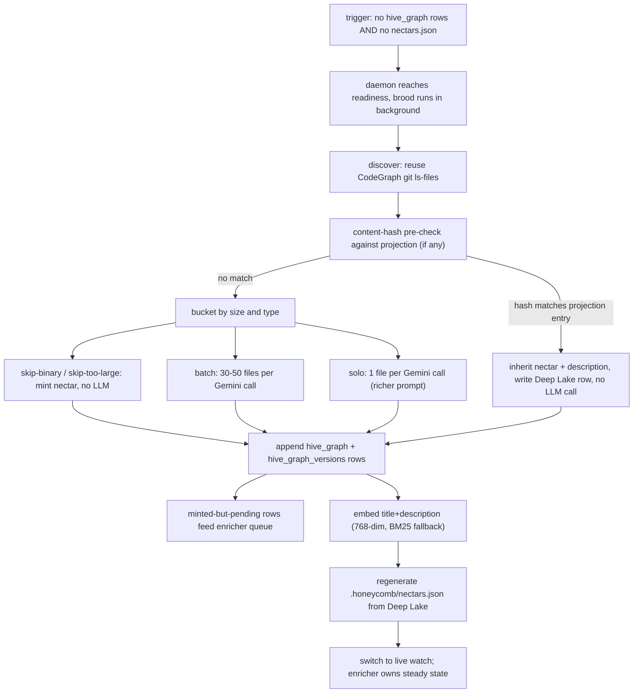
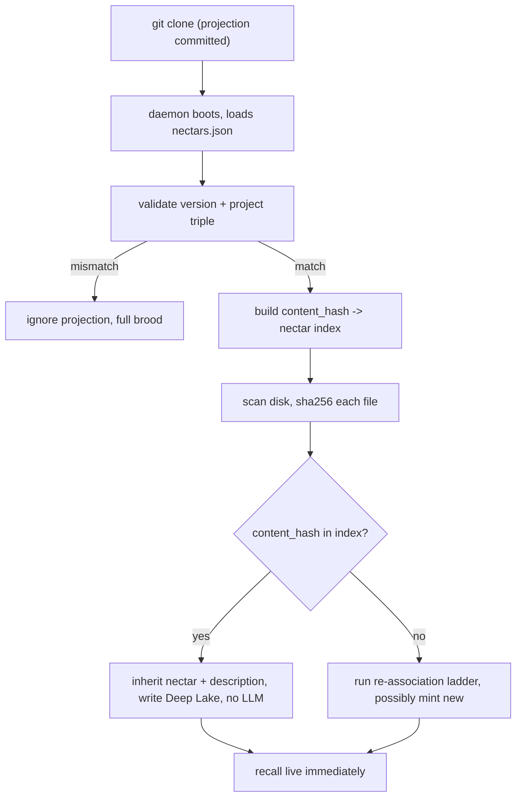

# Brooding Ecosystem Story Arc

> Category: AI | Version: 1.0 | Date: June 2026 | Status: Draft

How brooding composes with the rest of Nectar: a traced first brood from trigger through projection handoff, the content-hash fresh-clone shortcut that lets a teammate's clone skip the LLM cost entirely, and the points where brooding feeds the enricher's pending queue and writes the projection that subsequent clones inherit.

**Related:**
- [`brooding-introduction-and-theory.md`](brooding-introduction-and-theory.md)
- [`brooding-technical-specification.md`](brooding-technical-specification.md)
- [`brooding-user-stories.md`](brooding-user-stories.md)
- [`brooding-conclusion-and-deliverables.md`](brooding-conclusion-and-deliverables.md)
- [`../brooding-pipeline.md`](../brooding-pipeline.md)
- [`../identity-and-reassociation.md`](../identity-and-reassociation.md)
- [`../enricher-and-llm-model.md`](../enricher-and-llm-model.md)
- [`../../data/portable-registry.md`](../../data/portable-registry.md)
- [`../../data/hive-graph-schema.md`](../../data/hive-graph-schema.md)

---

## What this arc shows

Brooding is not an island. It is the bootstrap event that hands off to two other components: the enricher, which owns steady-state description maintenance, and the portable projection, which owns cross-clone inheritance. This document traces a single first brood end to end and then shows the inverse arc — a fresh clone that, because the projection was committed, skips brooding entirely. The mechanics of each stage are in [`brooding-technical-specification.md`](brooding-technical-specification.md); this document is about how the stages connect to the rest of the system.

---

## The first brood: trigger through handoff

The arc begins the first time hiveantennae runs against a project that has no `hive_graph` rows and no committed `.honeycomb/nectars.json`. The daemon reaches readiness, then starts brooding in the background. What follows is the full pipeline, annotated at the points where brooding touches another component.

### Trigger

Brooding fires when the daemon boots against a project with no `hive_graph` rows and no valid projection. It also fires on explicit invocation (`honeycomb nectar brood`, with `--force`, `--limit`, or `--dry-run`). The automatic trigger is non-blocking: the daemon accepts requests before the brood completes, and recall during the brood returns whatever has been described so far.

### Discovery, reusing the CodeGraph

Discovery is deliberately not Nectar's own code. It reuses the CodeGraph's `git ls-files --cached --others --exclude-standard -z` logic, with the same `~/.honeycomb/graph-ignore.json` ignore file and the same manual recursive walk fallback when git is unavailable. The invariant is that Nectar and the CodeGraph never disagree on what counts as a file; a separate ignore list would be a drift source.

### The content-hash pre-check

Before bucketing, each discovered file's `sha256(content)` is checked against the projection's content-hash index — *if a projection exists*. On a true first brood there is no projection, so every file falls through to bucketing. The pre-check earns its keep on subsequent events: a partial brood that was interrupted, or a teammate's clone that already has a projection. A file whose hash matches a projection entry inherits its nectar and description with zero LLM cost and is written straight to Deep Lake.

### Bucketing and calls

Files with no projection match enter the four-bucket classification (skip-binary, skip-too-large, batch, solo) documented in [`brooding-technical-specification.md`](brooding-technical-specification.md). The batch path packs 30–50 small files per Gemini call; the solo path gives large files one call each with a richer prompt; the skip paths mint a nectar and record a terminal skip state with no LLM call.

### Row writing and the enricher handoff

Every description and every skip produces a committed Deep Lake write. This is the point where brooding feeds the enricher: any file minted but left `pending` — because `--limit` capped the brood, or because the brood was interrupted — appears in the enricher's pending-work query. The enricher's `MAX(seq) per nectar WHERE describe_status = 'pending'` semantics mean the steady-state loop fills the gaps on its own cycle. A file in a terminal skip state (`skipped-binary`, `skipped-too-large`) is not enqueued; the skip is final.

### Embedding and the bootstrap write

After a description is written, the enricher computes a 768-dim embedding over `title + ' ' + description` through the embedding provider switch. If the selected provider is unavailable, the embedding is NULL and recall falls back to BM25 — no error, no cliff.

The bootstrap write — the one that only brooding performs — is the initial `.honeycomb/nectars.json`. The daemon regenerates the projection from Deep Lake at the end of the brood (temp file plus atomic rename). This is the artifact that makes the brood durable and shareable: it is what a subsequent clone matches against to inherit identity without re-brooding.

### Handoff to live watch

With the projection written and all reachable files at a terminal `describe_status`, the daemon switches to live watch. From this point, `node:fs.watch` reports disk observations, re-association reconstructs moves through the exact-match steps of the ladder, and the enricher owns description maintenance. Brooding does not re-trigger unless the projection is lost and identity cannot be re-derived.

---

## The inverse arc: a fresh clone with a committed projection

The brood above cost roughly $3.05 for a 2000-file repo, paid by whoever first brooded the project. The inverse arc shows why no one else pays it.

A teammate clones the repo. `.honeycomb/nectars.json` comes with the clone. The daemon boots against the project. Because a valid projection is present, the boot path is:

A fresh clone with a current projection typically achieves **zero LLM calls and zero fuzzy matches**. Every file's content hash matches the projection's content-hash index, every nectar is inherited, and every description is carried over. The daemon writes the inherited rows to the local Deep Lake instance and is immediately ready to serve semantic queries.

This is the content-hash pre-check from the first arc, applied to the whole codebase. The projection is the "known nectars" map that step 3 of the re-association ladder (documented in [`../identity-and-reassociation.md`](../identity-and-reassociation.md)) consults; a content-hash match inherits the nectar directly without Deep Lake cloud sync. The brooding cost was paid once; the clone pays nothing.

When the projection is stale — files on disk have content hashes not in the projection — those files enter the re-association ladder, and genuinely new files get fresh nectars and enter the enricher's pending queue. The brood is not re-run; the enricher fills only the gaps.

---

## The two handoffs, restated

Brooding composes with the rest of Nectar through exactly two handoffs, and they are worth isolating because they are the points where a bug would be most visible.

**Handoff to the enricher's pending queue.** Files minted but not described during brooding (`describe_status = 'pending'`) become the enricher's work. The enricher's latest-pending-per-nectar semantics guarantee that only the most recent content state of each file is described, so intermediate saves within an enricher cycle are never described. This handoff is what makes `--limit` safe: a capped brood leaves pending rows that the enricher drains over time.

**Handoff to the projection's initial write.** Brooding is the only mode that writes the initial `.honeycomb/nectars.json`. The enricher and cold catch-up maintain an already-bootstrapped projection (rewriting it at the end of any cycle that produced new descriptions); brooding creates it. This handoff is what makes brooding load-bearing: without it, a fresh clone has no identity map and must brood from scratch, and the one-time-per-project thesis collapses into a per-clone cost.

Both handoffs are append-only writes to Deep Lake followed by a projection regeneration. Neither requires coordination with the other component — the enricher polls the queue on its own cycle, and the projection is always regenerable from Deep Lake alone. This lack of coordination is deliberate: it is what lets brooding be interrupted and resumed, and what lets the enricher run concurrently with brooding against the same project without locks.

---

## Where this fits in the deep dive

The reasoning behind why brooding batches aggressively and why the projection converts the scan into a one-time cost is in [`brooding-introduction-and-theory.md`](brooding-introduction-and-theory.md). The verbatim bucket criteria, prompts, cost-math table, and resumability state machine are in [`brooding-technical-specification.md`](brooding-technical-specification.md). The engineering behaviors that constrain each stage are in [`brooding-user-stories.md`](brooding-user-stories.md). The deliverable and the explicit non-goals are restated in [`brooding-conclusion-and-deliverables.md`](brooding-conclusion-and-deliverables.md).
