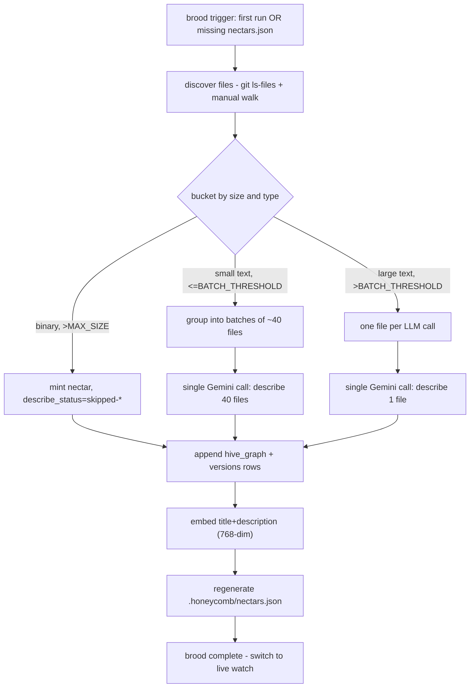
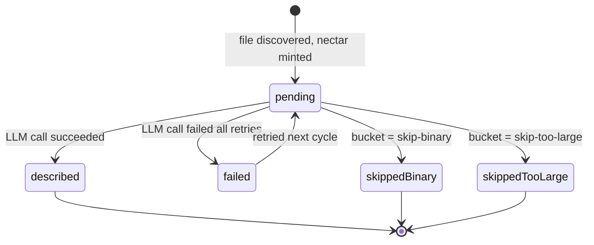

# Brooding Technical Specification

> Category: AI | Version: 1.0 | Date: June 2026 | Status: Draft

The pipeline contract for brooding: the discover→bucket→call→write→embed→projection→done flow, the four bucket criteria verbatim, the batch and solo call shapes with their system prompts, the embedding step, the resumability state machine, the cost-math table, the CLI surface, and the scaling notes. The authoritative reference for anyone implementing or auditing the brooder.

**Related:**
- [`brooding-introduction-and-theory.md`](brooding-introduction-and-theory.md)
- [`brooding-user-stories.md`](brooding-user-stories.md)
- [`brooding-ecosystem-story-arc.md`](brooding-ecosystem-story-arc.md)
- [`brooding-conclusion-and-deliverables.md`](brooding-conclusion-and-deliverables.md)
- [`../brooding-pipeline.md`](../brooding-pipeline.md)
- [`../enricher-and-llm-model.md`](../enricher-and-llm-model.md)
- [`../../data/hive-graph-schema.md`](../../data/hive-graph-schema.md)
- [`../../data/portable-registry.md`](../../data/portable-registry.md)

---

## The pipeline

Brooding is a linear pipeline with one fan-out (bucketing) and one fan-in (row writing). Every stage except the LLM calls is deterministic and cheap; the LLM calls dominate cost and wall-clock time. The flow never blocks daemon readiness — it runs in the background after the daemon is accepting requests, per the same daemon-readiness rule that governs the rest of Honeycomb.



The stages are documented in order below. Each produces a committed Deep Lake write before the next begins, which is what makes the pipeline resumable at every boundary.

---

## Stage 1: file discovery

Discovery reuses the existing CodeGraph discovery logic verbatim. The command is `git ls-files --cached --others --exclude-standard -z`, which honors `.gitignore` exactly, with a manual recursive walk fallback when git is unavailable. The same per-repo ignore file (`~/.honeycomb/graph-ignore.json`) applies.

Nectar does not maintain its own ignore list. A separate list would be a drift source: a file ignored by the CodeGraph but described by Nectar (or vice versa) would produce two disagreeing views of the codebase. The invariant is that if a file is in the CodeGraph's discovery set, it is in Nectar's; if it is not, it is not.

The one addition over the CodeGraph's discovery is a **content-hash pre-check** against the portable projection, when one exists. A file whose `content_hash` matches a projection entry inherits that nectar and description without re-brooding. This is the mechanism by which a fresh clone of a project that already committed `.honeycomb/nectars.json` skips the LLM cost entirely. Only files with no projection match enter the bucketing flow that follows.

---

## Stage 2: bucketing

Files are bucketed by size and parsability before any LLM call is made. The buckets determine the call shape and therefore the cost. The criteria are fixed and tuned against the model's context window and per-call economics.

| Bucket | Criteria | LLM call shape |
|---|---|---|
| **Skip-binary** | First 8KB contains NUL bytes, or extension is in a known-binary list (`.png`, `.jpg`, `.pdf`, `.woff2`, …) | No LLM call. Mint nectar, set `describe_status = 'skipped-binary'`, leave `title = filename`, `description = ''`. |
| **Skip-too-large** | `size_bytes > MAX_DESCRIBE_SIZE` (default 256 KB) | No LLM call. Mint nectar, set `describe_status = 'skipped-too-large'`, leave `title = filename`. The structural CodeGraph still extracts symbols; Nectar just does not describe it semantically. |
| **Batch** | Text, `size_bytes <= BATCH_FILE_SIZE` (default 4 KB), and the cumulative batch size is under `BATCH_TOTAL_SIZE` (default 100 KB) | 30–50 files per LLM call. |
| **Solo** | Text, `size_bytes > BATCH_FILE_SIZE` but `<= MAX_DESCRIBE_SIZE` | One file per LLM call. |

The thresholds are tuned against Gemini 2.5 Flash's 1M-token context window and per-call economics. Four kilobytes of source is roughly one thousand tokens; forty files is roughly forty thousand tokens of input, well under the window. The output — one title plus one one-to-three-sentence description per file — is roughly 50–100 tokens per file, roughly two-to-four thousand tokens per batch. The full cost math appears later in this document.

The skip buckets are not failures. A binary or oversized file still gets a nectar and a version row; it simply has no semantic description. The structural CodeGraph continues to extract symbols from large source files; the two layers remain independent and both ship.

---

## Stage 3a: the batch call

A batch call sends the LLM a JSON array of `{ nectar, path, content }` objects and asks for a JSON array of `{ nectar, title, description, concepts }` back, in the same order. The system prompt is short and fixed:

```
You are describing source files in a codebase for a semantic search index.
For each file, return:
- title: <=80 chars, a human-readable name for what this file IS (not its path).
- description: 1-3 sentences, what this file does and what it is for.
- concepts: 1-5 lowercase tags for cross-file linking (e.g. "auth", "session", "jwt").
Respond as a JSON array, one object per input file, in input order.
```

The response is parsed and validated against the expected shape. The validator checks both the per-entry structure and the array length: a response with the wrong number of entries is treated as malformed. Malformed entries are re-tried solo (one file per call) or, if still malformed, marked `describe_status = 'failed'`. Successfully described entries are written to the corresponding `hive_graph_versions` rows.

Batching collapses per-file cost by packing many files into one round-trip. The practical batch cap is 30–50 files, governed by output-token reliability of structured JSON rather than the input context ceiling.

---

## Stage 3b: the solo call

Large files get a solo call with a slightly richer prompt. The solo prompt allows a longer description — three to five sentences instead of one to three — and asks for a "primary symbol": the most important function, class, or type in the file. The primary symbol becomes a hint for cross-linking the semantic layer to the structural CodeGraph.

Solo calls are the most expensive path per file, which is why the threshold (`MAX_DESCRIBE_SIZE`, 256 KB) is high. Only genuinely large files pay the one-file-per-call cost. Files between the batch threshold (4 KB) and the max-describe size land here; files above the max-describe size land in skip-too-large instead and pay nothing.

---

## Stage 4: row writing

After a description is produced (batch or solo) or a skip is decided, the brooder appends the corresponding rows to Deep Lake:

- A `hive_graph` row keyed by the freshly-minted nectar ULID, carrying identity, provenance, and the tenancy triple.
- A `hive_graph_versions` row keyed by `(nectar, content_hash)`, carrying the path, metadata, and the LLM-minted `title`, `description`, `concepts`, plus `describe_status` set to `described` (or `skipped-binary` / `skipped-too-large` for skips).

The full column-by-column contract for both tables is in [`../../data/hive-graph-schema.md`](../../data/hive-graph-schema.md). Every write is committed before the next file is processed, which is what makes the pipeline resumable at every boundary.

---

## Stage 5: embedding

After the description is written, the enricher computes a 768-dimensional embedding over `title + ' ' + description` through the configured embedding provider. The default provider is local `nomic-embed-text-v1.5` (q8 quantization); the hosted opt-in provider is Cohere via Portkey.

The 768-dimensionality is load-bearing: it matches `sessions.message_embedding` and `memory.summary_embedding` deliberately, so the hybrid recall pipeline's vector index queries all three tables through one consistent index. A different dimensionality would force a separate index and a separate recall arm, doubling query cost.

If embeddings are off, the optional local provider was not installed, or the selected provider failed to warm up, the embedding column is left NULL and recall silently falls back to BM25 over `title` and `description`. There is no error and no quality cliff: the degradation is identical to what session and memory recall exhibit when embeddings are unavailable.

---

## Stage 6: projection regeneration

At the end of brooding (or on graceful interruption), the daemon regenerates `.honeycomb/nectars.json` from Deep Lake. The projection is a content-hash-keyed map of the latest described version of each nectar. It is written atomically (temp file plus rename) so a crashed regeneration leaves the old projection rather than a partial one.

The projection is the final step that makes the brood durable and shareable. Its full format, validation, and commit discipline are documented in [`../../data/portable-registry.md`](../../data/portable-registry.md).

---

## The cost math

Brooding cost is dominated by LLM input tokens; descriptions are short, so output cost is comparatively minor. The representative workload is a 2000-file TypeScript repository. The math:

| Bucket | File count | Avg size | Tokens per file | Call shape | Calls | Total input tokens |
|---|---|---|---|---|---|---|
| Skip-binary | ~200 | — | 0 | — | 0 | 0 |
| Skip-too-large | ~20 | — | 0 | — | 0 | 0 |
| Batch (≤4KB) | ~1500 | 2 KB | ~500 | 40 files/call | 38 | ~750K |
| Solo (>4KB, ≤256KB) | ~280 | 20 KB | ~5000 | 1 file/call | 280 | ~1.4M |
| **Total** | **2000** | | | | **318** | **~2.15M input tokens** |

At Gemini 2.5 Flash pricing, the ≤200K tier applies per call (per-call inputs are well under 200K even though cumulative project tokens exceed it):

- Input: ~2.15M × $0.30/M = **$0.65**
- Output: ~318 calls × ~3K tokens avg = ~950K × $2.50/M = **$2.40** (output is the larger cost because descriptions are richer than input file contents on a per-token basis)
- Embedding: ~1780 non-skipped files × 768-dim via local daemon = **$0** (local, optional dependency)
- **Total brooding cost for a 2000-file repo: ~$3.05**

The cost scales linearly with file count, with the batch/solo ratio holding roughly constant. A 10000-file monorepo broods for ~$15. A 200-file microservice broods for ~$0.30. The full model-comparison table (Gemini 2.5 Flash against Haiku, GPT-4.1, and GPT-4o-mini) is in [`../enricher-and-llm-model.md`](../enricher-and-llm-model.md).

---

## Resumability state machine

Brooding is resumable. Every nectar mint and every description write is a committed Deep Lake write, not an in-memory accumulation. The state of a brood is fully derivable from `hive_graph_versions.describe_status` — there is no "brood in progress" lockfile or partial-state marker.



On resume after an interruption (laptop closed, process crash, Ctrl-C), the next boot reads `describe_status` and continues:

1. Files already brooded have `describe_status != 'pending'` and are skipped.
2. Files minted but not yet described have `describe_status = 'pending'` and are re-enqueued.
3. Files not yet minted are discovered fresh and enter the bucketing flow.

This is the same append-only, resumable pattern Honeycomb uses for the pollinating loop and the skillify miner: the durable store records progress as a side effect of doing the work, so progress is not duplicated in a separate marker that could drift.

---

## CLI surface

Brooding triggers automatically the first time hiveantennae runs against a project with no `hive_graph` rows (or no `.honeycomb/nectars.json`). It can also be triggered explicitly:

```bash
honeycomb nectar brood                  # full brood, respects existing descriptions
honeycomb nectar brood --force          # re-describe every file, ignore existing
honeycomb nectar brood --limit 100      # brood at most 100 pending files (cost cap)
honeycomb nectar brood --dry-run        # show buckets and cost estimate, no LLM calls
```

The four flags compose: `--dry-run` runs discovery and bucketing, prints the estimated call count and cost, and exits without making any LLM calls. `--limit` caps the number of pending files processed, bounding the cost of an explicit invocation. `--force` resets already-described rows back to `pending` so every non-skipped file is re-described (used after a model swap, documented in [`../enricher-and-llm-model.md`](../enricher-and-llm-model.md)). `--dry-run` is the recommended first step on any new project to sanity-check the cost before committing to it.

---

## Scaling notes

### Batch and solo: linear in file count

The batch path cost is linear in the number of small files, divided by the batch size. The solo path cost is linear in the number of large files, one call each. Both hold their ratio as repos grow, which is why the per-file cost is predictable across repo sizes.

### TLSH fuzzy match: O(N×M), mitigated by size-bucketing

The fuzzy-match step of cold catch-up (TLSH comparison, used when the daemon reboots after offline moves-and-edits) is O(N × M) where N is missing files and M is on-disk files. For a 2000-file repo this is roughly four million comparisons, each on the order of microseconds — about four seconds of native TLSH work on a cold boot. For a 100K-file monorepo it becomes roughly ten billion comparisons and is no longer cheap.

The v1 mitigation is size-bucketing: TLSH fingerprints are compared only against files within ±20% of the same size, which cuts the search space by roughly 95% and keeps the 100K-file case under a minute. A future v2 could add a minhash-based LSH pre-filter if monorepo cold-boot latency becomes a measured problem. This is a cold-catch-up concern, not a brooding concern — brooding mints fresh and never consults TLSH — but the scaling note lives here because it bounds the worst-case cost of the broader identity pipeline that brooding bootstraps.

---

## What this specification does not cover

The conceptual reasoning behind each design choice — why brooding is a distinct mode, why long context is load-bearing, why the projection converts the scan into a one-time cost — is in [`brooding-introduction-and-theory.md`](brooding-introduction-and-theory.md). The end-to-end flow from trigger through projection handoff, including the fresh-clone shortcut, is traced in [`brooding-ecosystem-story-arc.md`](brooding-ecosystem-story-arc.md). The deliverable and the explicit non-goals (not on every boot, not blocking daemon readiness, both layers ship) are restated in [`brooding-conclusion-and-deliverables.md`](brooding-conclusion-and-deliverables.md).
