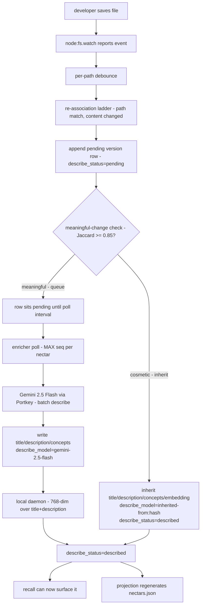
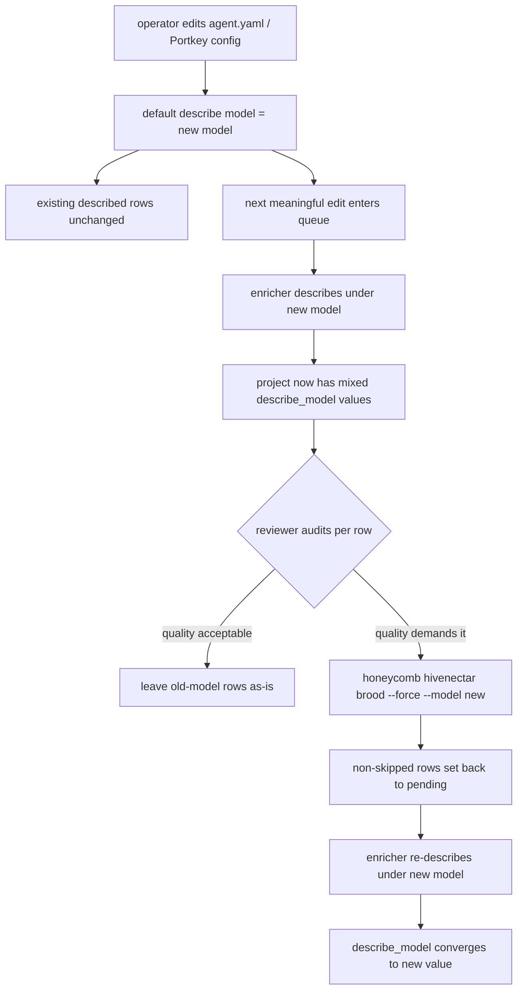

# Enricher Ecosystem Story Arc

> Category: AI | Version: 1.0 | Date: June 2026 | Status: Draft

How the enricher composes with the watcher, the meaningful-change heuristic, the LLM call, the embedding provider stack, recall, and the projection — traced as a steady-state edit end to end, plus the model-swap arc that follows.

**Related:**
- [`../enricher-and-llm-model.md`](../enricher-and-llm-model.md)
- [`enricher-technical-specification.md`](enricher-technical-specification.md)
- [`enricher-introduction-and-theory.md`](enricher-introduction-and-theory.md)
- [`enricher-user-stories.md`](enricher-user-stories.md)
- [`enricher-conclusion-and-deliverables.md`](enricher-conclusion-and-deliverables.md)
- [`../identity-and-reassociation.md`](../identity-and-reassociation.md)
- [`../../data/recall-integration.md`](../../data/recall-integration.md)
- [`../../data/source-graph-schema.md`](../../data/source-graph-schema.md)

---

## Why the arc matters

The enricher is not a standalone component. It is one stage in a pipeline that begins at the filesystem and ends at recall, and its behavior is only well-defined in the context of the stages before and after it. This document traces the full arc of a single steady-state edit — from the keystroke that changed a file to the moment an agent's recall query can surface the refreshed description — and then traces the parallel arc of a model swap, which follows the same row lifecycle under a different `describe_model`. The two arcs share the same loop; they differ in what triggers them and what the `describe_model` column records.

---

## The lazy loop, end to end

The diagram below is the steady-state loop in one frame. Each node is an observable state transition on `source_graph_versions` or a side effect on a sibling system. Read it top to bottom: a change is detected, debounced, judged, optionally described, embedded, and finally made recallable.

The shape to notice is the branch at the heuristic. A cosmetic change short-circuits the LLM entirely: the row is marked `described` with an inherited description and never touches the model. A meaningful change takes the longer path through the queue, the poll, the LLM call, and the embedding. Both branches converge at `describe_status = 'described'`, which is the single gate recall cares about. The loop's correctness does not depend on which branch ran; it depends only on the row reaching `described`.

---

## Tracing a meaningful edit, step by step

Consider a developer who edits `src/middleware/session-refresh.ts` to change the JWT skew tolerance from 5 minutes to 10 minutes. The arc:

1. **Watcher detects change.** `node:fs.watch` reports an observation for the path. The event enters the per-path debounce window. If the developer saves again within the window, the events collapse to one signal.

2. **Re-association runs.** The debounced signal enters the re-association ladder. The path matches an existing nectar; the content hash differs from the latest version. The ladder appends a new `source_graph_versions` row with `(nectar, new_content_hash, seq = prev_seq + 1)`, `describe_status = 'pending'`, and `title`/`description`/`embedding` left empty.

3. **Meaningful-change heuristic judges the delta.** The heuristic tokenizes the old and new content and computes Jaccard similarity. Changing a numeric constant from 5 to 10 is a small token delta; whether it crosses the 0.85 threshold depends on file size and structure. For a typical middleware file, a one-constant edit stays above threshold and the change is judged cosmetic — the row inherits the previous description and is marked `described` with `describe_model = inherited-from:<prev_content_hash>`. If the edit were larger (a renamed function, a new branch), similarity would drop below threshold and the row would queue for a real description.

4. **(Meaningful path only) The enricher picks it up.** On the next poll (within 30 seconds by default), the enricher selects the latest pending version per nectar. Intermediate pending rows for the same nectar are skipped by the `MAX(seq)` selection.

5. **(Meaningful path only) Gemini call via Portkey.** The enricher batches the file with any other pending files and issues a single describe call to Gemini 2.5 Flash through the Portkey gateway. Portkey handles transient 429/5xx with exponential backoff.

6. **(Meaningful path only) Write the description.** The response is validated; `title`, `description`, and `concepts` are written to the row. `describe_model` is set to `gemini-2.5-flash`, `describe_status` to `described`, `described_at` to the run timestamp.

7. **Embed via provider switch.** The enricher computes a 768-dim embedding over `title + ' ' + description` using the configured provider: local nomic by default or Cohere via Portkey when opted in. If the provider is unavailable, the embedding stays NULL and the row is still marked `described` — recall falls back to BM25.

8. **Recall can now surface it.** The row has `describe_status = 'described'`, so the recall arm's `latest-per-nectar` subquery includes it. An agent query for "session refresh" now returns this file alongside whatever structural CodeGraph hits exist.

9. **Projection regenerates.** The projection sync regenerates `.honeycomb/nectars.json` from Deep Lake, so the refreshed description is portable to a fresh clone.

The end-to-end latency, for a meaningful edit, is roughly the poll interval plus one LLM round-trip plus one embedding call — typically under a minute. For a cosmetic edit, the latency is the debounce window plus the re-association step — typically a few seconds, and no LLM cost.

---

## The model-swap arc

A model swap follows the same row lifecycle but changes what the `describe_model` column records. The arc:

1. **Operator changes config.** The operator edits `agent.yaml` / Portkey config to point the default describe model at, say, Claude Haiku 4.5. No code changes; no rows touched.

2. **Existing rows keep their descriptions.** Rows already marked `described` keep their existing `title`, `description`, `concepts`, `embedding`, and `describe_model` values. Recall continues to surface them unchanged. Existing descriptions are valid until proven otherwise.

3. **New pending rows get the new model.** The next file whose content meaningfully changes enters the queue as `pending`; the enricher describes it under the new model and writes `describe_model = claude-haiku-4.5`. From this point forward, the project's `source_graph_versions` table carries a mix of old-model and new-model rows, distinguishable by `describe_model`.

4. **(Optional) Selective re-description of old-model rows.** If the operator decides the old-model descriptions are no longer good enough, they run `honeycomb hivenectar brood --force --model <new>`, which sets all non-skipped rows back to `pending`. The enricher re-describes them on subsequent cycles, overwriting the old descriptions and updating `describe_model` to the new value. Skipped rows (`skipped-binary`, `skipped-too-large`) are not reset. A middle path — re-describe only rows where `describe_model` matches the old model identifier — is supported by filtering on that column.

The arc's key property is that nothing happens automatically beyond new rows picking up the new model. The re-description decision is a human one, made on the evidence of the `describe_model` column, and executed through an explicit command. The system never silently re-describes a project on a config change.

---

## The two arcs in one frame

The steady-state arc and the model-swap arc share the enricher loop, the embedding step, the recall gate, and the projection sync. They differ only at the trigger and at what `describe_model` records. The table below isolates the differences:

| Aspect | Steady-state edit arc | Model-swap arc |
|---|---|---|
| Trigger | A meaningful content change | An operator config edit |
| Rows touched at trigger | The edited file's new version row | None (config change is non-destructive) |
| `describe_model` written | Current default model | Current default model (new value after swap) |
| Existing rows affected | No | No, unless `--force` re-description runs |
| Reaches `described` via | LLM call or inheritance | LLM call (no inheritance across a forced re-describe) |
| Recall visibility | Gated on `described` | Gated on `described` |

Reading the two arcs together is what makes the enricher's behavior legible. The loop is the same; the inputs differ. An operator who understands the steady-state arc already understands the mechanics of the model-swap arc — they need only learn that a swap is a trigger that touches no rows directly and that re-description is an explicit, opt-in step gated by the `describe_model` column's auditability.

---

## Where the arc hands off

The enricher's arc terminates at two handoffs, both of which are documented elsewhere but worth naming here so the arc is complete.

The **recall handoff** happens at `describe_status = 'described'`. From that point, the row participates in the guarded Hivenectar recall arm, filtered to the latest described version per nectar. The recall layer does not know or care whether the description came from brooding, from an enricher LLM call, or from inheritance — it only checks the status and the tenancy scope.

The **projection handoff** happens at the projection-sync step. The refreshed description flows into `.honeycomb/nectars.json`, the portable lockfile that makes a fresh clone inherit descriptions without re-brooding. The projection is regenerable from Deep Lake, so this handoff is a cache update, not a state change.

Both handoffs are one-way from the enricher's perspective: the enricher writes to Deep Lake and lets recall and the projection read from it. There is no feedback path from recall or the projection back into the enricher. This is what makes the loop composable — the enricher can be stopped, restarted, or reconfigured without coordinating with the systems that consume its output, because they communicate only through the shared `source_graph_versions` table and its `describe_status` gate.
