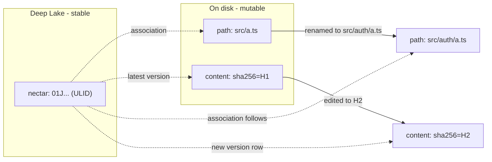
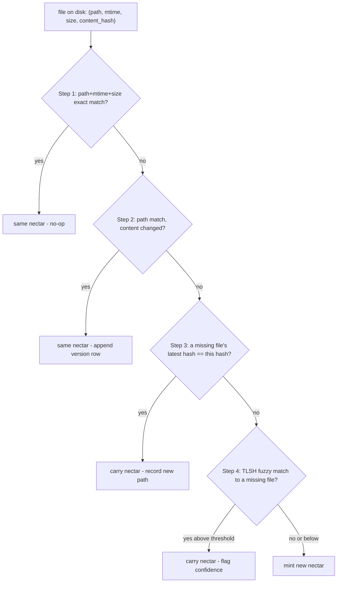

# Identity and Re-association

> Category: AI | Version: 1.2 | Date: July 2026 | Status: Active

The core algorithm of Nectar: how a ULID nectar is minted, how it survives edits and renames and moves, how the daemon re-associates a nectar to a file on disk after offline changes, and how copy-paste becomes a first-class provenance edge instead of a history-loss event.

**Related:**
- [`../overview.md`](../overview.md)
- [`../data/hive-graph-schema.md`](../data/hive-graph-schema.md)
- [`brooding-pipeline.md`](brooding-pipeline.md)
- [`enricher-and-llm-model.md`](enricher-and-llm-model.md)
- [`../data/portable-registry.md`](../data/portable-registry.md)
- [`../architecture/ADR-0001-minted-nectar-over-source-embedded-serial.md`](../architecture/ADR-0001-minted-nectar-over-source-embedded-serial.md)
- [`../reference/prior-art-crosswalk.md`](../reference/prior-art-crosswalk.md)

---

## Why identity is a daemon concept, not a file property

A file on disk has no stable identity of its own. Its path can change (rename, move). Its content can change (edit). Its inode can change (copy, or a save-that-replaces). The only thing that persists across all of these is *the fact that an observer once decided this is the same logical file it saw before*. That decision is the nectar: a 26-character ULID minted by the hiveantennae daemon and stored in Deep Lake, never written into the file itself.

The nectar is stable because it is **not derived from anything about the file**. It is not a hash of the content (that changes per edit). It is not a function of the path (that changes per move). It is not embedded in the source (that collides with the license header and breaks on copy-paste, see `ADR-0001`). It is a pure minted identifier, created once, associated to the file by the daemon's ongoing observation of disk.

This is the same pattern every IDE uses to track "this is the same file I had open" across a rename, and the same pattern rsync and Dropbox use to detect moves without re-transferring. It is not novel; it is correct. The novelty in Nectar is combining minted identity with LLM-minted description and Deep Lake persistence — the identity layer alone is well-trodden ground (see `../reference/prior-art-crosswalk.md`, particularly Aura's "identity anchor" and Mimir's `SymbolId`).



The nectar's association to a path is *metadata on the nectar record*, not a property of the path. When the path changes, the metadata changes; the nectar does not.

---

## Minting: ULID, once, by the daemon

A nectar is minted in exactly two situations:

1. **Brooding** — the first time hiveantennae sees a file it has no record of (initial scan, or a genuinely new file the watcher detected).
2. **Copy event** — the daemon detected that a new path's content matches an existing file's current content, and mints a fresh nectar for the new path with `derived_from_nectar` pointing at the source.

Minting uses ULID (Universally Unique Lexicographically Sortable Identifier), 26 characters, Crockford base32, uppercase. A ULID is generated as `timestamp_ms (48 bits) + randomness (80 bits)`, which gives two properties a plain UUIDv4 lacks:

- **Lexicographic sortability by creation time.** "Files created in the last hour" is a string-prefix range scan, no timestamp parsing. This matters for cold catch-up after downtime: the daemon can ask "what nectars were minted while I was offline" and get them in creation order.
- **Collision resistance without a registry.** The 80 bits of randomness per millisecond makes a collision astronomically unlikely across a single workspace, so minting is lock-free and distributed-safe — two harnesses minting in parallel cannot collide.

```typescript
import { ulid } from "ulid";

function mintNectar(): string {
  return ulid(); // e.g. "01J2X4F6K8ME7N9P1Q3R5T7V9WX"
}
```

The nectar is written to `hive_graph.nectar` as the primary key. The `created_at` column is set to the decoded ULID timestamp in ISO 8601 (so `nectars.json` and dashboards have a human-readable creation time without ULID parsing). The nectar is **never re-derived and never recomputed** — if the minting logic changes, old nectars keep their values; new nectars use the new logic. This is what makes identity stable across daemon upgrades.

---

## The re-association ladder

The hardest problem in Nectar is cold catch-up: the daemon boots after the laptop was closed, the user moved and edited a dozen files offline, and now disk does not match Deep Lake. The daemon must look at each file on disk and decide *which existing nectar (if any) it is*, or mint a new one. This is the re-association ladder, evaluated top-down per file — first match wins.



### Step 1: `(path, mtime, size)` exact match

The fast path. If a file at a known path has the same mtime and size as the last time hiveantennae observed it, the daemon treats it as unchanged without reading or hashing the content. This is the same optimization rsync uses (`--size-only` is the degenerate form). It covers the vast majority of files on a typical boot — most files were not touched.

The mtime/size pair is stored in `hive_graph_versions.mtime_observed` and `hive_graph_versions.size_bytes` for the latest version of each nectar. The check is a single SELECT against the latest-version index, scoped by tenancy and path.

### Step 2: path match, content changed

The path exists in Deep Lake under some nectar, but the content hash differs. This is a normal edit. The daemon:

1. Reads the file, computes `sha256(content)`.
2. Appends a new `hive_graph_versions` row with `(nectar, content_hash, seq = prev_seq + 1)`, the new path/metadata, and `title/description/embedding = NULL` (`describe_status = 'pending'`).
3. Updates `hive_graph.last_update_date`.
4. Enqueues a lazy enrich job for the new version.

The nectar is unchanged. The previous version row stays in place — the history chain is append-only.

### Step 3: exact content-hash match to a missing file

This is the move detector. The daemon keeps a map of "files that used to exist but do not anymore" (the set diff between Deep Lake's known paths and disk's current paths). When a new path's content hash exactly matches a missing file's *latest* version hash, the daemon concludes the file was moved (or renamed) without modification.

The action:

1. Append a new `hive_graph_versions` row for the existing nectar with the new path and the same `content_hash` (composite key `(nectar, content_hash)` is unique, but `seq` increments and `path` differs, so the row is new).
2. The previous version row's path is now stale but retained as history.
3. Enqueue no enrich job — the content is unchanged, so the existing description still applies.

Exact-hash matching is high-confidence. There is no ambiguity. The only failure mode is a *coincidental* hash collision, which is cryptographically negligible for sha256.

### Step 4: fuzzy content match (TLSH) to a missing file

The hard case: the file was moved *and* edited while the daemon was offline, so the content hash no longer matches anything. The daemon computes a TLSH (Trend Micro Locality-Sensitive Hash) fingerprint of the file and compares it against the TLSH fingerprints of missing files. TLSH is purpose-built for "are these two files near-duplicates" and tolerates small edits, whitespace changes, and reformatting that would break a cryptographic hash.

```typescript
// Pseudocode — actual TLSH impl is a native addon or WASM build
import { tlshHash, tlshDiff } from "tlsh";

function bestFuzzyMatch(
  newFileFingerprint: string,
  candidateMissing: Array<{ nectar: string; fingerprint: string }>,
): { nectar: string; distance: number } | null {
  let best: { nectar: string; distance: number } | null = null;
  for (const candidate of candidateMissing) {
    const distance = tlshDiff(newFileFingerprint, candidate.fingerprint);
    if (!best || distance < best.distance) best = { nectar: candidate.nectar, distance };
  }
  return best && best.distance <= FUZZY_THRESHOLD ? best : null;
}
```

The match is **scored, not binary**. The `hive_graph_versions` row appended for a fuzzy match carries a `confidence` field (1 − normalized distance). If confidence is below a "high" band (configurable, default tuned during brooding), the daemon does **not** silently claim the nectar - instead it surfaces the candidate match to the dashboard (or to an interactive `nectar review-matches` command) for human confirmation. Low-confidence matches mint a new nectar instead.

This step primarily fires after cold restart with offline changes, but it is not limited to that mode. Nectar mirrors Honeycomb's `node:fs.watch` pattern, which reports uncorrelated `(eventType, filename)` observations rather than a rich move object. During live operation the debounced event stream updates the missing-files and new/changed-files sets; step 3 reconstructs ordinary moves by exact hash, and step 4 handles move-and-edit cases when exact hash evidence is not enough.

### Step 5: nothing matches

The file is genuinely new. Mint a fresh nectar, write the `hive_graph` row, append the initial `hive_graph_versions` row, enqueue enrichment.

---

## Copy-paste as a first-class provenance edge

Copy-paste is the case that source-embedded serials handle worst and that minted identity handles best. The scenario:

1. File **A** exists with nectar N1, current content hash H1.
2. The user copy-pastes A to a new path **B** (Ctrl+C / Ctrl+V in a file explorer, or `cp a.ts b.ts`, or duplicate-in-IDE).
3. The `node:fs.watch` intake reports B as a new or changed path. B has no nectar. B's content is H1 (identical to A's).

The daemon's logic:

```typescript
function classifyNewFile(
  newPath: string,
  newHash: string,
  knownNectars: Map<string, { nectar: string; latestHash: string }>, // by latest hash
): { action: "mint" | "copy"; sourceNectar?: string } {
  const existing = knownNectars.get(newHash);
  if (existing && existing.latestHash === newHash) {
    // B's content matches some existing file's *current* content.
    // A different file with the same current content = copy event.
    return { action: "copy", sourceNectar: existing.nectar };
  }
  return { action: "mint" };
}
```

The daemon mints B a **fresh nectar N2** and sets `hive_graph`:

```
nectar: N2
kind: 'file'
created_at: <now>
derived_from_nectar: N1      # provenance back to A
fork_content_hash: H1        # A's content at the moment of copy
```

The result is what the source-embedded-serial model cannot produce: B is its own identity (N2), and yet it is permanently linked to A (N1) through `derived_from_nectar`. When B is later edited and its content diverges from A, the link survives. The Obsidian-style interlink view can render "B was forked from A at <time>" indefinitely.

This is the inverse of what content-hash-only identity produces. With pure content hashing, A and B were indistinguishable at copy time (same hash), and the moment B was edited, all trace of the A→B relationship was lost. With minted identity + `derived_from_nectar`, the relationship is explicit, durable, and queryable.

The detection has one ambiguity: two genuinely independent files that happen to have identical content (two empty `.gitkeep` files, two copies of a boilerplate license). The daemon treats both as copy events and sets `derived_from_nectar` on whichever was minted second. This is rarely wrong in practice (boilerplate duplication *is* a copy relationship, semantically), and when it is wrong the cost is low: a spurious `derived_from` link in an interlink view. A future enrichment pass could classify these as `derived_kind: 'coincidental'` vs `derived_kind: 'fork'` if the distinction proves valuable.

---

## Live watch vs cold catch-up

The re-association ladder is the same algorithm in both modes, but the *distribution* of ladder steps differs sharply:

| Step | Live watch frequency | Cold catch-up frequency |
|---|---|---|
| 1 (exact path/mtime/size) | rare (the watcher already knows nothing changed) | **dominant** — most files are untouched |
| 2 (path match, content changed) | **dominant** — normal edits | common — offline edits |
| 3 (exact hash → missing file) | common — debounced events plus the missing-files set reconstruct ordinary moves | common — offline renames |
| 4 (fuzzy TLSH match) | rare — live move-and-edit or incomplete event evidence | occasional — offline move-and-edit |
| 5 (mint new) | common — new files | occasional — genuinely new files |

Live watch is easier than cold catch-up because the daemon sees a fresh stream of disk observations, but `node:fs.watch` does not provide correlated move semantics. A rename or move may arrive as `rename`/`change` observations with only a filename, so the daemon debounces the path, refreshes the missing-files set, hashes the new path when needed, and lets step 3 carry the nectar when the new content matches a missing file's latest hash. The ladder is therefore the source of move reconstruction; the watcher is only the signal that work is needed.

Cold catch-up is the hard case because all the daemon has is the final state of disk, with no event stream to correlate. This is where steps 3 and 4 do their work, and where the `confidence` field on fuzzy matches earns its keep — the daemon cannot ask "was this a move or a coincidence?" of a human in real time, so it surfaces low-confidence matches for review instead of guessing.

---

## Re-association does not delete nectars

A nectar, once minted, is never deleted by the re-association ladder. If a file on disk has no re-association candidate (step 5), the daemon mints a new nectar — it does not scan for "orphaned" nectars whose paths are missing and reuse them. Orphaned nectars (the file was deleted, not moved) remain in Deep Lake as history.

Deletion of nectar records is a separate, explicit operation: `nectar prune --confirm` removes nectars whose latest version's path has been missing for longer than a configurable grace period (default 30 days). The grace period exists because a file that is "missing" might be on a branch that is currently checked out elsewhere, or might come back after a merge. Pruning is conservative and human-triggered.

This append-only-ish behavior (nectars are minted freely, pruned rarely, never reused) is what makes the history chain trustworthy. A nectar's version chain is a complete record of every observed state of the logical file it represents, from minting to (eventually) archival.

---

## Concurrent writes and seq collisions

The ladder appends version rows (steps 2, 3, 4, 5), and the enricher independently appends a durable describe row when it fills a description. Both write to `hive_graph_versions` for the same nectar, and each new row takes the next `seq`, the per-nectar counter whose maximum defines "latest version." A live incident showed those two writers can collide: renaming a watched file while its describe append was still in flight produced a duplicate `(nectar, seq)` pair, because the enricher and the registration bridge allocated the seq from independent views of the store. The enricher read the backend `MAX(seq)` while Deeplake's read-after-write lag still hid a row the bridge had just written, and the bridge computed its seq from a private in-memory mirror that could not see the enricher's durable append. Both landed on the same seq. Latest-version resolution then became ambiguous, and the renamed path was left undescribed while recall kept serving the old path.

The fix makes seq allocation immune to that lag. Both writers now route every append through one shared allocator that keeps a per-nectar in-process high-water mark and allocates `max(highWater, backendMax) + 1`, so a just-written seq is never re-handed-out even before the backend read catches up. The bridge re-allocates its seq at flush time through that same authority and reconciles the result back into its mirror. The mechanics live in [`../data/hive-graph-schema.md`](../data/hive-graph-schema.md) (the seq allocation and latest-version resolution section). Any duplicate that already exists is self-healing: the crash-repair sweep appends a corrected copy of the newest-observed tied row one seq above the tie, restoring an unambiguous latest without an in-place rewrite, and the incident resolves on the next resync.

---

## The portable projection's role in re-association

The committed `.honeycomb/nectars.json` file (documented in `../data/portable-registry.md`) is the bridge that makes re-association work on a fresh clone. When the daemon boots on a checkout that has never been brooded locally, the projection provides the "known nectars" map keyed by content hash — the daemon matches on-disk files into the projection before falling back to the full ladder. A fresh clone with a current projection typically needs zero fuzzy matches and zero new mints; every file on disk finds its nectar through the projection's content-hash index.

This is why the projection is committed even though Deep Lake is the source of truth: without it, a fresh clone would brood from scratch (re-describing every file, re-paying the LLM cost) and would have no way to know that the file at `src/auth/a.ts` is the same logical file the rest of the team calls nectar N1. The projection carries that knowledge across the clone boundary.

---

## What re-association explicitly does not do

- **It does not guess.** Step 4 fuzzy matches below the confidence threshold are surfaced for review, not auto-claimed. A mis-association is worse than a new nectar because it corrupts the history chain.
- **It does not trust mtime alone.** mtime is mutable (touch, rsync, git checkout can all change it without changing content). mtime+size is a fast-path cache key only; any path that is a candidate for steps 2–5 is content-hashed before a decision is made.
- **It does not run during live edits.** The watcher debounces (see `brooding-pipeline.md`), and re-association runs on the debounced state. Mid-edit, the daemon sees nothing.
- **It does not cross project boundaries.** Re-association is scoped by `project_id`. Two projects in the same workspace that happen to share a file path do not share nectars.
