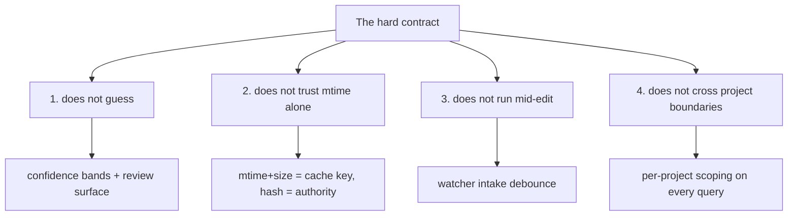

# Re-association: Conclusion and Deliverables

> Category: AI | Version: 1.0 | Date: June 2026 | Status: Draft

The deliverable restated as a single sentence, the four-rule hard contract that bounds what re-association will never do, and forward pointers to the source documents that ground the identity model, the first-run behavior, the fresh-clone inheritance path, and the rows the ladder writes.

**Related:**
- [`../identity-and-reassociation.md`](../identity-and-reassociation.md)
- [`reassociation-introduction-and-theory.md`](reassociation-introduction-and-theory.md)
- [`reassociation-technical-specification.md`](reassociation-technical-specification.md)
- [`reassociation-user-stories.md`](reassociation-user-stories.md)
- [`reassociation-ecosystem-story-arc.md`](reassociation-ecosystem-story-arc.md)
- [`../../architecture/ADR-0001-minted-nectar-over-source-embedded-serial.md`](../../architecture/ADR-0001-minted-nectar-over-source-embedded-serial.md)
- [`../brooding-pipeline.md`](../brooding-pipeline.md)
- [`../../data/portable-registry.md`](../../data/portable-registry.md)
- [`../../data/source-graph-schema.md`](../../data/source-graph-schema.md)

---

## The deliverable, restated

Re-association is a **deterministic-exact-then-fuzzy-conservative ladder** that preserves history integrity above all else. Exact matches (path/mtime/size, content hash, content hash against a missing file) proceed without review because they are unambiguous. Fuzzy matches (TLSH against missing files) are confidence-scored and gated: high-confidence matches carry the nectar automatically, low-confidence matches are surfaced for human review or fall through to a fresh mint. The ladder never deletes a nectar and never reuses an orphaned one. Copy-paste is captured as a first-class provenance edge rather than suffered as a history-loss event.

The single sentence: **the ladder prefers a redundant nectar to a corrupted history chain, every time.**

This deliverable is realized across the four companion docs in this deep-dive:

| Doc | What it delivers |
|---|---|
| [`reassociation-introduction-and-theory.md`](reassociation-introduction-and-theory.md) | The conceptual motivation: why cold catch-up is the hard case, why the ladder refuses to guess, why copy-paste is an asset, and how the projection collapses the hard case. |
| [`reassociation-technical-specification.md`](reassociation-technical-specification.md) | The algorithmic contract: each step's input state, predicate, Deep Lake writes, post-condition, and confidence handling; the three TypeScript functions; the confidence bands; the review surface; the prune grace period. |
| [`reassociation-user-stories.md`](reassociation-user-stories.md) | The engineering and operator behavior contract: 26 stories across the five personas, with acceptance criteria tied to the spec. |
| [`reassociation-ecosystem-story-arc.md`](reassociation-ecosystem-story-arc.md) | The compositional view: the journey of one file through minting, editing, moving, copy-paste, and clone inheritance; the cold-catch-up sequence; how the ladder feeds the enricher queue and the projection sync. |

---

## The hard contract: four things re-association does not do

The ladder's conservatism is not a tuning preference; it is a hard contract. These four rules are invariants the implementation must not violate. Each is grounded in the asymmetry that motivates the whole design: a mis-association corrupts the history chain of the wrong file, and that corruption is silent, system-wide, and effectively irreversible. The rules exist to make corruption impossible by construction.

### 1. It does not guess

Step 4 fuzzy matches below the high-confidence band are surfaced for review, not auto-claimed. Below the low-confidence band, they are not even surfaced — the daemon mints a new nectar instead. A mis-association is worse than a new nectar because it corrupts the history chain.

The worst outcome of a conservative ladder is a duplicate nectar: a cheap, local, detectable error that a future dedup pass (or a human) can correct. The worst outcome of an aggressive ladder is silent history corruption: the wrong file wears the wrong nectar's description and version chain, and the daemon has no mechanism to detect it. The contract picks the cheap error over the catastrophic one, always.

### 2. It does not trust mtime alone

mtime is mutable. `touch`, `rsync`, `git checkout`, and a dozen other operations change mtime without changing content. A ladder that trusted mtime as an authority would mis-associate on every one of them.

mtime combined with size is a fast-path cache key only. Step 1 uses the pair to skip re-hashing files that are genuinely unchanged. Any file that fails step 1 — any candidate for steps 2 through 5 — is content-hashed before a decision is made. The cryptographic hash is the authority; mtime is a hint that lets the daemon avoid computing the hash when it does not need to.

### 3. It does not run mid-edit

The chokidar watcher debounces events per-path (default 2000 ms at intake, documented in [`../brooding-pipeline.md`](../brooding-pipeline.md)), and re-association runs on the debounced state. Mid-edit, the daemon sees nothing. A developer hitting Cmd-S ten times in ten seconds produces one re-association pass against the final content, not ten passes against intermediate states.

This is a correctness property, not just a performance one. Running re-association against a half-written file would hash content that is never committed to disk, producing version rows for states that never existed. The debounce ensures the ladder only sees quiesced file states.

### 4. It does not cross project boundaries

Re-association is scoped by `project_id` (plus `org_id` and `workspace_id`). Two projects in the same workspace that happen to share a file path do not share nectars. The missing-files map is built per-project; the known-nectars map is scoped per-project; the fuzzy-match candidate set is scoped per-project.

This rule exists because project identity is a deliberate boundary in the data model (see the tenancy discussion in [`../../data/source-graph-schema.md`](../../data/source-graph-schema.md)). A file's meaning is contextual to its project; the same path in two projects is two different logical files. Cross-project re-association would conflate them.

---

## Forward pointers

The re-association ladder is one piece of the Hivenectar identity model. The decisions and mechanisms that surround it live in the source documents below. This deep-dive does not duplicate them; it links to them.

### To the identity-model decision

[`../../architecture/ADR-0001-minted-nectar-over-source-embedded-serial.md`](../../architecture/ADR-0001-minted-nectar-over-source-embedded-serial.md) records *why* identity is a daemon-minted ULID rather than a source-embedded serial or a content hash. The ADR is the prerequisite read for anyone questioning the identity model itself: it documents the four concrete failures of source-embedded serials (AGPL-header collision, line-1 conflict, copy-paste ambiguity, comment-syntax non-universality) and the single failure of content-hash identity (it churns per edit and therefore is not actually stable). The re-association ladder is the *consequence* of the ADR's decision — Option C requires the ladder; Options A and B do not. The ADR acknowledges the ladder as a real engineering cost and accepts it because the alternatives have worse problems.

### To first-run behavior

[`../brooding-pipeline.md`](../brooding-pipeline.md) documents the brooding mode that mints the initial nectars and writes the first descriptions. Brooding is the *only* mode that mints original nectars at scale; after brooding, the daemon is in live-watch mode with cold catch-up handling restarts. Re-association's step 5 (mint new) is the steady-state mint path, firing on genuinely new files the watcher detects. The brood's resumability — state is fully derivable from `source_graph_versions.describe_status`, no lockfile — is the same append-only pattern the re-association ladder relies on for its version chain.

### To fresh-clone inheritance

[`../../data/portable-registry.md`](../../data/portable-registry.md) documents the committed `.honeycomb/nectars.json` projection that collapses the hardest re-association case (a checkout the daemon has never observed) into the trivial one. The projection sits in front of the ladder: files whose content hashes match the projection inherit their nectar directly, and only misses fall through to the ladder. The projection is a *regenerable lockfile*, not a sidecar — enforced by the three rules in the portable-registry doc (Deep Lake writes first, never edited by hand, regenerable from Deep Lake alone). Without the projection, a fresh clone would brood from scratch and would have no way to know that the local file is the same logical file the team calls by a given nectar.

### To the rows the ladder writes

[`../../data/source-graph-schema.md`](../../data/source-graph-schema.md) documents the two tables the ladder reads and writes. `source_graph` carries identity and provenance (`nectar` as primary key, `derived_from_nectar` and `fork_content_hash` for copy-paste provenance, the tenancy triple). `source_graph_versions` is the append-only content-and-description chain, keyed by the composite `(nectar, content_hash)` with a monotonic `seq` for latest-version lookups. Every ladder step that carries or mints appends a version row; every step that changes content sets `describe_status = 'pending'` for the enricher to pick up. The composite key's invariant — same content under the same nectar is a no-op, same content under a *different* nectar is the copy-paste signal — is what makes step 5's copy detection work.

---

## Closing

The re-association ladder is not clever. It is disciplined. Its exact steps are unambiguous; its fuzzy step is confidence-gated; its fallthrough is a safe default. It never deletes, never reuses, never crosses project boundaries, never trusts mtime alone, and never guesses below the high-confidence band. The result is a history chain that survives edits, renames, moves, copy-paste, daemon downtime, and fresh clones without corruption — which is the only property that matters for an identity layer.
