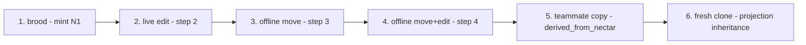
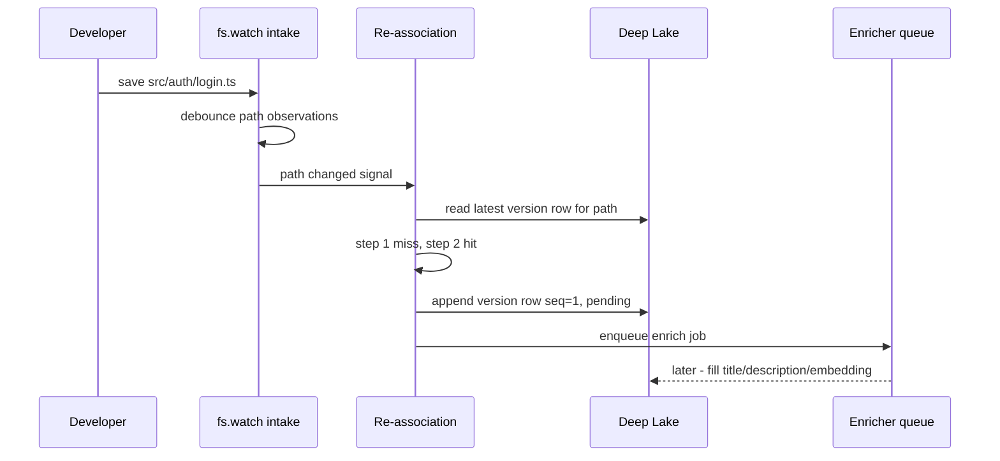
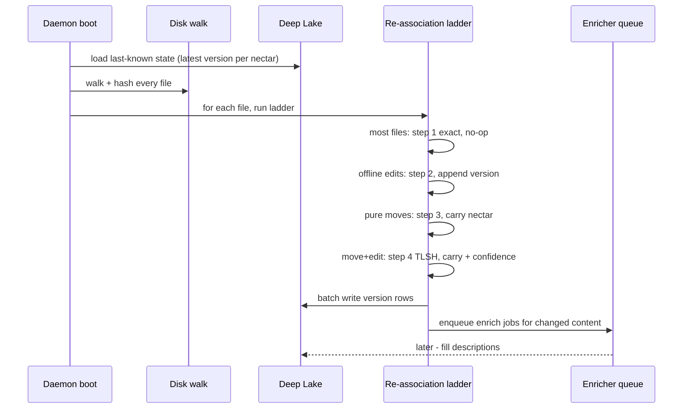
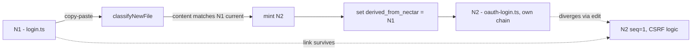
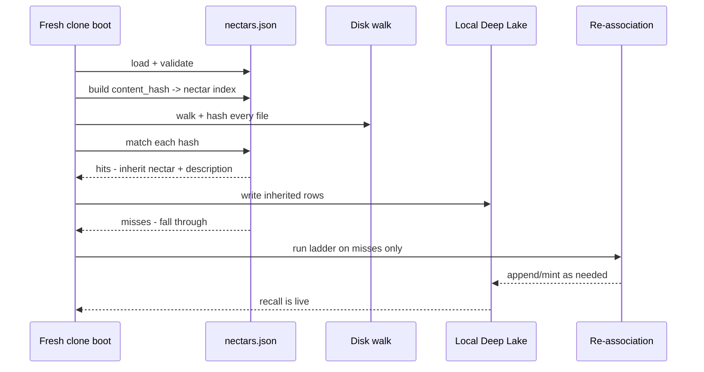

# Re-association: Ecosystem Story Arc

> Category: AI | Version: 1.0 | Date: June 2026 | Status: Draft

How the re-association ladder composes with the rest of Nectar: the journey of a single file through minting at brood, a live edit, an offline move, an offline move-and-edit, a teammate copy-paste that sets `derived_from_nectar`, and fresh-clone inheritance through the projection. Includes a cold-catch-up sequence diagram and shows how the ladder feeds the enricher queue and how the projection sync consumes its outputs.

**Related:**
- [`../identity-and-reassociation.md`](../identity-and-reassociation.md)
- [`reassociation-introduction-and-theory.md`](reassociation-introduction-and-theory.md)
- [`reassociation-technical-specification.md`](reassociation-technical-specification.md)
- [`reassociation-user-stories.md`](reassociation-user-stories.md)
- [`../brooding-pipeline.md`](../brooding-pipeline.md)
- [`../enricher-and-llm-model.md`](../enricher-and-llm-model.md)
- [`../../data/portable-registry.md`](../../data/portable-registry.md)
- [`../../data/hive-graph-schema.md`](../../data/hive-graph-schema.md)

---

## Why a story arc

The re-association ladder is specified step-by-step in [`reassociation-technical-specification.md`](reassociation-technical-specification.md) and motivated conceptually in [`reassociation-introduction-and-theory.md`](reassociation-introduction-and-theory.md). This doc follows a single file across its entire lifetime to show how the steps compose — how a nectar minted once at brood survives a live edit (step 2), an offline move (step 3), an offline move-and-edit (step 4), becomes the source of a teammate's copy-paste provenance edge, and finally crosses the clone boundary through the projection.

The arc makes two things visible that the per-step docs cannot: the ladder's continuity across modes (live watch and cold catch-up are the same algorithm exercising different steps), and the ladder's coupling to the enricher queue and the projection sync (every step that changes content feeds enrichment; every enrichment feeds the projection).

---

## The file under observation

Throughout this doc, the file under observation is `src/auth/login.ts` — the user login route handler. It begins as a fresh file at brooding and accumulates a version chain as it is edited, moved, copied, and cloned. Its nectar is `01J2X4F6K8ME7N9P1Q3R5T7V9WX` (N1), minted once and never changed.



---

## 1. Minting at brood

The arc begins when hiveantennae runs its initial full scan (brooding, documented in [`../brooding-pipeline.md`](../brooding-pipeline.md)) against a project with no `hive_graph` rows. Discovery finds `src/auth/login.ts`, its content hash is new, and no projection entry covers it. The daemon mints nectar N1.

The brood writes two rows: a `hive_graph` row (identity + provenance, `derived_from_nectar` empty because this is an original mint), and an initial `hive_graph_versions` row (`seq = 0`, `describe_status = 'pending'`). The file is bucketed (small text → batch), a Gemini 2.5 Flash call describes it, the description and a 768-dim embedding are written back to the version row, and the projection is regenerated.

At the end of brooding, N1 has one version row, a description, an embedding, and an entry in `.honeycomb/nectars.json`. The daemon switches to live watch.

---

## 2. Live edit (step 2)

The developer opens `src/auth/login.ts` and adds a rate-limit check, then saves. The `node:fs.watch` intake reports a `rename` or `change` observation for the path. The intake debounce collapses any rapid-fire saves into a single signal. Re-association runs:

- Step 1 misses — the content (and therefore the hash) changed, so mtime/size no longer both match.
- Step 2 hits — the path `src/auth/login.ts` matches N1's latest version, but `sha256(new content) != row.content_hash`.

The daemon appends a new `hive_graph_versions` row for N1 with `seq = 1`, the new content hash, `describe_status = 'pending'`, and nulls for title/description/embedding. `hive_graph.last_update_date` is updated. A lazy enrich job is enqueued.



On the next enricher cycle (default 30 seconds), the queue is drained. The enricher applies the "meaningful change" heuristic; the rate-limit addition is meaningful, so a re-description happens. The new description and embedding are written to the `seq = 1` row, and the projection is regenerated with the updated entry for N1.

The nectar N1 is unchanged throughout. The version chain now has two rows: `seq = 0` (the brood state, retained as history) and `seq = 1` (the current state, with the new description).

---

## 3. Offline move (step 3)

The developer closes the laptop. While the daemon is down, they run `git mv src/auth/login.ts src/auth/handlers/login.ts` — a pure rename, no content change. The daemon was not running, so no event stream records the move.

On the next daemon boot, cold catch-up runs. The daemon walks disk, hashes each file, and compares against Deep Lake's last-known state. For `src/auth/handlers/login.ts`:

- Step 1 misses — the path is new to Deep Lake.
- Step 2 misses — the path does not match any known nectar's latest version.
- Step 3 hits — `sha256(content at new path) == N1's latest content_hash`, and `src/auth/login.ts` (N1's previous path) is in the missing-files map.

The daemon carries N1 to the new path: it appends a `hive_graph_versions` row for N1 with `seq = 2`, the new path `src/auth/handlers/login.ts`, and the same content hash. No enrich job is enqueued — the content is unchanged, so the existing description still applies. The previous version row's stale path (`src/auth/login.ts`) is retained as history.

Step 3 is the move detector. In live mode, the `node:fs.watch` intake reports changed paths and the daemon refreshes the missing-files map before matching the new path's hash against missing files. In cold catch-up, the daemon infers the move from the exact hash match against the missing-files map after walking final disk state. Same step, different freshness of evidence.

---

## 4. Offline move-and-edit (step 4 TLSH)

A harder offline event. The developer, still offline, moves `src/auth/handlers/login.ts` to `src/auth/routes/login.ts` *and* edits it — adding a CSRF token check — before the daemon boots. Now the content hash no longer matches anything (step 3 misses because the edit broke the exact match), and the path is new (steps 1 and 2 miss).

Step 4 fires. The daemon computes a TLSH fingerprint of the file at `src/auth/routes/login.ts` and compares it against the TLSH fingerprints of missing files. `bestFuzzyMatch()` returns N1 as the best candidate with a distance well within the high-confidence band (the CSRF addition is a small edit; TLSH tolerates it).

The daemon carries N1: it appends a `hive_graph_versions` row for N1 with `seq = 3`, the new path, the new content hash, the `confidence` field populated (`1 − normalizedTLSHDistance`), and `describe_status = 'pending'`. An enrich job is enqueued because the content changed. The enricher later re-describes the file with its new CSRF behavior.

Had the match fallen in the review band, the daemon would have provisionally minted a fresh nectar and surfaced the candidate to `honeycomb nectar review-matches` instead of auto-claiming. The ladder never guesses below the high-confidence band.

---

## Cold catch-up boot: the full correlation

The two offline events above (steps 3 and 4) happen within a single cold-catch-up boot. The sequence below shows the daemon correlating disk against Deep Lake for all files at once, exercising steps 1 through 4 in the same pass.



The batched-write shape matters for cold-catch-up performance. The daemon does not write one row per file as it walks; it accumulates writes and flushes them in batches, the same pattern brooding uses. The enricher queue is populated from the batch of pending rows and drained on the next enricher cycle.

---

## 5. Copy-paste by a teammate (provenance edge)

A teammate, working in the same workspace, wants a second login route that shares most of the original's structure. They copy `src/auth/routes/login.ts` to `src/auth/routes/oauth-login.ts`. The `node:fs.watch` intake reports the new path. The new file's content hash matches N1's *current* content hash.

Re-association reaches step 5 (nothing exact or fuzzy resolves it as the *same* file at a new path — the original still exists at its path). Before minting, the daemon runs `classifyNewFile()`:

- `newHash` matches N1's latest `content_hash` in the known-nectars map.
- The function returns `{ action: 'copy', sourceNectar: N1 }`.

The daemon mints a **fresh nectar N2** for the copy and sets `hive_graph`:

```
nectar:              <N2, fresh ULID>
kind:                'file'
created_at:          <now>
derived_from_nectar: N1
fork_content_hash:   <N1's content at copy time>
```

The teammate edits `oauth-login.ts` to swap in OAuth-specific logic. The edit appends a version row to N2's chain (step 2 against N2's path). The `derived_from_nectar` link to N1 is write-once and survives the divergence. The Obsidian-style interlink view renders "oauth-login.ts was forked from login.ts" indefinitely — a first-class provenance edge that content-hash identity could not capture and source-embedded serials would have corrupted into an ambiguity.



---

## 6. Fresh clone inherits via projection

A third teammate clones the repo for the first time. Their checkout has the source tree and the committed `.honeycomb/nectars.json` projection, but their local Deep Lake has no `hive_graph` rows. When their daemon boots, it does not brood from scratch.

The boot path (documented in [`../../data/portable-registry.md`](../../data/portable-registry.md)):

1. Load and validate the projection (version, project triple, ULID/hash syntax).
2. Build a `content_hash -> nectar` index from the projection's `files` map.
3. Walk disk, hash each file, match into the projection.
4. Files whose hashes hit the projection inherit their nectar and description, written to the local Deep Lake.
5. Files whose hashes miss the projection fall through to the re-association ladder.

For a clone whose projection is current, every file's content hash matches the projection. N1 and N2 are both inherited. Zero fuzzy matches, zero new mints, zero LLM calls. The daemon writes the inherited rows to Deep Lake and is immediately ready to serve semantic recall.



The projection collapses the hardest case of cold catch-up — a checkout the daemon has never observed — into the trivial case. The ladder is not bypassed; it is simply unnecessary when the projection covers every file. The ladder remains the recovery path for files the projection does not cover: genuinely new files, files edited since the projection was generated, and files on unmerged branches.

---

## How re-association feeds the enricher queue

Every ladder step that changes content enqueues a lazy enrich job. The coupling is one-directional and deliberate: the ladder decides *identity*; the enricher decides *description*.

| Ladder outcome | Enrich job enqueued? | Why |
|---|---|---|
| Step 1 (exact match) | No | Content unchanged. |
| Step 2 (path match, content changed) | Yes | New content hash; description may need refreshing. |
| Step 3 (exact hash move) | No | Content unchanged; existing description still applies at the new path. |
| Step 4 high-confidence (fuzzy move+edit) | Yes | Content changed; re-description needed. |
| Step 4 review-band | Provisional mint is enqueued; carried nectar enqueued only on accept | The provisional nectar needs a description regardless; the carried nectar is described only if the review confirms the association. |
| Step 5 (mint new) | Yes | New nectar, no description yet. |
| Copy event | Yes | The copy gets a fresh nectar; describing it may reuse the source's description or produce a new one. |

The enricher drains the queue on its cycle (default 30 seconds), selecting `MAX(seq) per nectar WHERE describe_status = 'pending'` so that intermediate saves within a cycle are never described. This coalescing is documented in [`../enricher-and-llm-model.md`](../enricher-and-llm-model.md); the point here is that the ladder is the queue's sole source of pending rows.

---

## How the projection sync consumes enricher outputs

The enricher writes descriptions and embeddings to version rows. The projection sync reads those rows and regenerates `.honeycomb/nectars.json`. The coupling is also one-directional: the projection is derived from Deep Lake, never the reverse.

The projection sync runs at three points, documented in [`../../data/portable-registry.md`](../../data/portable-registry.md): end of brooding, end of an enricher cycle that wrote new descriptions, and explicitly via `honeycomb nectar rebuild-projection`. The sync selects the latest described version per nectar, denormalizes it into the projection format, and writes atomically (temp file plus rename) so a crashed regeneration leaves the old projection intact.

The full composition: the ladder resolves identity and appends version rows; the enricher fills descriptions on the pending rows; the projection sync regenerates the lockfile from the described rows; the committed lockfile is what the next fresh clone inherits. Each stage consumes the output of the previous one, and none of them write to each other's territory.

---

## What this arc does not cover

The conceptual motivation for the ladder's design is in [`reassociation-introduction-and-theory.md`](reassociation-introduction-and-theory.md). The step-by-step contract is in [`reassociation-technical-specification.md`](reassociation-technical-specification.md). The engineering and operator user stories are in [`reassociation-user-stories.md`](reassociation-user-stories.md). The four-rule hard contract and forward pointers are in [`reassociation-conclusion-and-deliverables.md`](reassociation-conclusion-and-deliverables.md).
