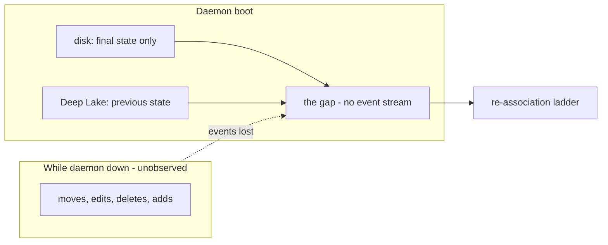
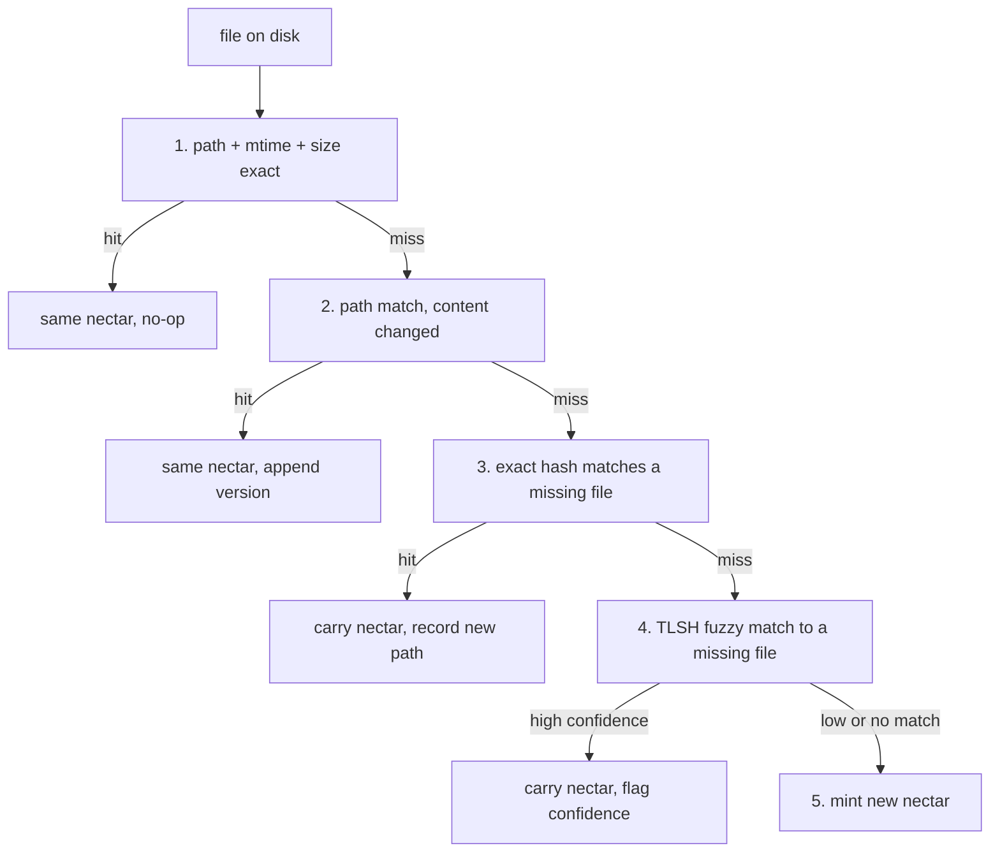
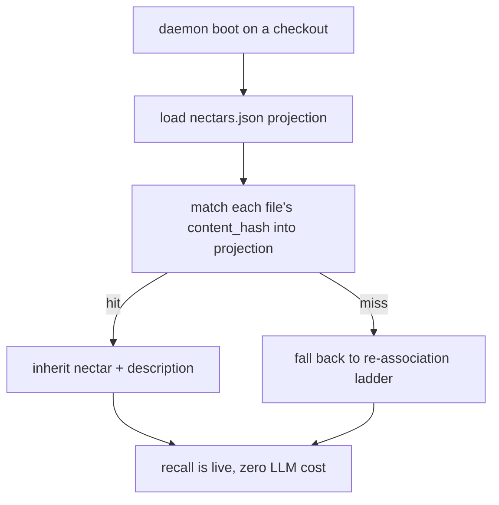

# Re-association: Introduction and Theory

> Category: AI | Version: 1.0 | Date: June 2026 | Status: Draft

The conceptual essay behind Nectar's re-association ladder — why cold catch-up is the hardest problem, why the algorithm refuses to guess, why copy-paste is an asset rather than a failure mode, and how the portable projection collapses the hardest case to nothing.

**Related:**
- [`../identity-and-reassociation.md`](../identity-and-reassociation.md)
- [`reassociation-technical-specification.md`](reassociation-technical-specification.md)
- [`reassociation-ecosystem-story-arc.md`](reassociation-ecosystem-story-arc.md)
- [`reassociation-conclusion-and-deliverables.md`](reassociation-conclusion-and-deliverables.md)
- [`../brooding-pipeline.md`](../brooding-pipeline.md)
- [`../../architecture/ADR-0001-minted-nectar-over-source-embedded-serial.md`](../../architecture/ADR-0001-minted-nectar-over-source-embedded-serial.md)
- [`../../data/portable-registry.md`](../../data/portable-registry.md)

---

## Why this essay exists

Re-association is the algorithm that keeps a nectar glued to the right file across edits, renames, moves, and copy-paste. It is described mechanically in [`../identity-and-reassociation.md`](../identity-and-reassociation.md) and specified contractually in [`reassociation-technical-specification.md`](reassociation-technical-specification.md). This doc covers the *thinking* behind those mechanics: the load-bearing assumptions, the asymmetry that makes the ladder conservative, and the inversion that turns copy-paste from a history-loss event into a first-class provenance edge.

Read this before arguing with the ladder's design, and before proposing a "smarter" heuristic that guesses more aggressively. Every loosenening of the ladder trades history integrity for convenience, and the trade is a bad one.

---

## The hardest problem is cold catch-up

A daemon that watches disk continuously has more evidence than a cold boot, but the watcher is not the authority for identity. Nectar mirrors Honeycomb's `node:fs.watch` pattern: the watcher emits uncorrelated `rename`/`change` observations with filenames, then the daemon debounces, refreshes the missing-files set, hashes changed paths, and lets the re-association ladder decide. Ordinary moves still resolve exactly through step 3 when the new path's content hash matches a missing file's latest hash; no richer move-correlation API is required.

The hard problem arrives the moment the laptop was closed.

While the daemon was offline, the user moved a dozen files, edited half of them, deleted two, and added a new one. When the daemon boots, it has no event stream. It has only the final state of disk: a set of `(path, mtime, size)` tuples, plus whatever it can recompute by reading files. Deep Lake holds the *previous* state: the last-known paths and content hashes of every nectar. The gap between those two snapshots is everything that happened offline, and reconstructing it is cold catch-up.



Cold catch-up is hard because the daemon must make identity decisions *without the evidence that would make those decisions easy*. It cannot ask "was this a move or a coincidence?" of a human in real time during a boot. It cannot replay the editor's undo history. It has two snapshots and must reconcile them by inference. The re-association ladder is the disciplined form of that inference.

---

## The philosophy: re-association does not guess

The single most important property of the ladder is that it is **conservative by design**. A mis-association is worse than a new nectar, because a new nectar is merely a redundant row — annoying, cheap, correctable — while a mis-association corrupts the history chain of the *wrong* file.

Consider what goes wrong when the daemon guesses and guesses wrong. File A is the authentication middleware, with three years of version history and a description refined across dozens of enricher passes. File B is an unrelated file that, by coincidence, has content similar enough to A's that a fuzzy matcher scores it as a likely match. If the daemon carries A's nectar onto B, two things break simultaneously: B now wears A's history and A's description, and A is left with no current path at all. The next enricher cycle describes A's next version using B's content while A's description sits wrongly on B. The corruption propagates. Undoing it requires detecting it, which the daemon has no mechanism to do, because from the daemon's perspective the chain looks continuous.

The ladder prevents this by *refusing to claim* anything below a confidence threshold. Step 4's fuzzy TLSH matches below the high-confidence band are not auto-claimed; they are surfaced for review. Below the low-confidence band, they are not even surfaced — the daemon mints a new nectar instead. The worst outcome of a conservative ladder is a duplicate nectar, which is a cheap, local, detectable error. The worst outcome of an aggressive ladder is silent history corruption, which is expensive, system-wide, and invisible until recall returns the wrong file's description under the right file's identity.

This asymmetry — duplicate nectars are cheap, mis-associations are catastrophic — is the entire reason the ladder exists in its exact-then-fuzzy-then-mint shape. The exact steps (1–3) are high-confidence and proceed without review. The fuzzy step (4) is confidence-scored and gated. The fallthrough (5) is a safe default.

---

## The exact-then-fuzzy ladder, conceptually

The ladder is evaluated top-down per file, first match wins. Each step is a stronger inference than the one below it, so the daemon tries the cheap, unambiguous checks before the expensive, ambiguous ones.



The steps ladder from certainty to inference to safety. Steps 1–3 are exact: a path/mtime/size triple, a content hash, or a content hash against a missing file. Each is a cryptographic or statistical certainty. Step 4 introduces genuine uncertainty (TLSH is a similarity score, not an equality check), which is why it carries a confidence field and a review surface. Step 5 is the conservative default — when nothing matches with confidence, the daemon assumes the file is new.

The full predicate-by-predicate contract for each step is in [`reassociation-technical-specification.md`](reassociation-technical-specification.md). The conceptual point is the ordering: certainty first, inference second, safe default last.

---

## Copy-paste as a first-class provenance edge

The re-association ladder's most counterintuitive property is how it treats copy-paste. In most identity systems, copy-paste is a failure mode: two files end up with identical content, the system cannot tell them apart, and when one is later edited the relationship is lost. In source-embedded serial schemes (the rejected Option A in [`ADR-0001`](../../architecture/ADR-0001-minted-nectar-over-source-embedded-serial.md)), copy-paste is worse than a failure — it produces two files claiming the *same serial*, an ambiguity the system cannot resolve.

Nectar inverts this. Copy-paste is not a failure; it is a signal the daemon captures as a permanent, queryable edge.

The mechanism: when a new path's content matches an existing file's *current* content, the daemon does not carry the source's nectar (that would be the move path, and it would make the two files indistinguishable). Instead it mints a **fresh nectar** for the copy and sets `derived_from_nectar` pointing back at the source. The copy gets its own identity, its own version chain, and a permanent link to its origin.

```mermaid
flowchart LR
    src["File A, nectar N1, content H1"] -->|copy-paste| copy["File B, content H1"]
    copy --> classify{"content matches an existing file's current content?"}
    classify -->|yes| mint["mint fresh nectar N2"]
    mint --> link["set derived_from_nectar = N1"]
    link --> graph["N2 has its own chain, linked to N1 forever"]
```

The result is what neither content-hash identity nor source-embedded serials can produce: B is its own identity (N2), and yet it is permanently linked to A (N1) through `derived_from_nectar`. When B diverges from A through later edits, the link survives. The Obsidian-style interlink view can render "B was forked from A at <time>" indefinitely.

The inversion is precise. With pure content hashing, A and B were indistinguishable at copy time (same hash), and the moment B was edited, all trace of the A→B relationship was lost. With minted identity plus `derived_from_nectar`, the relationship is explicit, durable, and queryable. Copy-paste stops being the thing the identity model apologizes for and becomes the thing it captures best.

The detection has one minor ambiguity: two genuinely independent files that happen to have identical content (two empty `.gitkeep` files, two boilerplate licenses). The daemon treats the second-minted one as a copy and sets `derived_from_nectar` on it. This is rarely wrong in practice — boilerplate duplication *is* a copy relationship, semantically — and when it is wrong the cost is low: a spurious link in an interlink view.

---

## The portable projection's role

The ladder is the recovery mechanism for when the daemon does not know which nectar a file belongs to. The committed `.honeycomb/nectars.json` projection (documented in [`../../data/portable-registry.md`](../../data/portable-registry.md)) is the mechanism that makes the ladder unnecessary in the common case.

The projection is a content-hash-keyed map: `{ content_hash: { nectar, title, description, concepts } }` for the latest version of each nectar in the project. When the daemon boots on a checkout that has a current projection, it matches on-disk files into the projection *before* falling back to the full ladder. A fresh clone with a current projection typically achieves zero fuzzy matches and zero new mints: every file on disk finds its nectar through the projection's content-hash index.

This is why the projection is committed to the repo even though Deep Lake is the source of truth. Without it, a fresh clone would brood from scratch — re-describing every file, re-paying the LLM cost — and would have no way to know that the file at `src/auth/login.ts` is the same logical file the rest of the team calls nectar N1. The projection carries that knowledge across the clone boundary, collapsing the hardest case of cold catch-up (a checkout that has never been observed by this daemon) into the trivial case (every content hash matches the projection, every nectar is inherited).



The projection does not replace the ladder; it sits in front of it. Files whose content hashes are not in the projection — genuinely new files, files edited since the projection was generated, files on an unmerged branch — still enter the ladder. The projection handles the common case (a fresh clone of a project whose projection is current); the ladder handles the residual hard case (anything the projection does not cover).

---

## Why the ladder is the same in both modes

The re-association ladder is identical whether it runs during live watch or during cold catch-up. What differs is the *distribution* of which steps fire, and that difference is the reason cold catch-up is the hard case.

During live watch, `node:fs.watch` provides a fresh signal that a path changed, but not a reliable move object. Most edits hit step 2 (path match, content changed) because the path is stable and only the content differs. Moves hit step 3 (exact hash to a missing file) because the daemon refreshes the missing-files set and matches the new path's hash to a missing file's latest hash. Step 4 (fuzzy TLSH) is rare in live mode — it fires for live move-and-edit cases or incomplete event evidence.

During cold catch-up, the daemon has no event stream. Step 1 dominates (most files were untouched), step 2 catches offline edits, and steps 3 and 4 do the real work of reconstructing moves without a correlation signal. Step 4 earns its complexity here: it is the only mechanism that can recover a file that was moved *and* edited while the daemon was offline, because the move broke the path match (step 2) and the edit broke the exact hash match (step 3).

The frequency table in [`reassociation-technical-specification.md`](reassociation-technical-specification.md) makes the distribution concrete. The conceptual takeaway is that the ladder is not two algorithms — it is one algorithm, and the harder mode simply exercises more of it.

---

## What this essay does not cover

The mechanical contract for each ladder step — input state, comparison predicate, Deep Lake writes, post-conditions, confidence handling — is in [`reassociation-technical-specification.md`](reassociation-technical-specification.md). The engineering and operator user stories that derive from the ladder are in [`reassociation-user-stories.md`](reassociation-user-stories.md). The end-to-end journey of a single file through minting, editing, moving, copy-paste, and clone inheritance is in [`reassociation-ecosystem-story-arc.md`](reassociation-ecosystem-story-arc.md). The hard contract — the four things re-association explicitly does not do — is restated in [`reassociation-conclusion-and-deliverables.md`](reassociation-conclusion-and-deliverables.md).

This essay covers the *why*. The other four cover the *what*, the *how*, and the *so what*.
