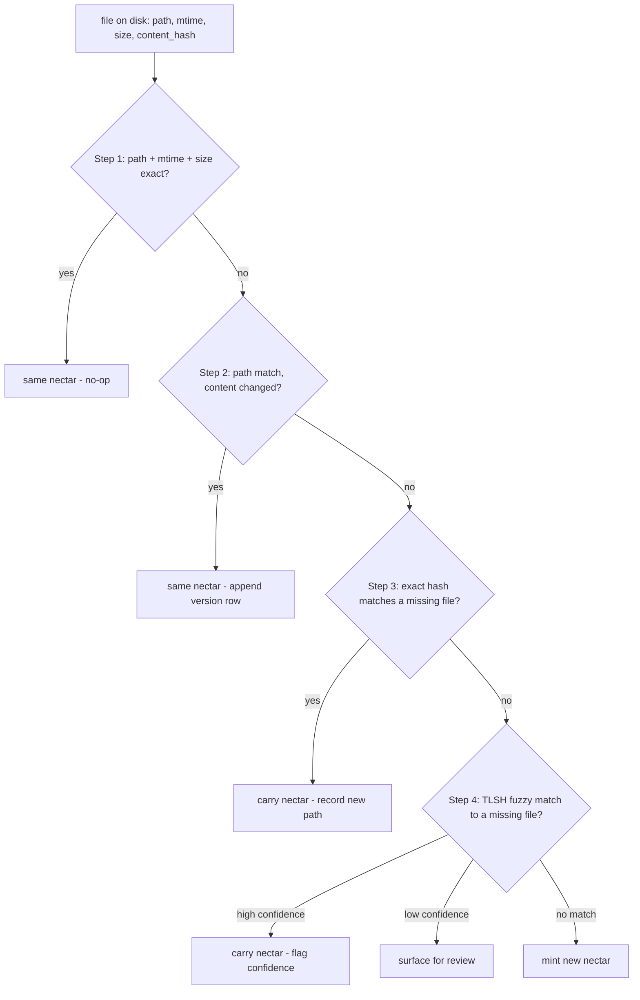

# Re-association: Technical Specification

> Category: AI | Version: 1.1 | Date: July 2026 | Status: Draft

The algorithmic contract for the re-association ladder: each of the five steps specified by input state, comparison predicate, Deep Lake write, post-condition, and confidence handling; the three TypeScript functions that implement minting, copy detection, and fuzzy matching; the confidence field semantics; the review surface; and the prune grace period.

**Related:**
- [`../identity-and-reassociation.md`](../identity-and-reassociation.md)
- [`reassociation-introduction-and-theory.md`](reassociation-introduction-and-theory.md)
- [`reassociation-user-stories.md`](reassociation-user-stories.md)
- [`reassociation-ecosystem-story-arc.md`](reassociation-ecosystem-story-arc.md)
- [`../enricher-and-llm-model.md`](../enricher-and-llm-model.md)
- [`../../data/hive-graph-schema.md`](../../data/hive-graph-schema.md)
- [`../../architecture/ADR-0001-minted-nectar-over-source-embedded-serial.md`](../../architecture/ADR-0001-minted-nectar-over-source-embedded-serial.md)

---

## The ladder as a contract

The re-association ladder is evaluated top-down per file, first match wins. Every step has the same shape: an input state, a comparison predicate, an action (a set of Deep Lake writes), a post-condition, and confidence handling. The contract is what makes the ladder auditable — any step's behavior is predictable from its inputs, and the writes it makes are deterministic.



The sections below specify each step in full. The TypeScript functions referenced (minting, copy detection, fuzzy matching) appear after the step contracts.

---

## Step 1 — `(path, mtime, size)` exact match

The fast path. If a file at a known path has the same mtime and byte size as the last time the daemon observed it, the daemon treats it as unchanged without reading or hashing the content. This is the rsync `--size-only` optimization generalized to mtime plus size.

| Aspect | Specification |
|---|---|
| Input state | Latest version row for some nectar at the same `path`, with stored `mtime_observed` and `size_bytes`. |
| Comparison predicate | `disk.path == row.path AND disk.mtime == row.mtime_observed AND disk.size_bytes == row.size_bytes`. |
| Action | None. No Deep Lake write. |
| Post-condition | The nectar's current version row is unchanged. |
| Confidence handling | Not applicable — exact match, no ambiguity. |

The mtime/size pair lives on `hive_graph_versions` for the latest version of each nectar. The check is a single SELECT against the latest-version index, scoped by tenancy (`org_id`, `workspace_id`, `project_id`) and path. This step covers the vast majority of files on a typical cold boot — most files were not touched while the daemon was down.

mtime is treated as a cache key only, never as an authority. The predicate combines mtime with size; a path that fails step 1 is content-hashed before any step-2-through-5 decision is made. See the "does not trust mtime alone" contract in [`reassociation-conclusion-and-deliverables.md`](reassociation-conclusion-and-deliverables.md).

---

## Step 2 — path match, content changed

The path exists in Deep Lake under some nectar, but the content hash differs from the latest version. This is a normal edit.

| Aspect | Specification |
|---|---|
| Input state | Latest version row for some nectar at the same `path`, with stored `content_hash`. |
| Comparison predicate | `disk.path == row.path AND sha256(disk.content) != row.content_hash`. |
| Action | (1) Append a new `hive_graph_versions` row: `(nectar, content_hash = new, seq = prev_seq + 1)`, new path/metadata, `title/description/embedding = NULL`, `describe_status = 'pending'`. (2) Update `hive_graph.last_update_date`. (3) Enqueue a lazy enrich job for the new version. |
| Post-condition | The nectar's version chain has one more row; the previous version row is retained as history. |
| Confidence handling | Not applicable — the path is a stable identity anchor at this step, the edit is unambiguous. |

The nectar is unchanged. The previous version row stays in place — the history chain is append-only. The enricher (documented in [`../enricher-and-llm-model.md`](../enricher-and-llm-model.md)) later fills the new version's `title`/`description`/`embedding`, applying the "meaningful change" heuristic so that a cosmetic reformat does not trigger a re-description.

---

## Step 3 — exact content-hash match to a missing file

The move detector. The daemon keeps a map of files that used to exist but do not anymore: the set difference between Deep Lake's known paths and disk's current paths. When a new path's content hash exactly matches a missing file's latest version hash, the daemon concludes the file was moved or renamed without modification.

| Aspect | Specification |
|---|---|
| Input state | A nectar whose latest version's `path` is absent from disk; a new on-disk path whose content hashes to that nectar's latest `content_hash`. |
| Comparison predicate | `sha256(disk.content at newPath) == missingFile.latest_content_hash`. |
| Action | (1) Append a new `hive_graph_versions` row for the existing nectar with the new `path` and the same `content_hash` (the composite key `(nectar, content_hash)` is unique, but `seq` increments and `path` differs, so the row is new). (2) The previous version row's path is now stale but retained as history. |
| Post-condition | The nectar's current path is the new location; no enrich job is enqueued. |
| Confidence handling | Not applicable — exact sha256 match is high-confidence by construction. The only failure mode is a coincidental hash collision, which is cryptographically negligible. |

No enrich job is enqueued because the content is unchanged; the existing description still applies. Exact-hash matching has no ambiguity. This step handles the common move case — `git mv`, IDE refactor-rename, OS-level move — in both live watch (where the watcher correlated the delete+add) and cold catch-up (where the daemon infers the move from the hash match).

---

## Step 4 — fuzzy content match (TLSH) to a missing file

The hard case. The file was moved *and* edited while the daemon was offline, so the content hash no longer matches anything. The daemon computes a TLSH (Trend Micro Locality-Sensitive Hash) fingerprint and compares it against the TLSH fingerprints of missing files. TLSH is purpose-built for "are these two files near-duplicates" and tolerates small edits, whitespace changes, and reformatting that would break a cryptographic hash.

| Aspect | Specification |
|---|---|
| Input state | A nectar whose latest version's `path` is absent from disk; a new on-disk path whose content hash matches nothing, with a computed TLSH fingerprint. |
| Comparison predicate | `tlshDiff(newFingerprint, candidate.fingerprint)` minimized over missing-file candidates, compared against the fuzzy threshold. |
| Action (high confidence) | Append a new `hive_graph_versions` row for the existing nectar with the new `path`, new `content_hash`, and `confidence` field set; enqueue an enrich job. |
| Action (low confidence) | Surface the candidate match for human review via `nectar review-matches`; do not auto-claim the nectar. |
| Action (no match) | Fall through to step 5. |
| Post-condition (high confidence) | The nectar follows the file to its new location with a version row flagging the confidence of the association. |
| Confidence handling | The `confidence` field on the appended version row is `1 − normalizedTLSHDistance`. Matches at or above the high band are carried; matches in the review band are surfaced; matches below the low band fall through to mint. |

This step primarily fires after cold restart with offline changes, but it can also handle live move-and-edit cases when exact hash evidence is not enough. During live operation, `node:fs.watch` provides uncorrelated disk observations; step 3 handles ordinary moves by exact hash against the missing-files set, and step 4 handles cases where the content changed enough to break the exact hash.

---

## Step 5 — nothing matches

The file is genuinely new. No exact match, no high-confidence fuzzy match, no review-accepted candidate. The daemon mints a fresh nectar.

| Aspect | Specification |
|---|---|
| Input state | No step 1–4 match resolved the file to an existing nectar. |
| Comparison predicate | None — this is the default. |
| Action | (1) Mint a ULID nectar. (2) Write the `hive_graph` row (identity + provenance). (3) Append the initial `hive_graph_versions` row. (4) Enqueue enrichment. |
| Post-condition | A new nectar exists in Deep Lake, scoped by tenancy, pending description. |
| Confidence handling | Not applicable — a fresh mint is unambiguous. |

Before minting, the daemon runs copy detection (below) to decide whether the new file is a copy of an existing file. If it is, the fresh nectar carries `derived_from_nectar` pointing at the source. If it is not, the nectar is an original mint.

---

## Minting — `mintNectar()`

A nectar is minted in exactly two situations: brooding (the first time the daemon sees a file it has no record of), and a copy event (a new path's content matches an existing file's current content, producing a fresh nectar with `derived_from_nectar`). Minting uses ULID — 26 characters, Crockford base32, uppercase, timestamp-sortable.

```typescript
import { ulid } from "ulid";

function mintNectar(): string {
  return ulid(); // e.g. "01J2X4F6K8ME7N9P1Q3R5T7V9WX"
}
```

Two properties of ULID make it the right choice, documented in [`../identity-and-reassociation.md`](../identity-and-reassociation.md):

- **Lexicographic sortability by creation time.** A ULID is `timestamp_ms (48 bits) + randomness (80 bits)`, so "nectars minted while I was offline" is a string-prefix range scan, no timestamp parsing.
- **Collision resistance without a registry.** The 80 bits of randomness per millisecond makes a collision astronomically unlikely across a single workspace, so minting is lock-free and distributed-safe — two harnesses minting in parallel cannot collide.

The nectar is written to `hive_graph.nectar` as the primary key. The `created_at` column is set to the decoded ULID timestamp in ISO 8601. The nectar is **never re-derived and never recomputed** — if the minting logic changes, old nectars keep their values; new nectars use the new logic. This is what makes identity stable across daemon upgrades.

---

## Copy detection — `classifyNewFile()`

When step 5 is about to mint a new nectar, the daemon first checks whether the new file is a copy of an existing file. The check is content-hash based: if the new path's content matches an existing file's *current* content, it is a copy event, not an original mint.

```typescript
function classifyNewFile(
  newPath: string,
  newHash: string,
  knownNectars: Map<string, { nectar: string; latestHash: string }>, // keyed by latest hash
): { action: "mint" | "copy"; sourceNectar?: string } {
  const existing = knownNectars.get(newHash);
  if (existing && existing.latestHash === newHash) {
    // newPath's content matches some existing file's current content.
    // A different file with the same current content = copy event.
    return { action: "copy", sourceNectar: existing.nectar };
  }
  return { action: "mint" };
}
```

A copy event mints a fresh nectar for the new path and sets `hive_graph`:

```
nectar:              <fresh ULID N2>
kind:                'file'
created_at:          <now>
derived_from_nectar: N1       # provenance back to the source
fork_content_hash:   H1       # the source's content at the moment of copy
```

The result is a first-class provenance edge. The copy is its own identity (N2), permanently linked to its origin (N1) through `derived_from_nectar`. When the copy is later edited and its content diverges, the link survives — unlike content-hash identity, where the relationship is lost the moment content diverges.

The one ambiguity: two genuinely independent files with identical content (two empty `.gitkeep` files, two boilerplate licenses). The daemon treats both as copy events and sets `derived_from_nectar` on whichever was minted second. This is rarely wrong in practice — boilerplate duplication *is* a copy relationship, semantically — and the cost when wrong is a spurious link in an interlink view.

---

## Fuzzy matching — `bestFuzzyMatch()`

Step 4 compares a new file's TLSH fingerprint against the fingerprints of missing files and returns the best candidate if it falls under the threshold.

```typescript
// Pseudocode — the actual TLSH impl is a native addon or WASM build
import { tlshHash, tlshDiff } from "tlsh";

function bestFuzzyMatch(
  newFileFingerprint: string,
  candidateMissing: Array<{ nectar: string; fingerprint: string }>,
): { nectar: string; distance: number } | null {
  let best: { nectar: string; distance: number } | null = null;
  for (const candidate of candidateMissing) {
    const distance = tlshDiff(newFileFingerprint, candidate.fingerprint);
    if (!best || distance < best.distance) best = { nectar: candidate.nectar, distance };
  }
  return best && best.distance <= FUZZY_THRESHOLD ? best : null;
}
```

The match is **scored, not binary**. The returned `distance` feeds the confidence field (below). The function returns the single best candidate under the threshold; ties are broken arbitrarily (the daemon does not claim a nectar on a tie — it surfaces the tie for review).

---

## The `confidence` field semantics

Every fuzzy match that produces a version row carries a `confidence` field on that row. The value is `1 − normalizedTLSHDistance`, where the normalized distance scales the raw TLSH diff into the `[0, 1]` range using the configured `FUZZY_THRESHOLD` as the upper bound.

The source spec deliberately commits **no concrete threshold value**: the high band is "configurable, default tuned during brooding," and matches below it are surfaced for review rather than auto-claimed. The three bands describe *behavior*, not pinned numerics:

| Band | Bound | Behavior |
|---|---|---|
| High confidence | above the configurable high band (default tuned during brooding) | The daemon carries the nectar automatically, appends the version row with the `confidence` value, and flags it. No human review required. |
| Review band | below the high band, above the low band | The daemon does **not** auto-claim the nectar. It surfaces the candidate match to the review surface (`nectar review-matches`). |
| Low confidence | at or below the low band | The match is not surfaced; the daemon mints a new nectar instead (step 5). |

The bands are configurable and the defaults are determined empirically during brooding — they are not fixed constants in the spec. The high band is deliberately strict: a false claim at the high band is the failure mode the ladder exists to prevent, so the threshold errs toward minting rather than carrying.

The `confidence` value is persisted on the version row so that a reviewer can see *how* confident the daemon was at association time, and so a future audit can distinguish auto-carried matches from human-confirmed ones.

---

## The review surface

Low-confidence matches are surfaced for human review rather than auto-claimed. The review surface is the interactive command `nectar review-matches`, plus a dashboard view. The source spec names the command but does not pin its sub-flag syntax; the command lists pending candidates and lets a reviewer accept (carry the candidate nectar) or reject (leave the provisional mint in place). The exact flag surface is an implementation detail left to the daemon.

```bash
nectar review-matches        # list pending low-confidence candidates
# then accept/reject each candidate via the command's review flow
```

The contract:

- A candidate in the review band blocks neither recall nor the rest of cold catch-up. The file on disk is associated to a provisional nectar (a fresh mint) until the review is adjudicated, so recall works either way.
- Accepting a candidate rewrites the provisional nectar's rows to point at the carried nectar and records the reviewer's decision.
- Rejecting a candidate leaves the provisional mint in place and removes the candidate from the review queue.
- Review decisions are auditable — the version row records whether the association was auto-carried (high confidence) or human-confirmed (review-accepted).

The review surface is the safety valve that lets the daemon be conservative without being paralyzed. The daemon never guesses below the high band; it asks.

---

## The prune grace period

A nectar, once minted, is never deleted by the re-association ladder. If a file on disk has no re-association candidate (step 5), the daemon mints a new nectar — it does not scan for orphaned nectars whose paths are missing and reuse them. Orphaned nectars (the file was deleted, not moved) remain in Deep Lake as history.

Deletion of nectar records is a separate, explicit, human-triggered operation.

```bash
nectar prune --confirm
```

This removes nectars whose latest version's `path` has been missing for longer than the configurable grace period. The defaults are conservative:

| Parameter | Default | Rationale |
|---|---|---|
| Grace period | 30 days | A file that is "missing" might be on a branch checked out elsewhere, or might come back after a merge. 30 days absorbs a typical branch lifecycle. |
| Trigger | Human (`--confirm` required) | Pruning is irreversible (the history chain is destroyed). It is never automatic. |
| Scope | Nectars whose *latest* version path is missing | A nectar with any version pointing at a live path is never pruned, even if older versions reference deleted paths. |

The grace period exists because "missing" is not "deleted." A file might be absent from the current checkout because it lives on a feature branch not yet merged; pruning it on first sight of its absence would destroy its history chain the moment a teammate switches branches. The 30-day window absorbs that common case. Pruning is the one operation that breaks the append-only history chain, and it is gated behind a human decision for exactly that reason.

---

## Live watch vs cold catch-up frequency

The ladder is the same algorithm in both modes, but the distribution of steps differs sharply. Live watch has fresher evidence because `node:fs.watch` reports changed paths quickly; cold catch-up is the hard case because the daemon has only final state.

| Step | Live watch frequency | Cold catch-up frequency |
|---|---|---|
| 1 (path + mtime + size exact) | rare — the watcher already knows nothing changed | **dominant** — most files are untouched |
| 2 (path match, content changed) | **dominant** — normal edits | common — offline edits |
| 3 (exact hash to a missing file) | common — moves emit delete+add the watcher correlates | common — offline renames |
| 4 (fuzzy TLSH match) | rare — only if the watcher missed a correlated event | occasional — offline move-and-edit |
| 5 (mint new) | common — new files | occasional — genuinely new files |

The distribution is why cold catch-up is the design driver. Step 4, which is rare in live mode, becomes a regular occurrence after offline chaos — and step 4 is the only step with a confidence band and a review surface. The ladder's complexity concentrates exactly where the harder mode concentrates its load.

---

## What the spec does not cover

The conceptual motivation for the ladder's conservatism is in [`reassociation-introduction-and-theory.md`](reassociation-introduction-and-theory.md). The engineering and operator user stories that exercise each step are in [`reassociation-user-stories.md`](reassociation-user-stories.md). The end-to-end journey of a file through the ladder, the enricher queue, and the projection sync is in [`reassociation-ecosystem-story-arc.md`](reassociation-ecosystem-story-arc.md). The hard contract — the four things re-association explicitly does not do — is restated in [`reassociation-conclusion-and-deliverables.md`](reassociation-conclusion-and-deliverables.md).
