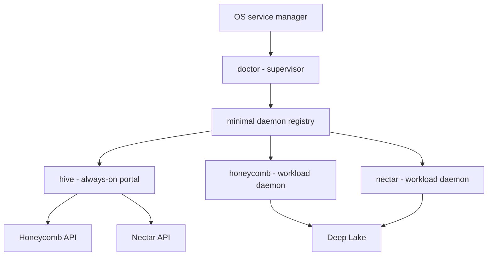

# ADR-0003: Three-Daemon Topology and hive Portal

> Category: Architecture | Version: 1.1 | Date: June 2026 | Status: Active

The architecture decision that expands Nectar's process topology into doctor as supervisor, hive as always-on portal, and Honeycomb/Nectar as workload daemons.

**Related:**
- [`ADR-0002-nectar-independent-daemon-supervised-by-doctor.md`](ADR-0002-nectar-independent-daemon-supervised-by-doctor.md)
- [`ADR-0004-hive-portal-daemon-role-and-boundaries.md`](ADR-0004-hive-portal-daemon-role-and-boundaries.md) *(expands the hive role + boundaries; this ADR records the topology, ADR-0004 records what hive IS)*
- [`hive-portal-daemon.md`](hive-portal-daemon.md) *(full design reference for hive)*
- [`../overview.md`](../overview.md)
- [`../data/recall-integration.md`](../data/recall-integration.md)
- [`../../../requirements/MASTER-PRD-INDEX.md`](../../../requirements/MASTER-PRD-INDEX.md)
- **Refined by:** [hive ADR-0001, retire honeycomb dashboard and copy-and-own into hive](../../../../../hive/library/knowledge/private/architecture/ADR-0001-retire-honeycomb-dashboard-and-copy-and-own-into-hive.md), which records the honeycomb dashboard retirement and the copy-and-own migration that realize this ADR's hive-owns-the-portal consequence without changing the topology.

---

## Context

ADR-0002 made the first process-boundary decision: hiveantennae must not run inside the Honeycomb daemon. It should run as the Nectar workload daemon, with its own process, Deep Lake client, auth context, scoping, and lifecycle. That remains correct.

The implementation research in `library/requirements/MASTER-PRD-INDEX.md:9-19` resolves the next topology question. doctor is not a portal and should not become one. Its job is supervision: health probes, restart policy, incident state, and service-unit integration. The dashboard should also be available before any workload daemon is healthy, but putting portal logic inside doctor would make the most stability-sensitive component carry the fastest-changing UI surface.

The split is therefore three daemon roles:

1. **doctor**: minimal supervisor. It gains a small daemon registry, where each registered daemon has a name, `healthUrl`, `pidPath`, and probe settings. It stays state-light and changes only when the supervised-daemon set changes.
2. **hive**: always-on portal daemon. It boots on OS start, is supervised by doctor, hosts the unified dashboard, and fetches data from registered workload daemon APIs.
3. **Workload daemons**: Honeycomb and Nectar. They own their respective work, expose `/health`, register with doctor, and surface dashboard/API data through hive.

## Decision

Adopt the **three-daemon topology**:

The topology has four operational boundaries:

- **doctor owns supervision, not product UI.** It can show minimal daemon status, but it does not host the unified dashboard or Hive Graph page.
- **hive owns the portal.** Dashboard routes, including the Hive Graph page, land in hive and call workload daemon APIs through its aggregation layer.
- **Honeycomb and Nectar remain workload daemons.** They expose their own health endpoints and product APIs, but neither owns the always-on portal shell.
- **Integration stays data/API-based.** There is no shared in-process state across doctor, hive, Honeycomb, or Nectar.

## Consequences

**Positive.**

- The dashboard can boot with the device because hive is a supervised always-on daemon.
- doctor stays rare-to-update and state-light; UI iteration happens in hive instead.
- Nectar remains independently deployable while still appearing in one portal with Honeycomb.
- Health and incident state become per-daemon registry entries instead of a single hardcoded Honeycomb target.

**Negative.**

- The system now has one more daemon to package, install, update, and supervise.
- hive needs an API aggregation contract for workload daemon status, Hive Graph data, and future portal surfaces.
- doctor needs a small registry migration from single-daemon config to named daemon entries.

## Rejected Alternatives

### Put the portal in doctor

Rejected because it couples dashboard velocity to the most stability-sensitive daemon. Any portal update would become a doctor update, erasing the stability/velocity split.

### Keep doctor as a single-daemon watchdog

Rejected because it leaves no durable place to register nectar or hive, and no single always-on UI truth when workload daemons are unhealthy.

### Make Nectar host its own dashboard page directly

Rejected as the primary user-facing topology. Nectar should expose Hive Graph APIs and status; hive should host the portal route. This keeps workload concerns in Nectar and the always-on dashboard shell in hive.

## Relationship to ADR-0002

ADR-0002 remains the decision that Nectar is not a Honeycomb worker. This ADR expands the surrounding topology: Nectar is one workload daemon in a registered set, doctor supervises that set, and hive hosts the portal for the set.

Corpus references that say "Nectar is supervised by doctor" remain true but incomplete unless they also account for registration and hive-hosted dashboard surfaces. Corpus references that place Nectar dashboard pages in Honeycomb are superseded by this ADR.

## Implementation Notes

- Nectar exposes `/health`, a PID/lock file, and API routes for Hive Graph search/status/build/projection work.
- doctor stores the daemon registry and runs one supervisor loop per registered daemon.
- hive hosts the unified dashboard and reads Nectar data through Nectar's API, not through direct table access.
- The data contract is unchanged: Nectar writes `hive_graph` and `hive_graph_versions` in Deep Lake, and Honeycomb recall reads those rows through its guarded recall arm.

## References

- `library/requirements/MASTER-PRD-INDEX.md:9-19` - locked decisions for topology, recall, table healing, watcher, embeddings, and Portkey caching.
- `library/requirements/MASTER-PRD-INDEX.md:29-35` - PRD-001 contract requiring ADR-0003.
- `library/requirements/MASTER-PRD-INDEX.md:49-65` - doctor registry and hive portal PRD boundaries.
- `doctor/src/supervisor.ts:144-343` - current doctor health-probe supervision contract to generalize.
- `doctor/src/config.ts:28-84` - current single-daemon config shape to generalize into registry entries.
