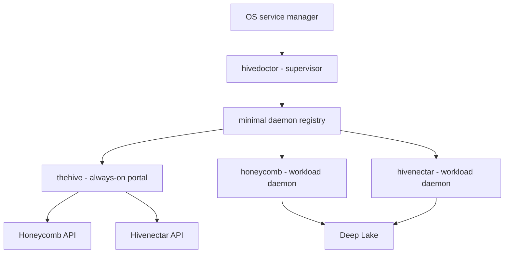

# ADR-0003: Three-Daemon Topology and thehive Portal

> Category: Architecture | Version: 1.1 | Date: June 2026 | Status: Active

The architecture decision that expands Hivenectar's process topology into hivedoctor as supervisor, thehive as always-on portal, and Honeycomb/Hivenectar as workload daemons.

**Related:**
- [`ADR-0002-hivenectar-independent-daemon-supervised-by-hivedoctor.md`](ADR-0002-hivenectar-independent-daemon-supervised-by-hivedoctor.md)
- [`ADR-0004-thehive-portal-daemon-role-and-boundaries.md`](ADR-0004-thehive-portal-daemon-role-and-boundaries.md) *(expands the thehive role + boundaries; this ADR records the topology, ADR-0004 records what thehive IS)*
- [`thehive-portal-daemon.md`](thehive-portal-daemon.md) *(full design reference for thehive)*
- [`../overview.md`](../overview.md)
- [`../data/recall-integration.md`](../data/recall-integration.md)
- [`../../../requirements/MASTER-PRD-INDEX.md`](../../../requirements/MASTER-PRD-INDEX.md)
- **Refined by:** [the-hive ADR-0001, retire honeycomb dashboard and copy-and-own into thehive](../../../../../the-hive/library/knowledge/private/architecture/ADR-0001-retire-honeycomb-dashboard-and-copy-and-own-into-thehive.md), which records the honeycomb dashboard retirement and the copy-and-own migration that realize this ADR's thehive-owns-the-portal consequence without changing the topology.

---

## Context

ADR-0002 made the first process-boundary decision: hiveantennae must not run inside the Honeycomb daemon. It should run as the Hivenectar workload daemon, with its own process, Deep Lake client, auth context, scoping, and lifecycle. That remains correct.

The implementation research in `library/requirements/MASTER-PRD-INDEX.md:9-19` resolves the next topology question. hivedoctor is not a portal and should not become one. Its job is supervision: health probes, restart policy, incident state, and service-unit integration. The dashboard should also be available before any workload daemon is healthy, but putting portal logic inside hivedoctor would make the most stability-sensitive component carry the fastest-changing UI surface.

The split is therefore three daemon roles:

1. **hivedoctor**: minimal supervisor. It gains a small daemon registry, where each registered daemon has a name, `healthUrl`, `pidPath`, and probe settings. It stays state-light and changes only when the supervised-daemon set changes.
2. **thehive**: always-on portal daemon. It boots on OS start, is supervised by hivedoctor, hosts the unified dashboard, and fetches data from registered workload daemon APIs.
3. **Workload daemons**: Honeycomb and Hivenectar. They own their respective work, expose `/health`, register with hivedoctor, and surface dashboard/API data through thehive.

## Decision

Adopt the **three-daemon topology**:

The topology has four operational boundaries:

- **hivedoctor owns supervision, not product UI.** It can show minimal daemon status, but it does not host the unified dashboard or Source Graph page.
- **thehive owns the portal.** Dashboard routes, including the Source Graph page, land in thehive and call workload daemon APIs through its aggregation layer.
- **Honeycomb and Hivenectar remain workload daemons.** They expose their own health endpoints and product APIs, but neither owns the always-on portal shell.
- **Integration stays data/API-based.** There is no shared in-process state across hivedoctor, thehive, Honeycomb, or Hivenectar.

## Consequences

**Positive.**

- The dashboard can boot with the device because thehive is a supervised always-on daemon.
- hivedoctor stays rare-to-update and state-light; UI iteration happens in thehive instead.
- Hivenectar remains independently deployable while still appearing in one portal with Honeycomb.
- Health and incident state become per-daemon registry entries instead of a single hardcoded Honeycomb target.

**Negative.**

- The system now has one more daemon to package, install, update, and supervise.
- thehive needs an API aggregation contract for workload daemon status, Source Graph data, and future portal surfaces.
- hivedoctor needs a small registry migration from single-daemon config to named daemon entries.

## Rejected Alternatives

### Put the portal in hivedoctor

Rejected because it couples dashboard velocity to the most stability-sensitive daemon. Any portal update would become a hivedoctor update, erasing the stability/velocity split.

### Keep hivedoctor as a single-daemon watchdog

Rejected because it leaves no durable place to register hivenectar or thehive, and no single always-on UI truth when workload daemons are unhealthy.

### Make Hivenectar host its own dashboard page directly

Rejected as the primary user-facing topology. Hivenectar should expose Source Graph APIs and status; thehive should host the portal route. This keeps workload concerns in Hivenectar and the always-on dashboard shell in thehive.

## Relationship to ADR-0002

ADR-0002 remains the decision that Hivenectar is not a Honeycomb worker. This ADR expands the surrounding topology: Hivenectar is one workload daemon in a registered set, hivedoctor supervises that set, and thehive hosts the portal for the set.

Corpus references that say "Hivenectar is supervised by hivedoctor" remain true but incomplete unless they also account for registration and thehive-hosted dashboard surfaces. Corpus references that place Hivenectar dashboard pages in Honeycomb are superseded by this ADR.

## Implementation Notes

- Hivenectar exposes `/health`, a PID/lock file, and API routes for Source Graph search/status/build/projection work.
- hivedoctor stores the daemon registry and runs one supervisor loop per registered daemon.
- thehive hosts the unified dashboard and reads Hivenectar data through Hivenectar's API, not through direct table access.
- The data contract is unchanged: Hivenectar writes `source_graph` and `source_graph_versions` in Deep Lake, and Honeycomb recall reads those rows through its guarded recall arm.

## References

- `library/requirements/MASTER-PRD-INDEX.md:9-19` - locked decisions for topology, recall, table healing, watcher, embeddings, and Portkey caching.
- `library/requirements/MASTER-PRD-INDEX.md:29-35` - PRD-001 contract requiring ADR-0003.
- `library/requirements/MASTER-PRD-INDEX.md:49-65` - hivedoctor registry and thehive portal PRD boundaries.
- `hivedoctor/src/supervisor.ts:144-343` - current hivedoctor health-probe supervision contract to generalize.
- `hivedoctor/src/config.ts:28-84` - current single-daemon config shape to generalize into registry entries.
