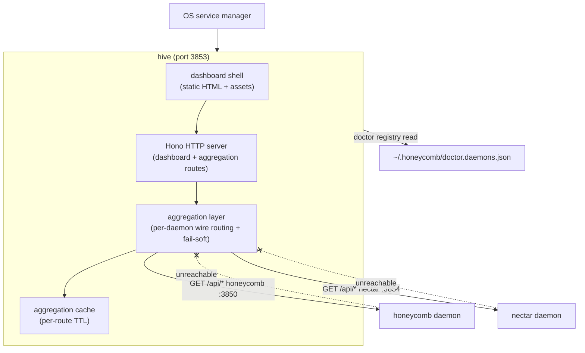
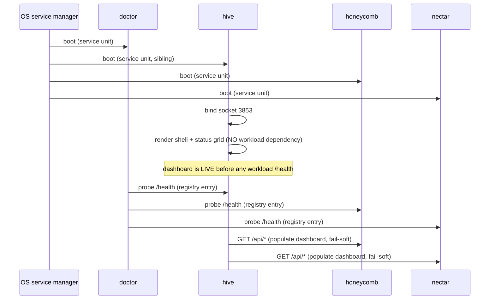

# hive Portal Daemon — design reference

> Category: Architecture | Version: 1.1 | Date: July 2026 | Status: Active

The full design detail for **hive**, the always-on portal daemon of the Nectar three-daemon topology: its component breakdown, the API-aggregation protocol mechanics, the dashboard route inventory, and its deployment/lifecycle model. This is the narrative companion to [ADR-0004](ADR-0004-hive-portal-daemon-role-and-boundaries.md) (which records the decisions) and [PRD-004c/004d](../../../requirements/completed/prd-004-doctor-registry-and-hive/) (which specify the build). Read ADR-0004 first for the *why*; this doc is the *what* and *how*.

**Implementation update (July 2026).** Hive shipped as its own repository and diverged from this design in three ways, recorded in hive's own knowledge base (`hive/library/knowledge/private/`): (1) the "reuse honeycomb's dashboard without forking" plan became **copy-and-own** (hive ADR-0001): the SPA was copied out of honeycomb once, honeycomb's copy was deleted, and hive owns the code outright; (2) the per-route TTL **aggregation cache was never built**: hive's server-side BFF proxy (hive ADR-0002, `hive/src/daemon/proxy.ts`) forwards each request over loopback with no cache layer; (3) the OS service names landed as `com.legioncode.hive` / `hive.service` / Windows task `hive` (`hive/src/service/platform.ts`), not the `com.hive.daemon` naming sketched here. The topology, the thin-portal boundaries, and the fail-soft aggregation contract all shipped as designed. Where this doc and hive's knowledge base disagree, hive's knowledge base wins.

**Related:**
- [`ADR-0004-hive-portal-daemon-role-and-boundaries.md`](ADR-0004-hive-portal-daemon-role-and-boundaries.md)
- [`ADR-0003-three-daemon-topology-and-hive-portal.md`](ADR-0003-three-daemon-topology-and-hive-portal.md)
- [`../../../requirements/completed/prd-004-doctor-registry-and-hive/prd-004c-hive-portal-daemon.md`](../../../requirements/completed/prd-004-doctor-registry-and-hive/prd-004c-hive-portal-daemon.md)
- [`../../../requirements/completed/prd-015-dashboard-hive-graph-page/`](../../../requirements/completed/prd-015-dashboard-hive-graph-page/)

---

## What hive is, in one paragraph

hive is a TypeScript/Node + Hono daemon that serves the unified dashboard for the Nectar ecosystem. It is one of three daemon roles in the topology decided by ADR-0003: doctor supervises, hive portals, and the workload daemons (honeycomb, nectar) do the work. hive boots on OS start as a supervised daemon in its own right (sibling to the workloads, not a child of any of them), renders the dashboard shell the moment its socket binds — before any workload daemon is confirmed healthy — and populates that shell by fetching data from each registered daemon's HTTP API. It holds no Deep Lake client, runs no queries, and resolves no tenancy scope. It is a thin portal: presentation plus an aggregation seam.

## The four binding properties (from ADR-0004)

These are the load-bearing decisions; this doc expands each into design detail.

1. **Always-on + boot-order contract** — hive serves the shell before any workload is healthy.
2. **API aggregation, not direct Deep Lake access** — hive fetches from daemon APIs; it is not a data-plane consumer.
3. **Dashboard ownership**: hive owns the unified dashboard. (Originally framed as runtime reuse of honeycomb's `registry.tsx` / `pages/*`; shipped as copy-and-own per hive ADR-0001, see the implementation update above.)
4. **Update-cadence boundary** — hive ships independently of doctor and the workloads.

---

## Component breakdown

| Component | Responsibility | Notes |
|---|---|---|
| **OS service unit** | Boots hive on device start; restarts on crash | Shipped as launchd `com.legioncode.hive` / systemd `hive.service` / Windows task `hive` (`hive/src/service/platform.ts`). Sibling to doctor's unit, not a child of a workload. |
| **Dashboard shell** | Static HTML + assets rendered before any API call | The always-on guarantee: the shell + a daemon-status grid render the moment the socket binds. API data populates async. |
| **Hono HTTP server** | Serves the shell + the dashboard routes + the aggregation routes | Modeled on honeycomb's `src/daemon/runtime/server.ts` (Hono, route groups, unprotected `/health`). |
| **Aggregation layer** | Per-daemon `wire` routing — each dashboard request is dispatched to the owning daemon's API | The seam from ADR-0004 decision 2. Fail-soft per daemon: unreachable → empty section + "daemon unreachable" badge, never a 500. |
| **Aggregation cache** | Per-route TTL cache of aggregated responses | Designed but never built: the shipped BFF proxy forwards every request over loopback uncached, and loopback latency made the cache unnecessary. Kept here as design history. |
| **doctor registry reader** | Reads `~/.honeycomb/doctor.daemons.json` to know which daemons exist + their API base URLs | Read on boot + on a slow poll. hive does not own the registry (doctor does); it consumes it. |

---

## The API-aggregation protocol (the seam)

This is the most consequential design element — the contract that keeps hive thin while letting it render data from any registered daemon.

### Request flow

1. A browser hits a hive dashboard route (e.g. `/hive-graph`).
2. hive's SPA router matches the route to a `PageProps` component from hive's own `registry.tsx` (copied and owned from honeycomb, hive ADR-0001).
3. The component calls `wire.<method>(...)` to fetch its data.
4. hive's `wire` implementation routes the call to the **owning daemon's** API — not to an in-process handler. For `/hive-graph` data, that's `GET http://127.0.0.1:3854/api/hive-graph/*` (nectar).
5. The fetch fires on every request (the designed per-route TTL cache was never built; loopback made it unnecessary).
6. On success, the response is returned. On unreachable, the fail-soft path returns an empty payload + a degradation flag the component renders as "daemon unreachable."

### The `wire` abstraction

hive's dashboard components call a `wire` data-fetch abstraction, the same pattern honeycomb's dashboard used. As designed here, hive was to reuse honeycomb's `wire` interface with a per-daemon HTTP implementation. As shipped, hive copied and owns its own `wire.ts` (`hive/src/dashboard/web/wire.ts`): every call fetches same-origin `/api/*` paths, and hive's server-side BFF proxy resolves the owning daemon per request and forwards over loopback (`hive/src/daemon/proxy.ts`, hive ADR-0002). The component layer still does not know which daemon serves it; the routing moved from the browser to the server.

### Per-daemon routing table

| Dashboard route | Owning daemon | Daemon API |
|---|---|---|
| `/` (Dashboard) | honeycomb | `:3850/api/*` |
| `/projects` | honeycomb | `:3850/api/*` |
| `/harnesses` | honeycomb | `:3850/api/*` |
| `/memories` | honeycomb | `:3850/api/*` |
| `/graph` (memory graph) | honeycomb | `:3850/api/*` |
| `/sync`, `/logs`, `/roi`, `/settings` | honeycomb | `:3850/api/*` |
| `/hive-graph` (PRD-015, NEW) | nectar | `:3854/api/hive-graph/*` |

The existing honeycomb routes are served by proxying to honeycomb's API. The new `/hive-graph` route (PRD-015) is the first nectar-owned route. Future nectar-owned pages (or pages from future workload daemons) extend this table.

### Fail-soft contract

- A daemon unreachable on a given route → that route's section renders empty + a "daemon unreachable" badge. hive never returns a 500 for a workload outage.
- A daemon returning an error payload → the section renders the error inline (operator-facing, not a broken page).
- hive's own `/health` is independent — it reports `ok` as long as hive's server is up, regardless of workload daemon health.

---

## Dashboard ownership + code reuse

hive owns the unified dashboard: every route a user visits lives here, including the pages that originated in honeycomb and the Hive Graph page (PRD-015). This section originally specified **runtime reuse** of honeycomb's component layer. What shipped is **copy-and-own** (hive ADR-0001): the React components in `pages/*`, the route registry in `registry.tsx`, and the `PageProps` shape were copied into `hive/src/dashboard/web/` once, honeycomb's dashboard was deleted, and hive owns the code outright with no shared package and no drift risk. Concretely, as shipped:

- **Route registry**: hive's own `ROUTES` array (`hive/src/dashboard/web/registry.tsx`) carries all 11 entries, including `/hive-graph`.
- **Page components**: the honeycomb-origin pages live in hive's tree and fetch through hive's same-origin `wire`; `HiveGraphPage` is hive-authored and renders nectar data.
- **`PageProps`**: preserved through the copy, so the add-a-page contract survived the ownership change.

The "how to add a page" contract now lives in hive's own knowledge base (`hive/library/knowledge/private/frontend/spa-architecture.md`): write a `function MyPage({ wire, ... })`, add a `RouteEntry`, done.

---

## Deployment + lifecycle

### Boot ordering

All four daemons are siblings under the OS service manager. There is no parent-child dependency. hive renders its shell the instant its own socket binds; workload data populates as each workload comes healthy.

### Process surface

| Property | Value | Source |
|---|---|---|
| Port | 3853 | PRD-001b (confirmed) |
| PID file | `~/.honeycomb/hive.pid` | PRD-004d |
| Lock file | `~/.honeycomb/hive.lock` | PRD-004d (single-instance guard) |
| OS service unit | launchd `com.legioncode.hive` / systemd `hive.service` / Windows task `hive` | `hive/src/service/platform.ts` (fleet naming decision #32) |
| `/health` | `ok`/`degraded` — independent of workload health | ADR-0004 decision 1 |
| Registry entry | one row in `~/.honeycomb/doctor.daemons.json` | PRD-004a (hive is supervised like the others) |
| Stack | TypeScript/Node + Hono (reuses honeycomb's dashboard code) | PRD-004c, ADR-0004 decision 3 |

### Update cadence

hive is a **separate release train** from doctor, honeycomb, and nectar. A dashboard change ships as a hive release (new bundle + restart of hive's service unit); it does not touch doctor or the workloads. Conversely, an doctor release does not redeploy hive. This is the operational realization of the stability/velocity split (ADR-0003 + ADR-0004 decision 4).

---

## What hive explicitly is NOT

- **Not a Deep Lake client.** No storage client, no tenancy scope, no queries. (ADR-0004 decision 2.)
- **Not a supervisor.** It does not probe `/health`, restart daemons, or own incident state — that's doctor.
- **Not a workload.** It does not brood, enrich, recall, or run any Nectar/honeycomb logic. It presents + aggregates.
- **Not a child of a workload.** It is a top-level supervised daemon, sibling to the workloads, so a workload outage does not take it down.
- **Not a fork of honeycomb's dashboard.** It is the dashboard: the code was copied and owned once (hive ADR-0001) and honeycomb's copy was retired, so there are not two dashboards to diverge.

---

## Forward pointers

- **The decisions** (always-on, aggregation, ownership, cadence) → [`ADR-0004`](ADR-0004-hive-portal-daemon-role-and-boundaries.md).
- **The build spec** (bootstrap, Hono server, aggregation `wire`, service unit, registration) → [`prd-004c`](../../../requirements/completed/prd-004-doctor-registry-and-hive/prd-004c-hive-portal-daemon.md) + [`prd-004d`](../../../requirements/completed/prd-004-doctor-registry-and-hive/prd-004d-hive-service-unit-and-registration.md).
- **The first hive-hosted page** (Hive Graph) → [`prd-015`](../../../requirements/completed/prd-015-dashboard-hive-graph-page/).
- **The dashboard code as shipped** → `hive/src/dashboard/web/registry.tsx` + `hive/src/dashboard/web/pages/*` (copy-and-own per hive ADR-0001).
- **The topology hive sits inside** → [`ADR-0003`](ADR-0003-three-daemon-topology-and-hive-portal.md).
- **Hive's own knowledge base** (authoritative for the shipped implementation) → `hive/library/knowledge/private/architecture/system-overview.md`.
