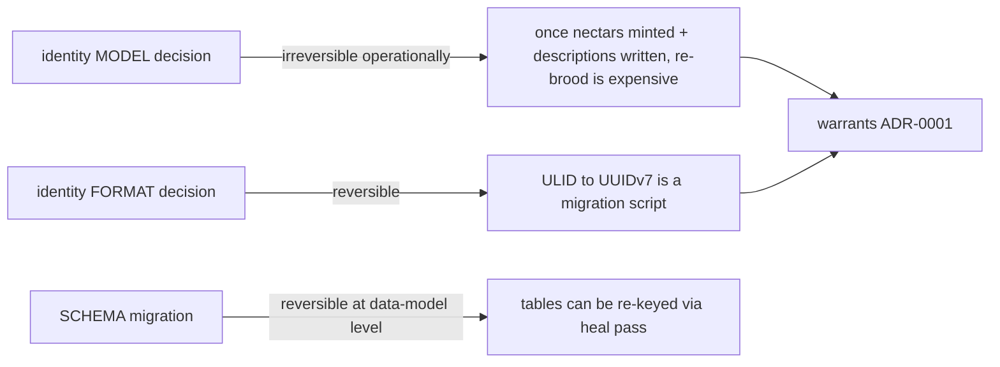

# Identity Model — Conclusion and Deliverables

> Category: Architecture | Version: 1.0 | Date: June 2026 | Status: Draft

The identity-model decision restated (Option C adopted), its positive and negative consequences, the reversibility analysis, and a one-sentence quick-reference table rejecting every alternative considered — the closing document of the identity-model narrative.

**Related:**
- [`../ADR-0001-minted-nectar-over-source-embedded-serial.md`](../ADR-0001-minted-nectar-over-source-embedded-serial.md)
- [`identity-model-introduction-and-theory.md`](identity-model-introduction-and-theory.md)
- [`identity-model-technical-specification.md`](identity-model-technical-specification.md)
- [`identity-model-ecosystem-story-arc.md`](identity-model-ecosystem-story-arc.md)
- [`identity-model-user-stories.md`](identity-model-user-stories.md)
- [`../../ai/identity-and-reassociation.md`](../../ai/identity-and-reassociation.md)
- [`../../reference/prior-art-crosswalk.md`](../../reference/prior-art-crosswalk.md)

---

## The decision, restated

Nectar adopts **Option C**: a daemon-minted ULID nectar, persisted in Deep Lake as the primary key of `hive_graph`, re-associated to files on disk by the exact-then-fuzzy ladder, with a committed regenerable projection for fresh-clone inheritance. The nectar is minted once, never written into the file, never re-derived from the file's content, and never reused. This is the decision recorded in [`ADR-0001`](../ADR-0001-minted-nectar-over-source-embedded-serial.md); this document closes the narrative by accounting for its consequences, its reversibility, and the alternatives it leaves behind.

The decision rests on a single load-bearing insight: a file on disk has no stable identity of its own, so identity must be assigned by an observer and maintained by observation. The minted ULID is the assigned identity; the re-association ladder is the observation that maintains it; the committed projection is the carrier that lets that assignment survive a git-clone boundary. Every other choice in the system — the two-table schema, the watcher contract, the fresh-clone story, the team-share path — is a deduction from this one. The four sibling documents in this folder expand each facet of the decision; the ADR remains the authoritative record.

---

## Positive consequences

The decision yields six positive consequences, each tied to a decision driver the chosen model satisfies.

**Stable identity across edits, moves, renames, and copy-paste.** Because the nectar is not derived from content or path, it does not churn when either changes. Edits append a version row; moves carry the nectar via the ladder; renames are moves; copy-paste mints a fresh nectar with a permanent provenance edge. The history chain is continuous and append-only.

**No source mutation.** The hiveantennae daemon never writes to source files. The AGPL license header on line 1 is untouched, the contributor workflow is unaffected, and the first-run brooding pass produces no invasive "mega-commit" touching thousands of files. The only committed artifact is the reviewable `.honeycomb/nectars.json` projection.

**Universal applicability across file types.** The daemon observes every file on disk regardless of comment syntax. JSON, `.env`, YAML, TOML, and lockfiles all receive nectars. Binary files receive nectars with `describe_status = 'skipped-binary'`, so identity coverage is universal even where semantic description is impossible. No file type is excluded from the identity layer.

**Deep Lake remains the only durable store; FR-8 is satisfied.** The nectar table is a Deep Lake table. There is no SQLite sidecar, no JSONL log, no parallel store. The committed projection is a regenerable lockfile, not a sidecar — enforced by three rules that keep it on the right side of FR-8.

**Fresh clones inherit identity via the committed projection.** A new `git clone` matches on-disk content hashes into the projection before falling back to the re-association ladder. A current projection yields zero LLM calls and zero fuzzy matches; the brooding cost was paid once, by whoever first brooded the project. The clone works offline, immediately, before login or cloud sync.

**Composition with the existing Honeycomb substrate.** The identity model reuses the existing Deep Lake client, auth, scoping, observability, CodeGraph, recall pipeline, daemon lifecycle, and embeddings runtime. Nothing about the identity decision requires a new subsystem; it requires a new table and a new worker within the existing daemon.

---

## Negative consequences acknowledged

The decision is not free. Four negative consequences are acknowledged in the ADR and accepted as the cost of the model's advantages.

**The re-association ladder is real engineering.** Steps 1–3 of the ladder are exact and easy. Step 4 — TLSH fuzzy matching — requires a TLSH implementation (native addon or WASM), size-bucketing for performance on large repos, and a confidence-scored review path for low-confidence matches. Option A and Option B do not need this machinery. The cost is paid because the alternatives have worse problems: A corrupts copy-paste and mutates source; B churns identity per edit.

**Cold catch-up after offline changes is the hard case.** During live operation, `node:fs.watch` tells the daemon which paths need refresh, and step 3 reconstructs ordinary moves through exact-hash matches against the missing-files set. Cold catch-up — the daemon boots after the laptop was closed while files were moved and edited — relies on steps 3 and 4 with only final disk state, and may surface low-confidence matches for human review. This is acceptable because the ladder is conservative: a mis-association is worse than a new nectar, so low-confidence candidates are surfaced rather than auto-claimed.

**Identity does not survive a fresh clone without the committed projection.** Without `.honeycomb/nectars.json`, a fresh clone must brood from scratch, minting new nectars with no connection to the originals. This breaks the team-share story. The mitigation is committing the projection by default; the system works without it (each clone broods independently) but loses the inheritance property.

**The TLSH comparison is O(N×M) in the worst case.** On a monorepo-scale cold boot, comparing every on-disk file's fingerprint against every missing file's fingerprint is quadratic. Size-bucketing limits candidate sets in v1; a future minhash-LSH pre-filter is a documented extension point. The quadratic bound is a real scaling concern for very large repos, not a theoretical one.

---

## Reversibility analysis

The decision's reversibility is asymmetric, and understanding the asymmetry is the reason it warranted an ADR.

**Reversible at the data-model level.** The schema could be migrated to a different identity scheme. `hive_graph` and `hive_graph_versions` are Deep Lake tables subject to the same additive schema-heal pass as the rest of Honeycomb; a migration script could re-key them. The nectar format itself (ULID) is independently reversible — a future release could re-encode nectars to UUIDv7 without touching the identity *model*. The format is deliberately recorded as separable from the model for exactly this reason.

**Irreversible at the operational level.** Once nectars are minted and descriptions are written against those nectars, re-brooding under a different identity model means rebuilding every history chain, every provenance edge, every recall link. The descriptions are cheap to regenerate; the *associations between descriptions and the files they describe* are not. Any cross-reference a teammate or agent has already formed — in recall results, in interlink views, in `derived_from` edges — is invalidated. This is the irreversibility that matters operationally: not "can the schema change" but "can the existing associations survive the change," and the answer is no, not cheaply.

The asymmetry is the point. A decision that is reversible at both levels is an implementation detail and does not need an ADR. A decision that is irreversible at both levels is a commitment and needs more than an ADR — it needs a migration plan. The identity model sits in the uncomfortable middle: reversible in principle, irreversible in practice. That is precisely the class of decision an ADR exists to record, so that the operational irreversibility is understood before the first nectar is minted, not discovered after.

---

## Alternatives rejected — quick reference

The ADR records six alternatives considered and rejected. Each is restated here in one sentence for quick reference; the ADR and [`identity-model-introduction-and-theory.md`](identity-model-introduction-and-theory.md) hold the full arguments.

| Alternative | One-sentence rejection |
|---|---|
| **Option A — source-embedded serial** | Rejected for AGPL-header collision, line-1 conflict under multi-author edits, copy-paste duplicate-serial ambiguity, and comment-syntax non-universality (JSON/`.env`/binaries). |
| **Option B — content hash as identity** | Rejected because it churns per edit and therefore is not actually stable — it is path-as-identity moved one layer down, where "path" is now "content." |
| **Option D — SQLite sidecar** | Rejected for FR-8 violation; Deep Lake is the only durable store, and a parallel SQLite store drifts and becomes a second source of truth. |
| **xattrs / NTFS alternate data streams** | Rejected because tooling is miserable on Windows, git strips them, and cross-filesystem copy loses them. |
| **Path-as-identity (the implicit default)** | Rejected because paths change on every rename and move, which is the failure mode stable identity exists to solve. |
| **Symbol-granular identity (Aura/Mimir at function level)** | Deferred to v2; v1 is file-granular, and symbol-level nectars would multiply row counts 10–100× and duplicate the structural CodeGraph. |

Option D (SQLite sidecar) is rejected independently of the identity-key choice: even with the minted-ULID model, storing nectars in a parallel SQLite database violates FR-8. The rejection of xattrs and path-as-identity eliminates the remaining "identity lives somewhere on the filesystem" options. The deferral of symbol-granular identity is a scope decision, not a rejection on merit — symbol-level nectars remain a v2 possibility once file-level proves the model.

---

## The deliverables of this decision

The identity-model decision produces a defined set of artifacts, each documented elsewhere in the knowledge base. This is the map of what the decision *delivers*.

| Deliverable | Where documented |
|---|---|
| The decision and its rationale | [`ADR-0001`](../ADR-0001-minted-nectar-over-source-embedded-serial.md) |
| The conceptual foundation (theory) | [`identity-model-introduction-and-theory.md`](identity-model-introduction-and-theory.md) |
| The technical contract (seven clauses) | [`identity-model-technical-specification.md`](identity-model-technical-specification.md) |
| The ecosystem cascade (seven stages) | [`identity-model-ecosystem-story-arc.md`](identity-model-ecosystem-story-arc.md) |
| The engineering acceptance criteria (25 stories) | [`identity-model-user-stories.md`](identity-model-user-stories.md) |
| The re-association algorithm (the ladder) | [`../../ai/identity-and-reassociation.md`](../../ai/identity-and-reassociation.md) |
| The schema (two Deep Lake tables) | [`../../data/hive-graph-schema.md`](../../data/hive-graph-schema.md) |
| The portable projection (the lockfile) | [`../../data/portable-registry.md`](../../data/portable-registry.md) |
| The prior-art survey (Aura, Mimir, et al.) | [`../../reference/prior-art-crosswalk.md`](../../reference/prior-art-crosswalk.md) |

The decision is closed. The nectar is minted, never embedded, re-associated by observation, projected for portability, and inherited across clones. The remaining work is implementation against the contract documented in these pages — and implementation that preserves the seven clauses is compliant with the identity model, regardless of the specific ladder, projection, or versioning details it chooses within those bounds.
