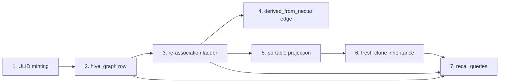
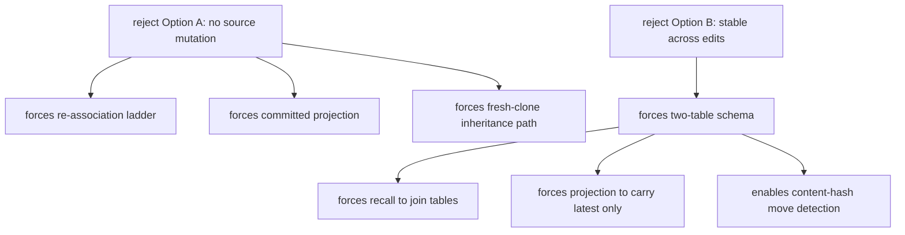

# Identity Model — Ecosystem Story Arc

> Category: Architecture | Version: 1.0 | Date: June 2026 | Status: Draft

How the identity-model decision cascades into the rest of Nectar: tracing the nectar from ULID minting through the Deep Lake row, the re-association ladder, the copy-paste provenance edge, the portable projection, fresh-clone inheritance, and recall — and showing how rejecting Option A and Option B forces the shape of the surrounding system.

**Related:**
- [`../ADR-0001-minted-nectar-over-source-embedded-serial.md`](../ADR-0001-minted-nectar-over-source-embedded-serial.md)
- [`identity-model-introduction-and-theory.md`](identity-model-introduction-and-theory.md)
- [`identity-model-technical-specification.md`](identity-model-technical-specification.md)
- [`identity-model-conclusion-and-deliverables.md`](identity-model-conclusion-and-deliverables.md)
- [`../../ai/identity-and-reassociation.md`](../../ai/identity-and-reassociation.md)
- [`../../data/hive-graph-schema.md`](../../data/hive-graph-schema.md)
- [`../../data/portable-registry.md`](../../data/portable-registry.md)

---

## The cascade

The identity model is not one decision; it is the first domino. Once the decision is made that identity is a daemon-minted ULID never embedded in source, the rest of the system's shape is largely determined. This document traces that cascade, stage by stage, from the moment a nectar is minted to the moment a recall query uses it. Each stage exists because of a property the identity model either provides or forbids.

Read the diagram left to right: a nectar is minted, persisted, carried across disk mutations, projected into a lockfile, inherited across a clone boundary, and finally queried. The seven stages are not independent components; they are the lifecycle of a single identity record, and each stage's existence is a consequence of the identity-model decision recorded in [`ADR-0001`](../ADR-0001-minted-nectar-over-source-embedded-serial.md).

---

## Stage 1: ULID minting

The cascade begins when hiveantennae observes a file it has no record of. The daemon mints a 26-character ULID — 48-bit millisecond timestamp plus 80 bits of randomness, Crockford base32, uppercase, lexicographically sortable by creation time. The minting happens in exactly two situations: brooding (first observation of a genuinely new file) and the copy event (a new path whose content matches an existing file's current content).

The ULID is minted, not derived. This is the foundational property. Because the nectar is not a function of the file's content, path, or inode, none of those properties can churn it. A save changes content; the nectar is unaffected. A rename changes path; the nectar is unaffected. The nectar follows the file because the daemon *observes* the file, not because a marker *travels* with the file. The minting stage is where the "identity is assigned, not intrinsic" principle becomes a concrete identifier.

The format's lexicographic sortability is not decorative — it is what makes cold catch-up tractable. When the daemon boots after downtime and asks "what changed while I was offline," the answer is a creation-time-ordered scan, not a timestamp parse over every row.

---

## Stage 2: the Deep Lake `hive_graph` row

The minted nectar is written to Deep Lake as the primary key of `hive_graph`. This is where FR-8 (Deep Lake as the only durable store) enters the cascade: the nectar table is a Deep Lake table, not a SQLite sidecar, not a JSONL log, not an in-file marker.

The row carries identity and provenance only — `nectar`, `kind`, `created_at`, `derived_from_nectar`, `fork_content_hash`, and the tenancy triple (`org_id`, `workspace_id`, `project_id`). No content, no description. Content and description live in the append-only `hive_graph_versions` table, keyed by the `(nectar, content_hash)` composite. The full DDL is in [`../../data/hive-graph-schema.md`](../../data/hive-graph-schema.md).

This two-table split is a direct consequence of rejecting Option B. If identity were the content hash, one table would suffice — but identity would churn per edit, which is the failure mode stable identity exists to solve. Separating a stable identity key (nectar) from a changing version key (content_hash) is the schema-level expression of "neither alone is enough," the Aura principle. The split is forced by the identity model, not chosen independently.

---

## Stage 3: the re-association ladder carries the nectar

Because the nectar never lives in the file, the daemon must re-establish the association between a nectar and a file on disk every time disk changes. This is the re-association ladder, evaluated top-down per file (first match wins):

1. `(path, mtime, size)` exact match → same nectar, no-op.
2. Path match, content changed → same nectar, append version row.
3. Exact content-hash match to a missing file → carry nectar, record new path (the move detector).
4. Fuzzy TLSH match to a missing file → carry nectar, flag confidence (the move-and-edit case).
5. Nothing matches → mint a fresh nectar.

The ladder is the cost of the minted model. Option A and Option B do not need it — A because the serial travels in-file, B because the hash is recomputable from content. Option C needs it because the nectar is *neither* in the file *nor* recomputable from the file; the association is maintained by observation, and observation requires a reconciliation algorithm when the observer was offline. The ladder is documented in full in [`../../ai/identity-and-reassociation.md`](../../ai/identity-and-reassociation.md).

Steps 1–3 are exact and easy. Step 4 (TLSH fuzzy match) is the real engineering — it requires a TLSH implementation, size-bucketing for performance on large repos, and a confidence-scored review path for low-confidence matches. The ladder is conservative: a low-confidence match is surfaced for human review rather than auto-claimed, because a mis-association corrupts the history chain and is worse than a new nectar.

The ladder's distribution differs sharply between live watch and cold catch-up. During live operation, `node:fs.watch` provides uncorrelated disk observations; the daemon debounces them, refreshes the missing-files set, and lets step 3 handle ordinary moves by exact content hash. Cold catch-up — the daemon boots after offline move-and-edit — is where steps 3 and 4 do their hardest work because only final disk state remains. The cascade's hardest stage exists for the least informative operating mode.

---

## Stage 4: copy-paste creates the `derived_from_nectar` edge

When a new path's content hash matches an existing file's current content, the daemon mints a *fresh* nectar for the new path and sets `derived_from_nectar` pointing at the source. The copy is its own identity, permanently linked to its origin.

This is the stage where the minted model's superiority over both alternatives is starkest. Under Option A, the copied file carries the same serial, producing duplicate-identity ambiguity — the system itself created a conflict it cannot resolve. Under Option B, the copy and the source are indistinguishable at copy time (same hash), and the moment the copy is edited, all trace of the relationship is lost. Under Option C, the copy gets a distinct identity (so it can diverge) *and* an explicit, durable, queryable provenance edge (so the relationship survives forever).

The `derived_from_nectar` and `fork_content_hash` columns on `hive_graph` are write-once: set at the copy-event minting, never updated. Even after both files diverge completely, the link remains. This is what enables the Obsidian-style interlink view to render "B was forked from A at time T when A looked like H1" indefinitely — a property neither rejected alternative can offer.

---

## Stage 5: the portable projection commits the map

At the end of every brood and every enricher cycle that produced new descriptions, the daemon regenerates `.honeycomb/nectars.json` — a single committed, reviewable file at the project root. The projection is a content-hash-keyed map of the latest described version per nectar, plus the `derived` provenance map. It is written atomically (temp file plus rename) so a crashed regeneration leaves the old projection, not a partial one.

The projection exists because of a property the identity model forbids: the nectar never lives in the file, so a fresh clone has no in-band way to know which nectar belongs to which file. Option A would solve fresh-clone trivially (the serial is in the file), but Option A is rejected for its other four failures. Option C must therefore provide an out-of-band carrier for the identity map, and the committed projection is that carrier.

The projection is a **lockfile, not a sidecar**. The distinction is enforced by three rules documented in [`../../data/portable-registry.md`](../../data/portable-registry.md): Deep Lake writes happen first (the projection is never the target of a write), the projection is never hand-edited (a hand-edit is overwritten on the next regeneration), and the projection is regenerable from Deep Lake alone (`rebuild-projection` produces it with no other inputs). These rules keep the projection on the right side of FR-8. The file exists for portability and reviewability, not because Deep Lake is insufficient.

---

## Stage 6: fresh clone inherits the nectar

When the daemon boots on a checkout that has `.honeycomb/nectars.json` present, it validates the projection (version, project triple, syntactically valid ULIDs and hashes), builds a content-hash → nectar index, scans disk, and matches each file's content hash into the projection. A match inherits the nectar and its description, writing the inherited rows to the local Deep Lake instance. A mismatch falls through to the re-association ladder.

A current projection typically achieves **zero LLM calls and zero fuzzy matches** on a fresh clone. Every file finds its nectar through the projection's content-hash index; the brooding cost was paid by whoever first brooded the project, and the clone pays nothing. This is the team-share story: a teammate's clone works offline immediately, inherits every description, and is ready to serve semantic recall without network or auth.

Without the projection, a fresh clone must brood from scratch — minting new nectars with no connection to the originals. The projection is committed by default precisely to prevent this. The cascade's sixth stage is what makes Nectar a team asset rather than a per-developer index.

---

## Stage 7: recall queries the nectar

The final stage. Nectar plugs into the existing hybrid recall pipeline (BM25 lexical plus 768-dim vector, fused by reciprocal rank). Honeycomb adds a guarded hive-graph arm over `hive_graph_versions` (latest-per-nectar, description non-null), weighted to contribute alongside session, memory, and skill hits. An agent query like *"everything associated with logins"* returns structural hits (the CodeGraph's `find/authenticate`) and semantic hits (the `session-refresh.ts` middleware described as "refreshes JWT claims on each authenticated request").

Recall keys off the nectar. "Current state of file X" is the latest version row for X's nectar. "History of file X" is all version rows for X's nectar. "Files forked from X" is the set of nectars whose `derived_from_nectar` equals X's nectar. Every query that matters — current state, history, provenance, related-by-concept — resolves through the nectar as the stable join key. If the nectar churned (Option B) or collided (Option A), every one of these queries would return wrong or ambiguous results. The nectar's stability is what makes the recall layer trustworthy.

---

## How the rejections shaped the system

The cascade above is shaped as much by what was rejected as by what was chosen. Two rejections in particular forced structural decisions that propagate through every stage.

### Rejecting Option A protects the AGPL-header convention

Option A (source-embedded serial) is rejected because it collides with the AGPL license header that owns line 1 of every source file. This rejection is not abstract — it is a collision with a rule already in force in this repository. The consequence ripples outward: because the daemon never writes to source (Clause 4 of the technical contract), it must maintain the identity association out-of-band. That requirement is what creates the re-association ladder (Stage 3), the committed projection (Stage 5), and the fresh-clone inheritance path (Stage 6). If the serial were in the file, none of those mechanisms would be necessary — but the serial cannot be in the file, so all of them are.

The rejection also protects the contributor workflow. Option A's first-pass minting produces a single invasive "brooding mega-commit" that prepends a line to thousands of files. Code reviewers reject it. Option C's brooding writes to Deep Lake and a single projection file; the source tree is untouched, and the only committed artifact is a reviewable lockfile. The cascade's shape — Deep Lake as store, projection as the only committed file — is the operational expression of "no source mutation."

### Rejecting Option B forces the two-table split

Option B (content hash as identity) is rejected because it churns per edit. This rejection is what forces the schema into two tables. If identity were the content hash, one table would suffice — but identity would be unstable, which defeats the purpose. Separating a stable identity key from a changing version key requires two tables: `hive_graph` for identity and provenance, `hive_graph_versions` for the append-only content+description chain.

The split propagates into recall (Stage 7), which must resolve "latest version of this nectar" by joining the two tables. It propagates into the projection (Stage 5), which carries only the latest described version per nectar, not the full chain. And it propagates into the re-association ladder (Stage 3), which uses the version chain's content hashes as its step-3 move detector. The two-table split is not a schema preference; it is the data-model consequence of requiring identity to be stable while content is not.

The identity decision is the spine. Every stage of the cascade is a vertebra that exists because the spine bends a particular way. To change the identity model is to re-shape the entire system — which is why the decision is the least reversible one in the design, as [`identity-model-conclusion-and-deliverables.md`](identity-model-conclusion-and-deliverables.md) makes explicit.
