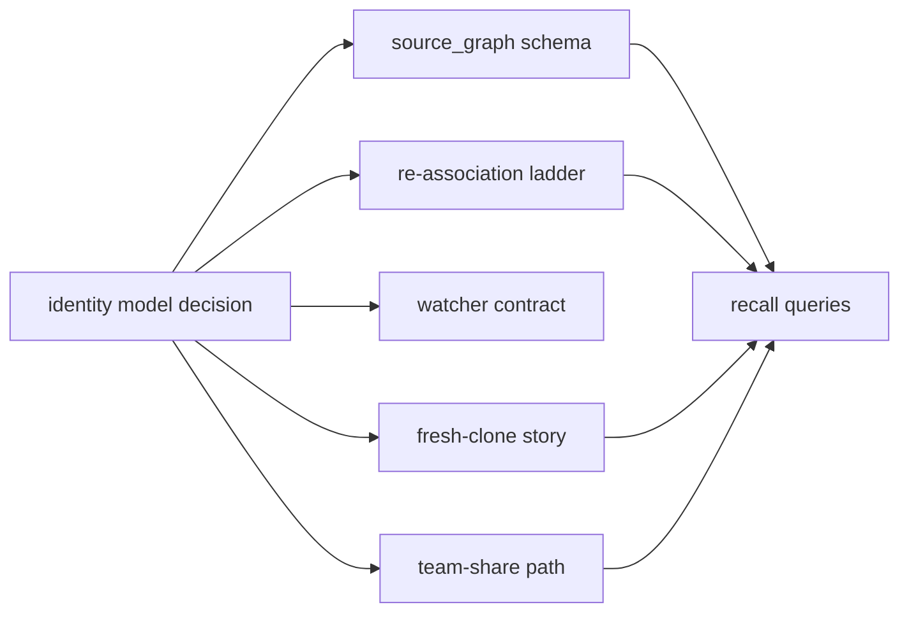
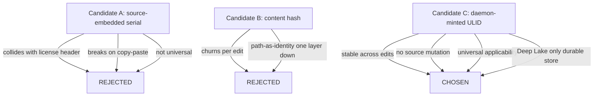

# Identity Model — Introduction and Theory

> Category: Architecture | Version: 1.0 | Date: June 2026 | Status: Draft

The conceptual foundation of Hivenectar's identity model: why "a file on disk has no stable identity of its own" is the load-bearing insight, how three candidate models each fail or win under Honeycomb's constraints, and why this is the least-reversible decision in the entire design.

**Related:**
- [`../ADR-0001-minted-nectar-over-source-embedded-serial.md`](../ADR-0001-minted-nectar-over-source-embedded-serial.md)
- [`identity-model-technical-specification.md`](identity-model-technical-specification.md)
- [`identity-model-ecosystem-story-arc.md`](identity-model-ecosystem-story-arc.md)
- [`identity-model-conclusion-and-deliverables.md`](identity-model-conclusion-and-deliverables.md)
- [`../../ai/identity-and-reassociation.md`](../../ai/identity-and-reassociation.md)
- [`../../data/source-graph-schema.md`](../../data/source-graph-schema.md)
- [`../../reference/prior-art-crosswalk.md`](../../reference/prior-art-crosswalk.md)

---

## The load-bearing insight

A file on disk has no stable identity of its own. This single sentence is the spine of Hivenectar's entire identity architecture, and everything else — the ULID format, the two-table schema, the re-association ladder, the committed projection — follows from taking it seriously.

Consider what a file actually is to the operating system. Its **path** can change at any moment: a rename, a `git mv`, an IDE refactor, a directory restructure. Its **content** can change on every save. Its **inode** can change on a copy, a clone, or a save-that-replaces. None of these properties — path, content, inode — is invariant across the operations a developer performs every day. If identity is defined as a function of any one of them, identity churns the moment that property churns.

The only thing that actually persists across a rename, a move, and an edit is the *fact that an observer once decided this is the same logical file it saw before*. That decision is not a property of the file. It is a property of the observer. Identity, in other words, is not something a file *has* — it is something a system *assigns* and then works to *maintain*. This is the philosophical pivot on which the whole model turns.

Hivenectar calls that assigned identity a **nectar**: a 26-character ULID minted once by the hiveantennae daemon and stored in Deep Lake. The nectar is stable precisely because it is **not derived from anything about the file**. It is not a hash of the content (that changes per edit). It is not a function of the path (that changes per move). It is not embedded in the source (that collides with the license header and breaks on copy-paste). It is a pure minted identifier, created once, associated to the file by the daemon's ongoing observation of disk.

---

## Why this is the least-reversible decision

The identity model is not just an important decision; it is the *most consequential and least reversible* decision in Hivenectar's design. The ADR records this explicitly: the identity model "determines the database schema, the re-association algorithm, the watcher contract, the fresh-clone story, and the team-share path."

The irreversibility is operational, not theoretical. A schema can be migrated; an algorithm can be swapped. But once nectars are minted and descriptions are written against those nectars, re-brooding the entire codebase under a different identity scheme means rebuilding every history chain, every provenance edge, every recall link — an expensive, destructive operation that corrupts any cross-reference a teammate or agent has already formed. The descriptions are cheap to regenerate; the *associations between descriptions and the files they describe* are not.

This asymmetry — easy to mint, expensive to re-mint — is why the decision warranted an Architecture Decision Record rather than an implementation note. Getting the identity model wrong means either corrupting history chains (a mis-association) or losing history entirely (an identity that churns). There is no gentle failure mode. The model has to be right on the first brood.

Everything downstream is a consequence. The schema must carry a stable identity key separate from a changing version key (forcing the two-table split). The watcher must notice disk changes without becoming the authority for identity (forcing the `node:fs.watch` + re-association-ladder contract). The fresh-clone story must carry identity across a git boundary (forcing the committed projection). The team-share path must give every clone the same nectars (forcing Deep Lake cloud sync plus the projection lockfile). None of these are independent decisions; they are all deductions from the identity model.

---

## The three candidate models

ADR-0001 put three identity models on the table. Each has real prior art, and each fails in a specific, concrete way under Honeycomb's constraints. Understanding *why* each fails is the only way to understand why the fourth — the minted ULID — was chosen.

### Candidate A: source-embedded serial in a first-line comment

Every source file gets a serial number embedded in a first-line comment — `// nectar:01J...` or `# nectar:01J...`. A git hook mints the serial on pre-commit. The serial lives inside the file and travels with it through git operations.

The appeal is intuitive. The identity is literally in the artifact, visible to humans. No separate database is required to answer "is this the same file." A fresh clone has the serials immediately, with zero bootstrapping. This was the model the original Hivenectar sketch proposed.

The appeal collapses under four concrete failures, any one of which is disqualifying. The serial **collides with the AGPL license header** that owns line 1 of every source file in this specific repository — where does the serial go, before the license (legally wrong) or after (no longer "the first line")? Line 1 is **the highest-conflict line in any file**, so a tool that owns it induces merge conflicts on the single line most likely to be touched by humans and tools. The serial **makes copy-paste worse**: a copied file carries the same serial, producing duplicate-identity ambiguity that the system itself created. And comment syntax **is not universal** — JSON has no comments, `.env` has no comments, binary files have no first line to claim. A half-indexed codebase is a liability, not an asset.

### Candidate B: content hash as identity

Every file's identity is `sha256(content)`. Same content produces the same identity, globally, without coordination. This is the model the largest family of code-indexing tools uses — Grove, Cartog, synrepo, and the CodeRAG family.

Content hash fails on the primary decision driver: **it changes on every edit**. A file saved twice has two different identities, which means identity is not stable — it is path-as-identity moved one layer down, where "path" is now "content." If identity churns per save, it is not actually stable identity; it is a content versioning key masquerading as an identity key.

Content hash is not useless. It is the correct *secondary* attribute — the version key, the delta-indexing fast path, the copy-event detector. The error is only in promoting it to the identity key. The Aura project documents this exact failure and the fix: combine a body hash (for rename-proofing and dedup) with a persistent identity anchor (for history continuity across edits). Content hash alone is the rejected half of Aura's model.

### Candidate C: daemon-minted ULID, never in the file

The hiveantennae daemon mints a 26-character ULID once per logical file and stores it in Deep Lake as the primary key of `source_graph`. The ULID never lives in the file. Re-association to the file on disk is performed by a ladder of exact-match and fuzzy-match heuristics at daemon boot and on watcher events.

This is the chosen model, and it wins on every decision driver because it refuses to derive identity from any mutable file property. The full technical contract is documented in [`identity-model-technical-specification.md`](identity-model-technical-specification.md); the cascade into the rest of the system is traced in [`identity-model-ecosystem-story-arc.md`](identity-model-ecosystem-story-arc.md).

---

## Intellectual predecessors: Aura and Mimir

The minted-identity model is not invented from scratch. Two prior systems supplied the conceptual grounding, and Hivenectar's ADR credits both. Understanding them clarifies why the minted model is correct, not merely convenient.

### Aura: the identity anchor plus content hash split

Aura (https://docs.auravcs.com/function-level-identity/) is the clearest intellectual predecessor to Hivenectar's two-table identity+version split. Aura separates a function's **identity anchor** — a persistent "this is the same function" thread — from its **content hash** — what the body currently is. The identity anchor survives renames, moves, and edits; the content hash changes per edit and is linked to the anchor as a version.

The load-bearing Aura insight, quoted in the ADR, is: *"Aura combines body hash (for rename-proofing and dedup) with a persistent identity anchor (for history continuity across edits). Neither alone is enough."* This is precisely the rejection of Candidate B (content hash alone) and the justification for Candidate C (a persistent anchor plus content hash as the version key). Hivenectar borrows the two-table model directly from Aura, lifting it from function granularity to file granularity.

Where Hivenectar diverges from Aura is the *form* of the anchor. Aura derives the initial anchor from the function's structural signature, which gives global dedup (two independent Aura instances mint the same anchor for the same function) at the cost of derivation complexity. Hivenectar mints a pure random ULID, which trades global dedup for simplicity and collision-freedom — two harnesses minting in parallel cannot collide, and minting is lock-free.

### Mimir: identity is explicit, not heuristic

Mimir (https://github.com/buildepshit/Mimir) implements a Roslyn-inspired symbol identity model where every entity has a stable `SymbolId` that is explicit, not heuristic. The Mimir principle, quoted in the ADR, is: *"Identity is explicit, not heuristic. Mimir refuses both name-based and hash-based identity."*

This is the philosophical basis for minted identity over derived identity. Mimir's argument is that identity allocation should be a first-class operation — the system *decides* an identity exists and records it — rather than a derivation from some other property. Renames produce alias edges rather than rewriting identity; the symbol table is append-only. Hivenectar's nectar is in the same spirit: explicit, immutable once allocated, never reused. The daemon "mints" rather than "computes."

Where Hivenectar diverges from Mimir is granularity. Mimir is symbol-granular and compiler-coupled (Roslyn-style); Hivenectar is file-granular and LLM-coupled. Symbol-level nectars are a Hivenectar v2 possibility, deferred in v1 because they would multiply row counts 10–100× and duplicate the structural CodeGraph that already owns symbol identity.

---

## The synthesis: minted identity is the spine

The three candidates and their two intellectual predecessors resolve into a single coherent position. Identity must be **explicit, not derived** (Mimir). Identity must be **separate from content** (Aura). Identity must **not live in the source** (the four failures of Candidate A). Identity must **not be the content hash** (the per-edit churn of Candidate B).

The only model that satisfies all four constraints is a daemon-minted identifier that is never written into the file and is never recomputed from the file's properties. That identifier is the ULID nectar. The rest of the identity-model documentation unpacks what that choice entails: the technical contract ([`identity-model-technical-specification.md`](identity-model-technical-specification.md)), the ecosystem cascade ([`identity-model-ecosystem-story-arc.md`](identity-model-ecosystem-story-arc.md)), the engineering acceptance criteria ([`identity-model-user-stories.md`](identity-model-user-stories.md)), and the consequences and reversibility ([`identity-model-conclusion-and-deliverables.md`](identity-model-conclusion-and-deliverables.md)).

The decision is recorded authoritatively in [`ADR-0001`](../ADR-0001-minted-nectar-over-source-embedded-serial.md). These docs are the narrative expansion of that ADR; the ADR remains the source of truth for the decision itself.
