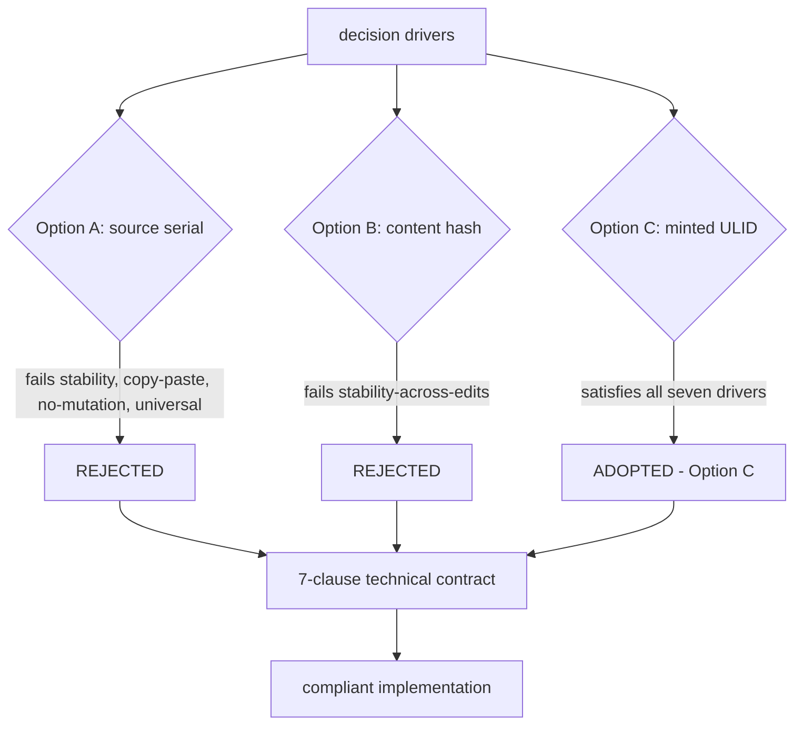

# Identity Model — Technical Specification

> Category: Architecture | Version: 1.0 | Date: June 2026 | Status: Draft

The technical contract of Hivenectar's chosen identity model (Option C: daemon-minted ULID): the nectar format, the minting triggers, the primary-key contract, the no-source-mutation invariant, the universal-applicability rule, FR-8 compliance, and a decision-driver matrix showing how Option C satisfies each driver where A and B fail.

**Related:**
- [`../ADR-0001-minted-nectar-over-source-embedded-serial.md`](../ADR-0001-minted-nectar-over-source-embedded-serial.md)
- [`identity-model-introduction-and-theory.md`](identity-model-introduction-and-theory.md)
- [`identity-model-ecosystem-story-arc.md`](identity-model-ecosystem-story-arc.md)
- [`identity-model-conclusion-and-deliverables.md`](identity-model-conclusion-and-deliverables.md)
- [`../../ai/identity-and-reassociation.md`](../../ai/identity-and-reassociation.md)
- [`../../data/source-graph-schema.md`](../../data/source-graph-schema.md)
- [`../../data/portable-registry.md`](../../data/portable-registry.md)

---

## The decision, as a contract

ADR-0001 adopts **Option C**: a daemon-minted ULID nectar, persisted in Deep Lake as the primary key of `source_graph`, re-associated to files on disk by the exact-then-fuzzy ladder, with a committed regenerable projection for fresh-clone inheritance. This document specifies that decision as an engineering contract — the invariants an implementation must satisfy to be compliant. The ADR is the authoritative source for *why*; this doc is the authoritative reference for *what*.

The contract has seven clauses, each derived from a decision driver in the ADR. An implementation that violates any clause is non-compliant with the identity model, regardless of whether its re-association ladder works or its recall returns results.

---

## Clause 1: The nectar format (ULID)

A nectar is a **ULID** (Universally Unique Lexicographically Sortable Identifier). The format is fixed:

- **Length:** 26 characters.
- **Alphabet:** Crockford base32, uppercase (`0123456789ABCDEFGHJKMNPQRSTVWXYZ` — no `I`, `L`, `O`, `U`).
- **Structure:** 48-bit Unix millisecond timestamp + 80 bits of cryptographically secure randomness.
- **Sortability:** lexicographic order equals creation-time order. String-prefix range scans answer "nectars minted since T" without timestamp parsing.
- **Case:** uppercase. A lowercased nectar is non-compliant.

```typescript
import { ulid } from "ulid";

function mintNectar(): string {
  return ulid(); // e.g. "01J2X4F6K8ME7N9P1Q3R5T7V9WX"
}
```

The format is chosen for two properties a plain UUIDv4 lacks. **Lexicographic sortability by creation time** matters for cold catch-up: the daemon can ask "what nectars were minted while I was offline" and get them in creation order via a string-prefix scan. **Collision resistance without a registry** — 80 bits of randomness per millisecond — makes minting lock-free and distributed-safe; two harnesses minting in parallel cannot collide, so no coordination round-trip is required.

The `created_at` column on `source_graph` is set to the decoded ULID timestamp in ISO 8601, so the projection file and dashboards have a human-readable creation time without ULID parsing. The nectar itself is **never re-derived and never recomputed**: if the minting logic changes in a future release, old nectars keep their values and new nectars use the new logic. This is what makes identity stable across daemon upgrades.

The format is deliberately recorded as separate from the identity-model decision, because the format is reversible (a future migration could re-encode nectars) while the model is not. Changing from ULID to UUIDv7 is a migration script; changing from minted to source-embedded is a re-brood.

---

## Clause 2: Minting triggers (brooding and copy event only)

A nectar is minted in **exactly two situations**. Minting in any other situation is non-compliant.

1. **Brooding** — the first time hiveantennae observes a file it has no record of. This covers the initial scan, and any genuinely new file the watcher detects during live operation (a new file with content that does not match any existing file's current content).
2. **Copy event** — the daemon detected that a new path's content hash matches an existing file's current content hash, and mints a *fresh* ULID for the new path with `derived_from_nectar` pointing at the source.

The copy-event rule is the one that distinguishes the minted model from both alternatives. Under Candidate A (source-embedded serial), a copy carries the same serial, producing ambiguity. Under Candidate B (content hash), the copy and the source are indistinguishable and the relationship is lost on the copy's first edit. Under Option C, the copy gets its own identity *and* a permanent provenance edge — the property neither alternative can provide.

Minting does **not** happen on edits (that appends a version row, keeping the nectar), on moves (that carries the nectar via the ladder), or on re-association of an existing nectar to a moved file (that is an association update, not a mint).

---

## Clause 3: The `source_graph.nectar` primary-key contract

The nectar is persisted as the **primary key of `source_graph`** in Deep Lake. The contract:

- `nectar` is TEXT, NOT NULL, and is the row identity. One row per logical file.
- `nectar` is **immutable**. It is written once at minting and never updated, never reused, and never re-derived.
- The `(nectar, content_hash)` pair on `source_graph_versions` is the composite version key; `content_hash` changes per edit, `nectar` does not.

The full DDL is documented in [`../../data/source-graph-schema.md`](../../data/source-graph-schema.md). The `source_graph` row carries identity and provenance only (`kind`, `created_at`, `derived_from_nectar`, `fork_content_hash`, tenancy columns). No content, no description. Content and description live in the append-only `source_graph_versions` table. The split is the schema consequence of the identity-model decision: a single table cannot cleanly represent stable identity and changing content without either overwriting history or burying the identity key.

---

## Clause 4: The no-source-mutation invariant

The hiveantennae worker **never writes to source files**. This is a hard invariant, not a preference. The only file hiveantennae writes is `.honeycomb/nectars.json`, a regenerable projection at the project root — and even that is reviewable, committed, and regenerable from Deep Lake alone.

The invariant protects the AGPL license header convention. `AGENTS.md` in the main Honeycomb corpus is explicit: every new source file gets the AGPL header from `docs/license-header.txt`, and that header occupies line 1. A tool that mutates source on a git hook — as Candidate A requires — collides with this rule and produces an invasive "brooding mega-commit" that touches every file on first run, which code reviewers reject.

The invariant also means the original Hivenectar sketch's proposal to "serialize them in an sqlite db (that would be fastest)" is rejected at the storage layer (see Clause 6), but the *source* layer is held to an even stricter rule: not even a comment is inserted.

---

## Clause 5: Universal applicability

The daemon observes **every file on disk regardless of whether it has a comment syntax**. The identity layer is universal; the description layer is best-effort.

- **JSON, `.env`, YAML, TOML, lockfiles** all get nectars. Comment syntax is irrelevant because the nectar never lives in the file.
- **Binary files** get nectars with `describe_status = 'skipped-binary'`. The nectar is minted and the identity row is written; the enricher skips description because there is no meaningful text to describe. The file is still discoverable by path and by provenance; it is simply not semantically described.
- **Files without a known extension** get nectars and are described if the enricher can extract text.

This is the rule Candidate A cannot satisfy. Source-embedded serials require a comment syntax, and JSON has none, `.env` has none, binary files have no first line to claim. Either serials cover only some files — a half-indexed codebase, which the ADR calls a liability, not an asset — or they require a sidecar-per-file scheme, which is the sidecar model rejected separately (Option D).

---

## Clause 6: Deep Lake as the only durable store (FR-8)

The nectar table is a **Deep Lake table**. There is no SQLite sidecar, no JSONL log, no parallel store. This satisfies FR-8 from the main Honeycomb PRD substrate: *"Durable state goes in Deep Lake, not JSON/JSONL sidecars."*

A parallel SQLite store (Option D in the ADR) is rejected independently of the identity-key choice because it would drift from Deep Lake, get out of sync with the daemon, and become a second source of truth that the daemon's consistency checks cannot see. A *cache* — the regenerable `(path → mtime → last_hash)` map the daemon keeps to avoid re-hashing on poll — is acceptable because it is not a source of truth and can be deleted without loss.

The committed `.honeycomb/nectars.json` projection is not a violation of FR-8 because it is a **projection, not a sidecar**. The distinction is enforcement: a projection is a denormalized, regenerable view written from the source of truth on a defined schedule, never edited directly, and deletable without loss. `honeycomb hivenectar rebuild-projection` regenerates it from a Deep Lake scan with no other inputs. The three enforcement rules are documented in [`../../data/portable-registry.md`](../../data/portable-registry.md): Deep Lake writes happen first, the projection is never hand-edited, and the projection is regenerable from Deep Lake alone.

---

## Clause 7: Fresh-clone portability

A new `git clone` **inherits identity without re-paying the brooding cost or requiring network access** to Deep Lake. The mechanism is the committed `.honeycomb/nectars.json` projection, which carries a content-hash → nectar map. On boot, the daemon matches on-disk content hashes into the projection before falling back to the re-association ladder.

A current projection typically achieves **zero LLM calls and zero fuzzy matches** on a fresh clone: every file's content hash matches the projection, every nectar is inherited, every description is carried over. The projection is committed by default precisely because without it, a fresh clone must brood from scratch — minting new nectars with no connection to the originals, breaking the team-share story.

---

## Decision-driver → option matrix

The seven clauses above are deductions from the ADR's decision drivers. The matrix below shows how Option C satisfies each driver where Candidates A and B fail. This is the compliance view of the contract: an implementation satisfies the model if and only if it preserves every "✓" in the Option C column.

| Decision driver | Option A (source serial) | Option B (content hash) | Option C (minted ULID) |
|---|---|---|---|
| **Stability across edits** | ✗ churns only on mint, but brittle | ✗ churns every save | ✓ not derived from content |
| **Stability across moves/renames** | ~ travels in-file, but copy breaks it | ✓ if content unchanged | ✓ ladder carries nectar |
| **Copy-paste as provenance** | ✗ duplicate-serial ambiguity | ✗ indistinguishable, link lost on edit | ✓ fresh nectar + `derived_from_nectar` |
| **No source mutation** | ✗ collides with AGPL header, line-1 conflict | ✓ never touches source | ✓ never touches source |
| **Universal applicability** | ✗ JSON/`.env`/binary have no comment | ✓ hashes anything | ✓ nectars anything; binary `skipped-binary` |
| **Deep Lake only (FR-8)** | ✓ in-file, but needs sidecar for non-source | ✓ hashable anywhere | ✓ Deep Lake table, projection not sidecar |
| **Fresh-clone portability** | ✓ serial in-file, zero bootstrap | ✗ must re-hash everything | ✓ committed projection carries map |

The same matrix as a flowchart, showing how rejecting A and B leaves only C:



Option C is the only model that satisfies all seven drivers simultaneously. Option A fails four (copy-paste, no-mutation, universal, and indirectly fresh-clone via the sidecar escape hatch). Option B fails the primary driver (stability across edits) and fresh-clone portability. The matrix is the argument; the seven clauses are the contract that enforces it.

---

## What the contract does not specify

The contract is deliberately silent on three things, each documented elsewhere:

- **The re-association algorithm.** The ladder (exact path/mtime/size → path+content-changed → exact hash to missing file → fuzzy TLSH → mint new) is the mechanism that *maintains* the association; it is documented in [`../../ai/identity-and-reassociation.md`](../../ai/identity-and-reassociation.md). The contract specifies only that the nectar is stable and re-associated; it does not prescribe the ladder's steps.
- **The projection format.** The `.honeycomb/nectars.json` structure (version, files map, derived map) is documented in [`../../data/portable-registry.md`](../../data/portable-registry.md). The contract specifies only that a projection exists and is regenerable.
- **The versioning semantics.** What constitutes a "meaningful edit," watcher debounce windows, and edit coalescing are documented in the brooding and enricher pipeline docs. The contract specifies only that the nectar does not change when content changes.

The contract is the invariant layer. The algorithm, projection, and versioning docs are the implementation layer. An implementation is compliant if it preserves the invariants; the implementation details are free to vary within those bounds.
