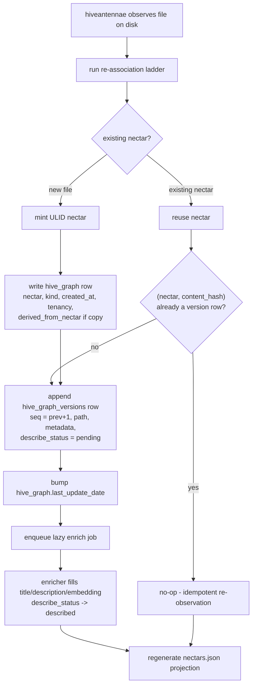
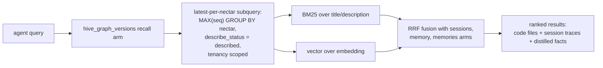
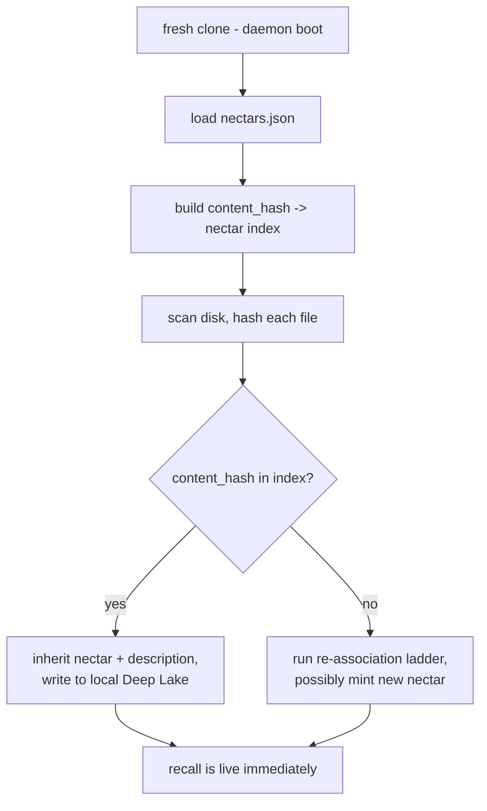
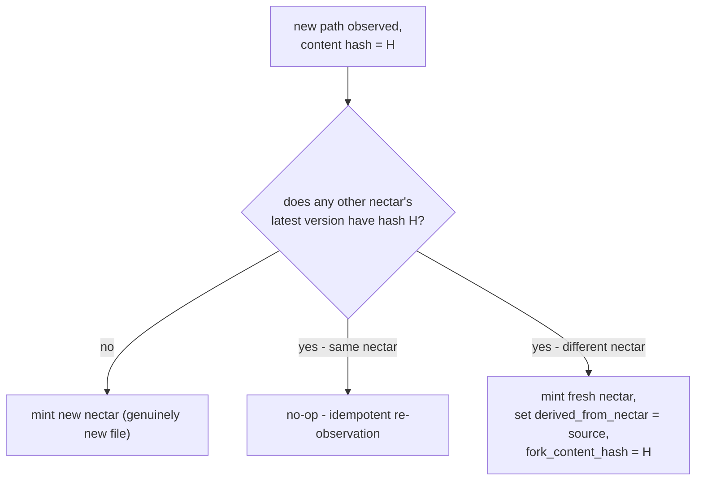

# Hive Graph: Ecosystem Story Arc

> Category: Data | Version: 1.0 | Date: June 2026 | Status: Draft

How the two Nectar tables compose end-to-end: the write path from nectar minting through version append through enricher fill through projection regeneration, the read path that recall takes through the latest-per-nectar subquery, and the composite-key invariant that distinguishes a no-op from a copy signal.

**Related:**
- [`../hive-graph-schema.md`](../hive-graph-schema.md)
- [`hive-graph-introduction-and-theory.md`](hive-graph-introduction-and-theory.md)
- [`hive-graph-technical-specification.md`](hive-graph-technical-specification.md)
- [`../recall-integration.md`](../recall-integration.md)
- [`../portable-registry.md`](../portable-registry.md)
- [`../ai/identity-and-reassociation.md`](../../ai/identity-and-reassociation.md)

---

## The arc in one sentence

A nectar is minted into `hive_graph`, every meaningful edit appends a row to `hive_graph_versions`, the enricher fills that row's description and embedding, recall reads the latest described version per nectar through a guarded arm, and the projection regenerates from the versions table as a portable cache. Every component talks to the same two tables through well-defined contracts; nothing reaches around them.

The two tables are the hub. Around them are the writer (the hiveantennae daemon's re-association ladder), the enricher (the lazy LLM description pass), the reader (the hybrid recall pipeline), and the projection (the regenerable lockfile). This document traces each path in turn, then names the composite-key invariant that ties the write path's copy-detection to the schema's physical key.

---

## The write path

The write path is triggered by the hiveantennae daemon whenever it observes a new or changed file on disk — during brooding (first scan), live watch (`node:fs.watch` observations during editing), or cold catch-up (daemon boot after offline changes). In every case the daemon runs the re-association ladder (documented in [`../ai/identity-and-reassociation.md`](../../ai/identity-and-reassociation.md)) to decide whether the file is an existing nectar or a new one, then writes accordingly.

The mint-vs-reuse decision is the re-association ladder's output, and it determines which table gets the first write. A genuinely new file (or a copy event — see the composite-key invariant below) writes a `hive_graph` row first, because the nectar must exist before any version row can reference it. An existing file under edit reuses the nectar and writes only to `hive_graph_versions`, because the identity row already exists and must not be touched.

Three properties of the write path are load-bearing:

**The identity row is written before the version row.** The `hive_graph_versions.nectar` column is a foreign key to `hive_graph.nectar`. A version row for a nectar that has no identity row is an orphan. The write order guarantees the identity anchor exists first.

**Every distinct content state appends exactly one version row, keyed by `(nectar, content_hash)`.** The composite key makes re-observation idempotent: if the worker hashes a file and finds that `(nectar, content_hash)` already exists, it writes nothing. This is what prevents duplicate version rows from a save-that-changed-nothing or a watcher that fired twice.

**The enricher is decoupled from the append.** The version row is written with empty `title`/`description`/`embedding` and `describe_status = 'pending'`. The enricher fills those columns later, asynchronously, and flips the status to `'described'`. Recall never sees the row until it is described. This decoupling is why a file can exist in Deep Lake for hours or days with no description — description is a cache, not a prerequisite for identity.

---

## The read path

The read path is the recall query. When an agent asks a question, the hybrid recall pipeline runs guarded BM25 lexical and 768-dim vector arms over `sessions`, `memory`, `memories`, and `hive_graph_versions`, fuses the successful results by reciprocal rank, and returns a single ranked list. Nectar's arm is the fourth: a subquery that selects the latest described version per nectar, scoped by tenancy, then filters and scores over `title`, `description`, `concepts`, and `embedding`.

The latest-per-nectar subquery is the structural feature that makes recall return one row per *current* file rather than one row per *version*. Without it, a file edited 50 times would dominate recall with 50 near-duplicate rows; with it, recall sees only the most recent described state. The subquery works because `seq` is a monotonic per-nectar counter — `MAX(seq)` per nectar is the latest version, full stop, no timestamp parsing and no content-hash ordering reliance.

The recall arm filters to `describe_status = 'described'`, which excludes `pending`, `failed`, `skipped-too-large`, and `skipped-binary` rows. A file that was never described does not appear in semantic recall, though it may still appear in the structural CodeGraph's `find/` results keyed by symbol name. The two layers are complementary, not redundant: Nectar discovers files by *function*; the CodeGraph navigates within and between them by *structure*. The full recall wiring, including the weighting and dedup strategy against the other three arms, is documented in [`../recall-integration.md`](../recall-integration.md).

Recall and brooding proceed concurrently with no coordination. Recall reads Deep Lake; brooding writes Deep Lake; a query mid-brood sees whatever has been described so far. There is no lock, no snapshot, no read-before-write ordering — the two paths are independent because the write path is append-only and the read path filters to described rows, so a half-described file simply does not surface until its enricher pass completes.

---

## The projection in both paths

The projection (`.honeycomb/nectars.json`, documented in [`../portable-registry.md`](../portable-registry.md)) sits at the end of the write path and at the beginning of the fresh-clone boot path, but it is *not* on the recall read path. Recall reads Deep Lake directly; the projection is never consulted during a recall query.

On the write path, the projection is regenerated at the end of every brood and every enricher cycle that produced new descriptions. The regeneration is a single scan of `hive_graph_versions` — latest described version per nectar, scoped to the project — denormalized into the projection format, written atomically (temp file plus rename). A crashed regeneration leaves the old projection, not a partial one.

On the fresh-clone boot path, the projection is the bridge that lets a new `git clone` inherit identity without network, auth, or LLM calls. The daemon loads the projection, builds a content-hash→nectar index, scans disk, and matches each file's content hash into the index. A fresh clone with a current projection typically achieves zero LLM calls and zero fuzzy matches: every file finds its nectar through the projection's content-hash index, and the daemon writes the inherited rows to local Deep Lake so recall is immediately live.

The projection is a projection, not a sidecar, because of where it sits. It is derived from Deep Lake (write-path end), regenerated from Deep Lake alone (rebuild command), and never the target of a write during normal operation. The only time the projection flows *into* Deep Lake is the fresh-clone inheritance write, and only for nectars the local Deep Lake does not already have. This is the same directionality as a lockfile: generated from the source of truth, committed for portability, never hand-edited.

---

## The composite-key invariant

The composite key `(nectar, content_hash)` on `hive_graph_versions` is the hinge that connects the write path's copy-detection to the schema's physical structure. The invariant has two cases, and the system treats them differently:

**Same content under the same nectar is a no-op.** If the worker observes a file whose `(nectar, content_hash)` pair already exists as a version row, it writes nothing. This handles the idempotent re-observation case: a save that changed no bytes, a watcher that fired twice, a cold-boot scan of an untouched file. The composite key makes these cases free — a single existence check, no row written, no enricher job enqueued.

**Same content under a different nectar is a copy signal.** If the worker observes a new path whose content hash matches an *existing* file's current (latest-version) content hash, the daemon concludes this is a copy-paste event. It mints a fresh nectar for the new path and sets `derived_from_nectar` on that new nectar's `hive_graph` row, pointing at the source nectar, with `fork_content_hash` recording the source's content at the fork point. The copy is its own identity, permanently linked to its origin.

The invariant is what makes copy-paste a first-class provenance edge instead of a history-loss event. With pure content-hash identity (the rejected Option B in the ADR), two files with identical content are indistinguishable, and the moment one is edited the relationship is lost. With the composite key plus the `derived_from_nectar` pointer, the relationship is explicit, durable, and queryable: the Obsidian-style interlink view can render "file B was forked from file A when A looked like H" indefinitely, even after both files have diverged.

The detection has one ambiguity: two genuinely independent files that happen to have identical content (two empty `.gitkeep` files, two copies of a boilerplate license). The daemon treats both as copy events and sets `derived_from_nectar` on whichever was minted second. This is rarely wrong in practice — boilerplate duplication *is* a copy relationship, semantically — and when it is wrong the cost is low: a spurious `derived_from` link in an interlink view. A future enrichment pass could classify these as `derived_kind: 'coincidental'` versus `derived_kind: 'fork'` if the distinction proves valuable, but v1 does not model the distinction.

---

## How the paths compose

The write path and the read path share the two tables but never block each other. The composition rests on four invariants that the schema enforces structurally:

1. **Append-only versions.** The write path only ever inserts into `hive_graph_versions`; it never updates a content hash or path in place. The read path's latest-per-nectar subquery therefore always sees a consistent snapshot, regardless of concurrent writes.
2. **Status-gated recall.** The read path filters to `describe_status = 'described'`. A version row mid-enrichment (status `'pending'`) is invisible to recall, so the enricher's fill is not a race with the reader.
3. **Identity row precedes version row.** The foreign key from `hive_graph_versions.nectar` to `hive_graph.nectar` is never violated because the write order guarantees the identity row exists first. The read path's join never hits an orphan.
4. **Projection is derived, not consulted.** Recall reads Deep Lake; the projection is regenerated from Deep Lake. The two paths are independent, and deleting the projection affects only the fresh-clone boot path, never an in-flight recall query.

These invariants are why the system can brood (long-running, many writes) while simultaneously serving recall (many reads) without locks. The schema's physical separation of identity and version, combined with the status gate and the append-only contract, makes the two paths composable by construction rather than by coordination.

---

## Forward pointers

The column-level reference for every column in both tables, including the indexing strategy and the lazy-schema-heal rule, is in [`hive-graph-technical-specification.md`](hive-graph-technical-specification.md). The engineering and operator contracts that the write and read paths impose — written as testable acceptance criteria — are in [`hive-graph-user-stories.md`](hive-graph-user-stories.md). The hard invariants and deliverable summary are restated in [`hive-graph-conclusion-and-deliverables.md`](hive-graph-conclusion-and-deliverables.md). The full recall wiring lives in [`../recall-integration.md`](../recall-integration.md); the full projection contract lives in [`../portable-registry.md`](../portable-registry.md); the full re-association algorithm lives in [`../ai/identity-and-reassociation.md`](../../ai/identity-and-reassociation.md).
