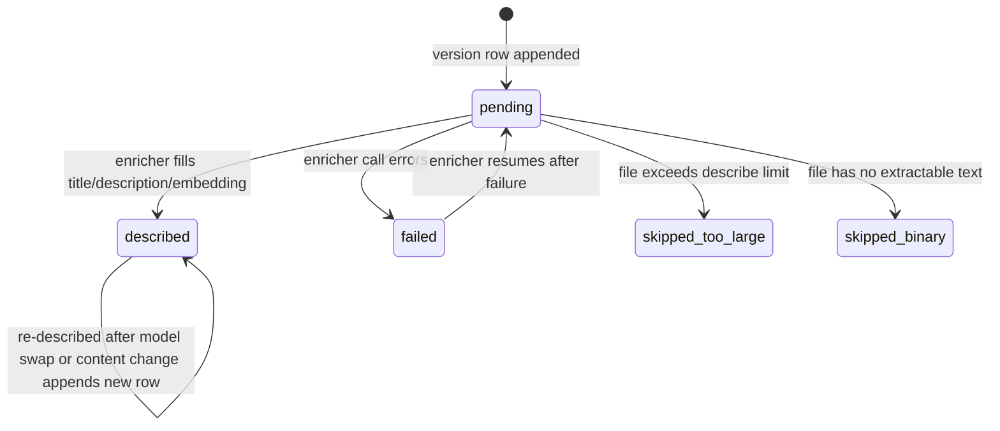

# Hive Graph: Technical Specification

> Category: Data | Version: 1.0 | Date: June 2026 | Status: Draft

The column-level reference for the two Nectar Deep Lake tables: full DDL carried verbatim, a column-by-column mutability table for each table, the indexing strategy, the tenancy/isolation contract, the lazy-schema-heal rule, the projection contract, and the v1 non-goals.

**Related:**
- [`../hive-graph-schema.md`](../hive-graph-schema.md)
- [`hive-graph-introduction-and-theory.md`](hive-graph-introduction-and-theory.md)
- [`hive-graph-ecosystem-story-arc.md`](hive-graph-ecosystem-story-arc.md)
- [`hive-graph-user-stories.md`](hive-graph-user-stories.md)
- [`../portable-registry.md`](../portable-registry.md)
- [`../recall-integration.md`](../recall-integration.md)

---

## The two tables at a glance

`hive_graph` is one row per logical file — the stable identity and provenance, keyed by nectar, with no content and no description. `hive_graph_versions` is append-only — one row per observed state of a file, keyed by `(nectar, content_hash)`, carrying the path, the metadata, and the lazily-filled description. "Current state of file X" is the latest version row for X's nectar; "full history of file X" is all version rows for X's nectar. Both are cheap queries. The conceptual rationale for the split is in [`hive-graph-introduction-and-theory.md`](hive-graph-introduction-and-theory.md); this document is the mechanical reference.

---

## `hive_graph` — identity + provenance

```sql
CREATE TABLE IF NOT EXISTS "hive_graph" (
  nectar              TEXT NOT NULL DEFAULT '',
  kind                TEXT NOT NULL DEFAULT 'file',
  created_at          TEXT NOT NULL DEFAULT '',
  derived_from_nectar TEXT NOT NULL DEFAULT '',
  fork_content_hash   TEXT NOT NULL DEFAULT '',
  org_id              TEXT NOT NULL DEFAULT '',
  workspace_id        TEXT NOT NULL DEFAULT '',
  project_id          TEXT NOT NULL DEFAULT '',
  last_update_date    TEXT NOT NULL DEFAULT ''
) USING deeplake;
```

### Column-by-column reference

| Column | Type | Purpose | Mutability |
|---|---|---|---|
| `nectar` | TEXT | **Primary key.** 26-char ULID minted once by hiveantennae. Never derived from content. Sortable by creation time. | Immutable — the one truly immutable column |
| `kind` | TEXT | Discriminator: `'file'` in v1. Reserved for `'directory'` if folder-level nectars are added later. | Write-once at minting; effectively immutable |
| `created_at` | TEXT | ISO 8601 timestamp of nectar minting. Equals the ULID's embedded timestamp but stored explicitly for portability into `nectars.json` (ULIDs are not self-describing to humans). | Write-once at minting |
| `derived_from_nectar` | TEXT | Copy-paste provenance. Empty for an originally-minted file. Set to the source nectar when a new path appears whose content matches an existing file's current content (the copy event). Survives forever, even after both files diverge. | Write-once at minting; never updated |
| `fork_content_hash` | TEXT | The content hash at the fork point. Lets the enricher render "this file was copied from X when X looked like Y" for the Obsidian-style interlink view. | Write-once at minting; never updated |
| `org_id` | TEXT | Tenancy. Explicit because identity is cross-cutting (mirrors the `codebase` table's tenancy columns). | Set at minting; not updated on edit |
| `workspace_id` | TEXT | Tenancy. Same rationale as `org_id`. | Set at minting; not updated on edit |
| `project_id` | TEXT | Project isolation within a workspace. Soft column filter, not a Deep Lake partition or provisioning boundary. | Set at minting; not updated on edit |
| `last_update_date` | TEXT | Denormalized "last observed change" timestamp. Updated whenever a new version row is appended. Lets the projection sync and the dashboard render "recently touched" without scanning the versions table. | Mutable — the only column that moves on a routine edit |

The `nectar` column is the only truly immutable column. `derived_from_nectar` and `fork_content_hash` are write-once (set at minting, never updated). `kind`, `created_at`, and the tenancy triple are set at minting and never subsequently change. Only `last_update_date` moves on a routine edit, and it moves in lockstep with a version-row append on the versions table.

---

## `hive_graph_versions` — content + description chain

```sql
CREATE TABLE IF NOT EXISTS "hive_graph_versions" (
  nectar          TEXT NOT NULL DEFAULT '',
  content_hash    TEXT NOT NULL DEFAULT '',
  seq             BIGINT NOT NULL DEFAULT 0,
  path            TEXT NOT NULL DEFAULT '',
  filename        TEXT NOT NULL DEFAULT '',
  ext             TEXT NOT NULL DEFAULT '',
  size_bytes      BIGINT NOT NULL DEFAULT 0,
  mtime_observed  TEXT NOT NULL DEFAULT '',
  title           TEXT NOT NULL DEFAULT '',
  description     TEXT NOT NULL DEFAULT '',
  concepts        TEXT NOT NULL DEFAULT '[]',
  embedding       FLOAT4[],
  described_at    TEXT NOT NULL DEFAULT '',
  describe_model  TEXT NOT NULL DEFAULT '',
  describe_status TEXT NOT NULL DEFAULT 'pending',
  observed_at     TEXT NOT NULL DEFAULT '',
  org_id          TEXT NOT NULL DEFAULT '',
  workspace_id    TEXT NOT NULL DEFAULT '',
  project_id      TEXT NOT NULL DEFAULT '',
  last_update_date TEXT NOT NULL DEFAULT ''
) USING deeplake;
```

### Column-by-column reference

| Column | Type | Purpose | Mutability |
|---|---|---|---|
| `nectar` | TEXT | FK → `hive_graph.nectar`. Composite key part 1. | Set at row insert; immutable |
| `content_hash` | TEXT | sha256 of file content at observation. Composite key part 2. **Changes per edit** — that is the point. | Set at row insert; immutable |
| `seq` | BIGINT | Monotonic per-nectar version counter (0, 1, 2, …). Lets "latest version" be `ORDER BY seq DESC LIMIT 1` without parsing timestamps or relying on `content_hash` ordering. | Set at row insert; immutable |
| `path` | TEXT | Repo-relative path with forward slashes, at observation time. **Mutable across version rows for the same nectar** — this is how moves are recorded. A nectar's `seq=0` row might say `src/a.ts` and its `seq=3` row might say `src/auth/a.ts`; the chain captures the rename. | Set at row insert; differs across rows for the same nectar |
| `filename` | TEXT | Bare filename (`a.ts`). Denormalized from path for fast filename-only searches without path parsing. | Set at row insert; immutable within a row |
| `ext` | TEXT | Lowercased extension without dot (`ts`, `tsx`, `md`, `json`). Routed to the right CodeGraph extractor and to the brooding batcher. | Set at row insert; immutable within a row |
| `size_bytes` | BIGINT | File size. Used to skip empty files and to bucket large files for solo-description. | Set at row insert; immutable within a row |
| `mtime_observed` | TEXT | File mtime at observation. Not authoritative (mtime is mutable), but useful as a fast-path cache key: if `(path, mtime, size)` all match the last observation, skip re-hashing. | Set at row insert; immutable within a row |
| `title` | TEXT | LLM-minted, ≤80 chars. Empty string while pending, filled by the enricher. | Nullable-then-filled: empty at insert, set by enricher |
| `description` | TEXT | LLM-minted, 1–3 sentences. Same lifecycle as `title`. | Nullable-then-filled: empty at insert, set by enricher |
| `concepts` | TEXT | JSON-encoded string array (`'["auth","session","jwt"]'`). LLM-minted concept tags for the Obsidian-style interlink layer. | Nullable-then-filled: `'[]'` at insert, set by enricher |
| `embedding` | FLOAT4[] | 768-dim vector over `title + ' ' + description`. **Same dimensionality as `sessions.message_embedding` and `memory.summary_embedding`** so the same hybrid recall pipeline queries all semantic arms. | Nullable until enriched; set by the configured embedding provider |
| `described_at` | TEXT | Timestamp of the enricher run that filled `title`/`description`. Empty while pending. | Empty at insert; set by enricher |
| `describe_model` | TEXT | Model identifier that produced the description (e.g. `gemini-2.5-flash` via `portkey`). Auditable, and lets a model swap trigger re-description selectively. | Empty at insert; set by enricher |
| `describe_status` | TEXT | One of `pending`, `described`, `failed`, `skipped-too-large`, `skipped-binary`. Lets recall filter out undescribed rows and lets the enricher resume after failures. | `'pending'` at insert; transitions through lifecycle |
| `observed_at` | TEXT | Timestamp the version row was appended (distinct from `mtime_observed`, which is the file's own clock). | Set at row insert; immutable |
| `org_id`, `workspace_id`, `project_id` | TEXT | Tenancy, denormalized from `hive_graph` so the versions table is queryable in isolation for recall. | Set at row insert; immutable within a row |
| `last_update_date` | TEXT | Standard Honeycomb UPDATE-coalescing workaround column. | Mutable |

The table is append-only in the sense that a new observed state always means a new row, never an in-place edit of an existing row. The one exception is the enricher's fill: a version row is inserted with empty `title`/`description`/`embedding` and `describe_status = 'pending'`, and the enricher later sets the description columns and flips the status to `'described'` (or `'failed'`/`'skipped-*'`). This is a state transition on the row's description fields, not a content revision; the content hash and path never change once the row is written.

### The `describe_status` lifecycle



Recall filters to `describe_status = 'described'`, so rows in any other state do not surface in semantic search. The enricher uses the status to resume after failures: a `'failed'` row is retried on the next lazy pass, not abandoned.

### The composite key invariant

The composite key `(nectar, content_hash)` has a useful property that the re-association and copy-detection logic both rely on. The same content under the same nectar is a no-op — an idempotent re-observation after a no-change save produces no new row because the key already exists. The same content under a *different* nectar is the copy-paste signal: the daemon mints a fresh nectar for the new path and sets `derived_from_nectar` on the newer nectar pointing at the source. The composite key is how the schema distinguishes "nothing changed" from "this is a fork."

---

## Indexing strategy

Deep Lake indexing is additive and configured through the catalog helpers, not hand-rolled `CREATE INDEX` statements. The indexes Nectar relies on all live on `hive_graph_versions`, because that is the table recall queries.

| Index | Table | Columns | Why |
|---|---|---|---|
| `deeplake_index` (BM25) | `hive_graph_versions` | `title`, `description` | Lexical recall over descriptions. Same operator Deep Lake applies to `memory.summary`. |
| Vector (`<#>` cosine) | `hive_graph_versions` | `embedding` | Semantic recall over descriptions. Falls back silently to BM25 if embeddings are off — same as the rest of Honeycomb, no quality cliff. |
| `deeplake_hybrid_record` | `hive_graph_versions` | BM25 + vector | The fused path recall prefers; documented in the main corpus's `ai/hybrid-sql-vector-rationale.md`. |
| Scope filter | `hive_graph_versions` | `org_id`, `workspace_id`, `project_id` | Every recall query scopes by tenancy before applying BM25/vector. |

The `path` and `filename` columns are deliberately not given dedicated indexes in v1. They are covered by the standard ILIKE fallback — the same `sqlLike`-guarded lexical path that recall uses when vector indexes are absent or embeddings are off. The row counts (one per file version, not one per symbol) are small enough that ILIKE is adequate. If path-anchored queries ever dominate cost, a dedicated index can be added through the catalog helpers without a schema change.

All indexing is additive and lazy. The BM25 index is present from initial table creation. The vector index is created when the first embedding is written; if the configured embedding provider is unavailable, the vector index is simply absent and recall falls back to BM25 alone. There is no hard dependency on embeddings for Nectar to function — only for the semantic-search arm.

---

## Tenancy and isolation contract

`hive_graph` and `hive_graph_versions` carry explicit `org_id`, `workspace_id`, and `project_id` columns. `project_id` is a soft column-level filter inside Honeycomb's org/workspace Deep Lake scope, not a per-project table or provisioning boundary. This mirrors the `codebase` table (the CodeGraph's cloud-sync target) and diverges from `sessions` and `memory`, which lean on partition isolation plus `agent_id` and `visibility`.

The divergence is structural, not stylistic. File identity is **cross-agent by nature** — every agent and every harness working in the same project reads the same source tree, so they must see the same file descriptions. There is therefore no `agent_id` column and no `visibility` column on either Nectar table. A team sharing a workspace shares a single Nectar graph per project through the required `project_id` predicate.

The practical consequence is that recall queries against `hive_graph_versions` always carry a `WHERE org_id = :org AND workspace_id = :workspace AND project_id = :project` predicate (the scope filter in the indexing table above) and never carry an `agent_id` predicate. This is what makes a teammate's fresh `git clone` inherit descriptions through cloud sync: the rows for the workspace are shared, not per-agent. The full collaboration and team-share path is documented in [`../recall-integration.md`](../recall-integration.md).

---

## The lazy-schema-heal rule

Nectar's tables participate in the same additive schema-heal pass as the rest of Honeycomb. The catalog group is registered once, and `withHeal` creates or heals tables on first write; there is no explicit per-project DDL step. When hiveantennae finds a table missing a column that a newer daemon version expects — for example, if `concepts` was added after initial deploy — the `withHeal` helper issues the additive `ALTER TABLE` and backfills defaults. Existing rows get `'[]'` for `concepts`; the enricher picks them up on the next lazy pass.

The rule is absolute: **never hand-roll an `ALTER` against these tables.** Define the `ColumnDef` array once in the daemon's schema module, add it to the catalog group, and let the heal pass converge. A hand-rolled ALTER bypasses the catalog, drifts from the `ColumnDef` source of truth, and produces a table that the next daemon boot will try to "heal" into a different shape — or, worse, a table whose columns the catalog does not know about and therefore cannot query correctly.

Heals are additive only. The heal pass adds columns that are missing; it never drops columns, renames them, or changes types. This is what makes healing safe to run on every boot without coordination: an additive ALTER cannot destroy data, and a column that the running daemon does not know about is simply ignored until an upgrade that uses it. The same rule governs every other Honeycomb table.

---

## The projection contract

`hive_graph_versions` is the source of truth. The committed `.honeycomb/nectars.json` file (documented in [`../portable-registry.md`](../portable-registry.md)) is a **regenerable projection** — a denormalized, content-hash-keyed map of `{ content_hash: { nectar, title, description, concepts } }` for the *latest described version* of each nectar in the project.

The contract has three parts, each enforceable:

1. **Deep Lake writes happen first.** Every nectar mint, version append, and description write goes to Deep Lake before the projection is regenerated. The projection is never the target of a write; it is always derived.
2. **The projection is regenerable from Deep Lake alone.** `honeycomb nectar project --rebuild-projection` regenerates it from a single scan of `hive_graph_versions`, with no other inputs. If it did not, the projection would be carrying state Deep Lake does not have, which would make it a sidecar — and sidecars are forbidden by FR-8.
3. **The projection is never edited by hand.** A hand-edit is overwritten on the next regeneration. The file is read-only from the system's perspective except for the regeneration write.

If `nectars.json` is deleted, lost, or corrupted, the rebuild command regenerates it from Deep Lake in a single scan. The projection is committed for portability across fresh clones (so a new checkout inherits descriptions without re-paying the brooding cost), never because Deep Lake is insufficient. The distinction between a projection and a sidecar, and the enforcement rules, are documented in full in [`../portable-registry.md`](../portable-registry.md).

---

## v1 non-goals (YAGNI)

The schema deliberately omits three things that the original design sketch mentioned, all deferred until measured need. Each is a deliberate non-goal for v1, not an oversight.

- **Directory nectars.** Folders are derivable from the union of file paths, and a directory-level description can be synthesized on demand from its files' descriptions. The `kind` column reserves the namespace (`'directory'`) so this can be added later without a schema change, but v1 does not mint directory nectars. If synthesis reads weak in practice, the path forward is `kind='directory'` rows whose `content_hash` is `sha256(sorted_child_nectars)`.
- **Symbol-level nectars.** Symbol identity is the CodeGraph's job (and, optionally, an LSP layer's job). Nectar is file-granular in v1. Symbol-level semantic description would multiply row counts by 10–100× and duplicate what the CodeGraph already extracts structurally.
- **Edit-coalesced versioning.** Every save appends a version row. There is no debouncing at the schema level — debouncing happens at the watcher intake, so the database sees one row per *meaningfully distinct* content state, not one per keystroke-save.

These non-goals constrain the schema's shape. The `kind` column exists only because directory support is a plausible future addition; without it, the column would not be there. The absence of a `symbol_id` or `parent_directory_nectar` column reflects the file-granular commitment. The append-on-every-distinct-content contract (no schema-level coalescing) is what makes `seq` a clean monotonic counter and the version chain a complete record.

---

## Forward pointers

The conceptual rationale for the two-table split — why one table cannot cleanly represent both identity and version — is in [`hive-graph-introduction-and-theory.md`](hive-graph-introduction-and-theory.md). The end-to-end composition, tracing a nectar from minting through version append through enrich through recall, is in [`hive-graph-ecosystem-story-arc.md`](hive-graph-ecosystem-story-arc.md). The engineering and operator contracts that the schema imposes, written as testable acceptance criteria, are in [`hive-graph-user-stories.md`](hive-graph-user-stories.md). The hard invariants and deliverable summary are restated in [`hive-graph-conclusion-and-deliverables.md`](hive-graph-conclusion-and-deliverables.md).
