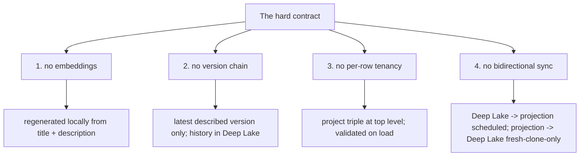

# Portable Registry: Conclusion and Deliverables

> Category: Data | Version: 1.0 | Date: June 2026 | Status: Draft

The deliverable restated as a single sentence, the four-rule hard contract that bounds what the projection will never do, the commit recommendation versus the gitignore tradeoff, and forward pointers to the source documents that ground the projection's relationship to the schema, the fresh-clone inheritance path, and the brooding and re-association pipelines.

**Related:**
- [`../portable-registry.md`](../portable-registry.md)
- [`portable-registry-introduction-and-theory.md`](portable-registry-introduction-and-theory.md)
- [`portable-registry-technical-specification.md`](portable-registry-technical-specification.md)
- [`portable-registry-user-stories.md`](portable-registry-user-stories.md)
- [`portable-registry-ecosystem-story-arc.md`](portable-registry-ecosystem-story-arc.md)
- [`../hive-graph-schema.md`](../hive-graph-schema.md)
- [`../recall-integration.md`](../recall-integration.md)
- [`../../ai/brooding-pipeline.md`](../../ai/brooding-pipeline.md)
- [`../../ai/identity-and-reassociation.md`](../../ai/identity-and-reassociation.md)
- [`../../architecture/ADR-0001-minted-nectar-over-source-embedded-serial.md`](../../architecture/ADR-0001-minted-nectar-over-source-embedded-serial.md)

---

## The deliverable, restated

The portable registry is a **committed, reviewable, regenerable lockfile** that gives a fresh `git clone` offline identity inheritance. It is generated from Deep Lake at the end of every brood and every enricher cycle that wrote new descriptions, committed to the repo like `package-lock.json`, and inherited on clone through content-hash matching — yielding zero LLM calls and zero fuzzy matches when current. It is a projection, not a sidecar: delete it and `honeycomb nectar rebuild-projection` regenerates it from Deep Lake alone.

The single sentence: **the projection exists for portability and reviewability, not because Deep Lake is insufficient.**

This deliverable is realized across the four companion docs in this deep-dive:

| Doc | What it delivers |
|---|---|
| [`portable-registry-introduction-and-theory.md`](portable-registry-introduction-and-theory.md) | The conceptual motivation: why Deep Lake (cloud) and fresh-clone (offline) are in tension, the projection-vs-sidecar distinction as enforcement-not-format, the FR-8 angle, and the zero-LLM, zero-fuzzy-match thesis. |
| [`portable-registry-technical-specification.md`](portable-registry-technical-specification.md) | The format spec: the JSON schema carried verbatim, what it contains versus omits, the three generation points, the validation-on-load contract, the three enforcement rules, and the atomic write pattern. |
| [`portable-registry-user-stories.md`](portable-registry-user-stories.md) | The engineering and operator behavior contract: 25 stories across the five personas, with acceptance criteria tied to the spec. |
| [`portable-registry-ecosystem-story-arc.md`](portable-registry-ecosystem-story-arc.md) | The compositional view: the fresh-clone journey, the bidirectional relationship (regeneration one-directional, inheritance fresh-clone-only), and how brooding, the enricher, and rebuild-projection all feed it. |

---

## The hard contract: four things the projection does not do

The projection's lockfile status is not a formatting choice; it is a hard contract. These four rules are invariants the implementation must not violate. Each is grounded in the asymmetry between a projection (regenerable, derived) and a sidecar (authoritative, drift-prone). The rules exist to keep `.honeycomb/nectars.json` on the right side of FR-8 by construction.

### 1. It does not carry embeddings

The 768-dim vectors are not in the projection. They are regenerable from `title + description` via the configured embedding provider, and including them would make the file megabytes instead of kilobytes. A fresh clone recomputes embeddings on first daemon boot when a provider is available, or skips them if embeddings are unavailable. The projection stays small because it carries only what recall needs to match and what a reviewer needs to read.

### 2. It does not carry the version chain

Only the latest described version per nectar is included. Historical versions stay in Deep Lake. Including them would bloat the file and serve no recall purpose — recall serves the current question, not archaeology. The version chain is queryable in Deep Lake when history is needed; the projection is a snapshot of the present.

### 3. It does not carry tenancy for every row

The project triple (`org_id`, `workspace_id`, `project_id`) is at the top level of the file; individual entries do not repeat it. A clone in a different project context refuses to load a mismatched projection at validation time. Per-row tenancy would multiply the file size for no information gain, since the whole projection is scoped to one project.

### 4. It does not sync bidirectionally with Deep Lake

Sync is one-directional: Deep Lake → projection (regeneration). The reverse — projection → Deep Lake — happens *only* on a fresh clone, as an inheritance write, and *only* for nectars the local Deep Lake does not already have. A running daemon reads Deep Lake directly; it does not read the projection back into Deep Lake. If the reverse direction ran during normal operation, the projection would be a source of truth the daemon reads from — a sidecar, which is disallowed.

These four rules, together with the three enforcement rules in [`portable-registry-technical-specification.md`](portable-registry-technical-specification.md) (Deep Lake writes first, never edited by hand, regenerable from Deep Lake alone), are the complete contract that distinguishes the projection from a sidecar.

---

## The commit recommendation versus the gitignore tradeoff

`.honeycomb/nectars.json` should be committed to the repo, like `package-lock.json`. This is what makes it a team asset: every teammate's clone inherits it, and a fresh clone achieves the zero-LLM, zero-fuzzy-match inheritance that is the projection's reason for existing.

The churn cost is manageable. The projection changes only when a new file is added and described (one entry added), a file's description is updated (one entry's fields change), or a file is deleted (one entry removed, possibly retained for a grace period). A typical PR adds or modifies a handful of projection entries. The daemon debounces projection writes with the same cadence as enricher calls (default 30 seconds), so a rapid-fire edit session produces one projection write at the end, not one per save. In practice the committed file changes only when descriptions actually change.

The diff is reviewable: a reviewer can see "this PR added `src/auth/login.ts` with the description 'User login route handler'" and sanity-check that the description is reasonable. This is a real benefit — the descriptions become a reviewable artifact, not an opaque database blob.

Some teams may prefer not to commit the projection. Nectar supports this: if `.honeycomb/nectars.json` is gitignored, the daemon still writes it locally (for the clone's own use during boot) but it is not shared. The tradeoff is that every clone broods from scratch, paying the LLM cost each time, and loses the offline-fresh-clone property that is the projection's purpose. The recommendation is to commit it, but the system works either way.

| Choice | Offline fresh-clone | LLM cost per clone | Reviewable descriptions |
|---|---|---|---|
| Commit the projection | Yes — zero LLM, zero fuzzy matches | Paid once by the first brooder | Yes — visible in PR diffs |
| Gitignore the projection | No — every clone broods | Paid by every clone | No — descriptions stay in Deep Lake |

---

## Forward pointers

The portable registry is one component of Nectar's identity and recall model. The decisions and mechanisms that surround it live in the source documents below. This deep-dive does not duplicate them; it links to them.

### To the schema it projects from

[`../hive-graph-schema.md`](../hive-graph-schema.md) documents the two tables the projection denormalizes. `hive_graph` carries identity and provenance (`nectar` as primary key, `derived_from_nectar` and `fork_content_hash` for copy-paste provenance, the tenancy triple). `hive_graph_versions` is the append-only content-and-description chain, keyed by the composite `(nectar, content_hash)` with a monotonic `seq` for latest-version lookups. The projection selects the latest described version per nectar from this table and denormalizes it into the `files` map, with the `derived` map carrying copy-paste provenance. Without this schema there is nothing to project; the projection is the lockfile view of it.

### To the brooding pipeline that bootstraps it

[`../../ai/brooding-pipeline.md`](../../ai/brooding-pipeline.md) documents the brooding mode that mints the initial nectars and writes the first descriptions — and, at its end, regenerates the complete projection. Brooding is the only mode that writes the initial `.honeycomb/nectars.json`, making the brood durable and shareable. The brood's content-hash pre-check against the projection is how a fresh clone skips the LLM cost: a file whose content hash matches a projection entry inherits without re-brooding. The brood's resumability (state fully derivable from `describe_status`, no lockfile) is the same append-only pattern the projection's regeneration relies on.

### To the re-association ladder that consumes it

[`../../ai/identity-and-reassociation.md`](../../ai/identity-and-reassociation.md) documents the re-association ladder that sits behind the projection on a fresh clone. Files whose content hashes match the projection inherit directly; files whose hashes miss the projection fall through to the ladder, which mints, carries, or surfaces for review as appropriate. The projection's content-hash index is the "known nectars" map that step 3 of the ladder consults; a content-hash match against a projection entry inherits that nectar without needing Deep Lake cloud sync. The projection collapses the hardest re-association case — a checkout the daemon has never observed — into the trivial one.

### To the recall integration it feeds

[`../recall-integration.md`](../recall-integration.md) documents how the inherited rows (written to local Deep Lake from the projection at clone boot) participate in hybrid recall. The projection's purpose on clone is to seed the local Deep Lake with enough described rows that recall is live immediately, before network or cloud sync. The `files` map carries exactly the `title`, `description`, and `concepts` that the guarded recall arm over `hive_graph_versions` queries.

### To the identity-model decision

[`../../architecture/ADR-0001-minted-nectar-over-source-embedded-serial.md`](../../architecture/ADR-0001-minted-nectar-over-source-embedded-serial.md) records *why* identity is a daemon-minted ULID rather than a source-embedded serial or a content hash. The ADR names fresh-clone portability as a decision driver and the committed projection as the mechanism that satisfies it: without `.honeycomb/nectars.json`, a fresh clone must brood from scratch and has no way to know that the local file is the same logical file the team calls by a given nectar. The ADR explicitly commits the projection "by default" because of this. The projection is the *consequence* of the ADR's Option C — minted identity requires the projection to cross the clone boundary, and the projection is what makes that crossing free.

---

## Closing

The portable registry is not clever. It is disciplined. It carries exactly what recall needs and what a reviewer can read, omits everything regenerable or historical, is written atomically so a crash leaves the old file, and is enforced as a projection — never a sidecar — by three rules that make its regenerability a construction, not an aspiration. The result is a fresh clone that inherits identity and descriptions offline, pays zero LLM cost, and serves semantic recall immediately — which is the only property that makes a cloud-source-of-truth system workable for a team that clones.
