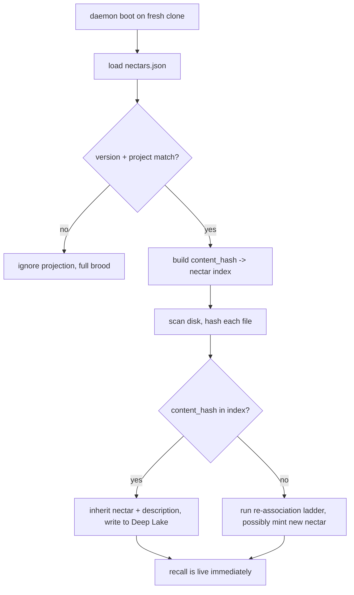
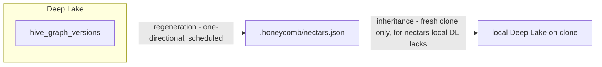
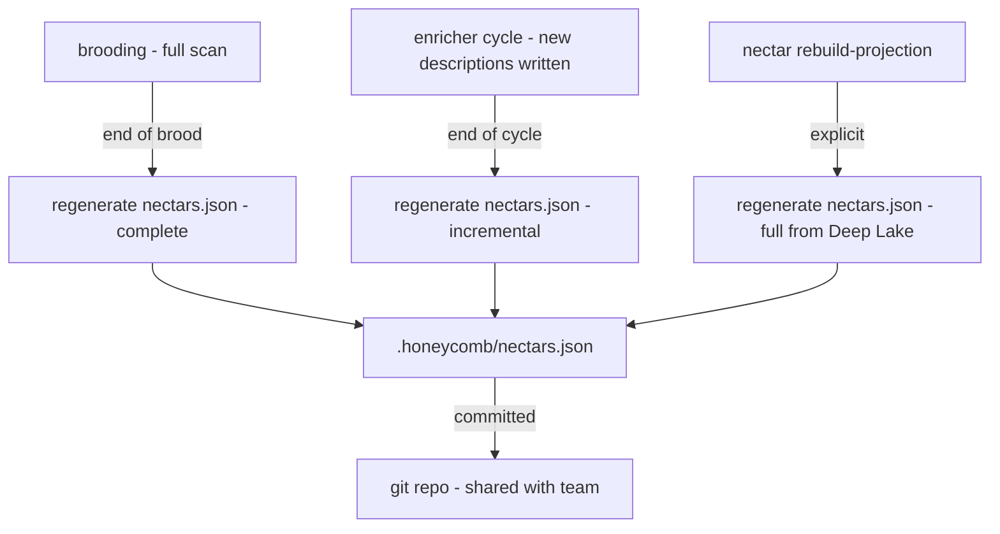
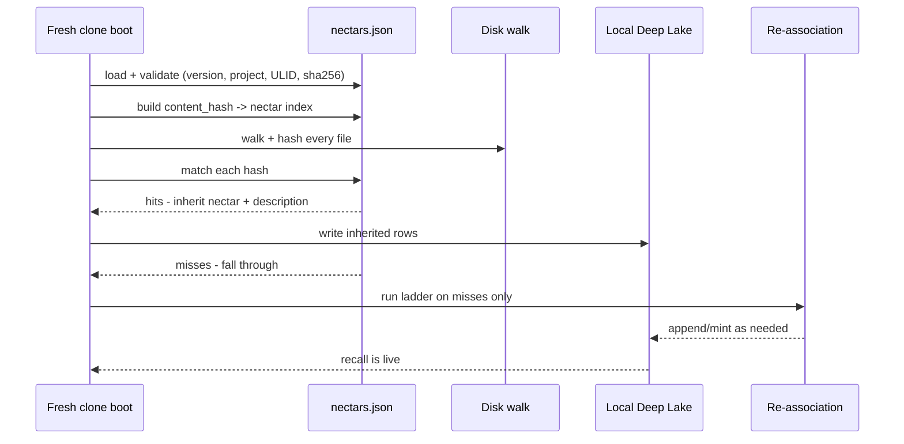

# Portable Registry: Ecosystem Story Arc

> Category: Data | Version: 1.1 | Date: July 2026 | Status: Draft

How the projection composes with the rest of Nectar: the fresh-clone journey from boot to live recall, the bidirectional relationship between Deep Lake and the projection (regeneration one-directional, inheritance only on fresh clone), and how brooding, the enricher, and `rebuild-projection` all feed it.

**Related:**
- [`../portable-registry.md`](../portable-registry.md)
- [`portable-registry-introduction-and-theory.md`](portable-registry-introduction-and-theory.md)
- [`portable-registry-technical-specification.md`](portable-registry-technical-specification.md)
- [`portable-registry-user-stories.md`](portable-registry-user-stories.md)
- [`portable-registry-conclusion-and-deliverables.md`](portable-registry-conclusion-and-deliverables.md)
- [`../hive-graph-schema.md`](../hive-graph-schema.md)
- [`../recall-integration.md`](../recall-integration.md)
- [`../../ai/identity-and-reassociation.md`](../../ai/identity-and-reassociation.md)
- [`../../ai/brooding-pipeline.md`](../../ai/brooding-pipeline.md)

---

## Why a story arc

The projection's file format is specified in [`portable-registry-technical-specification.md`](portable-registry-technical-specification.md) and motivated conceptually in [`portable-registry-introduction-and-theory.md`](portable-registry-introduction-and-theory.md). This doc follows the projection across its two lifecycle roles to show how it composes: as the *output* of Deep Lake regeneration (written by brooding, the enricher, and explicit rebuild), and as the *input* to a fresh clone's identity inheritance (consumed at boot to seed the local Deep Lake).

The arc makes two things visible that the format and theory docs cannot: the directionality of the two relationships (Deep Lake → projection is regeneration; projection → Deep Lake is inheritance, and only on fresh clone), and the convergence of three independent generation paths onto a single regenerable artifact.

---

## The fresh-clone journey

The projection's defining use is the fresh clone. When hiveantennae boots and finds `.honeycomb/nectars.json` present, the boot path is the flowchart carried from the source document:

Step by step:

1. **Boot.** The daemon starts on a checkout whose local Deep Lake has no `hive_graph` rows. The clone has the source tree and the committed `.honeycomb/nectars.json`.
2. **Load and validate.** The daemon loads the projection and validates four properties atomically: version ≤ schema, project triple match, every nectar a valid ULID, every hash a valid sha256 (contract in [`portable-registry-technical-specification.md`](portable-registry-technical-specification.md)). A failed validation falls back to full brooding — the clone is never stuck.
3. **Build the content-hash index.** The validated `files` map is inverted into a `content_hash -> nectar` (plus description) index. This is the lookup structure the clone matches against.
4. **Scan disk and hash.** The daemon walks the source tree, hashing each file.
5. **Match.** Each file's content hash is looked up in the index.
6. **Inherit on hit.** A hit inherits the nectar and its description, written to the local Deep Lake. Recall surfaces the file with its carried description.
7. **Fall through on miss.** A miss enters the re-association ladder (documented in [`../../ai/identity-and-reassociation.md`](../../ai/identity-and-reassociation.md)), which mints, carries, or surfaces for review as appropriate.
8. **Recall is live.** After the inheritance pass, the local Deep Lake has the inherited rows and the daemon serves semantic recall immediately — before any network or Deep Lake cloud sync.

A fresh clone with a current projection typically achieves **zero LLM calls and zero fuzzy matches**: every file's content hash matches the projection, every nectar is inherited, every description is carried over. The brooding cost was paid by whoever first brooded the project; the clone pays nothing.

---

## The bidirectional relationship, precisely

The projection has a relationship with Deep Lake in both directions, but the two directions are *not symmetric* and do not run concurrently. Conflating them is the classic sidecar mistake; the projection avoids it by construction.

### Deep Lake → projection (regeneration)

This direction is **one-directional and scheduled**. The projection is regenerated from Deep Lake at three points: end of brooding, end of an enricher cycle that wrote new descriptions, and explicitly via `nectar rebuild-projection`. The regeneration scans `hive_graph_versions` (latest described version per nectar, scoped to the project), denormalizes into the projection format, and writes atomically. This is the only way the projection is written during normal operation. Deep Lake is the source; the projection is the derived view.

### Projection → Deep Lake (inheritance, fresh clone only)

This direction is **the exception, not the rule**. The reverse flow — projection → Deep Lake — happens *only* on a fresh clone, as an inheritance write, and *only* for nectars the local Deep Lake does not already have. A clone that already has a nectar in its local Deep Lake does not overwrite it from the projection. A running daemon does not read the projection back into Deep Lake; it reads Deep Lake directly.

The asymmetry is what keeps the projection a projection. If the projection → Deep Lake direction ran during normal operation, the projection would be a source of truth the daemon reads from — a sidecar. By restricting the reverse flow to fresh-clone inheritance and to absent nectars only, the design ensures the projection never competes with Deep Lake as an authority. Deep Lake is always the source of truth; the projection is always a regenerable cache that seeds a fresh clone.

---

## The three generation paths converge

Three independent daemon activities all terminate by regenerating the projection. They have different triggers and different scopes, but they share a single output artifact and a single write pattern (atomic temp-file-plus-rename, documented in [`portable-registry-technical-specification.md`](portable-registry-technical-specification.md)).

### Brooding feeds it

Brooding (documented in [`../../ai/brooding-pipeline.md`](../../ai/brooding-pipeline.md)) is the bootstrap path. A full brood mints nectars, describes files, writes embeddings, and at its end regenerates a complete projection. This is the only mode that writes the *initial* `.honeycomb/nectars.json`, and it is what makes the brood durable and shareable: without it, a fresh clone has no identity map. The brood's projection regeneration is the moment the team-share story becomes possible.

### The enricher feeds it

After brooding, the daemon is in live-watch mode. The enricher (documented in the main Nectar corpus) fills descriptions lazily as the watcher notices edits or as recall might surface an undescribed file. At the end of an enricher cycle that wrote new descriptions, the projection is regenerated as an incremental update — the newly-described latest versions are substituted in, unchanged entries are retained. A cycle that wrote no descriptions produces no projection write; the file is not churned for no-ops.

### rebuild-projection feeds it

The explicit command `nectar rebuild-projection` performs a full regeneration from Deep Lake. It is the recovery path for a corrupt, lost, or suspected-stale projection, and it is the proof of Rule 3 of the projection invariant: the file is regenerable from Deep Lake alone, byte-identical modulo `generated_at`, with no other inputs. If rebuild could not reproduce the file, the projection would be a sidecar.

---

## How the projection sits in the clone lifecycle

The composition across a clone's lifetime: brooding (or inheritance) seeds the local Deep Lake; the enricher keeps descriptions current; the projection sync regenerates the lockfile from the described rows; the committed lockfile is what the next fresh clone inherits. Each stage consumes the output of the previous one, and none of them write to each other's territory.

The projection collapses the hardest case of cold catch-up — a checkout the daemon has never observed — into the trivial case. The ladder is not bypassed; it is simply unnecessary when the projection covers every file. The ladder remains the recovery path for files the projection does not cover: genuinely new files, files edited since the projection was generated, and files on unmerged branches.

---

## What this arc does not cover

The conceptual motivation for the projection-vs-sidecar distinction and the FR-8 angle is in [`portable-registry-introduction-and-theory.md`](portable-registry-introduction-and-theory.md). The file-format spec, generation points, validation-on-load contract, enforcement rules, and atomic write pattern are in [`portable-registry-technical-specification.md`](portable-registry-technical-specification.md). The engineering and operator user stories are in [`portable-registry-user-stories.md`](portable-registry-user-stories.md). The four-rule hard contract and the commit recommendation are in [`portable-registry-conclusion-and-deliverables.md`](portable-registry-conclusion-and-deliverables.md).
