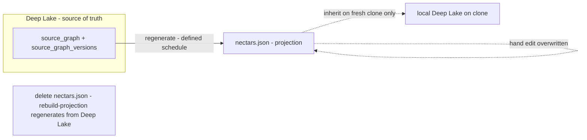

# Portable Registry: Introduction and Theory

> Category: Data | Version: 1.0 | Date: June 2026 | Status: Draft

The conceptual motivation for the portable registry: why Deep Lake (cloud) and fresh-clone (offline) are in tension, how the projection bridges them, why the projection-versus-sidecar distinction is enforcement-not-format, how a regenerable projection satisfies the FR-8 no-sidecar rule, and why a fresh clone with a current projection achieves zero LLM calls and zero fuzzy matches.

**Related:**
- [`../portable-registry.md`](../portable-registry.md)
- [`portable-registry-technical-specification.md`](portable-registry-technical-specification.md)
- [`portable-registry-user-stories.md`](portable-registry-user-stories.md)
- [`portable-registry-ecosystem-story-arc.md`](portable-registry-ecosystem-story-arc.md)
- [`portable-registry-conclusion-and-deliverables.md`](portable-registry-conclusion-and-deliverables.md)
- [`../source-graph-schema.md`](../source-graph-schema.md)
- [`../recall-integration.md`](../recall-integration.md)
- [`../../ai/identity-and-reassociation.md`](../../ai/identity-and-reassociation.md)
- [`../../ai/brooding-pipeline.md`](../../ai/brooding-pipeline.md)
- [`../../architecture/ADR-0001-minted-nectar-over-source-embedded-serial.md`](../../architecture/ADR-0001-minted-nectar-over-source-embedded-serial.md)

---

## The tension the projection resolves

Deep Lake is the source of truth for Hivenectar, but Deep Lake is not in the git repo. A fresh `git clone` produces the source files and no nectars — the clone's local Deep Lake has no `source_graph` rows until the daemon does something about it. Two recovery paths exist without the projection, and both are unsatisfactory.

The first path is cloud sync: the daemon boots and pulls the workspace's rows from Deep Lake. This requires network and auth. A clone on a plane, behind a captive portal, or in an air-gapped environment cannot take it. The second path is brooding from scratch: the daemon re-describes every file, re-paying the LLM cost. This wastes money and time — the brooding cost was already paid by whoever first brooded the project (documented in [`../../ai/brooding-pipeline.md`](../../ai/brooding-pipeline.md)).

The portable registry is a third path. `.honeycomb/nectars.json` is a single committed file at the project root that carries enough of the Deep Lake state to re-derive identity on a fresh clone *without* network, auth, or LLM calls. It is the bridge between "the source of truth is in the cloud" and "a clone should work offline immediately." The tension between a cloud source of truth and an offline-friendly clone is real, and the projection is what dissolves it.

---

## Projection versus sidecar: enforcement, not format

The most important idea in this design is that the distinction between a projection and a sidecar is **enforcement, not format**. The same JSON file on disk is a projection if the system treats it as regenerable, and a sidecar if the system reads from it as a source of truth. The bytes are irrelevant; the contract around them is everything.

A **sidecar** is a parallel source of truth that the system reads from and writes to during normal operation. Sidecars drift, get out of sync, and become liabilities. FR-8 in the main Honeycomb PRD substrate explicitly forbids them: durable state goes in Deep Lake, not in JSON/JSONL sidecars. An `.env` file is a sidecar — the application reads it as authoritative configuration and would malfunction without it.

A **projection** is a denormalized, regenerable view of the source of truth. It is written from the source of truth on a defined schedule, never edited directly, and can be deleted and regenerated without loss. A lockfile (`package-lock.json`, `Cargo.lock`) is a projection — delete it and `npm install` or `cargo build` regenerates it from the manifest. The system does not depend on the lockfile for correctness; it depends on it for reproducibility and convenience.

`.honeycomb/nectars.json` is generated from Deep Lake at the end of every brood and every enricher cycle that produced new descriptions. It is committed for portability. It is never the system of record. Delete it, and `honeycomb hivenectar rebuild-projection` reproduces it from Deep Lake alone. That property — regenerability from the source of truth with no other inputs — is what makes it a projection rather than a sidecar, regardless of the fact that it is a JSON file on disk.

---

## The FR-8 angle

FR-8 forbids sidecars because sidecars become second sources of truth that drift from Deep Lake, get out of sync with the daemon, and cannot be reconciled by tooling. A naive reading of FR-8 would forbid `.honeycomb/nectars.json` outright — it is a JSON file, it lives in the repo, it carries state. Why is it not a sidecar?

The answer is that FR-8 forbids *sidecars as sources of truth*, not *files that happen to contain derived state*. A regenerable projection satisfies FR-8 because it carries no state Deep Lake does not have. The three enforcement rules documented in [`portable-registry-technical-specification.md`](portable-registry-technical-specification.md) are what make this true by construction:

1. Deep Lake writes happen first — the projection is always derived from committed state.
2. The projection is never edited by hand or by external tools — no out-of-band mutations.
3. The projection is regenerable from Deep Lake alone — if rebuild could not reproduce it, it would be a sidecar.

These rules are not aspirations; they are invariants the implementation must not violate. Rule 3 is the load-bearing one. It is the difference between "a file that happens to be convenient" and "a file the system depends on for correctness." Hivenectar depends on Deep Lake for correctness; it depends on the projection only for offline portability and reviewability. Delete Deep Lake and the system is broken; delete the projection and `rebuild-projection` fixes it in a single scan.

This is why the projection is on the right side of FR-8: it exists for portability and reviewability, not because Deep Lake is insufficient.

---

## The zero-LLM, zero-fuzzy-match thesis

The central claim of the portable registry is that **a fresh clone with a current projection achieves zero LLM calls and zero fuzzy matches**. This is not an aspiration; it is the mechanical consequence of content-hash matching against a complete projection.

When the daemon boots on a fresh clone and finds a current projection, every file on disk has a content hash that matches an entry in the projection's `files` map. The daemon builds a `content_hash -> nectar` index from the projection, walks disk, hashes each file, and matches. Every hit inherits its nectar and description directly, written to the local Deep Lake. No file needs description because every description is already carried in the projection. No file needs fuzzy matching because every content hash is an exact match.

The brooding cost — the LLM spend to produce the descriptions in the first place — was paid by whoever first brooded the project. The clone pays nothing. The clone's daemon writes inherited rows to Deep Lake and is immediately ready to serve semantic recall. The full boot path is traced in [`portable-registry-ecosystem-story-arc.md`](portable-registry-ecosystem-story-arc.md).

This thesis holds only when the projection is *current* — when the committed projection's content hashes match the clone's file contents. A stale projection (files on disk have content hashes not in the projection) degrades gracefully: those files enter the re-association ladder documented in [`../../ai/identity-and-reassociation.md`](../../ai/identity-and-reassociation.md), which mints, carries, or surfaces for review as appropriate. The projection's content-hash index is the "known nectars" map that step 3 of the ladder consults; a content-hash match against a projection entry inherits that nectar directly without needing Deep Lake cloud sync.

The projection does not bypass the ladder; it makes the ladder unnecessary when the projection covers every file. The ladder remains the recovery path for files the projection does not cover: genuinely new files, files edited since the projection was generated, and files on unmerged branches.

---

## Why commit it, then?

If the projection is regenerable from Deep Lake, and Deep Lake cloud sync already exists (documented in [`../recall-integration.md`](../recall-integration.md)), why commit the projection to the repo at all? The answer is the offline-fresh-clone property. A committed projection gives a clone identity *before* the daemon ever runs, *before* network is available, *before* auth is established. Cloud sync gives the same rows eventually; the projection gives them immediately, offline, and without auth.

The two are complementary, not alternative. A team that commits the projection gets offline-fresh-clone support. A team that also uses Deep Lake cloud sync gets live description updates as teammates describe new files. The projection carries a snapshot; cloud sync carries the live feed. The projection is the offline cache that makes the first clone cheap; cloud sync is the steady-state sharing mechanism that keeps clones current.

The recommendation is to commit the projection, like a lockfile. The tradeoff — and the gitignore alternative — is examined in [`portable-registry-conclusion-and-deliverables.md`](portable-registry-conclusion-and-deliverables.md).

---

## What this essay does not cover

The file-format spec, the three generation points, the validation-on-load contract, the three enforcement rules stated as a contract, and the atomic write pattern are in [`portable-registry-technical-specification.md`](portable-registry-technical-specification.md). The engineering and operator user stories are in [`portable-registry-user-stories.md`](portable-registry-user-stories.md). The end-to-end fresh-clone journey is in [`portable-registry-ecosystem-story-arc.md`](portable-registry-ecosystem-story-arc.md). The four-rule hard contract and the commit recommendation are in [`portable-registry-conclusion-and-deliverables.md`](portable-registry-conclusion-and-deliverables.md).
