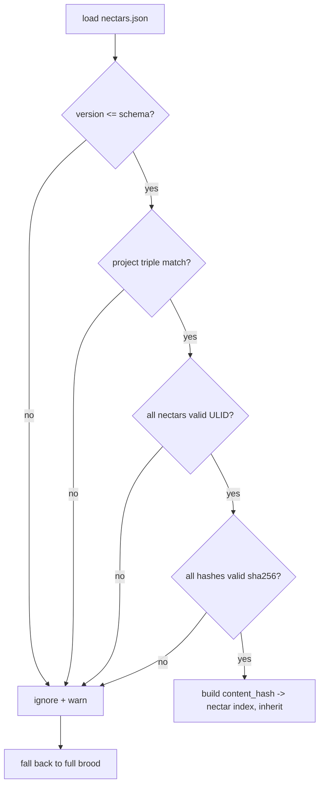
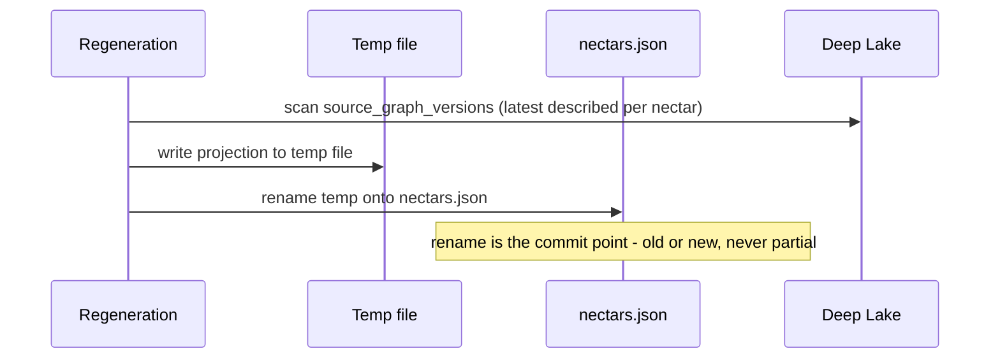

# Portable Registry: Technical Specification

> Category: Data | Version: 1.0 | Date: June 2026 | Status: Draft

The file-format spec for the `.honeycomb/nectars.json` projection carried from the source document, what it contains versus what it deliberately omits, the three generation points, the validation-on-load contract, the three projection-invariant enforcement rules, and the atomic write pattern.

**Related:**
- [`../portable-registry.md`](../portable-registry.md)
- [`portable-registry-introduction-and-theory.md`](portable-registry-introduction-and-theory.md)
- [`portable-registry-user-stories.md`](portable-registry-user-stories.md)
- [`portable-registry-ecosystem-story-arc.md`](portable-registry-ecosystem-story-arc.md)
- [`portable-registry-conclusion-and-deliverables.md`](portable-registry-conclusion-and-deliverables.md)
- [`../source-graph-schema.md`](../source-graph-schema.md)
- [`../recall-integration.md`](../recall-integration.md)
- [`../../ai/brooding-pipeline.md`](../../ai/brooding-pipeline.md)
- [`../../architecture/ADR-0001-minted-nectar-over-source-embedded-serial.md`](../../architecture/ADR-0001-minted-nectar-over-source-embedded-serial.md)

---

## The file format

The portable registry is a single JSON file at `.honeycomb/nectars.json` in the project root. Its schema is fixed by the source document and carried here verbatim so this spec is the canonical reference for the projection's shape.

```json
{
  "version": 1,
  "generated_at": "2026-06-30T12:00:00Z",
  "generator": "honeycomb-hivenectar@0.1.13",
  "project": {
    "org_id": "legion",
    "workspace_id": "engineering",
    "project_id": "honeycomb"
  },
  "files": {
    "01J2X4F6K8ME7N9P1Q3R5T7V9WX": {
      "content_hash": "sha256-abc123...",
      "path": "src/auth/login.ts",
      "title": "User login route handler",
      "description": "Validates credentials against the user store, starts a session, and issues a JWT refresh token. Entry point for the /login API.",
      "concepts": ["auth", "login", "session", "jwt"],
      "describe_model": "gemini-2.5-flash",
      "described_at": "2026-06-29T14:30:00Z"
    },
    "01J2X4F6K8ME7N9P1Q3R5T7V9WY": {
      "content_hash": "sha256-def456...",
      "path": "src/middleware/session-refresh.ts",
      "title": "JWT session refresh middleware",
      "description": "Refreshes JWT claims on each authenticated request. Part of the login session lifecycle.",
      "concepts": ["auth", "session", "jwt", "middleware"],
      "describe_model": "gemini-2.5-flash",
      "described_at": "2026-06-29T14:30:05Z"
    }
  },
  "derived": {
    "01J2X4F6K8ME7N9P1Q3R5T7V9WY": {
      "from_nectar": "01J2X4F6K8ME7N9P1Q3R5T7V9WX",
      "fork_content_hash": "sha256-abc123..."
    }
  }
}
```

---

## What it contains

Each top-level key has a defined role. The projection is denormalized specifically for content-hash lookups on a fresh clone; nothing is present that does not serve that purpose or the reviewability goal.

| Key | Purpose |
|---|---|
| `version` | Schema version of the projection format. Bumped on incompatible changes; old daemon versions refuse to load a higher version and fall back to full brooding. |
| `generated_at` | When the projection was last regenerated. Lets a clone detect staleness — a projection weeks old should be verified against Deep Lake once network is available. |
| `generator` | The daemon version that produced the file. Auditable. |
| `project` | The tenancy triple (`org_id`, `workspace_id`, `project_id`). A clone in a different project context refuses to load a mismatched projection. |
| `files` | The main payload. Keyed by nectar (ULID). Each entry carries the latest described version's content hash, path, title, description, concepts, and provenance metadata. This is exactly the data recall needs. |
| `derived` | The copy-paste provenance map. Keyed by the derived nectar, pointing at the source nectar (`from_nectar`) and the fork content hash (`fork_content_hash`). Separated from `files` so the file map stays flat for content-hash lookups. |

---

## What it deliberately omits

The projection is a denormalized view, not a dump. Four categories of Deep Lake state are intentionally absent.

- **The full version chain.** Only the latest described version per nectar is included. Historical versions stay in Deep Lake. Including them would bloat the file and serve no recall purpose — recall serves the current question, not archaeology.
- **Embeddings.** The 768-dim vectors are not in the projection. They are regenerable from `title + description` via the configured embedding provider, and including them would make the file megabytes instead of kilobytes. A fresh clone recomputes embeddings on first daemon boot when a provider is available, or skips them if embeddings are unavailable.
- **Undescribed files beyond a minimal entry.** A nectar minted but never described (brooding interrupted, or the file skipped as binary) appears with a minimal entry — `path` and `content_hash`, but empty `title`/`description` — so identity is preserved, but recall will not surface it until described.
- **Internal IDs.** No Deep Lake row IDs, no internal indices. The projection is portable across Deep Lake instances.

---

## The three generation points

The projection is regenerated by the daemon at three defined points. There is no other write path.

1. **End of brooding.** A full brood produces a complete projection. This is the only mode that writes the initial `nectars.json`, making the brood durable and shareable (see [`../../ai/brooding-pipeline.md`](../../ai/brooding-pipeline.md)).
2. **End of an enricher cycle that wrote new descriptions.** An incremental update — the projection is rewritten with the newly-described versions substituted in. A cycle that wrote no descriptions produces no projection write.
3. **Explicitly, via `honeycomb hivenectar rebuild-projection`.** A full regeneration from Deep Lake, used when the projection is corrupt, lost, or suspected stale.

Regeneration is a single scan of `source_graph_versions` — the latest described version per nectar, scoped to the project — denormalized into the projection format and written atomically. The scan reads only Deep Lake; no other input is permitted, or the projection would be carrying state Deep Lake does not have.

---

## Validation on load

When the daemon loads a projection, it validates four properties before inheriting anything. Validation is atomic: any single failure causes the whole projection to be ignored with a warning, and the daemon falls back to full brooding. The projection is never partially loaded.

| Check | Predicate | Failure behavior |
|---|---|---|
| Version compatibility | `projection.version <= daemon.schema_version` | Ignore, fall back to brooding. |
| Project triple match | `project.org_id`, `project.workspace_id`, `project.project_id` all match current context | Ignore (the repo was templated from another project, or the file was committed by mistake), fall back to brooding. |
| ULID validity | Every nectar key in `files` is a syntactically valid ULID (26-char Crockford base32, uppercase) | Ignore, fall back to brooding. |
| sha256 validity | Every `content_hash` is a syntactically valid sha256 | Ignore, fall back to brooding. |

The fall-back-to-brood on failure is the recovery path. A clone whose projection is unreadable is not stuck; it broods from scratch, minting fresh nectars and writing fresh descriptions, and regenerates a new valid projection at the end of the brood. The cost is the brooding LLM spend (documented in [`../../ai/brooding-pipeline.md`](../../ai/brooding-pipeline.md)); the correctness is preserved.



---

## The three projection-invariant enforcement rules

The line between a projection and a sidecar is enforcement, not format. The same JSON file is a projection if the system treats it as regenerable, and a sidecar if the system reads from it as a source of truth. Hivenectar enforces the projection invariant through three rules, grounded in FR-8 (no sidecars — durable state goes in Deep Lake).

### Rule 1 — Deep Lake writes happen first

Every nectar mint, version append, and description write goes to Deep Lake *before* the projection is regenerated. The projection is never the target of a write; it is always derived. This ordering guarantees the projection reflects committed Deep Lake state at the moment of regeneration.

### Rule 2 — The projection is never edited by hand or by external tools

A hand-edit to `.honeycomb/nectars.json` is overwritten on the next regeneration. The file is read-only from the system's perspective except for the regeneration write. No external tool or human edit is respected as state.

### Rule 3 — The projection is regenerable from Deep Lake alone

`honeycomb hivenectar rebuild-projection` produces a byte-identical file (modulo `generated_at`) from a Deep Lake scan, with no other inputs. If it did not, the projection would be carrying state Deep Lake does not have, which would make it a sidecar. This rule is what keeps the file on the right side of FR-8: it exists for portability and reviewability, not because Deep Lake is insufficient.

---

## Atomic write pattern

Regeneration writes atomically so a crashed regeneration leaves the old projection, not a partial one. The pattern is temp-file-plus-rename — the same pattern the CodeGraph uses for snapshot writes.



The rename is the commit point. Readers observe either the old file or the new file, never an intermediate or truncated state. A crash during the temp write leaves the previous projection intact on disk; the orphaned temp file is cleaned up on the next regeneration. This is the durability property that lets a clone trust the committed file even if a teammate's last regeneration was interrupted.

---

## What the spec does not cover

The conceptual motivation for the projection-vs-sidecar distinction and the FR-8 angle is in [`portable-registry-introduction-and-theory.md`](portable-registry-introduction-and-theory.md). The engineering and operator user stories that exercise the projection are in [`portable-registry-user-stories.md`](portable-registry-user-stories.md). The end-to-end fresh-clone journey that consumes the projection is in [`portable-registry-ecosystem-story-arc.md`](portable-registry-ecosystem-story-arc.md). The four-rule hard contract (what the projection explicitly does not do) and the commit-vs-gitignore tradeoff are restated in [`portable-registry-conclusion-and-deliverables.md`](portable-registry-conclusion-and-deliverables.md).
