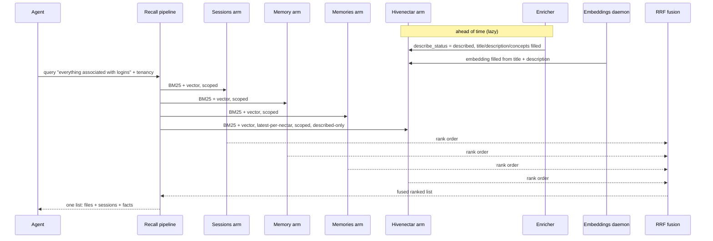

# Recall Integration — Ecosystem Story Arc

> Category: Data | Version: 1.0 | Date: June 2026 | Status: Draft

A single query traced end-to-end through the four-arm recall union: how the agent's words become a scoped, fused, ranked list where CodeGraph structural hits and Hivenectar semantic hits appear together, and how the enricher, the embeddings daemon, and the BM25 fallback each play their part in keeping the Hivenectar arm alive.

**Related:**
- [`../recall-integration.md`](../recall-integration.md)
- [`recall-integration-technical-specification.md`](recall-integration-technical-specification.md)
- [`recall-integration-introduction-and-theory.md`](recall-integration-introduction-and-theory.md)
- [`recall-integration-user-stories.md`](recall-integration-user-stories.md)
- [`recall-integration-conclusion-and-deliverables.md`](recall-integration-conclusion-and-deliverables.md)
- [`../../ai/enricher-and-llm-model.md`](../../ai/enricher-and-llm-model.md)
- [`../source-graph-schema.md`](../source-graph-schema.md)

---

## Why this exists

The SQL contract and the conceptual thesis are abstract until a single query is followed from words to ranked list. This document does exactly that: it traces *"everything associated with logins"* through the four-arm `UNION ALL`, the per-arm BM25+vector scoring, the RRF fusion, and the tenancy scoping, and it shows where the enricher's described rows, the embeddings daemon's vectors, and the BM25 fallback each enter the path. The point is to make the compositional argument concrete — to show the arm doing its job in motion, alongside the three arms that predate it. The SQL behind the trace is in [`recall-integration-technical-specification.md`](recall-integration-technical-specification.md); the personas and acceptance criteria are in [`recall-integration-user-stories.md`](recall-integration-user-stories.md).

---

## The query

An agent issues the query *"everything associated with logins"* against a typical Honeycomb-shaped codebase. The query is semantic — it is not a symbol name, so the structural CodeGraph's `find/` cannot answer it directly. Before Hivenectar, recall would return session traces about login bugs, distilled facts about JWT skew, and a wiki summary of the auth subsystem — and no code files. With the fourth arm, the same query also returns the code files that *implement* login, found by description rather than by symbol name.

The trace follows the query through five stages: issue, scope, score, fuse, rank.

---

## Stage 1 — Issue and scope

The agent hands the query string and its tenancy context (`org_id`, `workspace_id`, `project_id`) to the recall pipeline. The pipeline treats the query two ways: as a lexical pattern (for the BM25 paths) and as a 768-dim vector (for the vector paths). Both are derived from the same query string.

Scoping is applied per arm, inside each arm's own predicates. The sessions, memory, and memories arms scope by `org_id` / `workspace_id` / `project_id` plus `agent_id` / `visibility` where their schemas carry them. The Hivenectar arm scopes by the org/workspace/project triple only — file identity is cross-agent, so there is no `agent_id` and no `visibility` on `source_graph_versions`. The arms do not reconcile their scoping; each applies what its schema requires, and the union combines whatever survives.

---

## Stage 2 — The four-arm UNION ALL

The recall query is a single `UNION ALL` of four arms. Each arm runs both a BM25 lexical path and a 768-dim vector path over its body and vector columns, and returns its top-K rows.

| Arm | BM25 over | Vector over | What it finds for "logins" |
|---|---|---|---|
| Sessions | `message` | `message_embedding` | Tuesday's debugging session about the login skew bug |
| Memory | `summary` | `summary_embedding` | The wiki summary of the auth subsystem |
| Memories | `body` | `body_embedding` | "JWT refresh has a 5-minute skew tolerance" |
| Hivenectar | `title + description + concepts` | `embedding` | `login.ts`, `session-refresh.ts`, `jwt.ts`, `logout.ts` |

The Hivenectar arm is the new one. It finds four files for the login query, three of which no symbol-name search would have surfaced:

- `src/auth/login.ts` — *"user login entry point, validates credentials and starts a session"*
- `src/middleware/session-refresh.ts` — *"refreshes JWT claims on each authenticated request, part of the login session lifecycle"*
- `src/lib/jwt.ts` — *"JWT issue/verify, used by login and session-refresh"*
- `src/api/routes/logout.ts` — *"ends a login session, clears refresh token"*

Only `login.ts` has a symbol named `login*`. The other three participate in login without being named after it; the enricher's descriptions name login on their behalf, and the arm finds them by description. This is the structural-vs-semantic complementarity in motion.

---

## Stage 3 — Per-arm BM25 + vector scoring

Each arm scores its surviving rows independently. The Hivenectar arm's two paths:

- **BM25 path** scores over `title`, `description`, and `concepts`. A file whose description contains "login" scores higher than one whose description contains "session" alone; a file tagged with the `login` concept matches via the `concepts` ILIKE even if the prose uses a synonym.
- **Vector path** scores cosine distance between the query vector and the row's `embedding`, gated on `embedding IS NOT NULL`. A file whose description is semantically close to "login" (e.g. "credential validation") scores well even without the literal word.

A row that matches both paths is a stronger hit than one that matches only one. The arm produces a rank order from these scores; that rank order is what fusion consumes. The raw scores are not compared across arms — sessions JSONB and Hivenectar descriptions live on different scales — and they do not need to be, because fusion is rank-based.

### Where the described rows come from

The rows the arm scores are produced by the enricher, documented in [`../../ai/enricher-and-llm-model.md`](../../ai/enricher-and-llm-model.md). The enricher is a lazy loop inside the hiveantennae worker that polls `source_graph_versions` rows where `describe_status = 'pending'`, batches them, and fills `title`, `description`, and `concepts` via Gemini 2.5 Flash through the Portkey gateway. A row sits `pending` until the enricher reaches it; recall's `describe_status = 'described'` filter excludes pending rows, so a query mid-brood sees whatever has been described so far. The arm does not block on the enricher; the two proceed concurrently with no coordination.

### Where the vectors come from

The `embedding` column is filled by the embeddings daemon, which computes a 768-dim vector over `title + ' ' + description` using nomic-embed-text-v1.5 (q8 quantization, Unix-socket NDJSON IPC). The dimensionality matches `sessions.message_embedding` and `memory.summary_embedding` deliberately, so the same hybrid vector index serves all arms. The embedding is written after the description; between description-write and embedding-write, the row is `described` but has a NULL embedding, and the vector arm simply does not return it.

### BM25 fallback keeps the arm alive

When embeddings are off — the daemon is not installed, or it failed to warm up — the `embedding` column is NULL across the arm, the vector path returns nothing, and the BM25 path carries recall alone. The arm does not error, does not return empty, and does not degrade sharply: it returns lexical hits over descriptions, ranked by BM25. This is the same silent-fallback behavior every other recall arm uses. Re-enabling the embeddings daemon restores vector scoring on the next warm-up, with no manual re-index step.

---

## Stage 4 — RRF fusion

The four arms' rank orders are merged by reciprocal rank fusion. Each row's fused score is the sum, over every arm that returned it, of `multiplier / (k + rank)`. RRF is rank-based: a Hivenectar hit at rank 1 contributes the same fused weight as a sessions hit at rank 1, regardless of how their raw BM25/vector scores compare. This is what lets the four arms — with different score distributions — contribute on equal footing in one ranked list.

The Hivenectar arm ships with a default multiplier of 1.0 (equal weighting). An operator who finds Hivenectar hits dominating recall can lower the multiplier via `~/.honeycomb/hivenectar.json`. The fusion itself is unchanged from the three-arm case; the fourth arm is just another contributor to the same sum.

---

## Stage 5 — The ranked list

The agent receives a single ranked list where a code-file description sits alongside session traces and distilled facts. The list is the deliverable: structural answers and semantic answers in one fused ranking.

| Rank | Source | Row | What it tells the agent |
|---|---|---|---|
| 1 | hivenectar | `src/auth/login.ts` | The login entry point (what to look at) |
| 2 | sessions | Tuesday's login-skew debugging | What was discussed |
| 3 | hivenectar | `src/middleware/session-refresh.ts` | Login-adjacent file no symbol search would find |
| 4 | memories | "JWT refresh has a 5-minute skew tolerance" | What was decided |
| 5 | hivenectar | `src/lib/jwt.ts` | JWT issue/verify, used by login |
| 6 | hivenectar | `src/api/routes/logout.ts` | Ends a login session |
| 7 | memory | Auth subsystem wiki summary | What was written down |

The agent can now decide: read the code file, replay the session, or trust the distilled fact. It has all three signals in one place. That is the thesis from [`recall-integration-introduction-and-theory.md`](recall-integration-introduction-and-theory.md) made operational — *structural hits tell how to navigate; semantic hits tell what to look at* — and the fusion is what makes both appear together.

### What the agent reconciles

`src/auth/login.ts` may also appear in a concurrent CodeGraph `find/login` structural hit. The recall layer does not deduplicate across the two — it has no view into the CodeGraph's results. Both hits are returned, each carrying what its layer is good at: the Hivenectar hit carries the description, the CodeGraph hit carries symbol names and line numbers. Recognizing them as the same file is the agent's (or the harness prompt assembler's) job. Dedup at the recall layer would lose the structural context the CodeGraph hit carries.

---

## The arc, restated

The query entered as words and a tenancy triple. It was scoped per arm, scored by BM25 and vector over four different bodies, fused by rank into one list, and returned with code files alongside discussions. The enricher's described rows fed the Hivenectar arm's body; the embeddings daemon's vectors fed its vector path; the BM25 fallback kept the arm alive when embeddings were off. Nothing in the path was Hivenectar-specific except the arm's SELECT — the scoping, the fusion, the weighting, and the fallback are all shared with the three arms that predate it. That is the compositional property the fourth arm exists to preserve, and it is the reason a `UNION ALL` arm beats a separate query.

The deliverable, the two contracts (complementarity and graceful degradation), and the forward pointers to the source schema and the enricher are restated in [`recall-integration-conclusion-and-deliverables.md`](recall-integration-conclusion-and-deliverables.md).
