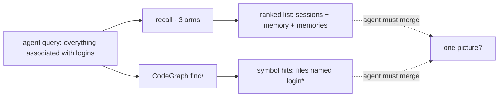
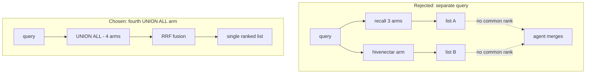

# Recall Integration — Introduction and Theory

> Category: Data | Version: 1.0 | Date: June 2026 | Status: Draft

Why Hivenectar earns a fourth arm in the Honeycomb hybrid recall pipeline: the conceptual gap between recall over what was *discussed and decided* versus what *implements the topic*, and why closing that gap inside the existing UNION ALL — rather than beside it — is the load-bearing design decision.

**Related:**
- [`../recall-integration.md`](../recall-integration.md)
- [`recall-integration-technical-specification.md`](recall-integration-technical-specification.md)
- [`recall-integration-user-stories.md`](recall-integration-user-stories.md)
- [`recall-integration-ecosystem-story-arc.md`](recall-integration-ecosystem-story-arc.md)
- [`recall-integration-conclusion-and-deliverables.md`](recall-integration-conclusion-and-deliverables.md)
- [`../source-graph-schema.md`](../source-graph-schema.md)
- [`../../overview.md`](../../overview.md)

---

## Why this exists

The existing Honeycomb hybrid recall pipeline answers an agent query by running lexical and vector search over a union of three tables and fusing the results into one ranked list. That list is excellent at one thing: telling the agent *what was discussed and what was decided* about the query topic. It is silent on a second thing: *which files in the codebase implement the topic*. A semantic query like *"everything associated with logins"* returns session traces, distilled facts, and wiki summaries — and not a single line of code, unless a human happened to paste one into a session.

This document is the conceptual entry point for the recall-integration deep-dive. It states the gap, states the thesis that closes it, and states the compositional argument for the shape of the fix. The SQL contract lives in [`recall-integration-technical-specification.md`](recall-integration-technical-specification.md); the end-to-end trace lives in [`recall-integration-ecosystem-story-arc.md`](recall-integration-ecosystem-story-arc.md).

---

## What recall looked like before Hivenectar

The recall union before Hivenectar has three arms. Each arm is a table in Deep Lake, each contributes a body column and a vector column, and each is scored by both BM25 lexical and 768-dim vector similarity before reciprocal rank fusion merges them.

| Arm | Table | Body column | Vector column | What it answers |
|---|---|---|---|---|
| Sessions | `sessions` | `message` (JSONB) | `message_embedding` | What was *discussed* — raw conversation events |
| Memory | `memory` | `summary` | `summary_embedding` | What was *written down* — wiki summaries, VFS rows |
| Memories | `memories` | `body` | `body_embedding` | What was *distilled* — facts the pipeline extracted |

The three arms are scoped by `org_id` / `workspace_id` / `project_id` (and `agent_id` / `visibility` where the schema carries them), fused by reciprocal rank fusion (RRF), and handed to the agent as one ranked list. The result answers *"what do we know about logins"* — the Tuesday debugging session, the distilled fact about JWT skew tolerance, the wiki page on the auth subsystem. It does not answer *"where is the login logic"*.

The structural CodeGraph owns the second question for symbol-shaped queries. `find/authenticate` returns `src/auth/login.ts` because a function named `authenticate` lives there, deterministically and byte-reproducibly from the AST. But `find/` is structural: it matches symbol names. A file like `src/middleware/session-refresh.ts`, which implements a critical piece of login behavior but names no symbol `login*`, is invisible to it. That is the gap.

---

## The gap, stated precisely

The gap is not "recall has no code." The CodeGraph is a first-class query surface. The gap is that the code-graph answer and the recall answer live in **two separate query paths** that the agent must know to invoke, and that the agent must stitch together in its own head.

Two failure modes follow from the split. First, an agent that only queries recall never learns that `session-refresh.ts` is part of the login story — because no session ever mentioned it and no memory distilled it. Second, an agent that only queries the CodeGraph finds the files *named* after login but misses the files that *participate in* login without being named after it. Either path alone is a blind spot; the agent has to run both and reconcile them, which is exactly the kind of orchestration that semantic recall is supposed to spare the agent from.

---

## The thesis: structural tells how to navigate, semantic tells what to look at

Hivenectar's contribution is a semantic description of every file — a title, a one-to-three-sentence description, concept tags, and a 768-dim embedding over the description, produced lazily by the enricher. The description of `session-refresh.ts` says *"refreshes JWT claims on each authenticated request, part of the login session lifecycle."* That sentence is what lets semantic recall find the file for the login query, because the description *names login* even though no symbol does.

The two layers therefore answer different facets of the same question, and the facets compose:

- The **structural** CodeGraph tells the agent *how to navigate* — which symbol calls which, what the blast radius of a change is, how to walk the call graph. It is exact, deterministic, and narrow.
- The **semantic** Hivenectar arm tells the agent *what to look at in the first place* — which files participate in a topic regardless of how their symbols are named. It is broad, probabilistic, and approximate.

The two are not redundant. The CodeGraph cannot find `session-refresh.ts` for the login query because no symbol in it is named `login*`. Hivenectar cannot tell the agent that `login.ts:14` calls `verifyJwt` — a structural edge — because it only knows that `login.ts` is *about* login. The agent uses both: Hivenectar to discover which files matter, the CodeGraph to navigate within and between them.

---

## Why a UNION ALL arm, not a separate query

The most natural-looking alternative to a fourth recall arm is a separate query: run recall for discussions, run the Hivenectar arm for files, return two lists and let the agent merge them. This is the fragmented path the gap section above describes, and it is rejected for a concrete reason.

RRF is rank-based, not score-based. A hit at rank 1 contributes the same fused weight regardless of which arm produced it or how that arm's raw BM25/vector score compares to another arm's. This is what lets the four arms — with wildly different score distributions (sessions JSONB is noisy; Hivenectar descriptions are clean and short) — contribute on equal footing in one ranked list. A Hivenectar hit at rank 1 sits next to a sessions hit at rank 1, and the agent sees both.

A separate query throws that property away. Two lists have no common rank scale, no shared fusion, and no way to express "this file and this session trace are both about login, rank them together." The agent is forced to do the merging the pipeline is supposed to do. The union arm, by contrast, drops the Hivenectar rows into the same fusion as the other three, and the ranking is the pipeline's job again.

The compositional argument is the whole point. A union arm is composable: it participates in the same scoping, the same fusion, the same weighting knobs, and the same graceful degradation as its siblings. A separate query is fragmented: it re-implements scoping, re-decides ranking, and forces the agent to reconcile. Hivenectar ships the arm precisely because the arm is what makes the structural and semantic answers appear in one fused ranked list.

---

## The complementarity contract

The thesis rests on a contract between the two layers that the rest of this deep-dive honors. The contract has two clauses.

**Independence.** A file can be in the CodeGraph without a nectar (it has structure but no description yet — brooding has not reached it, or it was skipped as binary). A file can have a nectar without being in the CodeGraph (a config file, a markdown doc, a `.env.example` — anything with meaning but no AST). The two indexes are built independently and queried independently; neither is a prerequisite for the other.

**Complementarity.** When both cover the same file, they contribute different facts. The CodeGraph contributes symbol names, line numbers, and call edges. Hivenectar contributes a description, concept tags, and an embedding. Recall does not deduplicate a file that appears in both a Hivenectar hit and a CodeGraph `find/` hit — both are returned, because dedup would strip the structural context the CodeGraph hit carries. The agent, or the harness prompt assembler, recognizes them as the same file and uses each for what it is good at.

The independence clause is why the arm can ship at all: it does not have to wait for the CodeGraph to cover every file, and the CodeGraph does not have to wait for descriptions. The complementarity clause is why the arm is worth shipping: a fused ranked list where both facets appear is strictly more useful than either facet alone.

---

## Forward pointers

The conceptual frame is now set. The remaining documents in this deep-dive take it apart along different axes:

- [`recall-integration-technical-specification.md`](recall-integration-technical-specification.md) — the SQL contract: the four-arm UNION ALL, the latest-per-nectar subquery, the per-arm BM25+vector scoring, RRF fusion, the SQL-guard requirement.
- [`recall-integration-ecosystem-story-arc.md`](recall-integration-ecosystem-story-arc.md) — a single query traced end-to-end through the four arms, with a sequence diagram of the fused path.
- [`recall-integration-user-stories.md`](recall-integration-user-stories.md) — engineering and operator acceptance criteria, persona by persona.
- [`recall-integration-conclusion-and-deliverables.md`](recall-integration-conclusion-and-deliverables.md) — the deliverable restated, the two contracts (complementarity, graceful degradation) restated, forward pointers to the source schema and the enricher.

The canonical single-document summary remains [`../recall-integration.md`](../recall-integration.md); this deep-dive expands it. The two-layer thesis that motivates the whole design lives in [`../../overview.md`](../../overview.md).
