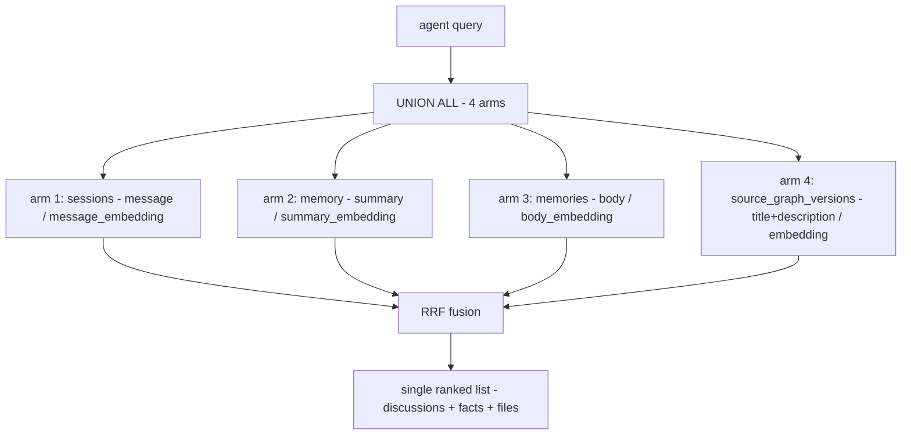

# Recall Integration — Technical Specification

> Category: Data | Version: 1.0 | Date: June 2026 | Status: Draft

The SQL contract for the Hivenectar recall arm: the four-arm `UNION ALL`, the latest-per-nectar subquery that collapses the version chain to one row per current file, the `describe_status = 'described'` filter, the tenancy scoping, the per-arm BM25+vector scoring, and the reciprocal-rank-fusion merge that produces a single ranked list.

**Related:**
- [`../recall-integration.md`](../recall-integration.md)
- [`recall-integration-introduction-and-theory.md`](recall-integration-introduction-and-theory.md)
- [`recall-integration-ecosystem-story-arc.md`](recall-integration-ecosystem-story-arc.md)
- [`recall-integration-user-stories.md`](recall-integration-user-stories.md)
- [`recall-integration-conclusion-and-deliverables.md`](recall-integration-conclusion-and-deliverables.md)
- [`../source-graph-schema.md`](../source-graph-schema.md)
- [`../../ai/enricher-and-llm-model.md`](../../ai/enricher-and-llm-model.md)

---

## Why this exists

Recall is a contract before it is a query. The agent, the harness, and the operator all depend on the Hivenectar arm returning a predictable shape: one row per *current described* file, scoped to the caller's tenancy, scored by both lexical and vector similarity, and fused into the same ranked list as the three pre-existing arms. This document is the authoritative statement of that contract — the SQL the arm contributes, the subquery that makes it return one row per file, the filter that keeps undescribed rows out, and the fusion that brings it all together. The conceptual motivation is in [`recall-integration-introduction-and-theory.md`](recall-integration-introduction-and-theory.md); the end-to-end trace is in [`recall-integration-ecosystem-story-arc.md`](recall-integration-ecosystem-story-arc.md).

---

## The SQL-guard requirement

Every SQL literal in the recall arm is bound through the daemon's storage-layer helpers — `sqlStr`, `sqlLike`, and their siblings — never string-interpolated. This is the SQL safety floor stated in the sibling Honeycomb daemon's `AGENTS.md` and implemented in its `src/daemon/storage/sql.ts`. The SQL in this document is written with named parameters (`:org`, `:pattern`, `:k`) for readability; the implementation substitutes each parameter through the appropriate helper so that a tenancy value, a query pattern, or an identifier can never become an injection vector.

This document does not reproduce the helpers' internals (they live in the sibling repo). It states the requirement as a hard contract on the arm: any engineer adding or modifying the recall SELECT must route every dynamic value through the storage-layer SQL guards (`sqlStr`, `sqlLike`, and siblings). A recall query that concatenates user input into SQL is a defect by definition.

---

## The Hivenectar recall arm (annotated)

The arm contributes a row per matching file to the recall union. The SELECT below is the lexical (BM25) arm, annotated clause by clause. The source-of-truth version is in [`../recall-integration.md`](../recall-integration.md); the column catalog it reads from is in [`../source-graph-schema.md`](../source-graph-schema.md).

```sql
SELECT
  'hivenectar'              AS source,     -- tag the arm for fusion + agent display
  v.nectar                  AS id,         -- stable file identity (ULID)
  v.path                    AS path,       -- repo-relative path at this version
  v.title                   AS title,      -- LLM-minted, <=80 chars
  v.description             AS body,       -- fused into BM25; also shown to the agent
  v.concepts                AS concepts,   -- JSON array of concept tags
  v.content_hash            AS content_hash
FROM source_graph_versions v
INNER JOIN (
  -- (1) latest-per-nectar subquery: collapse the version chain to one row per file
  SELECT nectar, MAX(seq) AS max_seq
  FROM source_graph_versions
  WHERE describe_status = 'described'        -- (2) exclude pending/failed/skipped
    AND org_id       = :org                  -- (3) tenancy scoping, applied inside
    AND workspace_id = :workspace            --     the subquery so MAX(seq) is scoped
    AND project_id   = :project              --     to this project's described rows
  GROUP BY nectar
) latest ON v.nectar = latest.nectar AND v.seq = latest.max_seq
WHERE (                                     -- (4) lexical filter, BM25 over title+description
  v.title       ILIKE :pattern               --     :pattern is sqlLike-guarded
  OR v.description ILIKE :pattern
  OR v.concepts  ILIKE :concept_pattern
)
ORDER BY bm25_score DESC
LIMIT :k;                                    -- top-K, same K as every other arm
```

Four clauses do the load-bearing work, and each is worth understanding precisely.

### (1) The latest-per-nectar subquery

`source_graph_versions` is append-only: one row per observed state of a file, keyed by `(nectar, content_hash)` with a monotonic `seq` counter per nectar. Without collapsing, a file edited 50 times would contribute 50 near-duplicate rows to recall and dominate the ranked list. The subquery picks `MAX(seq)` per nectar, scoped to described rows in the caller's tenancy, and the outer query joins back on `(nectar, seq)` to surface exactly that row.

The `seq` column exists for this purpose. It lets "latest version" be `MAX(seq)` without parsing timestamps or relying on `content_hash` ordering, both of which would be fragile. "Current state of file X" is, by definition, the row where `seq` equals the maximum `seq` for X's nectar.

### (2) The `describe_status = 'described'` filter

The filter sits *inside* the subquery, not on the outer query. This is deliberate: `MAX(seq)` must be computed over described rows only, otherwise a pending row with a higher `seq` (a fresh edit not yet enriched) would win `MAX(seq)` and then be filtered out, leaving the arm with no row for that nectar at all. Scoping the filter to the subquery guarantees that the latest *described* version is the one that surfaces.

Rows excluded by the filter are `pending` (enricher has not reached them), `failed` (enricher tried and the LLM call failed), `skipped-too-large`, and `skipped-binary`. An undescribed file does not appear in semantic recall. It may still appear in the structural CodeGraph's `find/` results, keyed by symbol name — the two layers are independent.

### (3) Tenancy scoping

`org_id`, `workspace_id`, and `project_id` are applied inside the subquery, alongside the describe filter. Hivenectar's tenancy model is org → workspace → project, with no `agent_id` and no `visibility` column, because file identity is cross-agent by nature: every agent working in the same project sees the same file descriptions. The columns are denormalized onto `source_graph_versions` from `source_graph` precisely so the versions table is queryable in isolation for recall.

### (4) The lexical filter

The BM25 arm scores over `title`, `description`, and `concepts`. `title` and `description` are the LLM-minted text; `concepts` is a JSON-encoded string array (`'["auth","session","jwt"]'`) whose ILIKE match lets a concept-tagged file surface even when the query term is a tag rather than prose. `:pattern` and `:concept_pattern` are `sqlLike`-bound.

---

## The vector arm

The vector arm is structurally analogous to the lexical arm, substituting vector similarity for the BM25/ILIKE filter. The same latest-per-nectar subquery and the same tenancy scoping apply; the difference is the scoring predicate.

```sql
SELECT
  'hivenectar' AS source,
  v.nectar     AS id,
  v.path       AS path,
  v.title      AS title,
  v.description AS body,
  v.concepts   AS concepts,
  v.content_hash AS content_hash
FROM source_graph_versions v
INNER JOIN (
  SELECT nectar, MAX(seq) AS max_seq
  FROM source_graph_versions
  WHERE describe_status = 'described'
    AND org_id       = :org
    AND workspace_id = :workspace
    AND project_id   = :project
  GROUP BY nectar
) latest ON v.nectar = latest.nectar AND v.seq = latest.max_seq
WHERE v.embedding IS NOT NULL              -- gate: only rows the enricher embedded
ORDER BY v.embedding <#> :query_vector     -- cosine distance, 768-dim
LIMIT :k;
```

The `<#>` operator is cosine distance over the 768-dim `embedding` column. The dimensionality matches `sessions.message_embedding` and `memory.summary_embedding` deliberately — the hybrid recall pipeline's vector index expects consistent dimensionality across the tables it unions over. The embedding is computed over `title + ' ' + description` by the embeddings daemon, documented in [`../../ai/enricher-and-llm-model.md`](../../ai/enricher-and-llm-model.md).

### Graceful BM25-only fallback

When embeddings are off — the optional embeddings daemon is not installed, or it failed to warm up — the `embedding` column is NULL and the vector arm returns nothing. Recall silently falls back to BM25 over `title` and `description`. This is the same fallback every other recall arm uses; there is no error, no quality cliff, just lexical-only recall over descriptions until embeddings are available. The arm stays alive on its lexical scoring alone.

---

## The four-arm UNION ALL

The Hivenectar arm is the fourth arm of a `UNION ALL` whose first three arms predate Hivenectar. Each arm returns its top-K rows with a score; the union is fused into one ranked list.



Each arm is independently scoped by tenancy before scoring. The sessions, memory, and memories arms carry `agent_id` and `visibility` in addition to the org/workspace/project triple; the Hivenectar arm carries only the triple, because file identity is cross-agent. The union does not reconcile these scoping differences — each arm applies the scoping its schema requires, and the union combines whatever survives.

---

## Per-arm BM25 + vector scoring

Every arm — not just Hivenectar's — runs both a BM25 lexical path and a 768-dim vector path. The two paths are not mutually exclusive: an arm contributes rows from whichever path matches, and a row that matches both lexical and vector is a stronger hit than one that matches only one. The per-arm scoring is what produces the rank order that RRF then fuses.

| Arm | BM25 over | Vector over |
|---|---|---|
| Sessions | `message` (JSONB) | `message_embedding` |
| Memory | `summary` | `summary_embedding` |
| Memories | `body` | `body_embedding` |
| Hivenectar | `title + description + concepts` | `embedding` |

The score distributions differ across arms — sessions JSONB is noisy, Hivenectar descriptions are clean and short — and this is exactly why fusion is rank-based rather than score-based. RRF consumes each arm's *rank*, not its raw score, so the arms contribute on equal footing regardless of distribution.

---

## RRF fusion and the weighting strategy

Reciprocal rank fusion merges the per-arm ranked lists into one. Each row's fused score is the sum, over every arm that returned it, of `multiplier / (k + rank)`, where `k` is the RRF constant (shared across arms) and `multiplier` is a per-arm weight. A row that ranks first in an arm contributes `multiplier / (k + 1)`; a row that ranks tenth contributes `multiplier / (k + 10)`.

RRF is rank-based by design, and that is the property that makes the four-arm union tractable. A Hivenectar hit at rank 1 contributes the same fused weight as a sessions hit at rank 1, even though their raw BM25/vector scores are computed over different text and live on different scales. The fusion does not need the arms to agree on what a "score" means — it only needs each arm to produce a rank order.

### The default multiplier

Hivenectar ships with a **multiplier of 1.0** (equal weighting) as the default. The theory is that a file-description hit is exactly as actionable as a session-trace hit: they answer different aspects of the same question, and neither is privileged. An operator who finds Hivenectar hits dominating recall at the expense of session memory — a possible failure mode if descriptions are written too keyword-stuffed — can lower the multiplier:

```json
{
  "recall": {
    "hivenectar_rrf_multiplier": 0.7
  }
}
```

Raising the multiplier is also supported but rarely useful: if Hivenectar is the dominant signal, the operator probably wants to investigate why session memory is thin, not amplify code descriptions to compensate.

### Dedup at fusion, not at the arm

The Hivenectar arm does not deduplicate against CodeGraph `find/` hits. If `src/auth/login.ts` appears in both a Hivenectar recall hit and a CodeGraph structural hit, both are returned — the recall layer has no view into the CodeGraph's results. Dedup at the recall layer would lose the structural context the CodeGraph hit carries (symbol names, line numbers). Recognizing the two as the same file is the agent's (or the harness prompt assembler's) job.

Within the Hivenectar arm, dedup is handled by the latest-per-nectar subquery: one row per nectar, never one row per version. There is no cross-nectar dedup because two different nectars are two different files, even if their current content is identical (the copy-paste case, recorded via `derived_from_nectar`).

---

## What the contract guarantees

The SQL contract guarantees four properties that the rest of the deep-dive depends on:

1. **One row per current described file.** The latest-per-nectar subquery with the describe filter inside it ensures exactly the most recent described version of each nectar participates.
2. **Tenancy isolation.** Org/workspace/project scoping is applied inside the subquery, so a cross-tenant nectar can never surface.
3. **Graceful degradation.** The vector arm gates on `embedding IS NOT NULL`; when embeddings are off, the lexical arm carries recall alone with no error.
4. **Composable fusion.** The arm produces a rank order consumable by the same RRF that fuses the other three, with a tunable per-arm multiplier defaulting to equal weighting.

The contract does *not* guarantee recency of description (a query mid-brood sees whatever has been described so far), completeness (undescribed files are absent from semantic recall though present in the structural graph), or cross-layer dedup (the agent reconciles Hivenectar and CodeGraph hits for the same file). These non-guarantees are deliberate and are traced end-to-end in [`recall-integration-ecosystem-story-arc.md`](recall-integration-ecosystem-story-arc.md).
