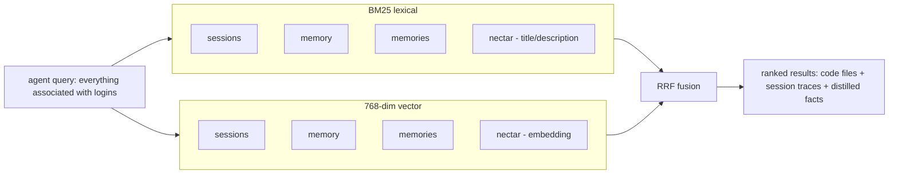

# Recall Integration

> Category: Data | Version: 1.0 | Date: June 2026 | Status: Draft

How Nectar's `hive_graph_versions` table plugs into the existing Honeycomb hybrid recall pipeline: the guarded hive-graph arm, the latest-per-nectar subquery, the weighting and dedup strategy against session/memory/skill hits, and the structural-vs-semantic complementarity that makes recall stronger with both layers than with either alone.

**Related:**
- [`../overview.md`](../overview.md)
- [`hive-graph-schema.md`](hive-graph-schema.md)
- [`portable-registry.md`](portable-registry.md)
- [`../ai/enricher-and-llm-model.md`](../ai/enricher-and-llm-model.md)
- [`../architecture/ADR-0003-three-daemon-topology-and-hive-portal.md`](../architecture/ADR-0003-three-daemon-topology-and-hive-portal.md)

---

## What recall looks like before Nectar

The existing Honeycomb hybrid recall pipeline (documented in the main corpus at `ai/retrieval.md` and `ai/hybrid-sql-vector-rationale.md`) answers an agent query by running BM25 lexical and 768-dim vector search over three guarded arms:

1. **`sessions`** — raw conversation events. `message` (JSONB) is the body; `message_embedding` is the vector.
2. **`memory`** — wiki summaries and VFS rows. `summary` is the body; `summary_embedding` is the vector.
3. **`memories`** — distilled facts from the pipeline. `body` is the text; `body_embedding` is the vector.

Each arm returns its top-K matches with a score; the results are fused by reciprocal rank fusion (RRF — see ADR-0001 in the main corpus) into a single ranked list, scoped by `org_id`/`workspace_id`/`project_id`/`agent_id`/`visibility` as each arm's schema requires. The result tells the agent *what was discussed and what was decided* about the query topic.

What it does not tell the agent is *what files in the codebase implement the query topic*. The CodeGraph's structural query surface (`find/`, `query/`, `show/`) answers that for symbol-shaped queries (`find/authenticate`), but not for semantic queries ("where is the login logic") — that is the gap Nectar fills.

---

## The added guarded arm

Nectar adds a fourth guarded arm to recall: `hive_graph_versions`, filtered to the latest described version per nectar. The arm contributes a row per matching file, scored by BM25 over `title + description` and vector similarity over `embedding`.

```sql
-- The Nectar recall arm (simplified; the real query is sqlStr/sqlLike-guarded
-- per the SQL safety floor in AGENTS.md, and uses the helpers in src/daemon/storage/sql.ts)
SELECT
  'nectar' AS source,
  v.nectar     AS id,
  v.path       AS path,
  v.title      AS title,
  v.description AS body,
  v.concepts   AS concepts,
  v.content_hash AS content_hash
FROM hive_graph_versions v
INNER JOIN (
  SELECT nectar, MAX(seq) AS max_seq
  FROM hive_graph_versions
  WHERE describe_status = 'described'
    AND org_id       = :org
    AND workspace_id = :workspace
    AND project_id   = :project
  GROUP BY nectar
) latest ON v.nectar = latest.nectar AND v.seq = latest.max_seq
WHERE (
  v.title       ILIKE :pattern
  OR v.description ILIKE :pattern
  OR v.concepts  ILIKE :concept_pattern
)
ORDER BY bm25_score DESC
LIMIT :k;
```

The vector arm is analogous, substituting `<#>` (cosine distance) over `embedding` for the BM25/ILIKE filter, gated on `embedding IS NOT NULL`. When embeddings are off, only the BM25 arm runs — same silent-fallback behavior as every other recall arm in Honeycomb.

The guard is load-bearing. If the Nectar tables are not present in a fresh workspace, this arm returns empty and the sessions, memory, and memories arms still answer. The implementation therefore mirrors Honeycomb's per-arm guarded-query pattern (`buildHiveGraphVersionsArmSql` beside the existing arm builders), rather than refactoring recall into one monolithic query.

The `latest-per-nectar` subquery is what makes recall return one row per *current* file rather than one row per *version*. Without it, a file edited 50 times would dominate recall with 50 near-duplicate rows; with it, recall sees only the most recent described state.

---

## Fusion with the other arms

The Nectar arm feeds into the same RRF fusion as the other three. RRF is rank-based, not score-based, so the four arms contribute equally on a per-row basis: a Nectar hit at rank 1 contributes the same RRF weight as a sessions hit at rank 1, regardless of how their raw BM25/vector scores compare. This is why the four arms can have different score distributions (sessions JSONB is noisy; Nectar descriptions are clean and short) without one drowning the others out.



The agent receives a single ranked list where a code-file description ("refreshes JWT claims on each authenticated request, part of the login session lifecycle") sits alongside session traces ("we discussed the JWT refresh bug on Tuesday") and distilled facts ("JWT refresh has a 5-minute skew tolerance"). The agent can then decide whether to read the code file, replay the session, or trust the fact — it has all three signals in one place.

---

## Weighting and the Nectar multiplier

RRF is unweighted by default (each arm's rank-1 contributes `1 / (k + 1)` with the same `k`), but the recall layer supports per-arm multipliers for cases where one arm should count more or less. Nectar ships with a **multiplier of 1.0** (equal weighting) as the default, on the theory that a file-description hit is exactly as actionable as a session-trace hit — they answer different aspects of the same question.

Operators who find Nectar hits dominating recall at the expense of session memory (a possible failure mode if descriptions are written to be too keyword-stuffed) can lower the multiplier via `~/.honeycomb/nectar.json`:

```json
{
  "recall": {
    "nectar_rrf_multiplier": 0.7
  }
}
```

The reverse (raising the multiplier) is also supported but rarely useful — if Nectar is the dominant signal, the operator probably wants to investigate why session memory is thin, not amplify code descriptions to compensate.

---

## Structural-vs-semantic complementarity in practice

The value of Nectar alongside the structural CodeGraph is clearest in a worked example. Consider the query *"everything associated with logins"* against a typical Honeycomb-shaped codebase:

| Source | What it returns | Quality |
|---|---|---|
| **CodeGraph `find/login`** | `src/auth/login.ts` (functions named `login`, `loginUser`), `src/api/routes/login.ts` | Exact, but misses anything not named "login" |
| **Nectar recall** | `src/auth/login.ts` ("user login entry point, validates credentials and starts a session"), `src/middleware/session-refresh.ts` ("refreshes JWT claims on each authenticated request, part of the login session lifecycle"), `src/lib/jwt.ts` ("JWT issue/verify, used by login and session-refresh"), `src/api/routes/logout.ts` ("ends a login session, clears refresh token") | Broader, surfaces files by *function* not *name* |
| **Sessions recall** | Tuesday's debugging session about the login skew bug | What was discussed, not what exists |

The structural hit (`find/login`) finds the files with "login" in their symbol names. The semantic hit (`session-refresh.ts`, `jwt.ts`, `logout.ts`) finds the files that *participate in* login without being named after it. The session hit finds the human discussion. Together they give the agent a complete picture; separately each is a blind spot.

The two are not redundant. The CodeGraph cannot find `session-refresh.ts` because no symbol in it is named `login*`. Nectar cannot tell you that `login.ts:14` calls `verifyJwt` (a structural edge) — it can only tell you that `login.ts` is *about* login. The agent uses both: Nectar to discover which files matter, the CodeGraph to navigate within and between them.

---

## What recall does not do with Nectar

- **It does not return undescribed rows.** The `describe_status = 'described'` filter excludes pending, failed, and skipped rows. A file that was never described (brooding not yet reached it, or it was skipped as binary/too-large) does not appear in semantic recall. It may still appear in the structural CodeGraph's `find/` results, keyed by symbol name.
- **It does not deduplicate against CodeGraph hits.** If `src/auth/login.ts` appears in both a Nectar recall hit and a CodeGraph `find/login` hit, both are returned. The agent (or the harness prompt assembler) is responsible for recognizing them as the same file. Dedup at the recall layer would lose the structural context the CodeGraph hit carries (symbol names, line numbers).
- **It does not return historical versions.** Only the latest described version per nectar participates in recall. A prior version of a file (before a major refactor) is in the version chain as history but not in recall. This is deliberate: recall serves the current question, not archaeology.
- **It does not run during brooding's LLM calls.** Recall reads Deep Lake; brooding writes Deep Lake; the two proceed concurrently with no coordination. A query mid-brood sees whatever has been described so far.

---

## The fresh-clone and team-share path

Because `hive_graph_versions` is a Deep Lake table with tenancy columns, it cloud-syncs the same way every other Honeycomb table does. A teammate who clones the repo and runs `nectar daemon` (registered with doctor, per ADR-0003) for the first time:

1. Pulls the workspace's `hive_graph_versions` rows from Deep Lake (the team-share path documented in the main corpus's `collaboration/` domain).
2. Re-derives the local `.honeycomb/nectars.json` projection from the pulled rows (or inherits the committed projection if present — see `portable-registry.md`).
3. Immediately has working semantic recall over the codebase, without brooding, because every file's content hash matches a pulled version row.

This is the property that makes Nectar a team asset, not a per-developer index. The brooding cost is paid once by whoever broods first; every teammate thereafter inherits the descriptions through Deep Lake sync plus the projection lockfile.
