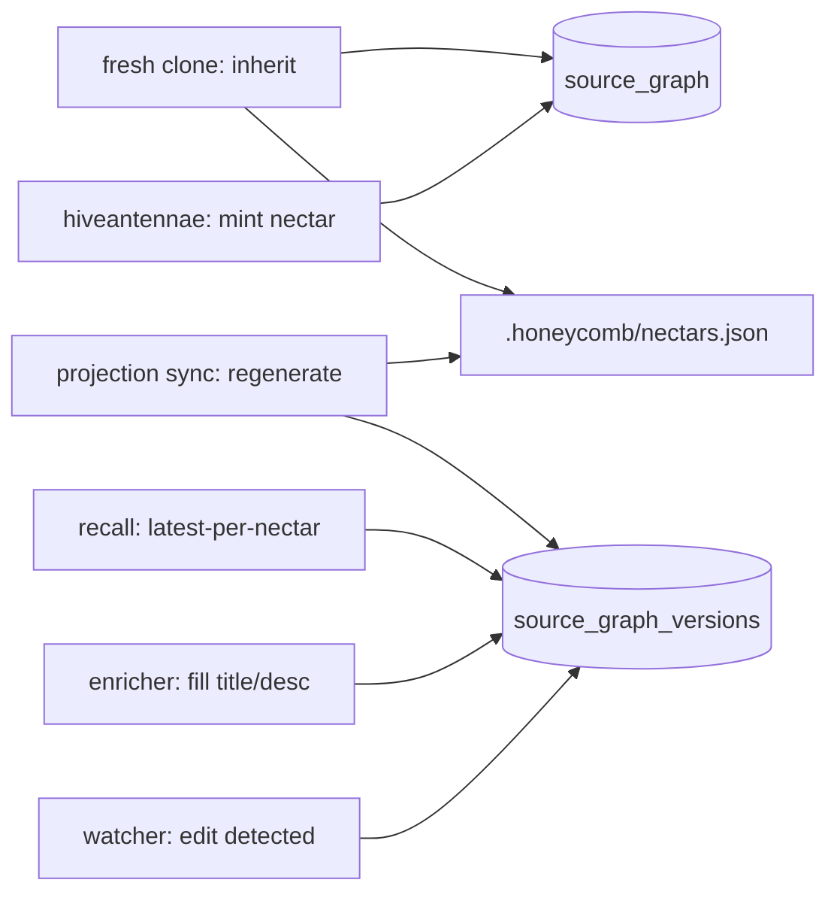

# Source Graph: Conclusion and Deliverables

> Category: Data | Version: 1.0 | Date: June 2026 | Status: Draft

What the two-table schema delivers, restated as concrete outcomes and hard contracts, with forward pointers into the rest of the corpus for the reader who needs the why, the algorithm, or the recall wiring.

**Related:**
- [`../source-graph-schema.md`](../source-graph-schema.md)
- [`source-graph-introduction-and-theory.md`](source-graph-introduction-and-theory.md)
- [`source-graph-technical-specification.md`](source-graph-technical-specification.md)
- [`source-graph-ecosystem-story-arc.md`](source-graph-ecosystem-story-arc.md)
- [`source-graph-user-stories.md`](source-graph-user-stories.md)
- [`../portable-registry.md`](../portable-registry.md)
- [`../recall-integration.md`](../recall-integration.md)
- [`../../architecture/ADR-0001-minted-nectar-over-source-embedded-serial.md`](../../architecture/ADR-0001-minted-nectar-over-source-embedded-serial.md)
- [`../../ai/identity-and-reassociation.md`](../../ai/identity-and-reassociation.md)

---

## The deliverable, in one paragraph

Two Deep Lake tables implement the identity+version split that makes Hivenectar's stable identity possible. `source_graph` is one row per logical file, keyed by an immutable ULID nectar, carrying provenance and tenancy and nothing else. `source_graph_versions` is append-only, keyed by `(nectar, content_hash)`, carrying every observed state of every file plus the lazily-filled title, description, concepts, and embedding. The two tables together answer the two questions Hivenectar exists to answer cheaply: *"what is the current state of file X"* is the latest version row for its nectar; *"what is the full history of file X"* is all the version rows for its nectar. Both are single-table queries against an append-only chain.

---

## The invariants this schema guarantees

| Invariant | What it means | What breaks if violated |
|---|---|---|
| **Nectar is immutable** | `source_graph.nectar` is set once at minting and never recomputed, re-derived, or reused. | Identity churns per save; history chains corrupt. |
| **Versions are append-only** | Edits append a new `source_graph_versions` row keyed by the new `content_hash`; previous rows are never overwritten. | History is lost; "what did this file look like last week" becomes unanswerable. |
| **Composite key uniqueness** | `(nectar, content_hash)` is unique. Same content under the same nectar is an idempotent no-op; same content under a different nectar is the copy signal. | Copy-paste detection breaks; provenance edges are lost or spuriously created. |
| **`seq` is monotonic per nectar** | "Latest version" is `ORDER BY seq DESC LIMIT 1`, with no timestamp parsing and no reliance on `content_hash` ordering. | "Current state" becomes ambiguous or expensive to compute. |
| **Tenancy is explicit and cross-agent** | `org_id`/`workspace_id`/`project_id` are columns, not partition isolation; there is no `agent_id` or `visibility` column. | Either isolation leaks across projects, or agents in the same project see different file graphs (defeating the point of a shared semantic layer). |
| **Description is nullable until enriched** | `title`/`description`/`embedding` are empty while `describe_status = 'pending'`; recall filters them out. | Recall surfaces empty/garbage rows, or the schema forces eager description (collapsing the lazy pillar). |

---

## The two cheap queries

The schema is shaped so that the two most common operations are trivial.

```sql
-- Current state of file X (given its nectar N):
SELECT * FROM source_graph_versions
WHERE nectar = :N AND describe_status = 'described'
ORDER BY seq DESC LIMIT 1;

-- Full history of file X:
SELECT seq, content_hash, path, title, described_at
FROM source_graph_versions
WHERE nectar = :N
ORDER BY seq ASC;
```

Neither requires a join, a window function, or content-hash parsing. The `seq` counter exists precisely so that "latest" does not depend on timestamp string comparison or hash ordering.

---

## Hard contracts (what the schema forbids)

These are not preferences. Each is a constraint the rest of the system depends on.

1. **No hand-rolled `ALTER`.** Additive schema changes go through `withHeal` against the canonical `ColumnDef` array in the daemon's schema module. A manual `ALTER TABLE` against `source_graph` or `source_graph_versions` desynchronizes the heal pass and produces drift. See the lazy-schema-heal section of [`source-graph-schema.md`](../source-graph-schema.md).
2. **No sidecar store.** All durable state is in Deep Lake. A SQLite mirror, a JSONL log, or a per-file `.meta` cache would drift and become a second source of truth that `rebuild-projection` cannot see. FR-8 forbids it; the schema enforces it by being the only store.
3. **No directory nectars in v1.** Folders are derivable from the union of file paths; a directory-level description can be synthesized on demand from its children. The `kind` column reserves the namespace (`'directory'`) so this can be added later without a schema change, but v1 mints only `kind = 'file'`.
4. **No symbol-level nectars in v1.** Symbol identity is the CodeGraph's job (and, optionally, an LSP layer's). Symbol-level nectars would multiply row counts 10–100× and duplicate what the CodeGraph already extracts structurally. Deferred to v2 pending measured need.
5. **No edit-coalesced versioning at the schema level.** Every meaningfully distinct content state appends a row. Debouncing happens at the watcher intake, not in the database, so the schema sees one row per *distinct* state rather than one per *keystroke-save*.

---

## Composition with the rest of Hivenectar

The schema is the substrate four other subsystems read and write:



- **Minting** ([`../../ai/identity-and-reassociation.md`](../../ai/identity-and-reassociation.md)) writes the `source_graph` row and the initial `source_graph_versions` row.
- **The enricher** ([`../../ai/enricher-and-llm-model.md`](../../ai/enricher-and-llm-model.md)) updates `source_graph_versions` rows from `describe_status = 'pending'` to `'described'`, filling the title/description/embedding columns.
- **Recall** ([`../recall-integration.md`](../recall-integration.md)) reads the latest described version per nectar through a `UNION ALL` arm.
- **The projection** ([`../portable-registry.md`](../portable-registry.md)) is regenerated from the versions table and, on a fresh clone, writes inherited rows back into both tables.

---

## What success looks like

The schema has succeeded when all of the following are simultaneously true:

- A file's nectar is unchanged across an edit, a rename, a move, and a copy-paste (the copy gets a fresh nectar with a `derived_from` pointer).
- "Current state" and "full history" are both single-table queries returning in milliseconds.
- A daemon boot after a column addition converges via `withHeal` without manual intervention or data loss.
- Recall returns the same set of files for a given query regardless of which agent in the project issues it (cross-agent visibility holds).
- Deleting `.honeycomb/nectars.json` and running `honeycomb hivenectar rebuild-projection` reproduces a byte-identical file (modulo `generated_at`), proving the versions table is the sole source of truth.

---

## Forward reading

| If you need... | Read... |
|---|---|
| The why behind the two-table split (the conceptual argument) | [`source-graph-introduction-and-theory.md`](source-graph-introduction-and-theory.md) |
| The full DDL, column tables, indexing strategy, heal rule | [`source-graph-technical-specification.md`](source-graph-technical-specification.md) |
| How writes and reads flow through the tables end-to-end | [`source-graph-ecosystem-story-arc.md`](source-graph-ecosystem-story-arc.md) |
| The operator/engineering scope and acceptance criteria | [`source-graph-user-stories.md`](source-graph-user-stories.md) |
| The identity-model decision that forces this schema | [`../../architecture/ADR-0001-minted-nectar-over-source-embedded-serial.md`](../../architecture/ADR-0001-minted-nectar-over-source-embedded-serial.md) |
| The re-association algorithm that writes these rows | [`../../ai/identity-and-reassociation.md`](../../ai/identity-and-reassociation.md) |
| The committed projection regenerated from this schema | [`../portable-registry.md`](../portable-registry.md) |
| The recall arm that reads from this schema | [`../recall-integration.md`](../recall-integration.md) |

The schema is the load-bearing substrate. Every other Hivenectar component is a producer or consumer of these two tables.
