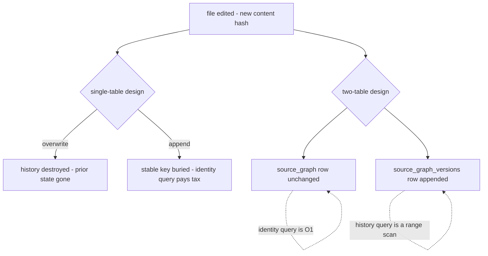

# Source Graph: Introduction and Theory

> Category: Data | Version: 1.0 | Date: June 2026 | Status: Draft

The conceptual essay behind Hivenectar's `source_graph` / `source_graph_versions` split: why a single table cannot cleanly represent both file identity and file content history, why the identity anchor is kept distinct from the content hash, and why file identity is cross-agent by nature.

**Related:**
- [`../source-graph-schema.md`](../source-graph-schema.md)
- [`source-graph-technical-specification.md`](source-graph-technical-specification.md)
- [`source-graph-ecosystem-story-arc.md`](source-graph-ecosystem-story-arc.md)
- [`../overview.md`](../../overview.md)
- [`../architecture/ADR-0001-minted-nectar-over-source-embedded-serial.md`](../../architecture/ADR-0001-minted-nectar-over-source-embedded-serial.md)
- [`../ai/identity-and-reassociation.md`](../../ai/identity-and-reassociation.md)

---

## Why this split exists

A file has two natures, and they pull in opposite directions. The file's *identity* — the fact that "this is the same logical file I saw yesterday" — is stable. It survives edits, renames, moves, and copy-paste. The file's *content and its description* change constantly: every save produces new bytes, and the LLM description eventually drifts to match. One wants to hold still forever; the other wants to change on every keystroke. A schema that tries to put both into the same row is forced to pick which nature wins, and either choice loses something.

This is the reason Hivenectar uses two tables. `source_graph` holds the stable part: one row per logical file, keyed by a daemon-minted ULID nectar, carrying identity and provenance and nothing that changes per edit. `source_graph_versions` holds the moving part: one row per observed state of a file, keyed by `(nectar, content_hash)`, carrying the path, the metadata, and the lazily-filled description. The identity row answers "what is this file"; the version rows answer "what does it look like right now, and what did it look like before."

The split is not an optimization or a normalization. It is a load-bearing structural decision. Every downstream behavior — append-only history, the latest-per-nectar recall query, copy-paste as a first-class provenance edge, the regenerable projection — depends on identity and version being physically separate.

---

## The collapsing forces: why one table fails

Consider the single-table alternative: one row per file, with the identity, the path, the content, and the description all in the same columns. The moment a file is edited, that row must change. There are only two ways to handle the change, and both break something.

The first option is **overwrite**: update the row in place. The new content hash replaces the old; the new description replaces the old. This keeps the stable identity key intact — the row's primary key does not change — but it destroys history. The previous content, the previous path, and the previous description are gone. There is no way to ask "what did this file look like before the refactor," no way to render an Obsidian-style interlink from a prior state, and no way to detect that a file used to live at a different path. Overwrite optimizes for the present and amputates the past.

The second option is **append**: on every edit, insert a new row rather than updating the old one. This preserves history — every observed state is present as its own row. But now the stable-identity key is buried. "Which row represents the current truth about file X" becomes a `GROUP BY nectar ORDER BY something DESC LIMIT 1` subquery on every read, and the primary key can no longer be the nectar alone (many rows share a nectar). The single table has quietly become a versions table wearing an identity table's clothes, with the identity query paying a tax on every access.



The two-table design pays neither cost. The identity row in `source_graph` is never overwritten on a content edit — its `nectar`, `kind`, `created_at`, `derived_from_nectar`, and `fork_content_hash` are immutable or write-once, and only `last_update_date` moves. The version row in `source_graph_versions` is appended, never updated, so history is preserved by construction. The identity query ("who is file X") is a direct primary-key lookup on `source_graph`; the history query ("what has file X looked like") is a range scan on `source_graph_versions` filtered by nectar. Each table serves the query it was shaped for.

---

## The git analogy: commit, tree, blob

The identity-plus-version pattern is not novel to Hivenectar. It is the internal structure of git, and git is the most heavily used versioned file system in existence. A git commit object is a stable anchor that points at a tree, which points at content-addressed blobs. The commit's identity (its SHA-1 hash, in git's case) is independent of the blob's content hash: the same blob can participate in many commits, and editing a file produces a new blob without producing a new commit-identity for the logical file's history.

Mapping this to Hivenectar's two tables:

- The **`source_graph` row** is the commit-equivalent: a stable identity anchor for a logical file, carrying provenance (the `derived_from_nectar` and `fork_content_hash` columns are Hivenectar's equivalent of git's parent-pointer — they record that this file was forked from another).
- The **`source_graph_versions` row** is the blob-equivalent: content-addressed by `content_hash`, append-only, and the thing that actually carries the bytes' fingerprint plus the human description.

The analogy is not exact — git keys commits by content, Hivenectar keys identity by a minted ULID (see the ADR for why content-derived identity churns per edit and is rejected as the identity key). But the *separation* is identical: a stable anchor that does not move, distinct from content-addressed versions that do.

---

## The Aura parallel: identity anchor vs content hash

The closest intellectual predecessor to this split is the Aura project, documented in the prior-art crosswalk and cited directly in `ADR-0001`. Aura's model, stated in its own documentation, is that a file (or function) needs two identifiers that serve two different purposes: an **identity anchor** that persists across edits to keep history continuous, and a **content hash** that changes per edit to detect duplication and enable delta indexing. Aura's own phrasing — "neither alone is enough" — is the thesis of this document.

Pure content-hash identity (the rejected Option B in the ADR) is the failure mode Aura diagnosed and Hivenectar avoids. If identity *is* the content hash, then a file saved twice has two different identities. The history chain fragments: the pre-edit file and the post-edit file are treated as unrelated, and every "what changed" question becomes a fuzzy content-diff instead of a structured version walk. Content hash is correct as a *version* key — it is what `source_graph_versions` uses for the second half of its composite key — but it is wrong as an *identity* key.

Hivenectar's synthesis is exactly Aura's, applied at file granularity: a minted ULID nectar as the persistent identity anchor (the `source_graph` primary key), and a sha256 content hash as the per-version content key (part of the `source_graph_versions` composite key). The nectar holds the history together; the content hash distinguishes one observed state from the next.

---

## The Mimir parallel: identity is explicit, not heuristic

A second thread in the lineage is Mimir, whose organizing principle is that identity should be *explicit and minted*, not *heuristic and derived*. Mimir keeps a stable `SymbolId` distinct from its append-only rename history — a symbol knows who it is regardless of what it is currently called, and its name changes are recorded as events rather than overwrites.

Hivenectar applies the same principle at file granularity. The nectar is explicit (minted once by the daemon, never recomputed from file properties) and the version chain is append-only (a move or rename appends a version row with a new `path`, it does not overwrite the old path). The parallel is exact: explicit identity, append-only history, the two physically separated.

The reason both Aura and Mimir — and git, and every IDE's "same file I had open" tracker — converge on this pattern is that it is the only pattern that satisfies the two competing requirements simultaneously. Anything that derives identity from content fails stability-across-edits. Anything that derives identity from path fails stability-across-moves. Anything that derives identity from a source-embedded marker fails copy-paste and universal file-type coverage (see the ADR). Minting identity once and keeping it physically separate from the changing attributes is the structural commitment that makes the rest of the system work.

---

## Why file identity is cross-agent by nature

The `source_graph` and `source_graph_versions` tables carry explicit tenancy columns — `org_id`, `workspace_id`, `project_id` — but they deliberately omit two columns that appear on the `sessions` and `memory` tables: `agent_id` and `visibility`. This omission is not an oversight. It reflects a structural fact about what file identity means.

A session is an agent's private conversation; a memory may be scoped to an agent's working set. Both are *owned* by an agent, and the `agent_id`/`visibility` columns encode that ownership so recall can enforce it. A file is not owned by any agent. Every agent and every harness working in the same project reads and writes the same source tree, and the question "what does `src/auth/login.ts` mean" has the same answer regardless of which agent is asking. File identity and file description are **shared facts about a shared artifact**, not per-agent observations of a private artifact.

```mermaid
flowchart LR
    subgraph perAgent[per-agent state - sessions and memory]
        s1["session - agent A"]:::perAgent
        s2["session - agent B"]:::perAgent
        m1["memory - agent A"]:::perAgent
    end
    subgraph shared[shared artifact - the source tree]
        file["src/auth/login.ts"]
        graph["one source_graph row"]
        versions["one version chain"]
        file --> graph
        file --> versions
    end
    s1 -. reads .-> shared
    s2 -. reads .-> shared
    m1 -. reads .-> shared
```

This is why isolation for Hivenectar is org→workspace→project, full stop. A team sharing a workspace (the normal Honeycomb collaboration model) shares a single Hivenectar graph per project. A new teammate's `git clone` and `honeycomb daemon` boot pulls the cloud-synced `source_graph_versions` rows for the workspace and inherits the descriptions, the same way the CodeGraph's `pullSnapshot` works. There is no per-agent view of the file graph because there is no per-agent version of the files themselves.

The contrast with the CodeGraph's `codebase` table is instructive. The `codebase` table — the CodeGraph's cloud-sync target — also carries explicit tenancy columns and also omits `agent_id`, for the same reason: the structural graph of symbols and edges is a shared fact about shared source. Hivenectar mirrors this precisely. The divergence from `sessions`/`memory`, which *do* carry `agent_id` and `visibility`, is the tell: those tables track private agent state; Hivenectar and the CodeGraph track shared artifact state.

---

## What this split rules out

Committing to the identity-plus-version split carries implications worth naming explicitly, because they constrain what the schema can and cannot cleanly express.

**The split assumes identity is minted, not derived.** Because `source_graph.nectar` is the anchor that ties the version chain together, anything that would make the nectar change-per-edit or change-per-move breaks the chain. This is why the ADR rejects content-hash identity and source-embedded serials: both make the anchor move, which defeats the purpose of having an anchor. The minted ULID is the only identity model consistent with the split.

**The split assumes versions are append-only.** Because `source_graph_versions` is the history, any operation that overwrites a version row corrupts that history. The contract is that every observed state gets its own row, keyed by `(nectar, content_hash)`, and rows are never edited in place (only new rows are added, and only the described-version columns are later filled by the enricher). The `seq` monotonic counter exists precisely so that "latest version" is a clean `ORDER BY seq DESC LIMIT 1` without needing to parse timestamps or rely on content-hash ordering.

**The split assumes the projection is regenerable.** The committed `.honeycomb/nectars.json` file (documented in `portable-registry.md`) is a denormalized view of the *latest described version* per nectar — it is not a copy of either table. If it were a source of truth, it would be a sidecar, which FR-8 forbids. The split makes the projection's regenerability possible: because the version table is append-only and the identity table is the stable anchor, the projection can be thrown away and rebuilt from Deep Lake in a single scan, byte-identical modulo the `generated_at` timestamp.

---

## Forward pointers

The mechanics of the split — the exact columns, the indexing strategy, the lazy-schema-heal rule — are in [`source-graph-technical-specification.md`](source-graph-technical-specification.md). The way the two tables compose end-to-end, from nectar minting through version append through enrich through recall, is traced in [`source-graph-ecosystem-story-arc.md`](source-graph-ecosystem-story-arc.md). The engineering and operator contracts that the split imposes, written as testable user stories, are in [`source-graph-user-stories.md`](source-graph-user-stories.md). The hard invariants and deliverable summary are restated in [`source-graph-conclusion-and-deliverables.md`](source-graph-conclusion-and-deliverables.md).

The identity decision itself — why minted over derived, and why the alternatives were rejected — is recorded in full in [`../architecture/ADR-0001-minted-nectar-over-source-embedded-serial.md`](../../architecture/ADR-0001-minted-nectar-over-source-embedded-serial.md). The re-association algorithm that keeps the minted nectar attached to the file across moves and edits is documented in [`../ai/identity-and-reassociation.md`](../../ai/identity-and-reassociation.md). The canonical column-by-column schema reference remains [`../source-graph-schema.md`](../source-graph-schema.md).
