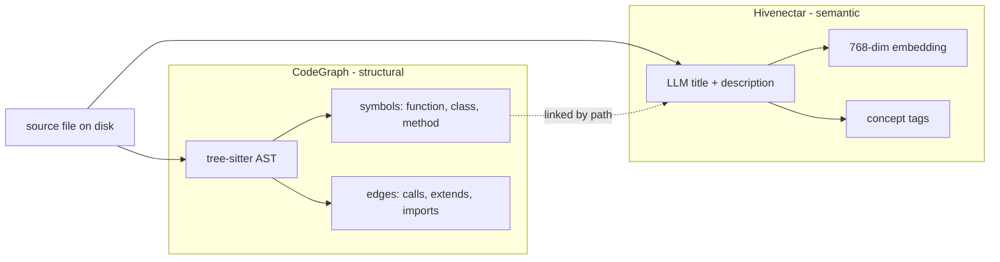
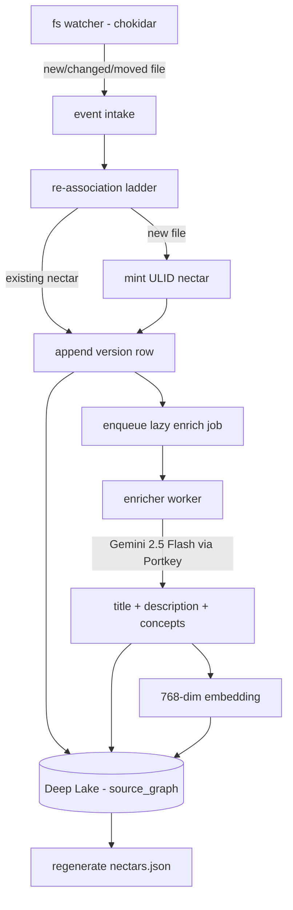

# Hivenectar Overview

> Category: Overview | Version: 1.0 | Date: June 2026 | Status: Draft

What Hivenectar is, the problem it solves that the structural CodeGraph cannot, how it differs from every code-indexing tool in the market today, and where to read next.

**Related:**
- [`architecture/ADR-0001-minted-nectar-over-source-embedded-serial.md`](architecture/ADR-0001-minted-nectar-over-source-embedded-serial.md)
- [`data/source-graph-schema.md`](data/source-graph-schema.md)
- [`ai/identity-and-reassociation.md`](ai/identity-and-reassociation.md)
- [`ai/brooding-pipeline.md`](ai/brooding-pipeline.md)
- [`ai/enricher-and-llm-model.md`](ai/enricher-and-llm-model.md)
- [`data/recall-integration.md`](data/recall-integration.md)
- [`data/portable-registry.md`](data/portable-registry.md)
- [`reference/prior-art-crosswalk.md`](reference/prior-art-crosswalk.md)

---

## What Hivenectar is

Hivenectar gives every file in a project a **stable identity** and a **human-and-machine-readable description**, then serves both back through semantic search so an agent can answer *"give me everything associated with logins"* and receive files scattered across directories that are not named `login-*`. It is a semantic memory layer over the source tree, distinct from but complementary to the existing structural CodeGraph.

The component that builds and maintains this layer is the **hiveantennae** worker, a background service inside the Honeycomb daemon (port 3850). It watches the project directory, mints identity for new files, re-associates identity after moves and edits, and lazily describes file contents through a cheap long-context LLM. The descriptions and their embeddings are persisted in Deep Lake alongside the existing memory tables, so they participate in the same hybrid recall pipeline that already serves session and skill memory.

Hivenectar is named for its function. The hive is the team of agents and engineers working in the repo. The antennae are what sense the environment — what files exist, what they mean, how they relate. A *nectar* is the minted identity record for a single file: small, stable, and the raw material from which richer understanding is produced.

---

## The problem: structural identity is not semantic identity

The existing CodeGraph (see `data/codebase-graph.md` in the main Honeycomb corpus) builds a live graph of files, symbols, and edges from source using tree-sitter. It answers *"who calls this function"*, *"what is the blast radius of changing this symbol"*, and *"walk me through this subsystem"*. It does this by extracting AST facts: `function`, `class`, `calls`, `extends`, `imports`. It never consults an LLM, and that is a deliberate choice — the graph is fast, deterministic, and reproducible byte-for-byte from the same source.

But the CodeGraph cannot answer *"where is the login logic"*. It can find a symbol named `login` or `authenticate`, but it has no concept of what those symbols *mean*, and it has no way to surface a file like `src/middleware/session-refresh.ts` (which implements a critical piece of login behavior) unless the agent already knows to look for it by name. Structural identity is about *how code is wired*. Semantic identity is about *what code is for*. Hivenectar provides the second without compromising the first.

The two layers are **independent** and **complementary**. A file can be in the CodeGraph without a nectar (it has structure but no description yet). A file can have a nectar without being in the CodeGraph (a config file, a markdown doc, a `.env.example` — anything with meaning but no AST). Recall unions over both: structural hits tell the agent *how to navigate*, semantic hits tell the agent *what to look at in the first place*.

---

## The three design pillars

### 1. Stable identity via a daemon-minted nectar, never embedded in source

Every file gets a nectar: a 26-character ULID minted once by the hiveantennae worker and persisted in Deep Lake. The nectar never lives inside the file. It survives edits (because it is not derived from content), renames and moves (because re-association follows the file on disk, not a comment marker), and copy-paste (because the copy gets a fresh nectar with a `derived_from` pointer back to the original). This decision, and the alternatives that were rejected, is recorded in `ADR-0001`.

The rejected alternative — embedding a serial number in a first-line comment of every source file — fails for four concrete reasons documented in the ADR: it collides with the AGPL license header that owns line 1 of every file, it makes line 1 the most conflict-prone line in the repo under multi-author edits, it cannot represent files without a comment syntax (JSON, `.env`, lockfiles, binaries), and it converts copy-paste from a recoverable event into an ambiguous one (two files claiming the same serial).

### 2. Lazy LLM description through a cheap long-context model

Files are described on demand, not eagerly. A nectar can exist for hours or days with a null description; the enricher fills it the first time recall might surface it, or on a debounced watch trigger after a meaningful edit. The model is **Gemini 2.5 Flash** routed through the existing Portkey gateway: ~$0.30 per million input tokens for the ≤200K tier and a true 1M-token context window, which lets the brooder batch 30–50 small files per call instead of one-per-call. The cost math is documented in `ai/brooding-pipeline.md`; the full brooding pass on a 2000-file repository lands under $2.

Long context is the load-bearing property here, not raw cheapness. A model with a 200K window (Haiku, Sonnet) can describe one large file or a few small ones per call; a model with a 1M window can describe an entire directory of small files in a single round-trip, collapsing the per-file cost by an order of magnitude. This is why Hivenectar specifies Gemini 2.5 Flash specifically, not "the cheapest available model."

### 3. Durable state in Deep Lake, with a portable projection

All nectar records, version chains, descriptions, and embeddings live in Deep Lake — the same substrate as `sessions`, `memory`, `memories`, and the CodeGraph's `codebase` table. There is no SQLite sidecar, no JSONL log, no parallel store. Deep Lake is the source of truth, enforced by the same FR-8 rule that governs the rest of Honeycomb: durable state goes in Deep Lake, not in sidecars.

A single committed, reviewable file — `.honeycomb/nectars.json` at the project root — is a **portable projection** of the Deep Lake table: a lockfile, not a sidecar. It is regenerated from Deep Lake on every successful brood or enrich. A fresh `git clone` re-derives identity by matching on-disk content hashes into this file before falling back to the full re-association ladder, so a new checkout inherits descriptions without re-paying the brooding cost. The mechanics are documented in `data/portable-registry.md`.

---

## The hiveantennae worker

hiveantennae is a background worker inside the Honeycomb daemon, parallel to the existing codebase-graph worker. It is not a separate process (it shares the daemon's Deep Lake client, auth, scoping, and observability) and it is not a phase of the graph worker (the graph worker is build-triggered and on-demand; hiveantennae is watch-driven and continuous).

The worker has four operating modes, all documented in their own pages:

| Mode | Trigger | What it does |
|---|---|---|
| **Brooding** | First run, or fresh checkout with no nectars.json | Full scan, batched description, initial projection write |
| **Live watch** | chokidar event during normal editing | Re-associate, append version, enqueue lazy enrich |
| **Cold catch-up** | Daemon boot after offline changes | Walk disk, run re-association ladder, batch-enrich drift |
| **Projection sync** | End of brood/enrich/catch-up | Regenerate `.honeycomb/nectars.json` from Deep Lake |

---

## The data model in one paragraph

Two tables. `source_graph` is one row per logical file, keyed by nectar (ULID primary key), carrying creation time, optional provenance (`derived_from_nectar`, `fork_content_hash`), and a `kind` discriminator reserved for future directory support. `source_graph_versions` is append-only, one row per observed state of a file, keyed by `(nectar, content_hash)`: it carries the current path, extension, size, mtime, and the LLM-minted `title`, `description`, `embedding`, and `concepts` (filled lazily, nullable until the enricher runs). "Current state of file X" is the latest version row for its nectar. "History of file X" is all its version rows. The full DDL is in `data/source-graph-schema.md`.

---

## How recall uses it

Hivenectar plugs into the existing hybrid recall pipeline (BM25 lexical + 768-dim vector, fused by reciprocal rank). The recall query adds a `UNION ALL` arm over `source_graph_versions` (latest-per-nectar, description non-null), weighted to contribute alongside session, memory, and skill hits. An agent query like *"everything associated with logins"* now returns both structural hits (the CodeGraph's `find/authenticate`) and semantic hits (the `session-refresh.ts` middleware described as "refreshes JWT claims on each authenticated request, part of the login session lifecycle"). The wiring is documented in `data/recall-integration.md`.

---

## What Hivenectar is not

- **Not a replacement for the CodeGraph.** The CodeGraph answers structural questions deterministically; Hivenectar answers semantic questions probabilistically. Both ship.
- **Not an LSP.** hiveantennae does not resolve types, run compilers, or produce compiler-accurate references. The structural CodeGraph and any future LSP layer own that.
- **Not eager.** A file can exist in Deep Lake with a null description for as long as nobody asks about it. Description is a cache, not a prerequisite.
- **Not a source mutation.** No file on disk is ever edited by hiveantennae. The only file hiveantennae writes is the committed `.honeycomb/nectars.json` projection, and even that is regenerable.
- **Not a separate database.** Deep Lake is the store. The "SQLite would be faster" instinct is addressed and rejected in `ADR-0001`.

---

## Reading guide

New to Hivenectar: this overview, then [`data/source-graph-schema.md`](data/source-graph-schema.md), then [`ai/identity-and-reassociation.md`](ai/identity-and-reassociation.md).

Understanding the identity decision: [`architecture/ADR-0001-minted-nectar-over-source-embedded-serial.md`](architecture/ADR-0001-minted-nectar-over-source-embedded-serial.md) (read this before arguing about serials-in-source).

Implementing the worker: [`ai/brooding-pipeline.md`](ai/brooding-pipeline.md), [`ai/enricher-and-llm-model.md`](ai/enricher-and-llm-model.md), [`ai/identity-and-reassociation.md`](ai/identity-and-reassociation.md).

Integrating with recall: [`data/recall-integration.md`](data/recall-integration.md), then the main corpus's `ai/retrieval.md` and `ai/hybrid-sql-vector-rationale.md`.

The portable projection and fresh-clone story: [`data/portable-registry.md`](data/portable-registry.md).

How this compares to existing tools: [`reference/prior-art-crosswalk.md`](reference/prior-art-crosswalk.md).

## Expanded deep dives

Each of the nine core documents above has been expanded into a five-document deep-dive (user stories & acceptance criteria, technical specification, introduction & theory, ecosystem story arc, conclusion & deliverables). The deep dives live alongside their source:

| Core document | Deep-dive folder |
|---|---|
| this overview | [`overview/`](overview/) |
| `architecture/ADR-0001...` | [`architecture/identity-model/`](architecture/identity-model/) |
| `ai/identity-and-reassociation.md` | [`ai/identity-deep-dive/`](ai/identity-deep-dive/) |
| `ai/brooding-pipeline.md` | [`ai/brooding-deep-dive/`](ai/brooding-deep-dive/) |
| `ai/enricher-and-llm-model.md` | [`ai/enricher-deep-dive/`](ai/enricher-deep-dive/) |
| `data/source-graph-schema.md` | [`data/source-graph-deep-dive/`](data/source-graph-deep-dive/) |
| `data/portable-registry.md` | [`data/portable-registry-deep-dive/`](data/portable-registry-deep-dive/) |
| `data/recall-integration.md` | [`data/recall-integration-deep-dive/`](data/recall-integration-deep-dive/) |
| `reference/prior-art-crosswalk.md` | [`reference/prior-art-deep-dive/`](reference/prior-art-deep-dive/) |

Customer-facing translations of the above live under [`../public/`](../public/) (overview, guides, FAQs).
