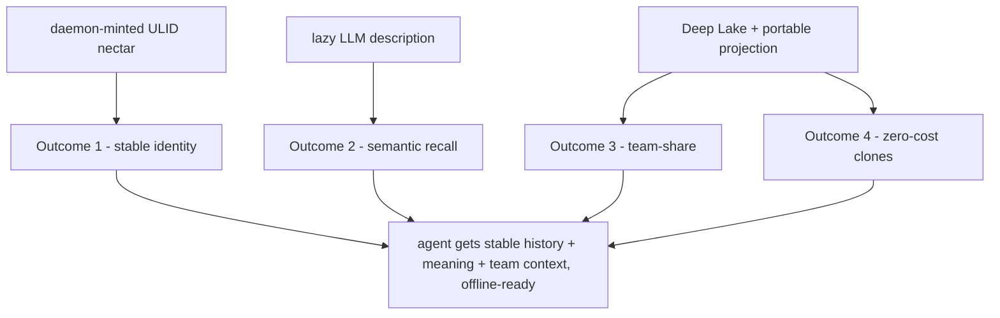

# Conclusion and Deliverables of Nectar

> Category: Overview | Version: 1.0 | Date: June 2026 | Status: Draft

The synthesis: what Nectar delivers restated as concrete outcomes, the non-goals restated as a contract boundary, a "what success looks like" section framed as measurable properties, and a forward pointer that expands the reading guide into the rest of the corpus.

**Related:**
- [`../overview.md`](../overview.md)
- [`overview-introduction-and-theory.md`](overview-introduction-and-theory.md)
- [`overview-technical-specification.md`](overview-technical-specification.md)
- [`overview-ecosystem-story-arc.md`](overview-ecosystem-story-arc.md)
- [`overview-user-stories.md`](overview-user-stories.md)
- [`../architecture/ADR-0001-minted-nectar-over-source-embedded-serial.md`](../architecture/ADR-0001-minted-nectar-over-source-embedded-serial.md)
- [`../architecture/ADR-0003-three-daemon-topology-and-hive-portal.md`](../architecture/ADR-0003-three-daemon-topology-and-hive-portal.md)
- [`../reference/prior-art-crosswalk.md`](../reference/prior-art-crosswalk.md)

---

## What Nectar delivers, restated as outcomes

The design pillars and operating modes exist to produce four concrete, verifiable outcomes. Each is stated here as a deliverable, not a feature.

### Outcome 1 — Stable identity

Every file in a project carries a nectar: a daemon-minted 26-character ULID that survives edits, renames, moves, and copy-paste. Identity is stable because it is not derived from content (which changes per edit), not derived from path (which changes per move), and not embedded in source (which collides with the license header and breaks on copy-paste). A file's description history follows it indefinitely instead of being lost the moment the file moves. The identity model and the alternatives rejected are recorded in [`../architecture/ADR-0001-minted-nectar-over-source-embedded-serial.md`](../architecture/ADR-0001-minted-nectar-over-source-embedded-serial.md); the re-association algorithm that carries identity across disk changes is in [`../ai/identity-and-reassociation.md`](../ai/identity-and-reassociation.md).

### Outcome 2 — Semantic recall

An agent can ask *"everything associated with logins"* and receive files scattered across directories that are not named `login-*`, because each file carries an LLM-minted title and description surfaced through hybrid recall. The semantic arm follows Honeycomb's guarded per-arm recall pattern and fuses with the existing structural, session, memory, and skill signals. The agent gets, in one ranked list: the code files that implement the topic (by meaning, not just by name), the session traces where humans discussed it, and the distilled facts that were decided about it. The recall wiring is in [`../data/recall-integration.md`](../data/recall-integration.md); the description pipeline that produces the titles and descriptions is in [`../ai/brooding-pipeline.md`](../ai/brooding-pipeline.md) and [`../ai/enricher-and-llm-model.md`](../ai/enricher-and-llm-model.md).

### Outcome 3 — Team-share

Nectar is a team asset, not a per-developer index. The semantic graph is scoped by Honeycomb's org/workspace Deep Lake scope plus `project_id` as a soft column filter, so a team sharing a workspace shares a single Nectar graph per project. The brooding cost is paid once by whoever broods first; every teammate thereafter inherits the descriptions. There is no `agent_id` or `visibility` column on the hive-graph tables, because file identity is cross-agent by nature — every agent and every harness working in the same project sees the same file descriptions.

### Outcome 4 — Zero-cost clones

A fresh `git clone` inherits identity and descriptions through the committed `.honeycomb/nectars.json` projection before the daemon makes any network call or LLM call. A clone with a current projection achieves zero LLM calls and zero fuzzy matches: every on-disk file's content hash matches the projection, every nectar is inherited, every description is carried over. The brooding cost was paid once; the clone pays nothing. The projection contract is in [`../data/portable-registry.md`](../data/portable-registry.md).

---

## The non-goals, restated as a contract boundary

The non-goals are not backlog items or deferred features; they are the hard boundary of what Nectar is. Crossing any of them would corrupt either Nectar or a sibling subsystem. The boundary is restated here as a contract because a deliverable is defined as much by what it refuses to do as by what it does.

- **Does not replace the CodeGraph.** The CodeGraph answers structural questions deterministically; Nectar answers semantic questions probabilistically. Both ship; recall unions over both without deduplication.
- **Does not provide compiler-accurate references.** hiveantennae is not an LSP. Type resolution, compiler references, and refactoring correctness belong to the structural CodeGraph and any future LSP layer.
- **Does not describe eagerly.** Description is a cache. A null description is a valid state, and a file can sit undescribed for as long as nobody asks about it.
- **Does not mutate source.** No file on disk other than `.honeycomb/nectars.json` is ever written by hiveantennae. The AGPL license header and contributor workflow are untouched.
- **Does not introduce a sidecar store.** Deep Lake is the only durable store (FR-8). The projection is a regenerable lockfile, enforceably distinct from a sidecar by the three rules in [`../data/portable-registry.md`](../data/portable-registry.md): Deep Lake writes first, the projection is never hand-edited, and it is regenerable from Deep Lake alone.
- **Does not go symbol-granular in v1.** File granularity is deliberate. Symbol-level nectars would multiply row counts 10–100× and duplicate the structural CodeGraph.
- **Does not go directory-granular in v1.** Folders are derivable from file paths; a directory description is synthesized on demand. The `kind` column reserves the namespace for a future addition without a schema change.
- **Does not sync the projection bidirectionally.** Sync is one-directional: Deep Lake → projection. The reverse happens only on a fresh clone, as an inheritance write for nectars the local Deep Lake lacks.

---

## What success looks like

Success is measurable. The properties below are the verifiable claims that distinguish a working Nectar from a plausible-looking one. Each is framed as a property an operator or engineer can check.

### Property 1 — A fresh clone with a current projection achieves zero LLM calls

Given a repository with a committed, current `.honeycomb/nectars.json`, a fresh `git clone` followed by `nectar daemon` boot (registered with doctor, per ADR-0003) makes zero Gemini description calls and zero fuzzy TLSH matches. Every on-disk file's content hash matches a projection entry, and every nectar and description is inherited into local Deep Lake. The cost counter in hive's dashboard reads $0 for the inheritance pass. Recall is live immediately. (This is the central fresh-clone claim; see [`../data/portable-registry.md`](../data/portable-registry.md).)

### Property 2 — Identity survives a move plus an edit

Given a file with nectar N1 at path A, if the file is moved to path B and edited while the daemon is offline, cold catch-up re-associates the file to N1 (via exact-hash match for the move, or scored TLSH fuzzy match for the move-and-edit) and appends a version row at path B. The history chain is intact: querying N1 returns both the old path A and the new path B as version rows. A fuzzy match below the confidence threshold does *not* silently claim N1 — it mints a fresh nectar and surfaces the candidate for review, because a mis-association is worse than a new identity. (See [`../ai/identity-and-reassociation.md`](../ai/identity-and-reassociation.md).)

### Property 3 — Recall returns both structural and semantic hits

Given the query *"everything associated with logins"* against a representative codebase, recall returns both the symbol-named structural hits (`src/auth/login.ts` via the CodeGraph's `find/login`) and the meaning-named semantic hits (`src/middleware/session-refresh.ts`, `src/lib/jwt.ts`, `src/api/routes/logout.ts` via the Nectar arm). The semantic hits include files no symbol of which is named `login*`, which the structural layer is structurally incapable of surfacing. The two hit sets are not deduplicated against each other. (See [`../data/recall-integration.md`](../data/recall-integration.md).)

### Property 4 — No source file is mutated

After a full brood and an indefinite period of live watch, `git status` shows no modifications to any source file. The only artifact hiveantennae writes is `.honeycomb/nectars.json`, which is regenerable. The AGPL license header on line 1 of every source file is byte-identical to its pre-Nectar state.

### Property 5 — Brooding cost is bounded and predictable

A full brood of a 2000-file repository costs under ~$3; a 10000-file monorepo costs ~$15; the cost scales linearly with file count at a roughly constant batch/solo ratio. The `honeycomb nectar brood --dry-run` flag reports the estimated call count and cost before any LLM call is made, so the cost is knowable in advance. (See [`../ai/brooding-pipeline.md`](../ai/brooding-pipeline.md).)

### Property 6 — The projection is enforceably a projection, not a sidecar

`honeycomb nectar rebuild-projection` regenerates `.honeycomb/nectars.json` from a Deep Lake scan alone, byte-identical modulo `generated_at`, with no other inputs. If it could not, the projection would be carrying state Deep Lake lacks and would be a sidecar in violation of FR-8. (See [`../data/portable-registry.md`](../data/portable-registry.md).)

---

## The honest novelty claim

The deliverable is not "the first codebase semantic search tool." Each of Nectar's pillars has precedent: Aura's identity-anchor-vs-content-hash split, Mimir's minted identity, Smith's lazy description and committed cache, the Grove/Cartog delta-indexing patterns. The survey in [`../reference/prior-art-crosswalk.md`](../reference/prior-art-crosswalk.md) credits each.

The honest claim is narrower and more defensible: Nectar is the first system to combine **daemon-minted file identity**, **LLM per-file description**, **Deep Lake persistence**, **guarded recall fusion with conversation memory**, and **a portable committed projection for fresh-clone inheritance**, in a supervised workload daemon that composes with Honeycomb's multi-harness recall substrate. The originality is in the composition and the integration with Honeycomb's existing substrate — not in any single pillar.

---

## Forward pointer: the reading guide, expanded

This overview folder is the on-ramp. The rest of the corpus holds the depth. The reading guide below expands the one in [`../overview.md`](../overview.md) into a directed path through the sibling documents.

### Start here (this folder)

Read in this order for a complete conceptual and contractual picture:

1. [`overview-introduction-and-theory.md`](overview-introduction-and-theory.md) — the why and the three pillars.
2. [`overview-technical-specification.md`](overview-technical-specification.md) — the four modes and the component contracts.
3. [`overview-ecosystem-story-arc.md`](overview-ecosystem-story-arc.md) — how a query flows through the union.
4. [`overview-user-stories.md`](overview-user-stories.md) — the engineering and operator scope as acceptance criteria.
5. This document — synthesis and measurable success.

### The decision record

- [`../architecture/ADR-0001-minted-nectar-over-source-embedded-serial.md`](../architecture/ADR-0001-minted-nectar-over-source-embedded-serial.md) — read this before arguing about serials-in-source. It records why source-embedded, content-hash, and SQLite-sidecar identity were each rejected, and the costs of the chosen minted-ULID model acknowledged.

### The identity and description machinery

- [`../ai/identity-and-reassociation.md`](../ai/identity-and-reassociation.md) — the re-association ladder, minting, and copy-paste-as-provenance.
- [`../ai/brooding-pipeline.md`](../ai/brooding-pipeline.md) — the one-time full scan, bucketing, batching, cost math, and resumability.
- [`../ai/enricher-and-llm-model.md`](../ai/enricher-and-llm-model.md) — the lazy enricher, why Gemini 2.5 Flash specifically, debouncing, and the meaningful-change heuristic.

### The data layer

- [`../data/hive-graph-schema.md`](../data/hive-graph-schema.md) — the full DDL for `hive_graph` and `hive_graph_versions`, the indexing strategy, and the tenancy model.
- [`../data/portable-registry.md`](../data/portable-registry.md) — the `nectars.json` projection: format, fresh-clone inheritance, generation, and the projection-vs-sidecar rule.
- [`../data/recall-integration.md`](../data/recall-integration.md) — the guarded hive-graph arm, latest-per-nectar subquery, RRF fusion, and weighting.
- [`../architecture/ADR-0003-three-daemon-topology-and-hive-portal.md`](../architecture/ADR-0003-three-daemon-topology-and-hive-portal.md) — the doctor registry, hive portal, and workload-daemon boundary.

### Context and prior art

- [`../reference/prior-art-crosswalk.md`](../reference/prior-art-crosswalk.md) — the survey of Aura, Mimir, Orbit, Grove, Cartog, Smith, synrepo, CodeRAG, and the rest, with the honest accounting of what Nectar borrows and where the five-way composition is novel.
- The main Honeycomb corpus — `ai/retrieval.md`, `ai/hybrid-sql-vector-rationale.md`, `data/codebase-graph.md`, the embeddings runtime docs, and `ai/portkey-gateway.md` — for the subsystems Nectar composes with but does not own.

The canonical one-page summary remains [`../overview.md`](../overview.md). When in doubt about scope, return to the non-goals boundary above: Nectar delivers stable identity, semantic recall, team-share, and zero-cost clones — and refuses, by contract, to do anything else.
