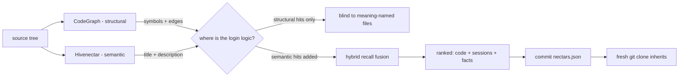

# Ecosystem Story Arc of Hivenectar

> Category: Overview | Version: 1.0 | Date: June 2026 | Status: Draft

How Hivenectar fits into the broader Honeycomb ecosystem: the existing CodeGraph (structural), the gap it leaves (semantic), how Hivenectar fills it, how guarded recall fuses both layers, how teams share via the committed projection, and how a fresh clone inherits. Traced as a story arc with a worked query that flows through recall and returns both structural and semantic hits.

**Related:**
- [`../overview.md`](../overview.md)
- [`overview-introduction-and-theory.md`](overview-introduction-and-theory.md)
- [`overview-technical-specification.md`](overview-technical-specification.md)
- [`overview-conclusion-and-deliverables.md`](overview-conclusion-and-deliverables.md)
- [`../data/recall-integration.md`](../data/recall-integration.md)
- [`../data/portable-registry.md`](../data/portable-registry.md)
- [`../reference/prior-art-crosswalk.md`](../reference/prior-art-crosswalk.md)

---

## The arc in one sentence

Honeycomb already had a structural graph that knew how code was wired; it lacked a semantic layer that knew what code was for; Hivenectar is that layer, and the two are united by guarded recall fusion so an agent gets both signals at once — and the whole thing travels to teammates through a committed lockfile.

The rest of this document walks that arc in five beats, then traces a single query end-to-end through every subsystem it composes with.

---

## Beat 1 — The existing CodeGraph (structural)

Before Hivenectar, Honeycomb's source-tree understanding was the **CodeGraph**: a live graph of files, symbols, and edges built from source with tree-sitter. It answers structural questions deterministically — "who calls this function," "what is the blast radius of changing this symbol," "walk me through this subsystem" — by extracting AST facts (`function`, `class`, `calls`, `extends`, `imports`). It never consults an LLM, and that is deliberate: the graph is fast, deterministic, and reproducible byte-for-byte from the same source.

The CodeGraph's structural identity is keyed on symbols and edges derived from ASTs. It is excellent at *navigation*. Its `find/`, `query/`, and `show/` surfaces answer symbol-shaped queries exactly. This beat of the arc is a solved problem in Honeycomb, and Hivenectar does not touch it.

## Beat 2 — The gap (semantic)

The CodeGraph cannot answer *"where is the login logic."* It can find a symbol named `login` or `authenticate`, but it has no concept of what those symbols *mean*, and it cannot surface `src/middleware/session-refresh.ts` — which implements a critical piece of login behavior — unless the agent already knows to look for it by name.

This is the gap. Structural identity is about *how code is wired*; semantic identity is about *what code is for*. No amount of AST extraction closes this gap, because meaning is not present in the syntax. The gap is not a missing feature of the CodeGraph; it is a different category of question that the CodeGraph was correctly designed not to answer.

## Beat 3 — Hivenectar fills it

Hivenectar is the semantic layer. The hiveantennae daemon watches the project, mints a stable ULID nectar for each file, and lazily describes file contents through a cheap long-context LLM (Gemini 2.5 Flash via the Portkey gateway). The descriptions and their 768-dim embeddings persist in Deep Lake alongside the existing memory tables. The result is a per-file "what is this file for" index that participates in the same hybrid recall pipeline already serving session and skill memory.

Critically, Hivenectar fills the gap *without compromising* the structural layer. The two workers are independent, write to disjoint tables, and run concurrently without coordination. A file is in both by default. See [`overview-introduction-and-theory.md`](overview-introduction-and-theory.md) for the full pillar treatment.

## Beat 4 — Recall unions both

This is the beat where the two layers meet. Hivenectar adds a fourth guarded arm to the existing hybrid recall pipeline over `source_graph_versions`, filtered to the latest described version per nectar. Recall already runs guarded arms over `sessions`, `memory`, and `memories`; Hivenectar's arm contributes alongside them, fused by reciprocal rank fusion (RRF) at equal default weight. If the Hivenectar table is missing, that arm returns empty and the other arms still answer. An agent query now returns, in a single ranked list: code-file descriptions (semantic), symbol-shaped structural hits (via the CodeGraph's separate query surface), session traces, and distilled facts.

The agent receives one ranked list and can decide whether to read the code, replay the session, or trust the fact — it has all the signals in one place. The fusion is rank-based, not score-based, so the four arms contribute equally regardless of their raw score distributions. The wiring is in [`../data/recall-integration.md`](../data/recall-integration.md).

## Beat 5 — Team-share and fresh-clone inheritance

The final beat carries the index across the team boundary. Because `source_graph_versions` is a Deep Lake table with tenancy columns, it cloud-syncs the same way every other Honeycomb table does. And because `.honeycomb/nectars.json` is a committed, regenerable projection of that table, a fresh `git clone` inherits identity and descriptions before the daemon ever makes a network call. A clone with a current projection achieves zero LLM calls and zero fuzzy matches: every on-disk file's content hash matches the projection, every nectar is inherited, every description is carried over. The brooding cost was paid once by whoever brooded first; the clone pays nothing.

---

## The subsystems Hivenectar composes with

The arc runs through every sibling subsystem in the Honeycomb ecosystem. Each is referenced, not duplicated, here.

| Subsystem | Role in the arc | Reference |
|---|---|---|
| **CodeGraph** | The structural layer; answers symbol-shaped queries; coexists with Hivenectar in disjoint tables. | `data/codebase-graph.md` (main corpus) |
| **Recall pipeline** | The hybrid BM25 + vector arm set, fused by RRF, that Hivenectar joins as a fourth guarded arm. | [`../data/recall-integration.md`](../data/recall-integration.md); main corpus `ai/retrieval.md`, `ai/hybrid-sql-vector-rationale.md` |
| **Embedding provider stack** | Produces the 768-dim vectors over `title + description`; local nomic is the default, Cohere via Portkey is opt-in, and both must honor the same dimensionality. | [`../ai/enricher-and-llm-model.md`](../ai/enricher-and-llm-model.md); main corpus embeddings docs |
| **Portkey gateway** | Routes the Gemini 2.5 Flash description calls with built-in rate-limit handling and backoff; the same gateway every other LLM call in Honeycomb uses. | [`../ai/enricher-and-llm-model.md`](../ai/enricher-and-llm-model.md); main corpus `ai/portkey-gateway.md`, `ai/model-provider-router.md` |
| **Daemon lifecycle** | hiveantennae is an independent Hivenectar workload daemon registered with hivedoctor; brooding does not block readiness. | [`overview-technical-specification.md`](overview-technical-specification.md); [`../architecture/ADR-0003-three-daemon-topology-and-thehive-portal.md`](../architecture/ADR-0003-three-daemon-topology-and-thehive-portal.md) |
| **thehive portal** | Hosts the always-on dashboard and Source Graph page, fetching data from Hivenectar and Honeycomb APIs. | [`../architecture/ADR-0003-three-daemon-topology-and-thehive-portal.md`](../architecture/ADR-0003-three-daemon-topology-and-thehive-portal.md) |
| **Deep Lake substrate** | The only durable store; `source_graph` and `source_graph_versions` are Deep Lake tables subject to the same FR-8 rule and schema-heal pass as the rest. | [`../data/source-graph-schema.md`](../data/source-graph-schema.md) |
| **Portable projection** | The committed lockfile that bridges cloud truth and offline clone. | [`../data/portable-registry.md`](../data/portable-registry.md) |

---

## The story arc as a flow



Read left to right: the source tree feeds both layers; the CodeGraph alone leaves the meaning-shaped query blind; Hivenectar adds the semantic arm; recall unites them; the result is committed and inherited on clone.

---

## A single query, traced end-to-end

The clearest way to see the arc is to follow one agent query — *"everything associated with logins"* — through every subsystem it touches, and watch both layers return.

```mermaid
sequenceDiagram
    participant agent as Agent (any harness)
    participant recall as Hybrid recall pipeline
    participant cg as CodeGraph
    participant dl as Deep Lake
    participant emb as Embedding provider
    participant proj as nectars.json
    participant clone as Fresh clone

    Note over agent,clone: Beat 5 - inheritance happens once, before the query
    clone->>proj: git clone carries committed projection
    proj->>dl: inherit nectars + descriptions by content hash
    dl->>emb: recompute 768-dim embeddings locally
    Note over dl: recall is live, zero LLM cost on clone

    Note over agent,recall: Beat 4 - the query flows through guarded recall arms
    agent->>recall: "everything associated with logins"
    par structural arm
        recall->>cg: find/login (symbol surface)
        cg-->>recall: src/auth/login.ts, src/api/routes/login.ts
    and semantic arm (BM25)
        recall->>dl: ILIKE over source_graph_versions title/description
        dl-->>recall: login.ts, session-refresh.ts, jwt.ts, logout.ts
    and semantic arm (vector)
        recall->>dl: cosine over 768-dim embedding
        dl-->>recall: same files, re-ranked by meaning
    and memory arm
        recall->>dl: sessions + memory + memories
        dl-->>recall: Tuesday's JWT skew-bug session, distilled facts
    end
    recall->>recall: RRF fusion (equal default weight)
    recall-->>agent: single ranked list: code files + session traces + facts
    Note over agent: structural hit tells how to navigate; semantic hit tells what to look at
```

### What each return carries

The query returns a single ranked list whose rows come from different layers, each carrying different information:

| Returned file | Source layer | What the agent learns |
|---|---|---|
| `src/auth/login.ts` | CodeGraph `find/login` + Hivenectar | The named entry point; *and* "validates credentials, starts a session, issues a JWT refresh token" |
| `src/middleware/session-refresh.ts` | Hivenectar only | "Refreshes JWT claims on each authenticated request, part of the login session lifecycle" — invisible to `find/login` because no symbol is named `login*` |
| `src/lib/jwt.ts` | Hivenectar only | "JWT issue/verify, used by login and session-refresh" |
| `src/api/routes/logout.ts` | Hivenectar only | "Ends a login session, clears refresh token" |
| Tuesday's debugging session | Sessions recall | What was *discussed* about login, not what exists |
| "JWT refresh has 5-min skew tolerance" | Distilled fact | What was *decided*, not what exists |

The structural hit finds the files with "login" in their symbol names. The semantic hits find the files that *participate in* login without being named for it. The session and fact hits find the human context. Separately, each is a blind spot; together, they give the agent a complete picture. This is the complementarity the arc exists to deliver.

---

## Why the arc stops where it stops

The arc is deliberately bounded. Hivenectar composes with the subsystems above; it does not absorb them, and it does not extend past them. Specifically:

- It does not replace the CodeGraph. Both layers answer questions the other cannot, and the recall union returns both without deduplication.
- It does not own embedding infrastructure. The provider stack does; Hivenectar only requires the 768-dim dimensionality to match the other recall tables so one index serves all.
- It does not own the model gateway. Portkey does; Hivenectar specifies the default model and routes through Portkey, while semantic caching and guardrails are configured server-side.
- It does not own the portal. thehive does; Hivenectar exposes APIs and status that the portal consumes.
- It does not own storage. Deep Lake does; the projection is a regenerable lockfile, not a sidecar.

The arc's contribution is the *composition* — daemon-minted identity, LLM description, Deep Lake persistence, union-recall, and portable projection in a single subsystem — not any one pillar in isolation. The prior-art survey in [`../reference/prior-art-crosswalk.md`](../reference/prior-art-crosswalk.md) establishes that each pillar has precedent; the five-way composition does not.

---

## Forward pointer

The arc shows *how* the pieces fit. For *what* Hivenectar delivers as concrete outcomes and how to measure success, read [`overview-conclusion-and-deliverables.md`](overview-conclusion-and-deliverables.md). For the operating contract that makes each beat work, read [`overview-technical-specification.md`](overview-technical-specification.md).
