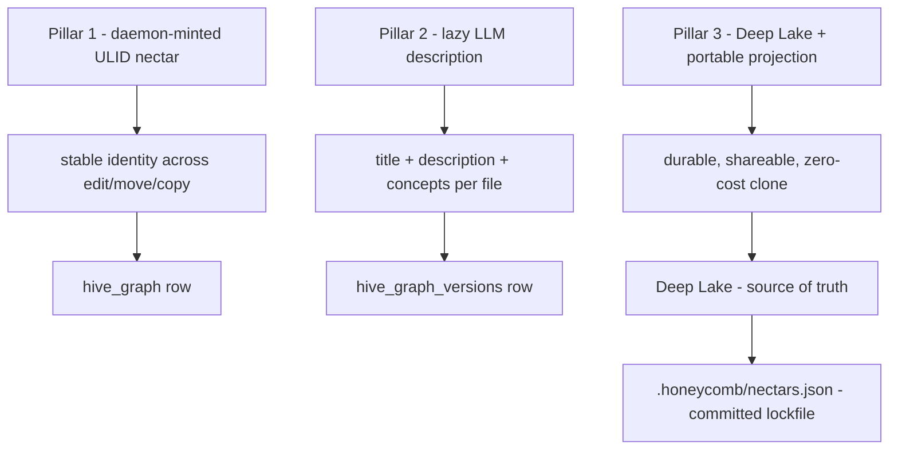
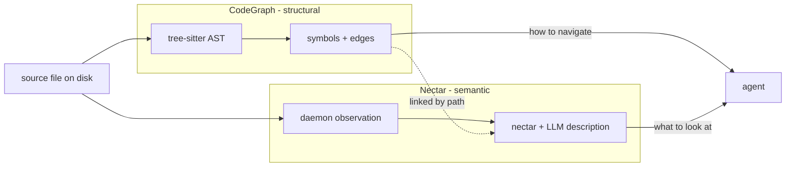

# Introduction and Theory of Nectar

> Category: Overview | Version: 1.0 | Date: June 2026 | Status: Draft

The conceptual on-ramp a new engineer reads before anything else: why the structural CodeGraph alone is not enough, what semantic identity means, how the three design pillars fit together, and the central thesis that Nectar is complementary to — not a replacement for — the CodeGraph.

**Related:**
- [`../overview.md`](../overview.md)
- [`overview-technical-specification.md`](overview-technical-specification.md)
- [`overview-ecosystem-story-arc.md`](overview-ecosystem-story-arc.md)
- [`overview-conclusion-and-deliverables.md`](overview-conclusion-and-deliverables.md)
- [`../architecture/ADR-0001-minted-nectar-over-source-embedded-serial.md`](../architecture/ADR-0001-minted-nectar-over-source-embedded-serial.md)
- [`../ai/identity-and-reassociation.md`](../ai/identity-and-reassociation.md)
- [`../reference/prior-art-crosswalk.md`](../reference/prior-art-crosswalk.md)

---

## The gap: structural identity is not semantic identity

Every modern AI coding tool indexes the source tree somehow. The dominant pattern in 2026 is structural: parse each file with tree-sitter, extract an AST, and build a graph of symbols and edges (`function`, `class`, `calls`, `extends`, `imports`). Honeycomb already ships such a graph — the **CodeGraph** — and it is excellent at answering questions of *wiring*: "who calls this function," "what is the blast radius of renaming this symbol," "walk me through this subsystem." It does all of this deterministically, without consulting an LLM, reproducible byte-for-byte from the same source. That determinism is a deliberate and valuable property.

What the CodeGraph cannot answer is *"where is the login logic."* It can find a symbol literally named `login` or `authenticate`, but it has no concept of what those symbols *mean*. It has no way to surface `src/middleware/session-refresh.ts` — which implements a critical piece of login behavior — unless the agent already knows to look for it by name. **Structural identity is about how code is wired. Semantic identity is about what code is for.** This is the gap Nectar exists to fill, without compromising the structural layer that already works.

The two layers are not competing approximations of the same thing. They answer disjoint questions. A file can be in the CodeGraph with no nectar (it has structure but no description yet). A file can have a nectar without being in the CodeGraph (a config file, a markdown doc, a `.env.example` — anything with meaning but no AST). Recall unions over both, because the agent needs both signals to act: the structural hit tells it *how to navigate*; the semantic hit tells it *what to look at in the first place*.

---

## Why the name: hive, antennae, nectar

The name is functional, not decorative, and each word maps to a role in the system.

- **The hive** is the team of agents and engineers working in the same repository. They share a codebase, they share context, and they should share the accumulated understanding of what that codebase is for. Nectar treats semantic understanding as a *team asset*, not a per-developer index.
- **The antennae** are what sense the environment — what files exist, what they mean, how they relate. The concrete component is the **Nectar daemon** (the `hiveantennae` process), an independent workload daemon registered with **doctor** and surfaced through **hive** that watches the project directory, mints identity for new files, re-associates identity after moves and edits, and lazily describes file contents. Antennae sense continuously; they do not require the agent to ask before noticing.
- **A nectar** is the minted identity record for a single file: small, stable, and the raw material from which richer understanding is produced. A nectar is a 26-character ULID. It is not a hash of the content, not a function of the path, and not embedded in the source. It is a pure minted identifier, created once by the daemon and persisted in Deep Lake.

The metaphor also captures the relationship to the hive's broader sustenance. The CodeGraph is the comb — the rigid, deterministic structure. Nectar is the forage — the gathered, probabilistic understanding of what each cell of the comb is for. Both belong to the same hive.

---

## The three design pillars

Nectar rests on three pillars. Each is individually present in some prior system (see [`../reference/prior-art-crosswalk.md`](../reference/prior-art-crosswalk.md)); the composition is what the system contributes.

### Pillar 1 — Stable identity via a daemon-minted nectar, never embedded in source

Every file gets a nectar: a ULID minted once by the hiveantennae daemon and persisted in Deep Lake. The nectar never lives inside the file. It survives the four events that defeat every other identity scheme:

- **Edits**, because the nectar is not derived from content. A save appends a version row keyed by the new content hash; the nectar is unchanged.
- **Renames and moves**, because re-association follows the file on disk through an exact-then-fuzzy ladder, not a comment marker. A `git mv` carries the nectar along.
- **Copy-paste**, because the copy gets a *fresh* nectar with a `derived_from_nectar` pointer back to the original. The fork is its own identity, permanently linked to its origin.
- **Daemon restarts**, because the nectar is in Deep Lake and the re-association ladder re-derives the on-disk association from content hashes at boot.

The rejected alternative — embedding a serial number in the first line of every source file — fails on four concrete grounds documented in [`../architecture/ADR-0001-minted-nectar-over-source-embedded-serial.md`](../architecture/ADR-0001-minted-nectar-over-source-embedded-serial.md): it collides with the AGPL license header that owns line 1, it makes line 1 the most conflict-prone line in the repo, it cannot represent files without a comment syntax (JSON, `.env`, binaries), and it turns copy-paste into an ambiguous event where two files claim the same serial. Content-hash-as-identity is rejected separately because it churns on every edit and is therefore path-as-identity one layer down. The full reasoning is in the ADR; read it before arguing about serials-in-source.

### Pillar 2 — Lazy LLM description through a cheap long-context model

Files are described on demand, not eagerly. A nectar can exist for hours or days with a null description; the enricher fills it the first time recall might surface it, or on a debounced watch trigger after a meaningful edit. **Description is a cache, not a prerequisite.** A file can sit in Deep Lake undescribed for as long as nobody asks about it, and nothing breaks.

The model is **Gemini 2.5 Flash** routed through the existing Portkey gateway. Two properties make it the canonical choice, and they are not interchangeable:

- **A genuine 1-million-token context window.** This is the load-bearing property. Long context lets the brooder pack 30–50 small files into a single LLM round-trip, collapsing the per-file cost by an order of magnitude. A model with a 200K window (Haiku, Sonnet, GPT-4o) caps the batch at 6–10 files per call and quintuples the call count. The full cost math is in [`../ai/brooding-pipeline.md`](../ai/brooding-pipeline.md): a complete brooding pass on a 2000-file repository lands under ~$3, and the batch/solo ratio holds as repos scale.
- **Frontier-tier quality at the lowest price in that tier.** A cheaper but weaker model (GPT-4o-mini) is price-competitive but measurably worse at single-file code understanding and forces tiny batches. Gemini 2.5 Flash is the Pareto-optimal point.

The model is not hardcoded — it is the default in the provider router, swappable via the same configuration that routes every other LLM call in Honeycomb. The `describe_model` column on every version row records which model produced each description, so a swap can trigger selective re-description if quality demands. The capability tier Nectar actually needs (long context, single-file understanding, structured JSON output, multilingual tolerance) is satisfied by several models; the choice is an economics decision, documented in [`../ai/enricher-and-llm-model.md`](../ai/enricher-and-llm-model.md).

### Pillar 3 — Durable state in Deep Lake, with a portable projection

All nectar records, version chains, descriptions, and embeddings live in Deep Lake — the same substrate as the `sessions`, `memory`, `memories`, and CodeGraph `codebase` tables. **There is no SQLite sidecar, no JSONL log, no parallel store.** Deep Lake is the source of truth, enforced by the same rule (FR-8) that governs the rest of Honeycomb: durable state goes in Deep Lake, not in sidecars.

A single committed, reviewable file — `.honeycomb/nectars.json` at the project root — is a **portable projection** of the Deep Lake table. It is a lockfile, not a sidecar: regenerated from Deep Lake on every successful brood or enrich, never edited directly, and regenerable byte-for-byte (modulo a timestamp) from a Deep Lake scan alone. A fresh `git clone` re-derives identity by matching on-disk content hashes into this file before falling back to the full re-association ladder, so a new checkout inherits descriptions without re-paying the brooding cost. The mechanics are in [`../data/portable-registry.md`](../data/portable-registry.md); the distinction between projection and sidecar is enforced, not just asserted.

---

## The central thesis: complementary, not replacement

The single most important thing to internalize before reading the rest of the corpus is this: **Nectar is complementary to the CodeGraph, not a replacement for it.** Both ship. The CodeGraph answers structural questions deterministically; Nectar answers semantic questions probabilistically. Neither subsumes the other.

This thesis has concrete consequences for how the system is built:

- **Two independent workload paths.** hiveantennae runs as the Nectar workload daemon, while the CodeGraph worker remains part of Honeycomb's workload. They write to different tables (`hive_graph_versions` vs `codebase`), with no coordination between them. A file is in both by default.
- **Two disjoint recall surfaces.** The CodeGraph's `find/`, `query/`, and `show/` answer symbol-shaped questions. Nectar's guarded hive-graph arm in the hybrid recall pipeline answers meaning-shaped questions. A recall hit does not deduplicate against a CodeGraph hit — the agent benefits from seeing both, because each carries information the other lacks.
- **Two different identity models, deliberately.** The CodeGraph keys on symbols and edges derived from ASTs; identity there is structural and reproducible. Nectar keys on files and mints identity; identity here is stable across mutation. Trying to unify them would corrupt both.

---

## What Nectar deliberately is not

Stating the negative boundaries clarifies the thesis as much as stating the positive pillars.

- **Not a replacement for the CodeGraph.** Both layers answer questions the other cannot. This is non-negotiable.
- **Not an LSP.** hiveantennae does not resolve types, run compilers, or produce compiler-accurate references. The structural CodeGraph and any future LSP layer own that.
- **Not eager.** Description is a cache. A null description is a valid state, not a bug.
- **Not a source mutation.** No file on disk is ever edited by hiveantennae. The only file it writes is the committed, regenerable projection.
- **Not a separate database.** Deep Lake is the store. The "SQLite would be faster" instinct is addressed and rejected in ADR-0001.

---

## Where to go next

This document is the conceptual entry point. The rest of the overview folder expands each facet:

- For the operating contract — the four hiveantennae modes, the component boundaries, the recall arm — read [`overview-technical-specification.md`](overview-technical-specification.md).
- For how a single agent query flows through the union and returns both layers — read [`overview-ecosystem-story-arc.md`](overview-ecosystem-story-arc.md).
- For the engineering and operator scope written as acceptance criteria — read [`overview-user-stories.md`](overview-user-stories.md).
- For what success looks like and a forward pointer to the rest of the corpus — read [`overview-conclusion-and-deliverables.md`](overview-conclusion-and-deliverables.md).

The canonical one-page summary remains [`../overview.md`](../overview.md).
