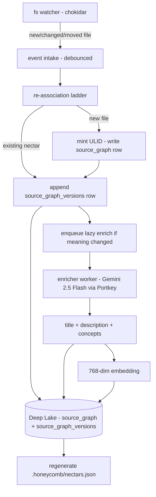
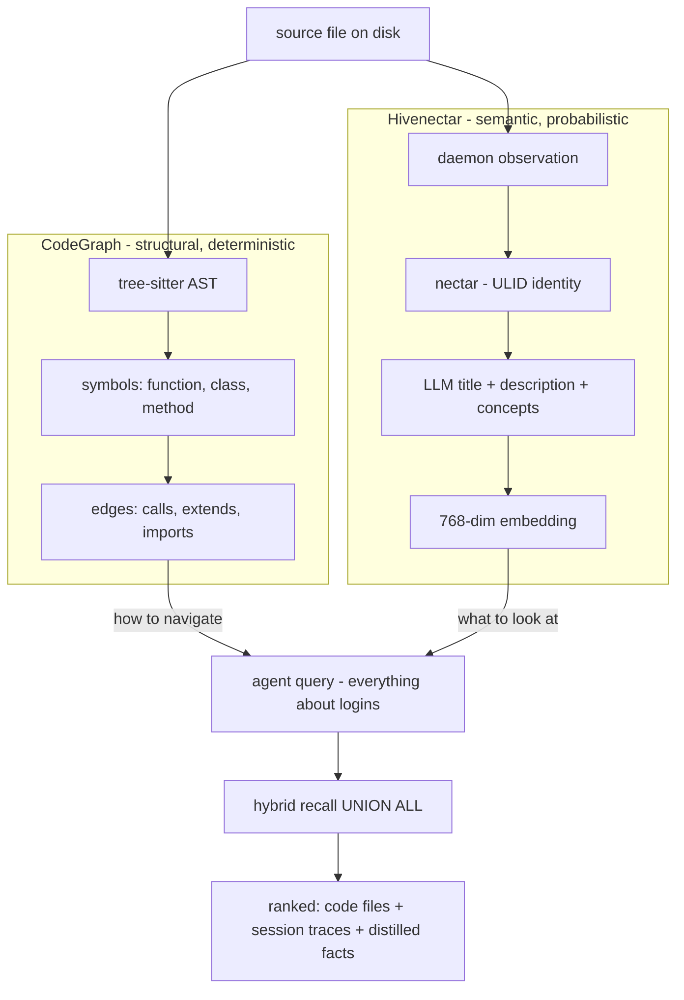
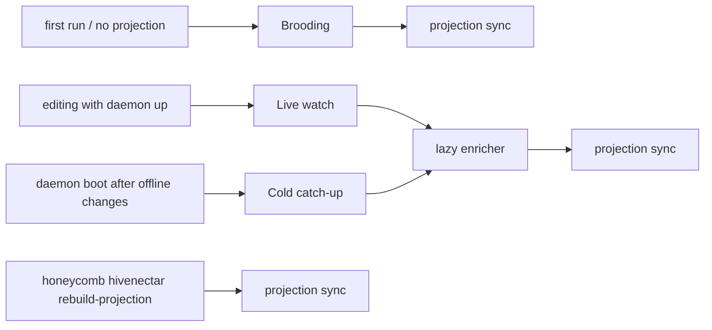

# Technical Specification of Hivenectar

> Category: Overview | Version: 1.0 | Date: June 2026 | Status: Draft

The technical contract for Hivenectar: the four hiveantennae operating modes as trigger→action→post-condition tables, the data-model component contract, the recall `UNION ALL` arm, the worker's daemon-colocation obligations, and the non-goals stated as hard exclusions.

**Related:**
- [`../overview.md`](../overview.md)
- [`overview-introduction-and-theory.md`](overview-introduction-and-theory.md)
- [`overview-user-stories.md`](overview-user-stories.md)
- [`../ai/brooding-pipeline.md`](../ai/brooding-pipeline.md)
- [`../ai/enricher-and-llm-model.md`](../ai/enricher-and-llm-model.md)
- [`../ai/identity-and-reassociation.md`](../ai/identity-and-reassociation.md)
- [`../data/source-graph-schema.md`](../data/source-graph-schema.md)
- [`../data/recall-integration.md`](../data/recall-integration.md)

---

## Scope of this contract

This document is the engineering contract: it states what the hiveantennae worker must do, the conditions under which each mode fires, the post-conditions that define success, and the boundaries it must not cross. It is not a concept essay (that is [`overview-introduction-and-theory.md`](overview-introduction-and-theory.md)) and it is not an operator-acceptance spec (that is [`overview-user-stories.md`](overview-user-stories.md)). The deep-dive docs it references hold the algorithmic and schema detail; this document holds the surface that composes them.

---

## The hiveantennae worker pipeline

hiveantennae is a background worker inside the Honeycomb daemon, parallel to the existing codebase-graph worker. It is **not** a separate process: it shares the daemon's Deep Lake client, auth, scoping, and observability. It is **not** a phase of the graph worker: the graph worker is build-triggered and on-demand; hiveantennae is watch-driven and continuous. The two write to disjoint tables and run without coordination.

---

## The four operating modes

hiveantennae operates in four modes. The modes are not mutually exclusive in code — they are the distinct *triggers* that select which pipeline path runs — but a given file event flows through exactly one at a time.

### Brooding

The one-time-per-project full scan that takes a codebase from "no nectars exist" to "every file has a nectar and most have a description."

| | |
|---|---|
| **Trigger** | First run against a project with no `source_graph` rows, or a fresh checkout with no `.honeycomb/nectars.json`. Also invokable explicitly via `honeycomb hivenectar brood`. |
| **Action** | Discover files via `git ls-files` (CodeGraph discovery reused verbatim). Pre-check each file's content hash against the portable projection; inherit on match. Bucket the rest by size/type (skip-binary, skip-too-large, batch ≤4KB, solo). Describe batches of ~40 small files per Gemini call, large files one-per-call. Embed each description at 768 dims. |
| **Post-condition** | Every non-skipped file has a nectar with `describe_status ∈ {described, skipped-*}`. `.honeycomb/nectars.json` is regenerated. Daemon switches to live-watch mode. |

Brooding is resumable: every mint and description write is a committed Deep Lake write, so a crash mid-brood resumes from `describe_status`. It does not block daemon readiness — recall serves whatever has been described so far while brooding proceeds in the background. The cost math for a representative 2000-file repo lands under ~$3; a 10000-file monorepo broods for ~$15. See [`../ai/brooding-pipeline.md`](../ai/brooding-pipeline.md).

### Live watch

Steady-state operation during normal editing.

| | |
|---|---|
| **Trigger** | A chokidar file-system event (add, change, unlink) during the daemon's normal running state. |
| **Action** | Debounce per-path (default 2000 ms window). Run the re-association ladder against the debounced state. Path+mtime+size exact match → no-op. Path match, content changed → append version row, enqueue lazy enrich. Exact-hash match to a missing file → carry nectar to new path. Fuzzy match → carry with a confidence flag. Nothing matches → mint new nectar. Copy detection: a new path whose content matches an existing file's current content mints a fresh nectar with `derived_from_nectar`. |
| **Post-condition** | Deep Lake reflects the post-debounce disk state. Lazy enrich jobs are queued for any meaningfully-changed version. Recall never blocks on the watcher. |

Live watch is the easy case because the chokidar event stream carries move semantics (a rename emits `unlink` on the old path and `add` on the new within milliseconds), so the fuzzy step is rarely reached. The full ladder is in [`../ai/identity-and-reassociation.md`](../ai/identity-and-reassociation.md).

### Cold catch-up

The hard case: the daemon boots after the laptop was closed and the user moved and edited files offline.

| | |
|---|---|
| **Trigger** | Daemon boot against a project whose on-disk state diverges from Deep Lake (files moved/edited/added while the daemon was down). |
| **Action** | Load `.honeycomb/nectars.json` if present and build a content-hash→nectar index; inherit on hash match. For unmatched files, walk disk and run the re-association ladder top-down per file. Exact path/mtime/size dominates (most files untouched). Exact-hash-to-missing handles renames. TLSH fuzzy handles move-and-edit, **scored not binary**: low-confidence matches are surfaced to the dashboard for human review rather than auto-claimed. Nothing matches → mint new. Batch-enrich any drifted pending versions. |
| **Post-condition** | Every on-disk file has a nectar; every meaningfully-changed file is queued for re-description. Low-confidence fuzzy matches are visible in the review surface, not silently committed. |

Cold catch-up is where the confidence field earns its keep: the daemon cannot ask a human in real time whether a fuzzy match is a real move, so it surfaces candidates instead of guessing. A mis-association corrupts the history chain, which is worse than a fresh nectar.

### Projection sync

The lockfile regeneration step that runs at the end of the other three modes.

| | |
|---|---|
| **Trigger** | End of a brood, end of an enricher cycle that wrote new descriptions, or explicit `honeycomb hivenectar rebuild-projection`. |
| **Action** | Scan `source_graph_versions` (latest described version per nectar, scoped to the project), denormalize into the projection format, write atomically (temp file + rename). |
| **Post-condition** | `.honeycomb/nectars.json` reflects current Deep Lake state. The write is atomic so a crashed regeneration leaves the prior projection, not a partial one. |

Projection writes are debounced the same way enricher calls are, so a rapid edit session produces one projection write at the end of a cycle, not one per save. See [`../data/portable-registry.md`](../data/portable-registry.md).

---

## The data-model component contract

The full DDL lives in [`../data/source-graph-schema.md`](../data/source-graph-schema.md); this is the one-paragraph contract expanded into component obligations.

**`source_graph`** — one row per logical file, keyed by nectar (ULID primary key, immutable, never derived). Carries `created_at`, optional provenance (`derived_from_nectar`, `fork_content_hash` set at minting, write-once), a `kind` discriminator (`'file'` in v1, namespace reserved for `'directory'`), and tenancy (`org_id`, `workspace_id`, `project_id`). It is identity and provenance only — no content, no description.

**`source_graph_versions`** — append-only, one row per observed state of a file, keyed by the composite `(nectar, content_hash)`. Carries `seq` (monotonic per-nectar counter so "latest" is `ORDER BY seq DESC LIMIT 1`), the observed `path` (mutable across rows for the same nectar — this is how moves are recorded), metadata (`filename`, `ext`, `size_bytes`, `mtime_observed`), and the lazily-filled semantic fields (`title`, `description`, `concepts`, `embedding`, `described_at`, `describe_model`, `describe_status`). Tenancy is denormalized so the versions table is queryable in isolation for recall.

The contract invariants:

| Invariant | Enforcement |
|---|---|
| `nectar` is immutable once written | Never updated by any code path. Re-association changes the *association* (path metadata on a new version row), never the nectar. |
| `(nectar, content_hash)` composite uniqueness | Idempotent re-observation: a no-change save is a no-op. |
| "Current state of file X" | Latest version row for X's nectar (`MAX(seq)`). |
| "History of file X" | All version rows for X's nectar. |
| Description is nullable until enriched | `describe_status` drives recall filtering; undescribed rows are excluded from semantic recall but not from identity. |
| Nectars are never deleted by re-association | Deletion is a separate, explicit `honeycomb hivenectar prune --confirm` with a configurable grace period (default 30 days). |

---

## The recall `UNION ALL` arm contract

Hivenectar adds a fourth arm to the existing hybrid recall pipeline (BM25 lexical + 768-dim vector, fused by reciprocal rank fusion). The arm queries `source_graph_versions` filtered to the latest described version per nectar, scoped by tenancy. The full query and fusion rationale are in [`../data/recall-integration.md`](../data/recall-integration.md).

The contract the arm must uphold:

- **One row per current file.** The latest-per-nectar subquery ensures a file edited 50 times does not dominate recall with 50 near-duplicate rows.
- **Described rows only.** The `describe_status = 'described'` filter excludes pending, failed, and skipped rows. A never-described file is absent from semantic recall but may still appear in the structural CodeGraph's `find/` results.
- **Equal RRF weight by default.** The arm ships with a multiplier of 1.0 — a Hivenectar rank-1 hit contributes the same RRF weight as a sessions rank-1 hit. Operators can tune the multiplier via `~/.honeycomb/hivenectar.json` if descriptions dominate recall.
- **Silent fallback to BM25.** When embeddings are off (optional dependency absent), only the lexical arm runs over `title + description`. No error, no quality cliff — the same degradation every other recall arm uses.
- **No dedup against CodeGraph hits.** If `src/auth/login.ts` appears in both a Hivenectar hit and a `find/login` structural hit, both are returned. Each carries information the other lacks.

---

## Structural-vs-semantic complementarity

The complementarity is the reason both layers ship. The diagram makes the division of labor explicit.

A file can be in the CodeGraph without a nectar; a file can have a nectar without being in the CodeGraph. Recall unions over both because the agent needs both.

---

## The daemon-colocation contract

hiveantennae is not a standalone service. Its colocation obligations are binding, not stylistic:

| Obligation | What it means | Why it is binding |
|---|---|---|
| **Shared Deep Lake client** | All writes go through the daemon's Deep Lake client — no private connection, no separate store. | FR-8: Deep Lake is the only durable store. A private connection would be a sidecar. |
| **Shared auth** | hiveantennae uses the daemon's authenticated identity, not its own credentials. | Tenancy scoping (`org_id`/`workspace_id`/`project_id`) depends on the daemon's auth context. |
| **Shared scoping** | Every query is scoped by the daemon's project context. Two projects in the same workspace do not share nectars. | File identity is cross-agent within a project but isolated across projects. |
| **Shared observability** | Enricher cycles log files described, inherited, failed, tokens consumed, estimated cost; the dashboard surfaces a rolling cost counter and queue-depth gauge. | Same pattern as the pollinating loop and skillify miner. No bespoke telemetry. |
| **Non-blocking** | Brooding and enrichment run in the background. Daemon readiness does not wait on them; recall serves partial state during a brood. | Per the daemon readiness principle: accept requests first, do background work after. |

---

## Non-goals as hard exclusions

The following are not deferred features; they are out of scope by design and the system actively does not do them.

- **Not a replacement for the CodeGraph.** Both layers ship. The CodeGraph answers structural questions deterministically; Hivenectar answers semantic questions probabilistically.
- **Not an LSP.** hiveantennae does not resolve types, run compilers, or produce compiler-accurate references. The CodeGraph and any future LSP own that.
- **Not eager.** A file can exist in Deep Lake with a null description indefinitely. Description is a cache.
- **Not a source mutation.** No file on disk is ever edited by hiveantennae. The only file it writes is the committed, regenerable `.honeycomb/nectars.json`.
- **Not a separate database.** Deep Lake is the store. The SQLite-sidecar instinct is rejected in ADR-0001 for FR-8 violation.
- **Not symbol-granular in v1.** File granularity is deliberate. Symbol-level nectars would multiply row counts 10–100× and duplicate the structural CodeGraph; deferred to a possible v2.
- **Not directory-granular in v1.** Folders are derivable from file paths; a directory description is synthesized on demand from its files' descriptions. The `kind` column reserves the namespace.
- **Not bidirectional projection sync.** Sync is one-directional: Deep Lake → projection. The reverse (projection → Deep Lake) happens only on a fresh clone, as an inheritance write for nectars the local Deep Lake lacks.

---

## How the modes compose

The four modes are the same pipeline with different triggers; understanding which mode owns which event is the key to reasoning about the worker.

Brooding runs once per project and bootstraps the projection. After brooding, the daemon is in live-watch; cold-catch-up handles restarts; projection sync runs at the tail of any mode that produced new descriptions.
