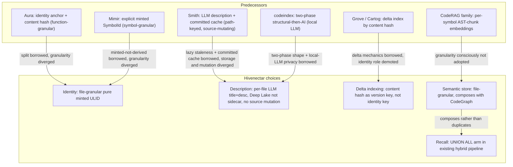

# Prior Art — Ecosystem Story Arc

> Category: Reference | Version: 1.0 | Date: June 2026 | Status: Draft

How prior-art awareness shaped each of Hivenectar's five design pillars: tracing every pillar to its predecessor, naming the deliberate divergence, and showing why the divergence is forced by Hivenectar's composition constraints rather than chosen on preference.

**Related:**
- [`../prior-art-crosswalk.md`](../prior-art-crosswalk.md)
- [`prior-art-introduction-and-theory.md`](prior-art-introduction-and-theory.md)
- [`prior-art-technical-specification.md`](prior-art-technical-specification.md)
- [`prior-art-user-stories.md`](prior-art-user-stories.md)
- [`prior-art-conclusion-and-deliverables.md`](prior-art-conclusion-and-deliverables.md)
- [`../../architecture/ADR-0001-minted-nectar-over-source-embedded-serial.md`](../../architecture/ADR-0001-minted-nectar-over-source-embedded-serial.md)
- [`../../overview.md`](../../overview.md)

---

## How to read this doc

This is the design-choice trace. Where [`prior-art-introduction-and-theory.md`](prior-art-introduction-and-theory.md) establishes the thesis and [`prior-art-technical-specification.md`](prior-art-technical-specification.md) provides the verbatim matrices, this doc narrates the arrow from each predecessor to the Hivenectar choice it informs. The recurring pattern across all five pillars is the same: Hivenectar borrows the predecessor's core insight and diverges on the specific dimension where the predecessor's choice conflicts with Hivenectar's composition constraints — file granularity, no source mutation, Deep Lake as the only store, and integration with the existing hybrid recall pipeline.

The diagram below summarizes the five arrows at a glance; the sections that follow walk each one in detail.

---

## The five pillars, each traced from prior art to Hivenectar's choice

The arrows are deliberately directional. Each points from a predecessor to a Hivenectar choice and carries a label naming what is borrowed and what diverged. The rest of this doc expands each arrow into a paragraph.

---

## Pillar 1 — Identity: Aura and Mimir to file-granular pure ULID

The identity pillar descends from two predecessors that Hivenectar treats as the canonical reference. The design choice — a file-granular, pure minted ULID, persisted as the primary key of `source_graph` — is the synthesis of what each predecessor got right, diverged on the dimensions where the predecessors' choices conflict with Hivenectar's constraints.

**From Aura**, Hivenectar borrows the identity-anchor / content-hash split wholesale. Aura separates a function's persistent identity anchor from its content hash; the anchor survives renames and edits, the hash changes per edit and links to the anchor as a version. Hivenectar's two-table model (`source_graph` for the anchor, `source_graph_versions` for the versioned content and description, documented in [`../../data/source-graph-schema.md`](../../data/source-graph-schema.md)) is this split lifted to file granularity. The divergence is granularity: Aura is function-granular; Hivenectar is file-granular in v1, because symbol granularity would multiply row counts ten to one hundred times and duplicate the structural CodeGraph. A second, subtler divergence is derivation: Aura derives the initial anchor from a structural signature, while Hivenectar mints a pure random ULID — trading cross-instance dedup for simplicity and collision-freedom, with Deep Lake tenancy providing the scoping that cross-instance dedup would otherwise provide.

**From Mimir**, Hivenectar borrows the philosophical position that identity allocation is a first-class operation, not a derivation. Mimir's `SymbolId` is allocated by a librarian, never derived from a name or hash, and never reused. Hivenectar's daemon "mints" a ULID in exactly this spirit: the minting is an explicit operation, the identifier is immutable once allocated, and the append-only history means a nectar is never reused even after its file is deleted. The divergence, again, is granularity (Mimir is symbol-granular and compiler-coupled; Hivenectar is file-granular and LLM-coupled).

The divergences are not preferences. File granularity is forced by the row-count budget and by the existence of the structural CodeGraph (which already owns symbol extraction). Pure minting is forced by the rejection of content-derived identity (which churns per edit, as Aura documents) and source-embedded identity (which collides with the AGPL header and breaks on copy-paste, as ADR-0001 records). The full rejected-alternatives set is in [`../../architecture/ADR-0001-minted-nectar-over-source-embedded-serial.md`](../../architecture/ADR-0001-minted-nectar-over-source-embedded-serial.md).

---

## Pillar 2 — Description: Smith and codeindex to Deep Lake, no source mutation

The description pillar descends from the LLM-description predecessors. The design choice — a per-file LLM-minted title, description, and concept set, stored in Deep Lake and projected to a single regenerable lockfile, never written into source — diverges from both predecessors on storage and mutation while preserving their core insights.

**From Smith**, Hivenectar borrows three things. First, the lazy-description-with-staleness-tracking model: Smith's `Hash:` / `Described-Against-Hash:` divergence flag is exactly Hivenectar's `describe_status = 'pending'` column. Second, the committed-cache team-inheritance story: committing the descriptions means a teammate who clones inherits them instead of re-paying the describe cost, which is why Hivenectar commits the `.honeycomb/nectars.json` projection. Third, the batch-with-approval economics: Smith batches ten files per LLM call with per-batch approval; Hivenectar batches thirty to fifty with cost-cap flags but no per-batch approval, judging the cost low enough to skip the friction. The divergences are sharp and structural. Smith has no stable identity (its `.meta` files are path-keyed, so a file move loses the description; Hivenectar's nectar survives moves). Smith embeds descriptions in `.meta` sidecars (Hivenectar stores them in Deep Lake and projects to a single lockfile, enforcing the projection-not-sidecar invariant). Smith is source-mutating — it writes into `constitution.md` and `CLAUDE.md`; Hivenectar never mutates source.

**From codeindex**, Hivenectar borrows the two-phase pipeline shape — structural README generation via tree-sitter first, then optional AI one-line module descriptions second, with the AI step opt-in. This is the same shape as the existing CodeGraph (structural) plus Hivenectar (AI enrichment) split. codeindex also articulates the local-LLM privacy property, which Hivenectar inherits by routing through the local daemon and the Portkey gateway so no code leaves the network.

The divergences are forced by two Hivenectar constraints. The Deep Lake constraint (FR-8: durable state goes in Deep Lake, not sidecars) forbids Smith's per-file `.meta` approach and forces the projection-not-sidecar invariant. The no-source-mutation constraint (the AGPL header owns line 1 of every source file per the main Honeycomb `AGENTS.md`) forbids Smith's `CLAUDE.md` / `constitution.md` writes and forces the projection to be a separate committed file. Smith's choices are correct for Smith's constraints; Hivenectar's constraints differ, so the divergence follows.

---

## Pillar 3 — Delta indexing: Grove and Cartog to content-hash-as-version-key

The delta-indexing pillar descends from the content-addressed indexing family. The design choice — content hash as the secondary attribute (the version key in `source_graph_versions` and the copy-event detector), explicitly rejected as the identity key — is the demotion of content hash from identity to version.

**From Grove and Cartog**, Hivenectar borrows the delta-indexing mechanics. Grove keys entries as `{filePath}::{qualifiedName}@{contentSHA}` and uses content hash to skip unchanged files. Cartog builds a Merkle tree of content hashes so an unchanged subtree is skipped wholesale and a changed subtree is re-indexed incrementally with a `--debounce` watcher. The `(path, mtime, size)` fast path in the re-association ladder's step 1, documented in [`../../ai/identity-and-reassociation.md`](../../ai/identity-and-reassociation.md), is Grove and Cartog's delta indexing applied to the re-association problem rather than to the initial index build.

The divergence is the role assigned to content hash. Grove and Cartog treat content hash as identity (same content, same identity, globally, without coordination). Hivenectar treats content hash as the version key — the secondary attribute that changes per edit and therefore cannot be the identity. This is the same insight Aura documents ("neither alone is enough") and that ADR-0001 records as the rejection of content-hash-as-identity. The delta mechanics are borrowed; the identity model they imply is rejected, because content hash churns per edit and therefore is not actually stable — it is path-as-identity moved one layer down.

The divergence is forced by the stability-across-edits decision driver in ADR-0001. A delta indexer that only ever sees a snapshot can afford content-hash identity; a memory layer that must carry descriptions across indefinite edits cannot. Hivenectar's use case is the latter, so content hash is demoted.

---

## Pillar 4 — Semantic store: CodeRAG family to file-granular, composing with CodeGraph

The semantic-store pillar descends from the AST-chunk embedding family. The design choice — file-granular description and one embedding per file, decoupled from AST extraction and composing with the existing structural CodeGraph — is a conscious decision not to adopt the dominant 2026 pattern.

**From the CodeRAG family** (CodeRAG, Codebase Cortex, Context+, cba, codebase-index, codebase-indexer, code-atlas, opencode-codebase-index), Hivenectar borrows nothing structural and adopts the opposite granularity. The family parses code with tree-sitter into AST chunks (functions, classes, methods), embeds each chunk, and exposes semantic search over the fine-grained rows. Hivenectar describes files and produces one embedding per file. The tradeoff is acknowledged in both directions: AST-chunk granularity gives finer recall (a specific function within a file) at the cost of high row counts (ten to one hundred times more embeddings) and coupling to tree-sitter's parse quality. File granularity gives coarser recall but works on any text file (config, markdown, `.env`), has ten to one hundred times lower row counts, and composes with the existing CodeGraph rather than duplicating it.

**From the Honeycomb CodeGraph**, Hivenectar borrows the substrate conventions: `git ls-files` discovery, atomic write patterns, content-addressed caching, and the daemon-as-only-storage-client rule. The structural CodeGraph already owns AST extraction via tree-sitter; Hivenectar deliberately does not duplicate that work. A structural `find/` or `query/` hit tells an agent how to navigate; a Hivenectar semantic hit tells the agent what to look at in the first place. The two layers are independent and complementary.

The divergence is forced by the composition constraint. Hivenectar ships inside a daemon that already has a structural CodeGraph. Adopting the AST-chunk family's granularity would duplicate the CodeGraph's extraction, multiply row counts, and couple Hivenectar to tree-sitter's parse quality for a recall benefit the CodeGraph already provides. File granularity is the choice that makes Hivenectar compose rather than compete.

---

## Pillar 5 — Recall integration: union arm in the existing hybrid pipeline

The recall-integration pillar is where the composition argument is load-bearing, because no surveyed predecessor offers a comparable integration point. The design choice — a `UNION ALL` arm over `source_graph_versions` in the existing hybrid recall pipeline (BM25 lexical plus 768-dim vector, fused by reciprocal rank), contributing alongside session, memory, and skill hits — is unique to Hivenectar because Hivenectar is a Honeycomb subsystem.

Every surveyed predecessor is a standalone semantic-search server. CodeRAG, Codebase Cortex, and Context+ expose search over their own indexes; Smith surfaces descriptions through a navigator; Aura serves behavior-proof through a VCS. None composes code-file recall with conversation-trace recall (the `sessions` table) and distilled-fact recall (the `memory` table) in a single fused query. Hivenectar does, because it plugs into a pipeline that already serves those tables and uses the same 768-dim embedding dimensionality as `sessions.message_embedding` and `memory.summary_embedding`.

This pillar is the one Hivenectar will defend most strongly, because it is the one with the least precedent. The honest framing is: the union-recall composition is not novel as a retrieval technique (hybrid BM25-plus-vector search is well-trodden), but the specific composition of code-file recall with conversation and distilled-fact recall in a single daemon that already serves a multi-harness AI coding memory system is not present in any surveyed predecessor. The wiring is documented in [`../../data/recall-integration.md`](../../data/recall-integration.md).

---

## The throughline: divergence forced by composition, not preference

Reading the five pillars together, a single throughline emerges. Every divergence is forced by one of four composition constraints: file granularity (forced by row-count budget and CodeGraph coexistence), no source mutation (forced by the AGPL-header rule), Deep Lake as the only store (forced by FR-8), and integration with the existing hybrid recall pipeline (forced by Hivenectar being a Honeycomb subsystem). None of the divergences is a stylistic preference. Each is the consequence of Hivenectar's position inside an existing system, which is why the originality claim is about composition rather than invention.

This throughline is what makes the prior-art survey load-bearing rather than decorative. A contributor who proposes a feature that ignores one of the four constraints is proposing to leave the composition that makes Hivenectar defensible. The [user-stories doc](prior-art-user-stories.md) codifies the audits that catch such proposals; the [conclusion](prior-art-conclusion-and-deliverables.md) restates the narrow defensibility claim that the composition supports.
