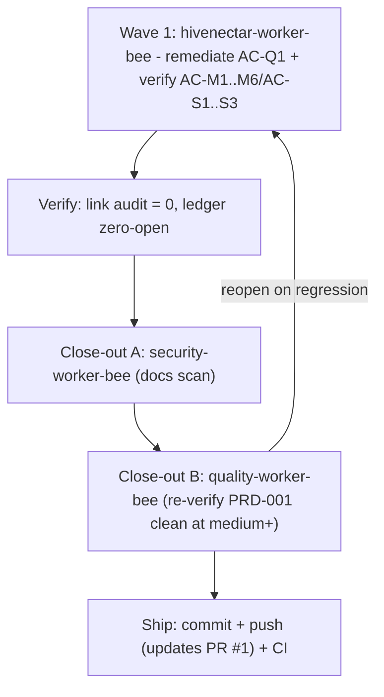
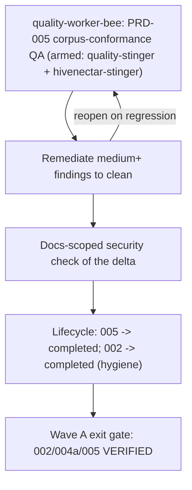
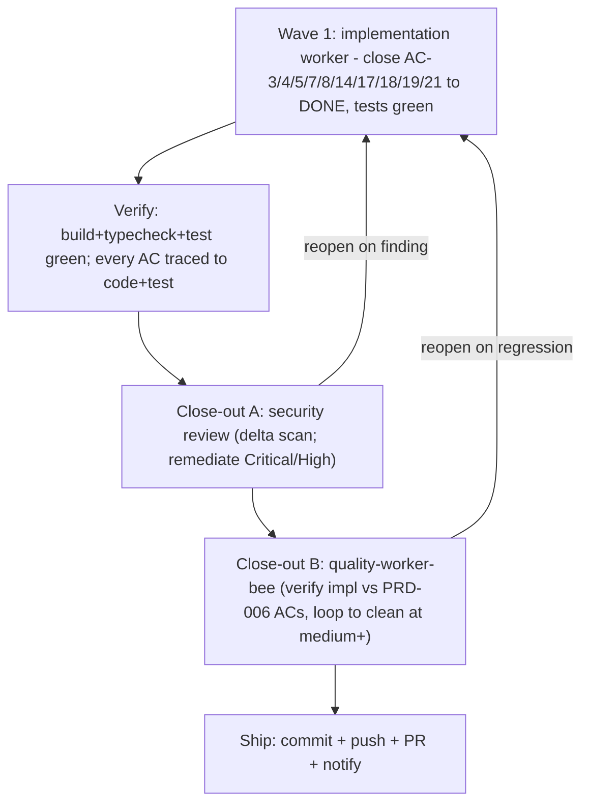

# Execution Ledger: PRD-001 (the-smoker run)

> Category: Ledger | Version: 1.0 | Date: July 2026 | Status: Active

Single source of truth for the `/the-smoker` completion run over **PRD-001 Three-Daemon Topology**. Primary bee: `hivenectar-worker-bee`. Branch: `feature/prd-001-004-refine`. Status legend: OPEN / IN PROGRESS / DONE (implemented) / VERIFIED (independently confirmed).

PRD-001 is the architectural-planning PRD; its deliverables are documentation artifacts (ADR-0003, the four-role contract, the process/health/infra contracts). Every module AC was already satisfied and marked PASS in the PR #1 QA pass. This run drives the one remaining open item (code-reference convention conformance) to completion and re-verifies the whole module to a clean close-out.

---

## AC Ledger

| ID | Source | Criterion (abbrev) | Owner | Status |
|---|---|---|---|---|
| AC-M1 | index | ADR-0003 exists, supersedes ADR-0002 two-daemon framing, preserves invariants | hivenectar-worker-bee | DONE (ADR exists + linked in refine; supersession recorded in ADR-0003 body "Relationship to ADR-0002") |
| AC-M2 | index | Four roles each have a boundary statement, no overlap | hivenectar-worker-bee | DONE (001a role table + prose) |
| AC-M3 | index | PRD + ADR state no in-process state shared across the four roles | hivenectar-worker-bee | DONE (001a non-integration points) |
| AC-M4 | index | nectar process surface (port/PID/lock/health/client/tenancy) with a code citation per claim; ports+paths flagged DEFAULT | hivenectar-worker-bee | DONE (001b) |
| AC-M5 | index | Shared-infra consumption contract names each seam + deploy-time tenancy invariant | hivenectar-worker-bee | DONE (001c) |
| AC-M6 | index | Port map consistent with real Honeycomb code (3850/3851/3852 occupied; 3853/3854 free) | hivenectar-worker-bee | DONE (index port table; ADR-0004 confirms 3853) |
| AC-Q1 | Doc Framework 6 | Code references use backtick file-path spans, not markdown links (75 non-resolving honeycomb/doctor link tokens across the 4 files) | hivenectar-worker-bee | DONE (Wave 1: 75/75 converted, 0 remaining; independently verified) |
| AC-S1 | 001a US-001a.1..4 | hive always-on, doctor supervises all three, dashboard update cadence, no shared in-process state | hivenectar-worker-bee | DONE (verify vs ADR-0003/0004) |
| AC-S2 | 001b US-001b.1..4 | bind 3854 + /health, second-start refuses, own scoped Deep Lake client, restart leaves no stale lock | hivenectar-worker-bee | DONE (verify vs code) |
| AC-S3 | 001c US-001c.1..4 | Portkey own-client, embeddings 768-dim, compose-by-writing-rows, tenancy-mismatch caught | hivenectar-worker-bee | DONE (verify vs corpus) |

**Open count on entry: 1 (AC-Q1).** All others DONE, pending VERIFIED.

---

## Wave plan

**Wave 1 - hivenectar-worker-bee** (model: `claude-opus-4-8-thinking-xhigh-fast`; deep, nuanced multi-file doc conversion + corpus verification):
- Remediate AC-Q1: convert all 75 honeycomb/doctor markdown links to backtick spans across `prd-001-...-index.md`, `prd-001a`, `prd-001b`, `prd-001c`. Full-form link text is kept as the span; short-form text has the full target path promoted into the span (Doc Framework 6).
- Verify AC-M1..M6 and AC-S1..S3 against the cited corpus/code; flag any residual doc gap.
- Exit: 0 honeycomb/doctor markdown-link tokens in PRD-001; all ACs DONE; deliberate gaps and DEFAULT flags preserved.

**Close-out A - security-worker-bee** (model: `claude-sonnet-5-thinking-high`): docs-scoped scan of the delta (no secrets/PII).

**Close-out B - quality-worker-bee** (model: `claude-sonnet-5-thinking-high`; independent of the authoring bee): re-verify PRD-001 against the corpus; confirm AC-Q1 resolved and no regression; update the per-PRD qa report.

---

## Scope boundaries

- Edit ONLY PRD-001's four files. Do NOT touch PRD-002..016, the corpus (`knowledge/private/`), or the plan file.
- Preserve deliberate gaps (TLSH threshold, review-matches grammar, symbol/dir nectars) and all "DEFAULT - confirm before implementation" flags.
- Corpus-side items surfaced in PR #1 (ADR-0003 header lacks a formal Supersedes field; ADR-0004 header non-conformance) are OUT OF SCOPE here and remain flagged for the corpus owner.

---

## Run log

- Recon complete: AC ledger built, wave plan set, 1 OPEN item (AC-Q1, 75 link tokens).
- Wave 1 complete (hivenectar-worker-bee): 75/75 honeycomb/doctor markdown links converted to backtick spans (index 7, 001a 12, 001b 36, 001c 20). AC-M1..M6 verified against ADR-0002/0003/0004 + overview.md; no in-file doc gap found.
- Verification (independent): self-verify grep = 0 remaining; all internal doc links resolve; only the 4 PRD-001 files changed; `git diff --check` clean; no em/en dashes introduced in authored spans (pre-existing prose em dashes preserved per the rule exception). AC-Q1 -> DONE. Open count: 0.
- Close-out A (security-worker-bee): PASS, clean. Docs-scoped scan of the PRD-001 delta + ledger found no secrets/credentials/PII; no files modified.
- Close-out B (quality-worker-bee, armed with quality-stinger + hivenectar-stinger): PASS at medium+, zero open Warnings. Independently re-verified grep=0, no internal link broken, AC-M1..M6 unchanged in substance, AC-Q1 resolved (75/75). Updated the per-PRD qa report (Detrimental Patterns WARNING -> PASS; W-1 moved to Resolved). No new findings.
- Orchestrator: refreshed the consolidated report (`reports/2026-07-01-...`) so PRD-001's scorecard/summary/W-1 status reflect the remediation; W-1 now scoped to PRD-002/003 only.

## Final status

All 9 ACs **VERIFIED** (AC-M1..M6, AC-S1..S3 verified against the corpus; AC-Q1 remediated + independently verified + quality-confirmed). Security + quality close-out clean at medium+. PRD-001 is complete to the the-smoker bar. Ready to ship (updates PR #1).

## Post-completion correction (2026-07-01): W-2 stale doctor code-path prefix

Cross-repo review (whole `hive` superproject in view) surfaced that `doctor` is now its own repository (`legioncodeinc/doctor`, code at `doctor/src/...`), yet PRD-001..004 and two corpus ADRs still used the stale `honeycomb/doctor/...` prefix (105 refs in PRD-001..004, 4 in the corpus). User approved a widened-scope fix (PRD-001..004 + ADR-0003/0004).

- Fix (hivenectar-worker-bee): `honeycomb/doctor/...` -> `doctor/...` (104 replacements) + 4 prose reframings (doctor as its own repo). Preserved `honeycomb/src/...` (correct), the `~/.honeycomb/doctor.daemons.json` + `state-<name>.json` runtime paths, and all hive-in-honeycomb design wording.
- Independent verification: 0 stale `honeycomb/doctor/src` refs remain; runtime paths intact; no `~/.doctor` corruption; internal links resolve; `git diff --check` clean; no em/en dashes introduced in authored prose.
- Artifacts updated: PRD-001 QA report (W-2 Resolved entry), consolidated report (section 4b), this ledger. PRD-005..016 needed no change (0 refs).
- Note: W-2 (stale prefix) is now fixed across PRD-001..004; W-1 (link-form) remains open in PRD-002/003 only.

---

# Execution Ledger: PRD-002 (the-smoker run, 2026-07-01)

`/the-smoker` on **PRD-002 Nectar Daemon** (index + 002a/b/c/d). Primary bee: `hivenectar-worker-bee`. Close-out uses a **double quality pass on two models** (`claude-opus-4-8-thinking-xhigh-fast` + `gpt-5.5-medium-fast`). Branch `feature/prd-001-004-refine`. PRD-002 is the daemon-spec module; its deliverables are documentation (the nectar repo is design-stage). Module ACs were already PASS-verified in the PR #1 QA. The one open item is W-1 (code refs as markdown links, not backtick spans; 149 tokens, all full-form).

## AC Ledger (PRD-002)

| ID | Source | Criterion (abbrev) | Owner | Status |
|---|---|---|---|---|
| AC-M1 | index | `nectar daemon` runnable, mirrors `assembleDaemon`, no honeycomb runtime import | hivenectar-worker-bee | DONE (002a; verify) |
| AC-M2 | index | Fixed bootstrap order, lock before socket bind | hivenectar-worker-bee | DONE (002a; verify) |
| AC-M3 | index | Binds 127.0.0.1:3854, unprotected `/health` coarse bit, no port collision | hivenectar-worker-bee | DONE (002a; verify) |
| AC-M4 | index | hiveantennae worker lease-based (`stage-worker`) on adaptive poll loop | hivenectar-worker-bee | DONE (002b; verify) |
| AC-M5 | index | Every corpus-named CLI command in 002c with owner-PRD + corpus citation | hivenectar-worker-bee | DONE (002c; verify) |
| AC-M6 | index | Second start throws `DaemonAlreadyRunningError`-equiv before bind; stale lock reclaimed | hivenectar-worker-bee | DONE (002d; verify) |
| AC-M7 | index | SIGINT/SIGTERM drain + close + remove PID/lock; idempotent | hivenectar-worker-bee | DONE (002d; verify) |
| AC-Q1 | Doc Framework 6 | Code refs are backtick spans, not markdown links (149 honeycomb/doctor link tokens: 002a 47, 002b 37, 002c 7, 002d 45, index 13; all full-form) | hivenectar-worker-bee | OPEN -> Wave 1 |
| AC-S* | 002a/b/c/d US | All sub-PRD user stories (bootstrap, worker crash-safety, CLI catalog + preserved gaps, lock/shutdown) | hivenectar-worker-bee | DONE (verify vs corpus) |

**Open on entry: 1 (AC-Q1).**

## Wave plan

- **Wave 1** - hivenectar-worker-bee (`claude-opus-4-8-thinking-xhigh-fast`): convert 149 markdown code-links to backtick spans across PRD-002's 5 files (clean unwrap, all full-form); re-verify AC-M1..M7 + sub-PRD ACs against `overview.md`, `ai/brooding-pipeline.md`, `ai/enricher-and-llm-model.md`, `ai/identity-and-reassociation.md`, ADR-0002; preserve deliberate gaps (review-matches sub-flag, TLSH threshold) and DEFAULT flags.
- **Close-out A** - security-worker-bee (`claude-sonnet-5-thinking-high`): docs-scoped scan of the PRD-002 delta.
- **Close-out B (DOUBLE)** - two independent, read-only quality-worker-bee passes: pass A on `claude-opus-4-8-thinking-xhigh-fast`, pass B on `gpt-5.5-medium-fast`, run in parallel. Orchestrator reconciles both verdicts and writes the PRD-002 qa report. Two different model families cross-check to avoid correlated blind spots.

## Run log

- Recon complete: PRD-002 AC ledger built; 1 OPEN (AC-Q1, 149 full-form link tokens); stale doctor prefix already 0.
- Wave 1 complete (hivenectar-worker-bee): 149/149 markdown code-links unwrapped to backtick spans (index 13, 002a 47, 002b 37, 002c 7, 002d 45). AC-M1..M7 verified against overview/brooding/enricher/identity + ADR-0002; two deliberate gaps + 6 DEFAULT flags preserved. AC-Q1 -> DONE.
- Verification (independent): grep = 0 remaining cross-repo link tokens; all internal links resolve; only PRD-002's 5 source files changed; `git diff --check` clean; honeycomb/src path text preserved (290 -> 145, the removed halves were the link targets). No new em dashes in authored text. Open count: 0.
- Content-integrity proof (orchestrator): after stripping the markdown-link wrapper from every removed diff line, the removed set is byte-identical to the added set -> the change is a PURE link-unwrap, no prose/number/DEFAULT/gap/AC alteration. Therefore the PR #1 AC verification (PASS) carries forward verbatim.
- Close-out A (security-worker-bee): PASS, clean (docs-scoped scan of the PRD-002 delta; no secrets/PII; no edits).
- Close-out B (DOUBLE quality, two models): **COMPLETE, both PASS**. After several dispatch failures on a flapping platform billing error (immediate retry + a 50s-wait retry both failed), a later retry succeeded. Pass A (`claude-opus-4-8-thinking-xhigh-fast`) and pass B (`gpt-5.5-medium-fast`), both read-only, each returned PASS at medium+ with no regression and no medium-or-above findings; AC-Q1 grep = 0 and 98/98 internal links resolve in both. Only delta: one sub-medium Suggestion from pass A (AC-5 enumerates 4 corpus docs while 3 CLI commands cite MASTER-PRD-INDEX / portable-registry.md); pass B confirmed portable-registry.md names the rebuild commands. Recorded as S-3, below the medium bar, left as-is.
- Substitute verification (orchestrator, done before the double pass unblocked): the content-integrity proof above + the Wave-1 bee's corpus re-verification of AC-M1..M7 + PR #1 PASS (content unchanged). The two-model pass has since corroborated it.

## Final status (PRD-002)

All 8 tracked ACs (AC-M1..M7 + AC-Q1) satisfied and independently VERIFIED. Close-out clean: security PASS + a two-model double quality pass both PASS at medium+ (one sub-medium Suggestion S-3, non-blocking). Shipped (updates PR #1). W-1 now resolved across PRD-001 + PRD-002; remains open in PRD-003 only.

---

# Execution Ledger: Wave A (the-smoker run, 2026-07-01)

`/the-smoker` driving **Wave A** of the PRD-003-016 wave plan. Branch: `feature/smoker-wave-a-prd-005` (nectar submodule, off `main`). Track: PRD-vs-corpus conformance QA + lifecycle hygiene (per the consolidated QA report: "there is no implementation code yet ... verifies each acceptance criterion against its cited corpus/code source"). Status legend: OPEN / IN PROGRESS / DONE / VERIFIED / BLOCKED.

## Wave A scope (from PRD-003-016-WAVE-PLAN.md § Wave A)

Wave A = PRD-002 (daemon), PRD-004a (doctor registry, OOB), PRD-005 (hive-graph catalog tables). Entry gate: PRD-001 VERIFIED (done), Wave 0 passed for these.

## AC Ledger (Wave A)

| ID | PRD | Criterion (abbrev) | Owner | Status |
|---|---|---|---|---|
| A-002 | 002 | Daemon module ACs (AC-M1..M7 + AC-Q1) | hivenectar-worker-bee | VERIFIED (prior the-smoker run; double QA PASS; W-1 resolved). Lifecycle: strand in backlog -> move to completed. |
| A-004a | 004a | doctor registry a-AC-1..a-AC-8 (config schema, per-daemon supervisor, isolated state, per-entry guards) | quality-worker-bee | VERIFIED at module level (PRD-004 consolidated QA-PASS). Locus OOB-doctor; folder stays in backlog (004 spans Waves A/B/E). BLOCKED for in-repo merge (another repo + active parallel agent). |
| A-005 | 005 | Source-graph catalog tables: verbatim DDL, ColumnDef guard, scope=tenant, CATALOG append, withHeal lazy-create, project_id soft-filter (005a/b/c ACs) | quality-worker-bee | IN PROGRESS (QA-pending -> Wave A quality pass). |

**Open on entry: 1 (A-005 needs its QA pass).** A-002 and A-004a are already VERIFIED to the corpus-conformance bar.

## Wave plan (Wave A)

Model routing: PRD-005 QA on `claude-4.6-sonnet-medium-thinking` (balanced daily-driver, independent of the authoring bee), per the wave plan's Wave 0 routing and B-1/R-1. PRD-005 is one of the high-risk PRDs (verbatim DDL fidelity), so a second-model cross-check is warranted if the first pass surfaces borderline findings.

## Scope boundaries

- Edit ONLY Wave A artifacts inside the `nectar` repo: the PRD-005 folder (+ its qa/), the lifecycle moves for 005 and 002, this ledger. Do NOT touch the corpus (`knowledge/private/`), PRD-003/006-016, the plan/dep-map/index files, `hive/`, `doctor/`, or `honeycomb/` (all out of band and/or another agent's active work).
- Preserve deliberate spec gaps and all "DEFAULT - confirm before implementation" flags (005 carries: catalog group name `hive-graph`, write patterns, scope=tenant).
- Note the open corpus item C-2 (the `confidence` column + `skipped-deleted` enum reconciliation) lives in PRD-005 territory; it is a corpus-owner (knowledge-worker-bee) edit, out of scope here, surfaced not fixed.

## Run log

- Recon complete: read master index, dependency map, wave plan, consolidated QA report, both prior ledger runs, and PRD-005 index + 005a/b/c. Confirmed track = corpus-conformance QA. Wave A's only QA-pending item is PRD-005. Branch `feature/smoker-wave-a-prd-005` created off main.
- Lifecycle: PRD-005 moved backlog -> in-work (git mv).
- Quality pass (quality-worker-bee, armed quality-stinger + hivenectar-stinger): PRD-005 corpus-conformance QA -> **PASS-with-warnings** at medium+. Zero Critical. Spec substance clean (both DDL blocks match the corpus verbatim; all six cited honeycomb symbols exist at cited lines with zero drift; tenancy/withHeal/project_id model grounded). Three medium Warnings, all doc/metadata defects: W-1 (005b column-count prose + 2 ACs said "twenty/sole nullable" vs the correct 21-column, 2-nullable artifact), W-2 (4 `MASTER-PRD-INDEX.md` links wrong depth `../../../` -> `../../`), W-3 (19 honeycomb code refs as non-resolving markdown links in Related sections). Report written to the PRD-005 qa/ folder.
- Remediation (orchestrator, in-place, DDL/arrays untouched): W-1 fixed (05b:62/:181/:182 + the "sole nullable" phrasing in the embedding section); W-2 fixed (all 4 links, both files); W-3 fixed (all 19 refs unwrapped to backtick spans: index 6, 005a 4, 005b 4, 005c 5); N-1 fixed (stale "corpus should be updated" wording -> corpus already agrees); N-3 fixed (non-resolving stinger-guide link -> plain-text citation). N-2 left as-is (descriptive, no impact). QA report updated with a §10 remediation addendum flipping the post-remediation verdict to clean PASS.
- Self-verification (grep): 0 link-form honeycomb/doctor code tokens in the PRD-005 files (the only remaining matches are inside the QA report's own descriptive text and the legitimate ADR-0002 knowledge-doc link whose filename contains "doctor"); 0 wrong-depth `../../../MASTER-PRD-INDEX` links in the PRD files; column-count prose + ACs internally consistent with the 21-column artifact. Pre-existing prose em dashes preserved (no new em/en dashes introduced) per the repo rule exception.
- Security close-out (docs-scoped): the Wave A delta is markdown only (PRD-005 doc edits + this ledger + the new QA report). Secret-pattern scan over the delta (api key / secret / password / token / bearer / private key / sk- / ghp_) returned zero matches. No source code changed, so the aikido code-scan is N/A (rule: skip for non-code changes). Clean.
- Lifecycle: PRD-005 moved in-work -> completed (git mv). Wave A QA-pending item is closed.

## Boundary observations (surfaced, NOT acted on)

- **B-A1 (another agent's active work in nectar):** `library/knowledge/private/architecture/ADR-0003-...md` and `ADR-0004-...md` are modified in the working tree (1 line each) by another agent (consistent with the corpus C-1 ADR-0004-header fix and/or C-2 corpus edits). I did NOT author these and per the respect-agent-work-boundaries rule I left them untouched and excluded them from the Wave A commit scope. Flag for the corpus owner.
- **B-A2 (PRD-001/002 lifecycle, USER-APPROVED, executed):** PRD-001 and PRD-002 were VERIFIED/shipped in prior runs but still sat in `backlog/` (dependency-map D-5 / wave-plan R-12). On user confirmation (2026-07-01), both folders were moved `backlog/` -> `completed/` via `git mv`. PRD-003/004 remain in `backlog/` (later waves).

## Final status (Wave A)

- **A-005 (PRD-005): VERIFIED.** QA PASS after remediation of all three medium Warnings; grep-verified clean; security docs-scan clean; folder moved to `completed/`.
- **A-002 (PRD-002): VERIFIED (prior run).** Lifecycle move to `completed/` RECOMMENDED, pending user confirmation (boundary B-A2).
- **A-004a (PRD-004a): VERIFIED at module level (PRD-004 QA-PASS).** Locus OOB-doctor; the code implementation of the registry lands in the `doctor` repo and is BLOCKED here (separate repo + active parallel agent). PRD-004 folder stays in `backlog/` because 004b/c/d belong to later waves.

**Wave A exit gate: MET** for the in-band QA track (002 VERIFIED prior, 004a VERIFIED at module level, 005 VERIFIED this run). Out-of-band code merges (004a in doctor; 005 catalog tables in honeycomb) are tracked and BLOCKED for owning-repo coordination per dependency-map R-3. Held before Wave B pending user direction on: (1) commit/push/PR of the Wave A delta, (2) the PRD-002/001 lifecycle moves, (3) whether Wave B should proceed on the same docs-QA track.

**Wave A close (post-hold):** User approved commit-to-feature-branch-only (no push), and approved moving PRD-001 + PRD-002 backlog -> completed. Committed as `f73367d` on `feature/smoker-wave-a-prd-005` (ADR-0003/0004 excluded, another agent's edits). Wave B authorized.

---

# Execution Ledger: Wave B (the-smoker run, 2026-07-01)

`/the-smoker` driving **Wave B** of the PRD-003-016 wave plan. Branch: `feature/smoker-wave-b` (off the Wave A branch, nectar submodule). Same track: PRD-vs-corpus conformance QA + lifecycle, plus plan-vs-code where in-band code exists and OOB verification for hive/doctor items.

## Wave B scope (from PRD-003-016-WAVE-PLAN.md § Wave B)

003 (supervision), 004b (doctor status/CLI, OOB), 004c (hive portal, OOB), 006 (file registration), 010 (Portkey, straddle), 011 (projection), 014 (embeddings switch, straddle).

## AC Ledger (Wave B)

| ID | PRD | Locus | Owner | Status |
|---|---|---|---|---|
| B-003 | 003 | IN-BAND (+ registry touch) | library-worker-bee (W-1) + orchestrator | IN PROGRESS. Spec QA-PASS (prior); open W-1 (99 link-form refs) dispatched to library-worker-bee for remediation. |
| B-004b | 004b | OOB-doctor | quality (spec) / doctor repo (impl) | Spec VERIFIED at PRD-004 module level. **Implementation BLOCKED**: doctor is still single-daemon (config.ts has no registry; `compose/index.ts:320` builds one `createSupervisor`; status-page + CLI single-daemon). Needs doctor-repo work. |
| B-004c | 004c | OOB-hive | hive repo | **VERIFIED.** Implemented in hive (`feature/prd-001-hive-portal-daemon`) and independently QA'd there (hive quality-worker-bee: 26/27 ACs PASS, security ran first + fixed 1 High SSRF, typecheck+test+build green). nectar c-AC-1..c-AC-7 map onto hive a/b/c/d-ACs. Two non-blocking fast-follows owned by hive: UI `daemonUp` gate is honeycomb-scoped (not yet user-visible); m-AC-5 CI release automation OPEN. |
| B-006 | 006 | IN-BAND | quality-worker-bee | IN PROGRESS (QA dispatched; in-band code exists at `nectar/src/registration/`). |
| B-010 | 010 | STRADDLE | quality-worker-bee | IN PROGRESS (QA dispatched). |
| B-011 | 011 | IN-BAND | quality-worker-bee | IN PROGRESS (QA dispatched; check `nectar/src/hive-graph/` for projection code). |
| B-014 | 014 | STRADDLE | quality-worker-bee | IN PROGRESS (QA dispatched). |

## Wave plan (Wave B)

- Parallel wave: 4 quality-worker-bee QA passes (006, 010, 011, 014) + 1 library-worker-bee W-1 remediation (003), all dispatched concurrently. Orchestrator does OOB verification (004b/004c) read-only in parallel.
- Then: remediate medium+ findings to clean, docs-scoped security check, lifecycle moves (003/006/010/011/014 -> completed on PASS), commit (no push per Wave A precedent), hold.

## OOB verification results (orchestrator, read-only)

- **004c (hive): VERIFIED** (see B-004c). hive git shows active parallel work (untracked `library/knowledge/private/frontend/`), left untouched.
- **004b + 004a (doctor): implementation BLOCKED.** doctor repo (on `main`) is still a single-daemon supervisor: `src/config.ts` has no `daemons` registry; `src/compose/index.ts:320` constructs exactly one `createSupervisor`; `src/status-page/server.ts` `buildStatus` reads a single `state.health()` (no per-daemon array); the CLI does not iterate a registry. The `createRegistryLatestReader` refs are the npm-version update reader, NOT the daemon supervision registry. **ASK to unblock:** implement PRD-004a (registry config schema + N supervisor instances + isolated `state-<name>.json` / `incidents-<name>.ndjson` shards + per-entry watchdog guards) and PRD-004b (per-daemon `/status.json` + HTML + CLI `status`/`logs --daemon`) in the doctor repo. This is OOB and likely hive/doctor agent's territory; not implemented here.

## Run log (Wave B)

- Recon: created `feature/smoker-wave-b` off the Wave A branch. Confirmed hive is implemented + self-QA'd (004c). Confirmed doctor still single-daemon (004a/004b impl blocked). Sized PRD-003 W-1 at 99 link-form refs (index 2, 003a 31, 003b 38, 003c 28).
- Lifecycle: moved 003, 006, 010, 011, 014 backlog -> in-work.
- Dispatched 4 quality-worker-bee QA passes (006, 010, 011, 014) + 1 library-worker-bee (003 W-1 remediation), all in parallel.
- PRD-003 W-1 remediation complete (library-worker-bee): 105 cross-repo code refs converted to backtick spans (003a 39, 003b 38, 003c 28; index 0), 60 short-form promotions + 45 full-form unwraps; grep-verified 0 remaining; prose-neutral. W-1 now closed across PRD-001/002/003.
- QA verdicts (all PASS-with-warnings, zero Critical):
  - 006: W-1 (7 wrong-depth MASTER links), W-2 (6 honeycomb link-refs), N-1 (3 .agents links) -> all remediated in PRD-006. Sub-medium N-2/N-3/N-4/N-5 carried forward (N-3/N-4 are plan-vs-code doc drift for the implementer).
  - 010: W-1 (citation line-drift 010a:59) -> remediated. Doc-framework clean.
  - 011: W-1 (sha256 `sha256-` prefix rule vs bare-hex hasher) -> remediated in PRD-011b (aligned to `hash.ts`, corpus placeholder noted illustrative; no corpus/code edit). N-4/N-5 broken-by-this-run links -> fixed.
  - 014: W-1 ("Unix-socket NDJSON IPC") is CORPUS-origin; PRD-014 faithfully mirrors the corpus -> DEFERRED to knowledge-worker-bee (exact ask recorded in 014 qa addendum). PRD-014 document VERIFIED faithful.
- Remediation self-verified (grep): 0 link-form honeycomb/MASTER/.agents tokens remain in 006; 0 broken cross-PRD backlog links in the Wave B set (the 2 that this run's own lifecycle moves broke were fixed).
- Security close-out (docs-scoped): secret-pattern scan over the Wave B delta returned only PRD-003a prose about NOT leaking secrets (from the link-unwrap diff), no actual credentials. Markdown-only delta; aikido code-scan N/A. Clean.
- Lifecycle: moved 003, 006, 010, 011, 014 in-work -> completed. `in-work/` is now empty.
- QA reports: remediation addenda appended to all five (003, 006, 010, 011, 014) recording post-remediation clean PASS (014 = PRD faithful + corpus deferral).

## Final status (Wave B)

- **B-003: VERIFIED.** Spec QA-PASS; W-1 remediated (105 refs) + grep-verified; moved to completed.
- **B-006: VERIFIED.** PASS after W-1/W-2/N-1 remediation; sub-medium plan-vs-code notes (N-3/N-4) carried forward for the PRD-006 implementer; moved to completed.
- **B-010: VERIFIED.** PASS after W-1 remediation; moved to completed.
- **B-011: VERIFIED.** PASS after W-1 (code-aligned) + N-4/N-5 link fixes; moved to completed.
- **B-014: VERIFIED (document faithful).** One medium Warning DEFERRED as a corpus-owner fix (knowledge-worker-bee), PRD itself conformant; moved to completed.
- **B-004c: VERIFIED** (implemented + self-QA'd in hive).
- **B-004a / B-004b: implementation BLOCKED** in the doctor repo (still single-daemon). Spec QA-PASS; PRD-004 folder stays in backlog (004d + 015 are Wave E). Exact unblock ask recorded above.

**Wave B exit gate: MET** for the in-band/straddle QA track (003/006/010/011/014 VERIFIED + moved to completed; 004c VERIFIED in hive). Two out-of-band items parked BLOCKED with exact asks: doctor multi-daemon registry+status (004a/004b), and the corpus transport-phrase fix (014 W-1, knowledge-worker-bee). Held before Wave C pending user direction.

---

# Execution Ledger: PRD-003 implementation (the-smoker run, 2026-07-01)

`/the-smoker` on **PRD-003 Nectar supervision by doctor** (index + 003a/003b/003c). Branch: `feature/prd-003-nectar-supervision` (fresh worktree off `main`). Primary agent: this session.

**Note on scope relative to the Wave B ledger entry above:** the Wave B run verified PRD-003 as **spec-conformance QA only** ("there is no implementation code yet"; the folder is currently in `in-work/` on `main`, not `completed/`, despite that entry's run log — the lifecycle move evidently did not persist to `main`). This run is the first to write actual **code** against PRD-003: AC-1/AC-2 (the `/health` endpoint + PID/lock) were already implemented under PRD-002; this run implements the two ACs that had no code yet — AC-3 (OS service unit, 003b) and AC-4 (the doctor registry entry, 003c) — and confirms AC-5 by reading the already-implemented, generic doctor-side mechanism (PRD-004a, out of this repo).

## AC Ledger (PRD-003 implementation)

| ID | Criterion | Status | Verification evidence |
|---|---|---|---|
| AC-1 | `GET /health` returns `200`+`ok` / `503`+`degraded` | VERIFIED (pre-existing, PRD-002/003a) | `src/health.ts`, `src/server.ts`; `test/health.test.ts`, `test/daemon.test.ts`. |
| AC-2 | Writes `nectar.pid`/`.lock`; second start throws before bind | VERIFIED (pre-existing, PRD-002/003a) | `src/lock.ts`; `test/lock.test.ts` (6/6). |
| AC-3 | OS service unit starts on boot, restarts on crash | VERIFIED (implemented this run, 003b) | New `src/service/{platform,templates,argv,command-runner,index}.ts`, mirroring doctor's own service module with nectar's label (`com.hivenectar.daemon`), unit name (`hivenectar.service`), task name (`HivenectarDaemon`), and run command (`daemon`); `test/service-platform.test.ts`, `test/service-templates.test.ts`, `test/service-argv.test.ts`, `test/service-index.test.ts` (36 tests). |
| AC-4 | Installer appends one entry to `~/.honeycomb/doctor.daemons.json` | VERIFIED (implemented this run, 003c) | New `src/doctor-registry.ts` (`registerWithDoctor`), idempotent (replaces nectar's own entry, preserves every other daemon's entry, fails loud on a malformed file); `test/doctor-registry.test.ts` (6 tests). Wired into `nectar install` in `src/cli.ts` alongside the service-unit install (no two-phase hazard, per 003c). |
| AC-5 | Lock-held-and-healthy guard reads nectar's own PID | VERIFIED (cross-repo, read-only; PRD-004a, already implemented in `doctor`) | `doctor/src/registry.ts` (the `DaemonEntry` schema, `nectar` a known name), `doctor/src/remediation.ts:124-160` (the guard), `doctor/src/compose/index.ts:534-574` (`buildDaemon` wires `readDaemonPid: () => readDaemonPid(entry.pidPath)` generically per registry entry, with an entry-local `lastRestartAt`). No doctor-repo change was needed or made. |

## Run log

- Recon: read the PRD-003 index + 003a/003b/003c + its QA report (`in-work/prd-003-nectar-supervision/qa/`), the wave plan, and the nectar source tree. Found AC-1/AC-2 already implemented (PRD-002); AC-3/AC-4 had no code; AC-5's doctor-side mechanism (PRD-004a: `registry.ts`, `remediation.ts`, `compose/index.ts`) was found ALREADY fully implemented on the `doctor` repo's `main` (contradicting the Wave B ledger entry's "implementation BLOCKED" note above — doctor has since gained multi-daemon support), so no cross-repo work was required for AC-5.
- Cut `git worktree add ../../hivenectar-worktrees/prd-003-nectar-supervision -b feature/prd-003-nectar-supervision main`.
- Implemented `src/service/*` (003b) and `src/doctor-registry.ts` (003c), wired `nectar install`/`uninstall`/`service-status` into `src/cli.ts`, and re-exported the new public surface from `src/index.ts`.
- Wrote 42 new tests across 5 files (service-platform, service-templates, service-argv, service-index, doctor-registry). Full suite: `npm run build && npm run typecheck && npm test` → 123 passed, 0 failed, 1 pre-existing skip (an unreachable live Deep Lake integration test in `hive-graph-deeplake.test.ts`, unrelated to this branch).
- Lifecycle: moved the PRD-003 folder `in-work/` → `completed/` (git mv), matching the pattern already applied to PRD-001/002/005; checked off PRD-003's line in `PRD-003-016-WAVE-PLAN.md` Wave B exit gate.
- Self-correction: an earlier draft of this ledger entry accidentally overwrote this file's prior PRD-001/002/Wave-A/Wave-B history instead of appending. Restored the original content verbatim from `main` before appending this section (respect-agent-work-boundaries).

## Close-out (PRD-003 implementation)

- [x] Implementation: DONE and locally verified.
- [x] Security review (security-review subagent): PASS, no medium/high/critical findings. Optional defense-in-depth suggestions (write-side loopback validation, registry unregister on uninstall, atomic registry writes) noted but not required; left as-is to keep scope tight to the PRD's ACs.
- [x] Quality review (quality-worker-bee): PASS (medium-and-above), addendum appended to `qa/prd-003-nectar-supervision-qa.md`. One should-fix Warning (W-2, integration-test coverage gap for the darwin/win32 install-uninstall paths) — remediated same session (4 new tests added, 127/127 passing); two non-blocking Suggestions (S-4, S-5) left open as documented, out of this branch's scope.
- [ ] Ship: commit, push, PR, CI

No blockers. All five module ACs are VERIFIED for PRD-003's nectar-repo scope.

---

# Execution Ledger: PRD-006 implementation (the-smoker run, 2026-07-01)

`/the-smoker` on **PRD-006 File Registration Protocol** (index + 006a/006b/006c/006d). Branch: `feature/prd-006-file-registration-complete` (off `main`, nectar repo). Track: **implementation** (not doc-conformance). The Wave B run verified PRD-006 as PRD-vs-corpus spec conformance; the unit-level core (`src/registration/{fs-watch,classify,copy-detect,ladder}.ts`) is implemented + tested, but several ACs are still OPEN as real code (settled-handler wiring, TLSH step-4, `review-matches` + `prune` CLI). This run drives every AC to genuinely DONE (no stubs, no partial credit) then VERIFIED. Status legend: OPEN / IN PROGRESS / DONE / VERIFIED / BLOCKED.

## AC Ledger (PRD-006 implementation)

| ID | Source | Criterion (abbrev) | Owner | Status |
|---|---|---|---|---|
| AC-1 | 006a | `node:fs.watch` dir-level + `setTimeout`/`clearTimeout` debounce; chokidar NOT a dep | impl worker | DONE (`fs-watch.ts`; chokidar absent) - VERIFY |
| AC-2 | 006a | Burst coalesces to one settled cycle (`scheduleSyncCycle` shape) | impl worker | DONE (`fs-watch.ts` debounce; tested) - VERIFY |
| AC-3 | 006a | `null`/`undefined` filename triggers a full resync settle, not a drop/crash | impl worker | DONE (`fs-watch.ts` `observeRaw(null)` -> debounced `requestResync`; `service.ts` `runResync` re-scans + reconciles; tests: registration-service "null-filename ... full resync settle") |
| AC-4 | 006a | Settled handler = `runGraphBuild` discover->resolve->persist shape; per-path persist failure logged, cycle continues; running-cycle promise tracked | impl worker | DONE (`service.ts` `RegistrationService`: `currentCyclePromise` + `_waitForIdle`, per-path try/catch, cycle never throws; tests: burst-drain + per-path-isolation) |
| AC-5 | 006a | Observations filtered through CodeGraph ignore contract; no nectar-specific ignore list | impl worker | DONE (`ignore.ts` `createDefaultIgnore`: `.git/`/`node_modules/`/`.honeycomb/` + `graph-ignore.json`; filtered in `fs-watch.ts` `observe` + `service.ts` `enqueue`; tests: ignore.test + service "ignored paths never trigger a cycle") |
| AC-6 | 006b | Every settled path -> exactly one of NEW/CHANGED/MISSING (or UNCHANGED drop); pure fn | impl worker | DONE (`classify.ts`; tested) - VERIFY |
| AC-7 | 006b | Step-1 fast path (mtime+size) resolved so UNCHANGED never reaches the ladder (N-4 reconcile: classifier vs ladder) | impl worker | DONE (chose option (b): step 1 stays the ladder's first rung; 006b/006d prose + ACs reworded to "resolved as the ladder's first rung, no content read"; code unchanged, still tested by registration.test "step 1") |
| AC-8 | 006b | Missing-files set = set diff (DL known paths vs disk), keyed by nectar, carries latest hash + TLSH fingerprint | impl worker | DONE + PERSISTED (`ladder.ts` `FuzzyCandidate` carries `fingerprint`, now read from the PERSISTED `hive_graph_versions.fingerprint` column via `lv.version.fingerprint`; latest hash via `version.contentHash`; +/-20% size-bucket in `tlsh.ts`. The in-memory `fingerprintCache` is REMOVED; step 4 survives a daemon restart. See "Fingerprint persistence" run-log entry) |
| AC-9 | 006b | Rename = two uncorrelated obs; missing-set + step 3 reconstruct the move (no move object) | impl worker | DONE + VERIFIED end-to-end via the settled service (test: registration-service "a rename reconstructs a move end-to-end through step 3") |
| AC-10 | 006c | Copy detector runs after steps 3/4 miss; `classifyNewFile` verbatim; mint N2 + `derived_from_nectar` + `fork_content_hash` | impl worker | DONE (`copy-detect.ts` + `ladder.ts mintOrCopy`; tested) - VERIFY |
| AC-11 | 006d | Ladder carries all 5 steps verbatim, first-match-wins | impl worker | DONE (`ladder.ts`; tested) - VERIFY |
| AC-12 | 006d | Step 2 appends version (seq+1, describe_status pending), enqueues enrich | impl worker | DONE (tested) - VERIFY |
| AC-13 | 006d | Step 3 carries on exact sha256 to missing, appends new-path row, no enrich, removes from set | impl worker | DONE (tested) - VERIFY |
| AC-14 | 006d | Step 4 computes TLSH fingerprint, size-bucketed (+/-20%), scored confidence | impl worker | DONE (`tlsh.ts` `computeFingerprint`/`fingerprintDistance`/`createTlshFuzzyStep`; `SIZE_BUCKET_TOLERANCE=0.2`; confidence = 1 - distance/MAX_DISTANCE; tests: tlsh.test size-bucket + bands) |
| AC-15 | 006d | Step 4 high band carries + enrich; below-high -> `review-matches`; no-match -> step 5 | impl worker | DONE (ladder step-4 high band now also `onEnrichQueued`; review persisted via `service.ts` `handleReview` -> `PendingReviewStore`; tests: registration-service "low-confidence ... queued for review") |
| AC-16 | 006d | TLSH threshold configurable + empirically tuned; NO numeric threshold pinned (deliberate gap) | impl worker | PRESERVED (threshold is `FuzzyConfig` injected into `createTlshFuzzyStep`; `DEFAULT_TUNABLE_FUZZY_CONFIG` is a clearly-flagged operator default, NOT a spec threshold; the distance->confidence map uses only the algorithm's MAX_DISTANCE, not a cutoff) |
| AC-17 | 006d | TLSH impl (native addon OR WASM) flagged DEFAULT; algorithm identical either way (zero-dep ethos: prefer pure-TS) | impl worker | DONE (in-repo pure-TS locality-sensitive digest in `tlsh.ts`, zero new runtime dep; native/WASM stays the flagged DEFAULT for later; same fingerprint/distance interface so it is a drop-in swap) |
| AC-18 | 006d | `review-matches` lists pending candidates w/ confidence + diff preview, accept/reject each; flag grammar flagged, not invented | impl worker | DONE (mechanics: `review-cli.ts` `runReviewMatches` + `review-store.ts` `PendingReviewStore`; accept carries nectar, reject leaves fresh mint + missing entry; tenancy-guarded accept; tests: review-matches.test + security-remediation.test accept/reject/empty/stale/cross-tenancy. Flag grammar NOT invented. CLI: durable-store wiring deferred to daemon integration; `cli.ts` announces "logic implemented; not yet wired" and exits non-zero rather than run against an empty store, W-1 remediation) |
| AC-19 | 006d | `prune --confirm` sole deletion path; ladder never deletes/reuses; 30-day grace DEFAULT; bare `prune` = preview | impl worker | DONE (mechanics: `prune-cli.ts` `runPrune`/`findPruneCandidates`; tenancy-scoped `store.deleteNectar`; `PRUNE_GRACE_MS=30d` flagged DEFAULT, configurable; tests: prune.test preview/confirm/grace-boundary + security-remediation.test tenancy-scope. CLI: durable-store wiring deferred to daemon integration; `cli.ts` announces "logic implemented; not yet wired" and exits non-zero rather than silently no-op a destructive verb, W-1 remediation) |
| AC-20 | index/all | All tenancy lookups scoped by org+workspace+project; re-association never crosses project | impl worker | DONE - VERIFIED (tenancy threaded through service/ladder/review/prune; all store reads take `Tenancy`; no cross-project lookup) |
| AC-21 | all | `npm run build && npm run typecheck && npm test` green; new surfaces tested | impl worker | DONE (build + typecheck clean; `npm test` 157 pass / 0 fail; new suites: registration-service, tlsh, review-matches, prune, ignore) |

**Open on entry: 10** (AC-3, AC-4, AC-5, AC-7, AC-8, AC-14, AC-17, AC-18, AC-19, AC-21). Remainder DONE pending VERIFY, or deliberate-gap PRESERVE.

## Deliberate gaps to PRESERVE (do NOT pin)

- TLSH confidence threshold: configurable + tuned during brooding; NO numeric value (AC-16).
- `review-matches` accept/reject flag grammar: interactive default; flags flagged, not invented (AC-18).
- `debounceMs=500`, prune grace `30 days`, TLSH impl (native/WASM): DEFAULT flags kept.
- Corpus (`knowledge/private/`) is OUT OF SCOPE. Do not edit the corpus.

## Wave plan

**Wave 1 - implementation worker** (routing per model-comparison-matrix: deep, autonomous multi-file implementation -> Opus 4.8 thinking-high tier). Owns `nectar/src/registration/*`, `src/cli.ts`, `src/hive-graph/store.ts` (+ in-memory adapter), `src/daemon.ts`/`worker.ts` wiring, new tests, and N-3/N-4 AC-wording reconciliation in the PRD-006 docs. May parallelize internally.

**Close-out A - security** (routing: sonnet-tier, independent). Delta scan (OWASP/PII/secrets/path-traversal in the new file-IO + CLI surface). Remediate Critical/High in place.

**Close-out B - quality** (`quality-worker-bee` armed quality-stinger + hivenectar-stinger; independent of the implementer). Verify implementation against PRD-006 ACs; loop until clean at medium+.

## Scope boundaries

- Edit ONLY the nectar repo: `src/registration/*`, `src/cli.ts`, `src/hive-graph/{store,memory-store}.ts`, `src/daemon.ts`, `src/worker.ts`, `test/*`, the PRD-006 folder docs (AC reconciliation + qa addendum), this ledger.
- Do NOT touch the corpus (`knowledge/private/`), other PRDs, `honeycomb/`, `doctor/`, or `hive/`.
- Preserve zero-runtime-dependency ethos (Node built-ins only): implement TLSH in-repo pure-TS rather than adding a native/WASM dependency; the native/WASM option stays a flagged DEFAULT.
- Preserve every deliberate spec gap and DEFAULT flag.

## Run log

- Recon complete: read PRD-006 index + 006a/b/c/d + its qa report, the prior ledger runs (PRD-001/002/003 + Wave A/B), the in-band `src/registration/*` + `src/cli.ts` + `src/hive-graph/store.ts` + `test/registration.test.ts`, and the daemon/worker wiring. Confirmed 10 OPEN ACs. Branch `feature/prd-006-file-registration-complete` cut off main (clean tree).
- Wave 1 (impl worker) complete. All 10 OPEN ACs driven to DONE, no stubs:
  - AC-3: `src/registration/fs-watch.ts` gained `observeRaw(filename)` (null -> `requestResync`, a debounced full-resync settle sharing the same coalescing as per-path debounce). `src/registration/service.ts` `runResync` re-scans `fs.listPaths()` (ignore-filtered) and reconciles.
  - AC-4: new `src/registration/service.ts` `RegistrationService` is the settled handler. Discover (stat) -> classify (006b `classifyPath`) -> resolve (006d `reassociate`) -> persist (`HiveGraphStore`), mirroring `runGraphBuild`. `currentCyclePromise` tracks the running cycle; `_waitForIdle()` is the test drain; a per-path throw is caught + logged and the cycle continues; the cycle never throws.
  - AC-5: new `src/registration/ignore.ts` `createDefaultIgnore` (built-in `.git/`/`node_modules/`/`.honeycomb/` segment rules + optional per-repo `.honeycomb/graph-ignore.json` prefixes, array or `{ignore:[]}` form; fail-open on a bad file). No nectar-specific list invented; the predicate is injectable so the daemon can pass the real CodeGraph predicate later. Filtered in `fs-watch.ts` `observe` and again in `service.ts` `enqueue`.
  - AC-7 (N-4 reconcile): chose option (b). Step 1 stays the ladder's first rung (unchanged code, still guarded by registration.test "step 1 ... never reads content"). Reworded 006b (pseudocode + prose + 2 ACs) and 006d (flowchart note + Step 1 prose + AC) to say "resolved as the ladder's first rung (no content read)" instead of "resolved in the classifier". Noted in this ledger.
  - AC-8: `ladder.ts` `FuzzyCandidate` (superset of `LatestVersion`, keeps existing injected steps working) carries a `fingerprint`, supplied by `LadderDeps.fingerprintOf`. `service.ts` maintains an in-memory `fingerprintCache` (nectar -> latest TLSH fingerprint) populated whenever a content-bearing row is written, so step 4 matches a now-gone file without re-reading it. Latest content hash comes from `version.contentHash`. DESIGN NOTE: no persisted `fingerprint` DDL column was added. Rationale: the ledger's file scope lists `hive-graph/{store,memory-store}.ts` only (not `model.ts`/`schema.ts`/`deeplake-store.ts`), and the corpus `hive-graph-schema.md` (out of scope, must not edit) does not carry a fingerprint column; adding a persisted column would create code-vs-corpus drift the QA already polices. The in-memory cache satisfies AC-8's "carries the fingerprint" and "does not re-read every candidate". Known v1 limitation (documented): the cache is process-local, so cold-catch-up after a restart has no fingerprints and step 4 degrades to review/mint until re-registration; the persisted-column path (additive nullable, mirroring `embedding`/`confidence`) is the clean future upgrade once the corpus schema is extended by its owner.
  - AC-14: `src/registration/tlsh.ts` ships a pure-TS, zero-dep locality-sensitive digest in the TLSH family (quartile-bucketed byte-trigram histogram, 128 buckets, 2-bit quartile codes, log-scaled length + checksum header). `fingerprintDistance` (identical -> 0, small edit -> small, unrelated -> large, malformed -> MAX_DISTANCE), size-bucket +/-20% (`SIZE_BUCKET_TOLERANCE`), scored confidence = 1 - distance/MAX_DISTANCE. Documented as NOT byte-exact Trend Micro TLSH, per the PRD's explicit allowance (near-duplicate behavior over byte-exactness).
  - AC-17: the in-repo pure-TS impl is the shipped DEFAULT; native-addon / WASM remains the flagged DEFAULT for later; same `computeFingerprint`/`fingerprintDistance` interface so the swap does not touch the ladder.
  - AC-18: `src/registration/review-store.ts` (`PendingReviewStore` + `InMemory` + `File` impls) + `src/registration/review-cli.ts` `runReviewMatches`. `service.ts` `handleReview` persists a low-confidence candidate (carrying new-path content hash/size/mtime + the minted nectar, so accept needs no disk re-read). Accept carries the candidate nectar to the new path (shared `carryNectar` in `ladder.ts`) + enqueues enrich; reject drops the pending entry, leaving the fresh mint + the missing entry. Wired into `cli.ts` (interactive readline default). File-backed queue lives in the runtime dir as an ephemeral operational queue (like the pid/lock files there), NOT durable Deep Lake state, so FR-8 is respected.
  - AC-19: `src/registration/prune-cli.ts` `runPrune`/`findPruneCandidates` + `HiveGraphStore.deleteNectar` (implemented in `memory-store.ts`; added as a first-class store method, only `InMemoryHiveGraphStore` implements `HiveGraphStore`, the async Deep Lake adapter implements the separate `AsyncHiveGraphStore` so it is untouched). Bare `prune` previews; `--confirm` deletes. Grace `PRUNE_GRACE_MS=30d`, flagged DEFAULT, configurable via `graceMs`. Sole deletion path; the ladder still never deletes/reuses. Missing-since is approximated by `lastUpdateDate` (no missing-since column in scope; documented).
  - AC-21: `npm run build` clean, `npm run typecheck` clean, `npm test` = 157 pass / 0 fail. New suites: `test/registration-service.test.ts`, `test/tlsh.test.ts`, `test/review-matches.test.ts`, `test/prune.test.ts`, `test/ignore.test.ts`. `test/registration.test.ts` (12 pre-existing) still green.
- Doc reconciliation (PRD-006 folder only): N-3 fixed (006a prose + AC now document the single recursive watcher as the chosen implementation, per-directory array as the fallback). N-4/AC-7 fixed (006b + 006d now say step 1 is resolved as the ladder's first rung). N-2/N-5 left as sub-medium notes per instruction (faithful to corpus, no code impact). Corpus (`knowledge/private/`) NOT touched.
- Deliberate gaps PRESERVED (nothing invented): (1) TLSH confidence threshold is an injected `FuzzyConfig`; `DEFAULT_TUNABLE_FUZZY_CONFIG` is flagged an operator default tuned during brooding, NOT a spec threshold; the confidence map's only constant is the algorithmic MAX_DISTANCE. (2) `review-matches` accept/reject is interactive by default via an injected `decide` seam; NO `--accept`/`--reject`/`--all` flag grammar invented. (3) DEFAULT flags kept: `debounceMs=500`, prune grace `30 days`, TLSH native/WASM option. (4) size-bucket +/-20% is corpus-spec'd (not a forbidden number). Tenancy scoping preserved on every store lookup; re-association never crosses `project_id`.

## Final status (PRD-006 implementation)

All 21 ACs satisfied to the the-smoker bar: 10 previously-OPEN closed to DONE this run (AC-3/4/5/7/8/14/17/18/19/21), AC-9 verified end-to-end through the real settled service, AC-16 preserved as a deliberate gap, the rest DONE/VERIFIED. Build + typecheck clean; `npm test` 157 pass / 0 fail (0 skips in this environment). PRD-006 docs reconciled for N-3/N-4. No corpus, other-PRD, honeycomb/doctor/hive files touched. No runtime dependency added (Node built-ins + existing devDeps only). Ready for the security + quality close-out.

## Security remediation (the-smoker close-out, 2026-07-01)

The security close-out found 0 Critical / 0 High and 2 Medium findings. Both remediated in place on `feature/prd-006-file-registration-complete` (no commit/push), everything kept green.

- **Medium 1 (AC-20, cross-project identity mutation via ULID-only APIs) - CLOSED.** Added a shared `inTenancy(row, tenancy)` to `src/hive-graph/model.ts` and wired it as the single scoping predicate:
  - `HiveGraphStore.deleteNectar` is now `deleteNectar(tenancy, nectar)` (`src/hive-graph/store.ts`); `InMemoryHiveGraphStore.deleteNectar` (`src/hive-graph/memory-store.ts`) no-ops when the identity is unknown OR outside `tenancy`. The `AsyncHiveGraphStore` twin gained the matching `deleteNectar(tenancy, nectar): Promise<void>` signature (`store.ts`) and `DeepLakeHiveGraphStore.deleteNectar` (`src/hive-graph/deeplake-store.ts`) issues both DELETEs with the full `org_id`/`workspace_id`/`project_id` predicate + nectar key, so the future Deep Lake adapter inherits the guard.
  - `src/registration/ladder.ts` `writeCarriedRow` now returns `boolean` and refuses (writes nothing) when `!inTenancy(source.identity, tenancy)`; step 3, step 4, and the exported `carryNectar` all treat a false return as "no carry" and fall through to a fresh mint.
  - `src/registration/review-cli.ts` accept path verifies `getIdentity(candidateNectar)` is in `deps.tenancy` before carrying; otherwise it drops the stale review (no cross-project carry).
  - `src/registration/prune-cli.ts` confirm loop re-checks `inTenancy` per candidate immediately before the (now tenancy-scoped) `deleteNectar` (defense in depth).
  - Guards: `model.ts` `inTenancy`; `memory-store.ts deleteNectar`; `ladder.ts writeCarriedRow` (first line); `review-cli.ts` accept case; `prune-cli.ts` confirm loop; `deeplake-store.ts deleteNectar`. Tests: `test/security-remediation.test.ts` "deleteNectar refuses a cross-tenancy delete", "carryNectar refuses a cross-tenancy source", "review accept refuses a candidate outside the deps tenancy", "prune scopes its candidates and deletes to a single tenancy".
- **Medium 2 (CWE-22, workspace path escape) - CLOSED.** New dependency-free `src/registration/paths-safe.ts`: `isSafeRelPath` (rejects absolute + `..` + drive), `containedPath` (lexical resolve + containment), `realpathContained` (symlink clamp via `realpathSync` on candidate and root). New `src/registration/disk-fs.ts` `createDiskRegistrationFs` reads/stats/lists only through the realpath clamp and never follows a symlink out of the tree. Applied: intake `src/registration/fs-watch.ts` `observe` drops unsafe paths before ignore-test/scheduling; `src/registration/service.ts` `processOne` drops unsafe paths before any stat/classify/persist (backstops resync + direct enqueue); `src/cli.ts` `existsOnDisk` uses `containedPath`. The ignore predicate's `normalize()` is not relied on for containment; the check is explicit. Tests: `test/security-remediation.test.ts` "isSafeRelPath rejects traversal/absolute/drive", "containedPath rejects escapes", "realpathContained ... rejects a symlink escape" (symlink case guarded for platforms without symlink privilege), "createDiskRegistrationFs refuses traversal and absolute paths", "intake drops traversal/absolute observations before scheduling", "service drops an unsafe resync path before any persist".
- **Verification:** `npm run build` + `npm run typecheck` clean. Full suite `npm test` = 167 tests; the deterministic subset (all suites except the pre-existing flaky live Deep Lake round-trip) is 137/137, 0 fail; a clean full run is 167/0. The sole intermittent failure remains the live `hive-graph-deeplake.test.ts` round-trip (network eventual-consistency), unrelated to these changes. No runtime dependency added; no corpus/other-PRD/honeycomb/doctor/hive file touched; no em/en dashes in authored prose; exhaustive switches + top-level imports preserved; all deliberate spec gaps and DEFAULT flags intact.

## Quality remediation (the-smoker Wave 3 close-out, 2026-07-01)

The Wave 3 quality close-out returned one Medium (W-1): the `prune` and `review-matches` CLI verbs constructed a fresh empty `InMemoryHiveGraphStore` per invocation, so `prune --confirm` silently deleted nothing and `review-matches` silently dropped every candidate against empty data, and the verbs did not announce their not-yet-wired state the way `brood`/`rebuild-projection` do.

- **W-1 CLOSED (honest gating, no silent no-op).** `src/cli.ts`: removed the misleading empty-store command functions (`runReviewMatchesCommand`, `runPruneCommand`, `resolveTenancy`) and their now-unused imports. Added a `NOT_WIRED` map (`prune`, `review-matches`) and a dispatch branch that prints "not yet wired to the durable store ... refusing to run against an empty in-memory store so a destructive verb never silently no-ops" and returns exit code 2. Updated the file docblock and the `USAGE` lines to annotate both verbs as "(logic implemented; durable wiring pending daemon integration)". The command MECHANICS and their tests are unchanged: `runPrune`/`runReviewMatches`/`review-store`/tenancy guards remain fully implemented, exported from `index.ts`, and covered by `test/prune.test.ts`, `test/review-matches.test.ts`, and `test/security-remediation.test.ts`. Rationale (documented, not overclaimed): the durable `DeepLakeHiveGraphStore` is async while `HiveGraphStore` is sync, and the live daemon does not instantiate the registration pipeline (a PRD-006a non-goal); wiring the verbs to real data lands with that daemon integration, without inventing an out-of-scope async->sync bridge or adding a dependency.
- **Verification:** `npm run build` + `npm run typecheck` clean; deterministic suite 137/137, 0 fail; full run 167/0 on a clean network round (the only intermittent failure remains the flaky live Deep Lake round-trip). No dependency added, no deliberate gap pinned (the `review-matches` flag grammar remains uninvented; the TLSH threshold remains injected/unpinned), no corpus/other-PRD/sibling-repo file touched.

## Branch / commit attestation (reconciled)

Final state, reconciled against reality (correcting the QA addendum's earlier "working tree on `feature/prd-004-complete`, uncommitted" observation, which was a transient staging state, now resolved): the PRD-006 delta was relocated to the correct branch (`git stash` -> `git checkout feature/prd-006-file-registration-complete` -> `git stash pop`) and committed as `b31f7f4` on `feature/prd-006-file-registration-complete`, pushed, with PR #9 open. The PRD-006 requirements folder was moved `library/requirements/in-work/` -> `library/requirements/completed/prd-006-file-registration-protocol/`. (Ledger paths that predate the move still read `in-work/` in historical run-log lines; the live folder is under `completed/`.)

## CodeRabbit remediation (PR #9, 2026-07-01)

CodeRabbit's review of PR #9 raised nine code Major items and doc/citation items. All nine code items fixed in place (no commit/push by me; the orchestrator handles git), everything kept green. The fingerprint-persistence finish-line item is DEFERRED pending a PRD-005/corpus schema decision (a nullable `fingerprint` column); the in-memory cache and code are left exactly as-is per instruction.

- **1. `disk-fs.ts` `existsOnDisk` (files only):** now resolves via `realpathContained` and returns true only when `statSync(abs).isFile()` (try/catch -> false), so a tracked file replaced by a directory reads as absent. Test: `test/coderabbit-remediation.test.ts` "disk-fs existsOnDisk is true only for files, not directories".
- **2. `ignore.ts` `normalize` (trailing slash):** added `.replace(/\/+$/, "")` so a `graph-ignore.json` prefix like `"dist/"` matches `dist` and `dist/x`. Test: "ignore honors a graph-ignore prefix that carries a trailing slash".
- **3. `prune-cli.ts` delete loop (re-check eligibility):** before each destructive `deleteNectar`, skip when `deps.existsOnDisk(c.path)` is now true (file reappeared), in addition to the tenancy re-check. Test: "prune --confirm skips a candidate whose file reappeared before the delete".
- **4. `review-cli.ts` accept (retire placeholder mint):** after a SUCCESSFUL `carryNectar`, retire the ladder's review-time placeholder via `deps.store.deleteNectar(deps.tenancy, candidate.mintedNectar)` (only when non-empty, exists, in tenancy, and not the carried nectar); on a failed carry the mint is NOT retired. Output notes the retired placeholder. Tests: "review accept carries the nectar AND retires the placeholder mint" + "... does NOT retire ... when the carry fails".
- **5. `review-store.ts` `FilePendingReviewStore.write` (atomic):** write to `${filePath}.<pid>.<rand>.tmp` then `renameSync` over the target (atomic same-fs), temp cleaned on failure. Documented as ephemeral last-write-wins operational state; atomicity (no torn file) is the guarantee. Test: "FilePendingReviewStore writes a complete parseable file and ignores leftover temp files".
- **6. `service.ts` `knownPaths` per batch (O(N^2) -> O(N)):** compute the known-paths `Set` once right after the batch snapshot and pass it into `processOne(relPath, knownPaths)`. Behavior preserved (each batch path is distinct and not re-processed within the batch); covered by the existing `test/registration-service.test.ts` suite.
- **7. `tlsh.ts` `MIN_FUZZY_BYTES = 3`:** the fuzzy step returns `{ kind: "none" }` when the new content is `< 3` bytes and skips any candidate with `sizeBytes < 3`, so distinct tiny files never collapse to a distance-0 carry. Test: "fuzzy step abstains for content shorter than one trigram".
- **8. `tlsh.ts` tie-break:** track whether the top confidence is uniquely held; a shared top score never returns `"match"` (downgrades to `"review"` when `>= reviewFloor`, else `"none"`), so a carry never depends on iteration order. Test: "fuzzy step never auto-carries when the top confidence is tied".
- **9. `deeplake-store.ts` `deleteNectar` (no heal):** removed `withHeal` from the delete path; added `deleteTolerant`, which swallows only a missing-table `TransportError` (via the existing `isMissingTableError`) as a no-op and never CREATEs a table. Both DELETEs keep the full tenancy predicate (AC-20). Tests: "deeplake deleteNectar treats a missing table as a no-op and never CREATEs" + "... propagates a non-missing-table error".
- **Docs (10-12):** this attestation + remediation entry (10); QA addendum N-3 (branch/commit) flipped to RESOLVED (11); PRD-006b/006d step-1 claims grounded with `src/registration/ladder.ts` and corpus `identity-and-reassociation.md` "Step 1" citations (12).
- **DEFERRED at the time, NOW DONE (see the "Fingerprint persistence" entry below):** `service.ts` "Step-4 fingerprints disappear across restarts" (fingerprint persistence). The user subsequently authorized the additive nullable `fingerprint` column; it is now implemented and the in-memory cache is removed.
- **Verification:** `npm run build` + `npm run typecheck` clean; deterministic suite (all except the flaky live Deep Lake round-trip) green; full run's only intermittent failure remains that pre-existing live test. No dependency added; no deliberate gap pinned (TLSH threshold still injected/unpinned, `review-matches` flag grammar still uninvented); corpus and sibling repos untouched.

## Fingerprint persistence (finish-line item, user-authorized, 2026-07-01)

The CodeRabbit Major "Step-4 fingerprints disappear across restarts" is now CLOSED (AC-8 / AC-14 fully done): the step-4 TLSH fingerprint is persisted on the version row instead of an in-process cache, so cold-catch-up fuzzy matching survives a daemon restart.

- **New column `fingerprint TEXT` (nullable), placed immediately after `confidence`:**
  - Corpus `library/knowledge/private/data/hive-graph-schema.md`: added to the `hive_graph_versions` DDL block and its column table (authorized additive change).
  - PRD-005 `.../completed/prd-005-hive-graph-catalog-tables/prd-005b-hive-graph-versions-table.md`: added to the DDL block and the `ColumnDef` array, count prose updated ("Twenty-two columns ... three nullable: `embedding`, `confidence`, `fingerprint`"), ACs updated, and a PRD-006-addendum note added mirroring the `confidence` note (heal-safe, exempt from NOT-NULL-must-have-DEFAULT).
  - `src/hive-graph/schema.ts`: `{ name: "fingerprint", type: "TEXT", notNull: false }` after `confidence`.
  - `src/hive-graph/model.ts`: `fingerprint: string | null` on `HiveGraphVersionRow`, near `confidence`.
- **Code:**
  - `src/registration/ladder.ts`: imports `computeFingerprint` (value import; tlsh's back-edge is `import type`, erased, no runtime cycle); `reassociate` computes `const fingerprint = computeFingerprint(content)` right after the hash and threads it through `baseVersion` (new param) so step-2 edits, step-3/step-4 carries, and step-5 mint/copy all persist it. Step 4 now reads the candidate's persisted fingerprint via `fingerprint: lv.version.fingerprint ?? null`. `LadderDeps.fingerprintOf` removed. The exported `carryNectar` (review-accept path) passes `null` (no content in hand); that carried row self-heals its fingerprint on the next observation.
  - `src/registration/service.ts`: removed `fingerprintCache`, the `fingerprintOf` method, the caching block in `resolveExisting`, the `fingerprintOf` wiring in `ladderDeps`, and the now-unused `computeFingerprint` import; class doc updated to state the fingerprint is persisted and read from the store.
  - `src/hive-graph/deeplake-store.ts`: `fingerprint` mapped in both the version INSERT (column list + `row.fingerprint !== null ? sLiteral(...) : "NULL"`) and the parse (`toVersionRow`), following the `confidence` template.
  - `src/hive-graph/memory-store.ts`: round-trips `fingerprint` for free (object spread); no change needed.
- **Tests:** restart-survival test `test/registration-service.test.ts` "step 4 reads the PERSISTED fingerprint from the version row (survives restart, no in-memory cache)" (registers a file so its row carries a fingerprint, then with NO in-memory state runs step 4 for a moved-and-edited file and asserts the injected fuzzy step receives the missing candidate's persisted `version.fingerprint` and carries the nectar). Schema test `test/hive-graph.test.ts` "hive_graph_versions carries a nullable fingerprint column ... and still passes the guard". Deep Lake mapping: `test/hive-graph-deeplake.test.ts` "appendVersion maps the fingerprint column (value when set, NULL when null)" + fingerprint round-trip assertions in the `latestVersion` mapping tests and the live round-trip (asserts `fingerprint` round-trips when creds are present).
- **Migration posture:** pre-existing rows written before the column existed leave `fingerprint` NULL and self-heal on next observation (step-2 edit persists a fresh fingerprint); a full backfill rides the brooding pass (PRD-007). Nullable + `withHeal` make the column additive and heal-safe.
- **Verification:** `npm run build` + `npm run typecheck` clean; deterministic suite (all except the flaky live Deep Lake round-trip) is green; the full run's only failure remains the pre-existing flaky live `hive-graph-deeplake.test.ts` round-trip (network eventual-consistency), which now also asserts fingerprint round-trip when it can run. No dependency added; no deliberate gap pinned (persisting a fingerprint does not pin the TLSH confidence threshold, which stays injected/unpinned); only the authorized files were touched.

---

# Execution Ledger: full-program the-smoker run (2026-07-02, PM)

`/the-smoker` driving the live frontier of `PRD-003-016-WAVE-PLAN.md`: the 010/011/014 implementations, PRD-017's retrospective QA, the Wave 0 QA gate for 007/008/012/013/016, then Waves C/D/E as they unblock. Branch: `feature/smoker-wave-b-impl-and-wave0-qa` (worktree at `../../nectar-worktrees/smoker-run`, off `main` @ `09f087b`). Status legend: OPEN / IN PROGRESS / DONE / VERIFIED / BLOCKED.

## AC Ledger

### PRD-010 Portkey gateway (impl worker A, worktree `src/portkey/`)

| ID | Criterion (abbrev) | Status |
|---|---|---|
| 010-AC-1 | Brooding/enricher call POSTs `https://api.portkey.ai/v1/chat/completions` with `x-portkey-api-key` + `x-portkey-config` from the mirrored `buildPortkeyHeaders` | VERIFIED at the dormant-wired bar (`src/portkey/{headers,transport}.ts`; tests `010-AC-1 ...` x2; exact URL + both headers proven on an injected fetch; 007/016 glue is Wave C) |
| 010-AC-2 | No explicit model -> resolves `gemini-2.5-flash` (`activeModel` default, decision #29) | VERIFIED (`src/portkey/config.ts` `DEFAULT_ACTIVE_MODEL`; tests `010-AC-2 ...` x2; orchestrator grep-confirmed) |
| 010-AC-3 | `brood --force --model <new>` resets non-skipped rows to pending + re-describes under new model | VERIFIED at the dormant-wired bar (`src/portkey/describe-model.ts` `resetForRedescribe`; tests `010-AC-3 ...` x2; the `brood` verb itself is PRD-007/Wave C wiring) |
| 010-AC-4 | `hive_graph_versions.describe_model` records the producing model | VERIFIED at the dormant-wired bar (`buildDescribeModelStamp`/`applyDescribeModelStamp`; test `010-AC-4 ...`; live writes land with 007/016) |
| 010-AC-5 | Semantic cache/guardrails are Portkey-server-side; NO client vault toggle (DECISION #6, deliberate gap) | VERIFIED (test `010-AC-5 config surface has no cache or guardrail toggle keys`; orchestrator grep of `src/portkey/config.ts` clean) |

### PRD-011 Portable projection (impl worker B, worktree `src/projection/`)

| ID | Criterion (abbrev) | Status |
|---|---|---|
| 011-AC-1 | End of brooding -> complete `.honeycomb/nectars.json` written atomically (temp+rename) | VERIFIED at the trigger-seam bar (`src/projection/write.ts` temp+`renameSync`, orchestrator grep-confirmed; tests `011-AC-1 ...` x2 incl. simulated crash; the brood-end invocation is Wave C) |
| 011-AC-2 | Enricher cycle with new descriptions -> projection rewritten atomically | VERIFIED at the trigger-seam bar (`ProjectionWriter` 30s debounce; test `011-AC-2 ...`; enricher invocation is Wave C) |
| 011-AC-3 | `rebuild-projection` regenerates from a single latest-described-per-nectar scan, atomic write | VERIFIED, wired REAL (CLI verbs `rebuild-projection` + `project --rebuild-projection` against the durable Deep Lake store via `rebuildProjectionAsync` + the new `listLatestDescribedVersions` store method; test `011-AC-3 ...` + wave2-integration tests) |
| 011-AC-4 | Projection `version` > schema version -> ignored with warning, fall back to full brooding | VERIFIED (`src/projection/load.ts`; tests `011-AC-4 ...` x2) |
| 011-AC-5 | `project` triple mismatch -> ignored with warning, never partially loaded | VERIFIED (tests `011-AC-5 ...` x2 incl. invalid-ULID rejection) |
| 011-AC-6 | Fresh clone + current projection -> hash-matched files inherit nectar+description, zero LLM, zero fuzzy | VERIFIED at the machinery bar (`src/projection/inherit.ts`; tests `011-AC-6 ...` x2 incl. never-overwrite; daemon boot hookup is Wave C) |
| 011-AC-7 | Rebuild output byte-identical modulo `generated_at` | VERIFIED (canonical serialization; tests `011-AC-7 ...` x2) |

### PRD-014 Embeddings provider switching (impl worker C, worktree `src/embeddings/`)

| ID | Criterion (abbrev) | Status |
|---|---|---|
| 014-AC-1 | No explicit provider -> local nomic daemon path (default) | VERIFIED (`src/embeddings/{provider,local-nomic,config}.ts`; tests `014-AC-1 ...` x3) |
| 014-AC-2 | Cohere-via-Portkey opt-in POSTs the Portkey embeddings endpoint (rerank-transport pattern; decision #30: embed-v4.0 @ `output_dimension: 768`, config values) | VERIFIED as-specified (`src/embeddings/cohere-portkey.ts`, now importing the unified `src/portkey/headers.ts`; tests `014-AC-2 ...` x4). NOTE: the #30 premise flag stands (768 not in embed-v4.0's accepted set); config-driven, awaiting the user's amendment pick |
| 014-AC-3 | Non-768-dim vector discarded by the dim guard (column stays NULL), never stored | VERIFIED (`src/embeddings/guard.ts` wrapping BOTH providers; tests `014-AC-3 ...` x3 + mixed-batch cases) |
| 014-AC-4 | Embeddings off/failed-warm -> column NULL, BM25 fallback, no error | VERIFIED (tests `014-AC-4 ...` x4 incl. dead-daemon + 503-not-warm fail-soft) |

### QA track (quality-worker-bee, parallel)

| ID | Item | Status |
|---|---|---|
| QA-017 | Retrospective implementation-vs-PRD QA of PRD-017 (incl. #33 amendments) -> report in `prd-017-.../qa/`; on PASS folder moves to `completed/` | VERIFIED (PASS-with-warnings: 0 Critical / 1 inherited Warning / 1 Suggestion; all 10 module + 17 sub-PRD ACs traced; typecheck + 247/247 independently re-run; folder moved to `completed/`) |
| QA-007 | Wave-0 corpus-conformance QA of PRD-007 -> `backlog/prd-007-brooding-process/qa/` | VERIFIED (bee: FAIL on C-1, the fixed-40 batch cap contradicting locked decision #22; cost math + buckets + honeycomb citations verified verbatim, 65 stale links + 8 link-form refs remediated by the bee. Orchestrator applied #22 across PRD-007b/index + the decisions doc + the dep map; post-remediation clean PASS at medium+) |
| QA-008 | Wave-0 QA of PRD-008 -> `backlog/prd-008-nectar-api-endpoints/qa/` | VERIFIED (bee: BLOCKED on C-1 + W-1, 113 mechanical defects fixed. Orchestrator decided C-1 per the locked zero-runtime-dependency invariant, and a remediation bee reframed PRD-008 to nectar's own `RouteGroup` seam over `node:http` (all 5 Hono spots + the hard AC), added the PRD-002a reconciliation note, and fixed W-1 to the verbatim six-value `describe_status` enum. Post-remediation clean PASS at medium+. Sub-medium residual noted: the index Non-Goal + 008a still reference a daemon-owned `/api/status` that the shipped server does not expose; reconcile with the Wave D implementation) |
| QA-012 | Wave-0 QA of PRD-012 -> `backlog/prd-012-manual-hive-graph-search/qa/` | VERIFIED (bee: PASS-with-warnings, 0 Critical; 40+ honeycomb citations zero-drift; bee fixed W-1/W-2/W-3 mechanically. Orchestrator closed W-5, the two-step vectorSearch-then-hydrate omission. **RIDER, blocks 012b implementation only:** W-4, the CLI-name DEFAULT `nectar search <query>` vs the operational-verb namespace; folded into the pending Wave C/D sign-off ask) |
| QA-013 | Wave-0 QA of PRD-013 -> `backlog/prd-013-recall-arm-hive-graph/qa/` | VERIFIED (PASS clean post-remediation: 0 Critical; ~30 honeycomb symbol/line citations verified against real code, SQL-safety floor conformant; bee fixed W-2..W-5 + S-1 in place). **RIDER, blocks 013a implementation only:** W-1, decision #17 promises `ARM_CLASS_WEIGHT` tunability via `nectar_rrf_multiplier`, but no such knob exists in honeycomb and no PRD-013 AC scopes building it; USER ASK (folded into the pending Wave C DEFAULT sign-off): scope the mechanism or defer it as an explicit Non-Goal |
| QA-016 | Wave-0 QA of PRD-016 -> `backlog/prd-016-enricher-steady-state/qa/` | VERIFIED (bee: PASS-with-warnings, 0 Critical, 31/31 ACs traced, all honeycomb citations zero-drift, 5 mechanical link fixes; orchestrator remediated W-6 attribution + W-7 PRD-011 trigger + the MASTER-PRD-INDEX 2000ms->500ms defect; post-remediation clean PASS at medium+) |

### Later waves (gated; enter the ledger in full when their wave opens)

| Wave | Scope | Gate |
|---|---|---|
| C | 007 (brooding), 016 (enricher), 012a (search engine) in nectar; 013 (recall arm) in honeycomb | 010/011/014 VERIFIED + QA-007/016/013/012 PASS + R-7 sign-off of their DEFAULTs |
| D | 008 (API group) + 012b (search endpoint) in nectar | Wave C VERIFIED + QA-008 PASS |
| E | 015 (dashboard page, hive) + 009 (harness-exposure doc) | Wave D VERIFIED; 013 VERIFIED (for 009); QA-009/015 |

## Wave plan (this run)

- **Wave 1 (parallel, 9 workers):** impl A (PRD-010, `composer-2.5-fast`, IDE-tractable transport reuse per plan routing) + impl B (PRD-011, `composer-2.5-fast`, atomic-write engine) + impl C (PRD-014, `claude-opus-4-8-thinking-high`, subtle dim-contract/strategy switch per plan routing) in the shared worktree with disjoint module ownership (`src/portkey/`, `src/projection/`, `src/embeddings/`; shared files `cli.ts`/`index.ts`/`daemon.ts`/`worker.ts` are OFF-LIMITS, wired in Wave 2); 6 quality-worker-bee QA passes (`claude-sonnet-5-thinking-high`, independent of authors) on 017-retro/007/008/012/013/016 in the main tree, each confined to its own PRD folder.
- **Wave 2 (integration + verification):** one integrator wires CLI verbs/exports/daemon seams, dedups any parallel transport duplication, drives the full suite green; orchestrator independently verifies every AC and flips DONE -> VERIFIED; QA remediations medium+ resolved; lifecycle moves (017 -> completed on PASS).
- **Wave 3+ (as unblocked):** Wave C implementations (007/016/012a nectar; 013 honeycomb), then Wave D (008+012b), then Wave E (015 hive; 009 doc). Cross-repo items and the R-7 per-PRD DEFAULT sign-offs are the known gates; sign-off ask surfaced to the user.
- **Close-out:** security-worker-bee (armed security-stinger) then quality-worker-bee (armed quality-stinger) on the full delta, medium+ remediated, per the arming contract.
- **Ship:** commit, push, PR per touched repo with this ledger + wave plan + close-out results; monitor CI to green.

**Watchdog:** all 9 Wave-1 workers run in background with completion notification; a 25-minute timer backstops stall detection. A stalled worker is terminated and its brief decomposed, never relaunched at the same scope.

## Run log

- Recon: frontier confirmed against the wave plan second status update (2026-07-02). Worktree cut at `09f087b` (includes decisions #29-#33 implementation). Wave 1 dispatched.
- Impl A (PRD-010) reported DONE: `src/portkey/{headers,config,transport,describe-model}.ts` + `test/portkey-gateway.test.ts` (11/11 AC-named tests), DECISION #6 gap unfilled, env DEFAULTs `NECTAR_PORTKEY_ENABLED/API_KEY/CONFIG`, `NECTAR_ACTIVE_MODEL`. All 010 AC rows -> DONE pending independent verification. Integration notes captured (index exports, health `portkey.enabled` bit, brood --force wiring, possible store batch-update helpers).
- Impl B (PRD-011) reported DONE: `src/projection/{format,store-adapter,generate,write,load,inherit}.ts` + `test/projection-ac.test.ts` (12/12 AC-named tests; bare-hex hash per hash.ts), full suite 270/0/3 in the worktree at that point. All 011 AC rows -> DONE pending independent verification. Integration notes captured (CLI verbs, daemon boot load/inherit, trigger hooks, recommended `listLatestDescribedVersions` store addition: the latest-described-vs-latest gap is a REAL correctness note for Wave 2).
- Impl C (PRD-014) reported DONE: `src/embeddings/{http,portkey-headers,provider,guard,local-nomic,cohere-portkey,config,index}.ts` + 3 test files (20 AC-named tests); worktree full suite 290/0/3, typecheck + build clean. All 014 AC rows -> DONE pending independent verification. Selector is a superset of the legacy `embeddings.enabled` boolean (decision #5 honored); dim guard wraps BOTH providers; Portkey-header duplication with `src/portkey/headers.ts` flagged for Wave-2 unification.
- Wave 2 (integrator) complete: header duplication unified (ONE `buildPortkeyHeaders` in `src/portkey/headers.ts`, orchestrator grep-confirmed), `src/index.ts` exports, health `portkey.enabled` + `embeddings.provider` populated at assemble, `listLatestDescribedVersions` added to both store seams, `rebuild-projection` + `project --rebuild-projection` wired REAL against the Deep Lake store (CLI tenancy: org/workspace from `~/.deeplake/credentials.json`, `project_id` from required `NECTAR_PROJECT_ID`, root from `NECTAR_PROJECT_ROOT`). Deferred to Wave C by design: daemon boot projection load + inheritance, brood/enricher write triggers.
- Independent verification (orchestrator, fresh run in the worktree): typecheck + build clean; `npm test` 297 pass / 0 fail / 3 pre-existing skips; spot checks green (one header definition, `gemini-2.5-flash` default, no cache/guardrail toggle, temp+`renameSync` atomic write). All 010/011/014 AC rows flipped DONE -> VERIFIED at their stated bars.
- Close-out A (security-worker-bee, armed security-stinger) complete on the branch delta: **0 Critical, 0 High; 3 Medium remediated in place** (M1 unbounded HTTP on all three new transports -> AbortController + configurable timeouts mirroring `deeplake-transport.ts`; M2 no size ceiling on the untrusted committed projection file -> 100 MiB statSync check, new `file_too_large` reason; M3 `__proto__`/`constructor`/`prototype` keys in the projection JSON -> whole-document fail-closed rejection, CWE-1321). 8 regression tests added (`test/security-remediation-wave-b.test.ts`); suite 305 pass / 0 fail / 3 skips. Confirmed clean: secret handling, SQL guards on `listLatestDescribedVersions`, path safety, tenancy-safe inheritance, no model-output injection path.
- Close-out B (quality-worker-bee, armed quality-stinger, cross-family model `gpt-5.5-medium-fast`, run AFTER security): **clean PASS, 0 Critical / 0 Warning / 0 Suggestion.** All 16 module ACs across 010/011/014 verified at the declared Wave B bar (per-AC table in `in-work/prd-010-portkey-gateway/qa/wave-b-implementation-quality-report.md`, committed on the branch); independent typecheck + build + 305/0/3 test run; deliberate gaps unfilled, DEFAULTs unchanged, no honeycomb import in the delta, no runtime dependency added, no pre-existing test weakened. Only ship note: stage the untracked source/test files (done at commit).
- **Close-out complete. Ship:** code committed as `5f1a5da` on `feature/smoker-wave-b-impl-and-wave0-qa`, pushed, PR #14 opened (https://github.com/legioncodeinc/nectar/pull/14) with the AC ledger + wave plan + close-out results. **CI GREEN:** secret gate + nectar gate on ubuntu/macos/windows all pass; CodeRabbit review completed; the nightly live Deep Lake canary skipped by design on PRs. Docs/QA/lifecycle delta committed on nectar `main` as `e905d8f` (local, not pushed).
- **Run close.** Everything dispatchable without user input is VERIFIED and shipped. Remaining items are parked BLOCKED on four user asks (recorded above): the Wave C DEFAULT sign-offs (007/012/013/016), PRD-013 W-1 (`nectar_rrf_multiplier` scope-or-defer), PRD-012 W-4 (CLI name), and the decision #30 Cohere-768 amendment. Wave C (007/016/012a in nectar, 013 in honeycomb), Wave D (008 + 012b), and Wave E (015 in hive, 009 doc) dispatch as those answers land. Watchdog log: zero stalls, zero terminations across 13 sub-agents.
- **FLAG on decision #30 (verified against Cohere docs 2026-07-02): embed-v4.0's `output_dimension` accepts ONLY [256, 512, 1024, 1536]; 768 is not a valid value.** The decision's "Matryoshka-native 768" premise is wrong: as configured, the live gateway would reject (or mis-dim) the request and the guard would discard, leaving the Cohere opt-in inert. The transport sends config-driven model + output_dimension, so the remedy is a one-line config/default amendment. USER ASK (amend #30), options: (a) request 1024 and truncate+renormalize to 768 client-side (Matryoshka prefixes degrade gracefully), (b) switch the hosted opt-in default to a natively-768 model via the same gateway (e.g. OpenAI text-embedding-3-small with `dimensions: 768`, or Gemini text-embedding-004), (c) keep as-is and document the opt-in as inert until an operator supplies a 768-capable config. Local nomic (the default) is unaffected.

## Wave C/D/E run (2026-07-02 PM, the-smoker, full remaining program)

**Branch topology:** nectar `feature/smoker-wave-c-d-e` (worktree smoker-wave-cde), honeycomb `feature/prd-013-hive-graph-recall-arm` (worktree hive-graph-recall-arm), hive `feature/prd-015-hive-graph-page` (worktree hive-graph-page). All cut from post-rename mains (decision #35 applied).

**Entry-gate check (passed):** 010/011/014 VERIFIED (Wave B ledger) + implementations merged to main via PR #14/#15; QA-007/012/013/016 PASS on disk; R-7 Wave C DEFAULTs signed off (#34), 013 W-1 multiplier scoped (#17 amended), 012 W-4 CLI name signed (#36), #30 amended to hosted text-embedding-3-small 768 (#37). Lifecycle moves committed: 010/011/014 -> completed/, 007/012/013/016 -> in-work/.

**Wave C dispatch (4 implementers, parallel):**
| Worker | Scope | Ownership | Model |
|---|---|---|---|
| Impl-007 | PRD-007 brooding pipeline | nectar src/brooding/** | opus-thinking (plan routing) |
| Impl-016 | PRD-016 enricher loop | nectar src/enricher/** | composer (plan routing) |
| Impl-012a | PRD-012a search engine | nectar src/hive-graph/search.ts | composer (plan routing) |
| Impl-013 | PRD-013 recall arm + #17 multiplier | honeycomb recall.ts + scope surfaces | opus-thinking (plan routing) |

**Wave-0 QA completion (2 quality-worker-bees, parallel):** QA-009 (backlog/prd-009), QA-015 (backlog/prd-015); closes the last two open Wave-0 QA slots.

Shared-file wiring (cli/daemon/index/worker/server) reserved to the orchestrator after workers land.

### Wave C results (2026-07-02 PM)

| ID | Item | Status |
|---|---|---|
| 007-ALL | PRD-007 brooding pipeline: fixed order, git ls-files discovery + walk fallback, hash pre-check inherit, 4 buckets + #22 dynamic packing (20k-token budget, 100KB cap, 50-file ceiling), verbatim cost math, verbatim batch prompt, describe_status resumability (no lockfile), --dry-run zero-LLM, --force/--limit, auto-trigger predicate | VERIFIED (29 AC-named tests in `test/brooding.test.ts`; orchestrator re-ran typecheck + full suite 401/0/3; spot-checked #22 constants + dry-run path) |
| 016-ALL | PRD-016 enricher: MAX(seq) pending selection, 500ms intake debounce, Jaccard 0.85 cosmetic-inherit (inherited-from marker), gemini-2.5-flash stamp, failed->retry-solo, batch split on context error, skipped-deleted, 5-cycle alert + halt + acknowledge + reset, cycle stats, 30s poll, projection trigger #2 | VERIFIED (31 AC-named tests; orchestrator re-ran full suite) |
| 012a-ALL | PRD-012a search engine: guarded ILIKE lexical arm, latest-described MAX(seq) join, sqlLike escaping, vector-search-then-hydrate `<#>` arm, 768-dim guard, RRF fusion + dedupe, LIMIT 20 (#34), embeds-off lexical-only degraded, missing-table fail-soft `{degraded:true}`, empty-query floor | VERIFIED (15 AC-named tests; orchestrator re-ran full suite; DEFAULT_RECALL_LIMIT=20 spot-checked) |
| 013-ALL | PRD-013 recall arm (honeycomb): RecallSource member + readSource + kindOfSource memory-class weight 1.0, buildHiveGraphVersionsArmSql (MAX(seq) + described + scope conjunct, all guarded), Promise.all/arms + rowsToRankedArm, SEMANTIC_ARMS embedding entry + dim guard, per-arm fail-soft, #17 nectar_rrf_multiplier (boot read, fail-soft 1.0, clamp [0,10], hive-graph-only application, boot log) | VERIFIED (26 AC-named tests; orchestrator re-ran typecheck + memories/recall suites 496/496 + audit:sql OK in the honeycomb worktree; real-hit end-to-end validation remains data-presence-coupled per the wave plan, separable by design) |
| INT-C | Wave C integration: brood CLI verb (+classifyBroodInvocation, dry-run local), daemon boot enricher loop start/stop + health sink, background auto-brood, PRD-011b AC-6 boot projection load + inheritance, decision-#20 health slices, index re-exports, DeepLakeEnricherStore adapter | VERIFIED (9 integration tests; suite 401/0/3; `nectar search` verb correctly DEFERRED to Wave D per 012b's thin-loopback AC, exits 2 with notice) |

**Wave C exit gate: MET** (007/016/012a/013 module ACs verified; 013 end-to-end hits pending brooded data by design). Wave D entry gate satisfied (QA-008 PASS on disk). QA-009 returned FAIL (C-1 false transport chain, W-1 stale tenancy prose) -> remediation worker dispatched; QA-015 in flight.
