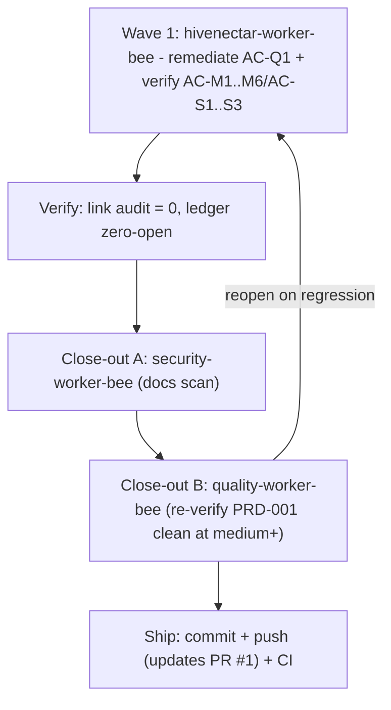

# Execution Ledger: PRD-001 (the-smoker run)

> Category: Ledger | Version: 1.0 | Date: July 2026 | Status: Active

Single source of truth for the `/the-smoker` completion run over **PRD-001 Three-Daemon Topology**. Primary bee: `hivenectar-worker-bee`. Branch: `feature/prd-001-004-refine`. Status legend: OPEN / IN PROGRESS / DONE (implemented) / VERIFIED (independently confirmed).

PRD-001 is the architectural-planning PRD; its deliverables are documentation artifacts (ADR-0003, the four-role contract, the process/health/infra contracts). Every module AC was already satisfied and marked PASS in the PR #1 QA pass. This run drives the one remaining open item (code-reference convention conformance) to completion and re-verifies the whole module to a clean close-out.

---

## AC Ledger

| ID | Source | Criterion (abbrev) | Owner | Status |
|---|---|---|---|---|
| AC-M1 | index | ADR-0003 exists, supersedes ADR-0002 two-daemon framing, preserves invariants | hivenectar-worker-bee | DONE (ADR exists + linked in refine; supersession recorded in ADR-0003 body "Relationship to ADR-0002") |
| AC-M2 | index | Four roles each have a boundary statement, no overlap | hivenectar-worker-bee | DONE (001a role table + prose) |
| AC-M3 | index | PRD + ADR state no in-process state shared across the four roles | hivenectar-worker-bee | DONE (001a non-integration points) |
| AC-M4 | index | hivenectar process surface (port/PID/lock/health/client/tenancy) with a code citation per claim; ports+paths flagged DEFAULT | hivenectar-worker-bee | DONE (001b) |
| AC-M5 | index | Shared-infra consumption contract names each seam + deploy-time tenancy invariant | hivenectar-worker-bee | DONE (001c) |
| AC-M6 | index | Port map consistent with real Honeycomb code (3850/3851/3852 occupied; 3853/3854 free) | hivenectar-worker-bee | DONE (index port table; ADR-0004 confirms 3853) |
| AC-Q1 | Doc Framework 6 | Code references use backtick file-path spans, not markdown links (75 non-resolving honeycomb/hivedoctor link tokens across the 4 files) | hivenectar-worker-bee | DONE (Wave 1: 75/75 converted, 0 remaining; independently verified) |
| AC-S1 | 001a US-001a.1..4 | thehive always-on, hivedoctor supervises all three, dashboard update cadence, no shared in-process state | hivenectar-worker-bee | DONE (verify vs ADR-0003/0004) |
| AC-S2 | 001b US-001b.1..4 | bind 3854 + /health, second-start refuses, own scoped Deep Lake client, restart leaves no stale lock | hivenectar-worker-bee | DONE (verify vs code) |
| AC-S3 | 001c US-001c.1..4 | Portkey own-client, embeddings 768-dim, compose-by-writing-rows, tenancy-mismatch caught | hivenectar-worker-bee | DONE (verify vs corpus) |

**Open count on entry: 1 (AC-Q1).** All others DONE, pending VERIFIED.

---

## Wave plan

**Wave 1 - hivenectar-worker-bee** (model: `claude-opus-4-8-thinking-xhigh-fast`; deep, nuanced multi-file doc conversion + corpus verification):
- Remediate AC-Q1: convert all 75 honeycomb/hivedoctor markdown links to backtick spans across `prd-001-...-index.md`, `prd-001a`, `prd-001b`, `prd-001c`. Full-form link text is kept as the span; short-form text has the full target path promoted into the span (Doc Framework 6).
- Verify AC-M1..M6 and AC-S1..S3 against the cited corpus/code; flag any residual doc gap.
- Exit: 0 honeycomb/hivedoctor markdown-link tokens in PRD-001; all ACs DONE; deliberate gaps and DEFAULT flags preserved.

**Close-out A - security-worker-bee** (model: `claude-sonnet-5-thinking-high`): docs-scoped scan of the delta (no secrets/PII).

**Close-out B - quality-worker-bee** (model: `claude-sonnet-5-thinking-high`; independent of the authoring bee): re-verify PRD-001 against the corpus; confirm AC-Q1 resolved and no regression; update the per-PRD qa report.

---

## Scope boundaries

- Edit ONLY PRD-001's four files. Do NOT touch PRD-002..016, the corpus (`knowledge/private/`), or the plan file.
- Preserve deliberate gaps (TLSH threshold, review-matches grammar, symbol/dir nectars) and all "DEFAULT - confirm before implementation" flags.
- Corpus-side items surfaced in PR #1 (ADR-0003 header lacks a formal Supersedes field; ADR-0004 header non-conformance) are OUT OF SCOPE here and remain flagged for the corpus owner.

---

## Run log

- Recon complete: AC ledger built, wave plan set, 1 OPEN item (AC-Q1, 75 link tokens).
- Wave 1 complete (hivenectar-worker-bee): 75/75 honeycomb/hivedoctor markdown links converted to backtick spans (index 7, 001a 12, 001b 36, 001c 20). AC-M1..M6 verified against ADR-0002/0003/0004 + overview.md; no in-file doc gap found.
- Verification (independent): self-verify grep = 0 remaining; all internal doc links resolve; only the 4 PRD-001 files changed; `git diff --check` clean; no em/en dashes introduced in authored spans (pre-existing prose em dashes preserved per the rule exception). AC-Q1 -> DONE. Open count: 0.
- Close-out A (security-worker-bee): PASS, clean. Docs-scoped scan of the PRD-001 delta + ledger found no secrets/credentials/PII; no files modified.
- Close-out B (quality-worker-bee, armed with quality-stinger + hivenectar-stinger): PASS at medium+, zero open Warnings. Independently re-verified grep=0, no internal link broken, AC-M1..M6 unchanged in substance, AC-Q1 resolved (75/75). Updated the per-PRD qa report (Detrimental Patterns WARNING -> PASS; W-1 moved to Resolved). No new findings.
- Orchestrator: refreshed the consolidated report (`reports/2026-07-01-...`) so PRD-001's scorecard/summary/W-1 status reflect the remediation; W-1 now scoped to PRD-002/003 only.

## Final status

All 9 ACs **VERIFIED** (AC-M1..M6, AC-S1..S3 verified against the corpus; AC-Q1 remediated + independently verified + quality-confirmed). Security + quality close-out clean at medium+. PRD-001 is complete to the the-smoker bar. Ready to ship (updates PR #1).
