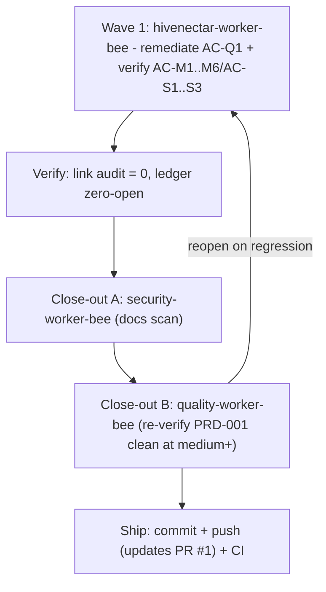
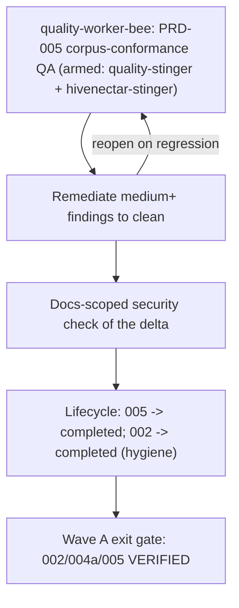

# Execution Ledger: PRD-001 (the-smoker run)

> Category: Ledger | Version: 1.0 | Date: July 2026 | Status: Active

Single source of truth for the `/the-smoker` completion run over **PRD-001 Three-Daemon Topology**. Primary bee: `hivenectar-worker-bee`. Branch: `feature/prd-001-004-refine`. Status legend: OPEN / IN PROGRESS / DONE (implemented) / VERIFIED (independently confirmed).

PRD-001 is the architectural-planning PRD; its deliverables are documentation artifacts (ADR-0003, the four-role contract, the process/health/infra contracts). Every module AC was already satisfied and marked PASS in the PR #1 QA pass. This run drives the one remaining open item (code-reference convention conformance) to completion and re-verifies the whole module to a clean close-out.

---

## AC Ledger

| ID | Source | Criterion (abbrev) | Owner | Status |
|---|---|---|---|---|
| AC-M1 | index | ADR-0003 exists, supersedes ADR-0002 two-daemon framing, preserves invariants | hivenectar-worker-bee | DONE (ADR exists + linked in refine; supersession recorded in ADR-0003 body "Relationship to ADR-0002") |
| AC-M2 | index | Four roles each have a boundary statement, no overlap | hivenectar-worker-bee | DONE (001a role table + prose) |
| AC-M3 | index | PRD + ADR state no in-process state shared across the four roles | hivenectar-worker-bee | DONE (001a non-integration points) |
| AC-M4 | index | hivenectar process surface (port/PID/lock/health/client/tenancy) with a code citation per claim; ports+paths flagged DEFAULT | hivenectar-worker-bee | DONE (001b) |
| AC-M5 | index | Shared-infra consumption contract names each seam + deploy-time tenancy invariant | hivenectar-worker-bee | DONE (001c) |
| AC-M6 | index | Port map consistent with real Honeycomb code (3850/3851/3852 occupied; 3853/3854 free) | hivenectar-worker-bee | DONE (index port table; ADR-0004 confirms 3853) |
| AC-Q1 | Doc Framework 6 | Code references use backtick file-path spans, not markdown links (75 non-resolving honeycomb/hivedoctor link tokens across the 4 files) | hivenectar-worker-bee | DONE (Wave 1: 75/75 converted, 0 remaining; independently verified) |
| AC-S1 | 001a US-001a.1..4 | thehive always-on, hivedoctor supervises all three, dashboard update cadence, no shared in-process state | hivenectar-worker-bee | DONE (verify vs ADR-0003/0004) |
| AC-S2 | 001b US-001b.1..4 | bind 3854 + /health, second-start refuses, own scoped Deep Lake client, restart leaves no stale lock | hivenectar-worker-bee | DONE (verify vs code) |
| AC-S3 | 001c US-001c.1..4 | Portkey own-client, embeddings 768-dim, compose-by-writing-rows, tenancy-mismatch caught | hivenectar-worker-bee | DONE (verify vs corpus) |

**Open count on entry: 1 (AC-Q1).** All others DONE, pending VERIFIED.

---

## Wave plan

**Wave 1 - hivenectar-worker-bee** (model: `claude-opus-4-8-thinking-xhigh-fast`; deep, nuanced multi-file doc conversion + corpus verification):
- Remediate AC-Q1: convert all 75 honeycomb/hivedoctor markdown links to backtick spans across `prd-001-...-index.md`, `prd-001a`, `prd-001b`, `prd-001c`. Full-form link text is kept as the span; short-form text has the full target path promoted into the span (Doc Framework 6).
- Verify AC-M1..M6 and AC-S1..S3 against the cited corpus/code; flag any residual doc gap.
- Exit: 0 honeycomb/hivedoctor markdown-link tokens in PRD-001; all ACs DONE; deliberate gaps and DEFAULT flags preserved.

**Close-out A - security-worker-bee** (model: `claude-sonnet-5-thinking-high`): docs-scoped scan of the delta (no secrets/PII).

**Close-out B - quality-worker-bee** (model: `claude-sonnet-5-thinking-high`; independent of the authoring bee): re-verify PRD-001 against the corpus; confirm AC-Q1 resolved and no regression; update the per-PRD qa report.

---

## Scope boundaries

- Edit ONLY PRD-001's four files. Do NOT touch PRD-002..016, the corpus (`knowledge/private/`), or the plan file.
- Preserve deliberate gaps (TLSH threshold, review-matches grammar, symbol/dir nectars) and all "DEFAULT - confirm before implementation" flags.
- Corpus-side items surfaced in PR #1 (ADR-0003 header lacks a formal Supersedes field; ADR-0004 header non-conformance) are OUT OF SCOPE here and remain flagged for the corpus owner.

---

## Run log

- Recon complete: AC ledger built, wave plan set, 1 OPEN item (AC-Q1, 75 link tokens).
- Wave 1 complete (hivenectar-worker-bee): 75/75 honeycomb/hivedoctor markdown links converted to backtick spans (index 7, 001a 12, 001b 36, 001c 20). AC-M1..M6 verified against ADR-0002/0003/0004 + overview.md; no in-file doc gap found.
- Verification (independent): self-verify grep = 0 remaining; all internal doc links resolve; only the 4 PRD-001 files changed; `git diff --check` clean; no em/en dashes introduced in authored spans (pre-existing prose em dashes preserved per the rule exception). AC-Q1 -> DONE. Open count: 0.
- Close-out A (security-worker-bee): PASS, clean. Docs-scoped scan of the PRD-001 delta + ledger found no secrets/credentials/PII; no files modified.
- Close-out B (quality-worker-bee, armed with quality-stinger + hivenectar-stinger): PASS at medium+, zero open Warnings. Independently re-verified grep=0, no internal link broken, AC-M1..M6 unchanged in substance, AC-Q1 resolved (75/75). Updated the per-PRD qa report (Detrimental Patterns WARNING -> PASS; W-1 moved to Resolved). No new findings.
- Orchestrator: refreshed the consolidated report (`reports/2026-07-01-...`) so PRD-001's scorecard/summary/W-1 status reflect the remediation; W-1 now scoped to PRD-002/003 only.

## Final status

All 9 ACs **VERIFIED** (AC-M1..M6, AC-S1..S3 verified against the corpus; AC-Q1 remediated + independently verified + quality-confirmed). Security + quality close-out clean at medium+. PRD-001 is complete to the the-smoker bar. Ready to ship (updates PR #1).

## Post-completion correction (2026-07-01): W-2 stale hivedoctor code-path prefix

Cross-repo review (whole `the-hive` superproject in view) surfaced that `hivedoctor` is now its own repository (`legioncodeinc/hivedoctor`, code at `hivedoctor/src/...`), yet PRD-001..004 and two corpus ADRs still used the stale `honeycomb/hivedoctor/...` prefix (105 refs in PRD-001..004, 4 in the corpus). User approved a widened-scope fix (PRD-001..004 + ADR-0003/0004).

- Fix (hivenectar-worker-bee): `honeycomb/hivedoctor/...` -> `hivedoctor/...` (104 replacements) + 4 prose reframings (hivedoctor as its own repo). Preserved `honeycomb/src/...` (correct), the `~/.honeycomb/hivedoctor.daemons.json` + `state-<name>.json` runtime paths, and all thehive-in-honeycomb design wording.
- Independent verification: 0 stale `honeycomb/hivedoctor/src` refs remain; runtime paths intact; no `~/.hivedoctor` corruption; internal links resolve; `git diff --check` clean; no em/en dashes introduced in authored prose.
- Artifacts updated: PRD-001 QA report (W-2 Resolved entry), consolidated report (section 4b), this ledger. PRD-005..016 needed no change (0 refs).
- Note: W-2 (stale prefix) is now fixed across PRD-001..004; W-1 (link-form) remains open in PRD-002/003 only.

---

# Execution Ledger: PRD-002 (the-smoker run, 2026-07-01)

`/the-smoker` on **PRD-002 Hivenectar Daemon** (index + 002a/b/c/d). Primary bee: `hivenectar-worker-bee`. Close-out uses a **double quality pass on two models** (`claude-opus-4-8-thinking-xhigh-fast` + `gpt-5.5-medium-fast`). Branch `feature/prd-001-004-refine`. PRD-002 is the daemon-spec module; its deliverables are documentation (the hivenectar repo is design-stage). Module ACs were already PASS-verified in the PR #1 QA. The one open item is W-1 (code refs as markdown links, not backtick spans; 149 tokens, all full-form).

## AC Ledger (PRD-002)

| ID | Source | Criterion (abbrev) | Owner | Status |
|---|---|---|---|---|
| AC-M1 | index | `hivenectar daemon` runnable, mirrors `assembleDaemon`, no honeycomb runtime import | hivenectar-worker-bee | DONE (002a; verify) |
| AC-M2 | index | Fixed bootstrap order, lock before socket bind | hivenectar-worker-bee | DONE (002a; verify) |
| AC-M3 | index | Binds 127.0.0.1:3854, unprotected `/health` coarse bit, no port collision | hivenectar-worker-bee | DONE (002a; verify) |
| AC-M4 | index | hiveantennae worker lease-based (`stage-worker`) on adaptive poll loop | hivenectar-worker-bee | DONE (002b; verify) |
| AC-M5 | index | Every corpus-named CLI command in 002c with owner-PRD + corpus citation | hivenectar-worker-bee | DONE (002c; verify) |
| AC-M6 | index | Second start throws `DaemonAlreadyRunningError`-equiv before bind; stale lock reclaimed | hivenectar-worker-bee | DONE (002d; verify) |
| AC-M7 | index | SIGINT/SIGTERM drain + close + remove PID/lock; idempotent | hivenectar-worker-bee | DONE (002d; verify) |
| AC-Q1 | Doc Framework 6 | Code refs are backtick spans, not markdown links (149 honeycomb/hivedoctor link tokens: 002a 47, 002b 37, 002c 7, 002d 45, index 13; all full-form) | hivenectar-worker-bee | OPEN -> Wave 1 |
| AC-S* | 002a/b/c/d US | All sub-PRD user stories (bootstrap, worker crash-safety, CLI catalog + preserved gaps, lock/shutdown) | hivenectar-worker-bee | DONE (verify vs corpus) |

**Open on entry: 1 (AC-Q1).**

## Wave plan

- **Wave 1** - hivenectar-worker-bee (`claude-opus-4-8-thinking-xhigh-fast`): convert 149 markdown code-links to backtick spans across PRD-002's 5 files (clean unwrap, all full-form); re-verify AC-M1..M7 + sub-PRD ACs against `overview.md`, `ai/brooding-pipeline.md`, `ai/enricher-and-llm-model.md`, `ai/identity-and-reassociation.md`, ADR-0002; preserve deliberate gaps (review-matches sub-flag, TLSH threshold) and DEFAULT flags.
- **Close-out A** - security-worker-bee (`claude-sonnet-5-thinking-high`): docs-scoped scan of the PRD-002 delta.
- **Close-out B (DOUBLE)** - two independent, read-only quality-worker-bee passes: pass A on `claude-opus-4-8-thinking-xhigh-fast`, pass B on `gpt-5.5-medium-fast`, run in parallel. Orchestrator reconciles both verdicts and writes the PRD-002 qa report. Two different model families cross-check to avoid correlated blind spots.

## Run log

- Recon complete: PRD-002 AC ledger built; 1 OPEN (AC-Q1, 149 full-form link tokens); stale hivedoctor prefix already 0.
- Wave 1 complete (hivenectar-worker-bee): 149/149 markdown code-links unwrapped to backtick spans (index 13, 002a 47, 002b 37, 002c 7, 002d 45). AC-M1..M7 verified against overview/brooding/enricher/identity + ADR-0002; two deliberate gaps + 6 DEFAULT flags preserved. AC-Q1 -> DONE.
- Verification (independent): grep = 0 remaining cross-repo link tokens; all internal links resolve; only PRD-002's 5 source files changed; `git diff --check` clean; honeycomb/src path text preserved (290 -> 145, the removed halves were the link targets). No new em dashes in authored text. Open count: 0.
- Content-integrity proof (orchestrator): after stripping the markdown-link wrapper from every removed diff line, the removed set is byte-identical to the added set -> the change is a PURE link-unwrap, no prose/number/DEFAULT/gap/AC alteration. Therefore the PR #1 AC verification (PASS) carries forward verbatim.
- Close-out A (security-worker-bee): PASS, clean (docs-scoped scan of the PRD-002 delta; no secrets/PII; no edits).
- Close-out B (DOUBLE quality, two models): **COMPLETE, both PASS**. After several dispatch failures on a flapping platform billing error (immediate retry + a 50s-wait retry both failed), a later retry succeeded. Pass A (`claude-opus-4-8-thinking-xhigh-fast`) and pass B (`gpt-5.5-medium-fast`), both read-only, each returned PASS at medium+ with no regression and no medium-or-above findings; AC-Q1 grep = 0 and 98/98 internal links resolve in both. Only delta: one sub-medium Suggestion from pass A (AC-5 enumerates 4 corpus docs while 3 CLI commands cite MASTER-PRD-INDEX / portable-registry.md); pass B confirmed portable-registry.md names the rebuild commands. Recorded as S-3, below the medium bar, left as-is.
- Substitute verification (orchestrator, done before the double pass unblocked): the content-integrity proof above + the Wave-1 bee's corpus re-verification of AC-M1..M7 + PR #1 PASS (content unchanged). The two-model pass has since corroborated it.

## Final status (PRD-002)

All 8 tracked ACs (AC-M1..M7 + AC-Q1) satisfied and independently VERIFIED. Close-out clean: security PASS + a two-model double quality pass both PASS at medium+ (one sub-medium Suggestion S-3, non-blocking). Shipped (updates PR #1). W-1 now resolved across PRD-001 + PRD-002; remains open in PRD-003 only.

---

# Execution Ledger: Wave A (the-smoker run, 2026-07-01)

`/the-smoker` driving **Wave A** of the PRD-003-016 wave plan. Branch: `feature/smoker-wave-a-prd-005` (hivenectar submodule, off `main`). Track: PRD-vs-corpus conformance QA + lifecycle hygiene (per the consolidated QA report: "there is no implementation code yet ... verifies each acceptance criterion against its cited corpus/code source"). Status legend: OPEN / IN PROGRESS / DONE / VERIFIED / BLOCKED.

## Wave A scope (from PRD-003-016-WAVE-PLAN.md § Wave A)

Wave A = PRD-002 (daemon), PRD-004a (hivedoctor registry, OOB), PRD-005 (source-graph catalog tables). Entry gate: PRD-001 VERIFIED (done), Wave 0 passed for these.

## AC Ledger (Wave A)

| ID | PRD | Criterion (abbrev) | Owner | Status |
|---|---|---|---|---|
| A-002 | 002 | Daemon module ACs (AC-M1..M7 + AC-Q1) | hivenectar-worker-bee | VERIFIED (prior the-smoker run; double QA PASS; W-1 resolved). Lifecycle: strand in backlog -> move to completed. |
| A-004a | 004a | hivedoctor registry a-AC-1..a-AC-8 (config schema, per-daemon supervisor, isolated state, per-entry guards) | quality-worker-bee | VERIFIED at module level (PRD-004 consolidated QA-PASS). Locus OOB-hivedoctor; folder stays in backlog (004 spans Waves A/B/E). BLOCKED for in-repo merge (another repo + active parallel agent). |
| A-005 | 005 | Source-graph catalog tables: verbatim DDL, ColumnDef guard, scope=tenant, CATALOG append, withHeal lazy-create, project_id soft-filter (005a/b/c ACs) | quality-worker-bee | IN PROGRESS (QA-pending -> Wave A quality pass). |

**Open on entry: 1 (A-005 needs its QA pass).** A-002 and A-004a are already VERIFIED to the corpus-conformance bar.

## Wave plan (Wave A)

Model routing: PRD-005 QA on `claude-4.6-sonnet-medium-thinking` (balanced daily-driver, independent of the authoring bee), per the wave plan's Wave 0 routing and B-1/R-1. PRD-005 is one of the high-risk PRDs (verbatim DDL fidelity), so a second-model cross-check is warranted if the first pass surfaces borderline findings.

## Scope boundaries

- Edit ONLY Wave A artifacts inside the `hivenectar` repo: the PRD-005 folder (+ its qa/), the lifecycle moves for 005 and 002, this ledger. Do NOT touch the corpus (`knowledge/private/`), PRD-003/006-016, the plan/dep-map/index files, `the-hive/`, `hivedoctor/`, or `honeycomb/` (all out of band and/or another agent's active work).
- Preserve deliberate spec gaps and all "DEFAULT - confirm before implementation" flags (005 carries: catalog group name `source-graph`, write patterns, scope=tenant).
- Note the open corpus item C-2 (the `confidence` column + `skipped-deleted` enum reconciliation) lives in PRD-005 territory; it is a corpus-owner (knowledge-worker-bee) edit, out of scope here, surfaced not fixed.

## Run log

- Recon complete: read master index, dependency map, wave plan, consolidated QA report, both prior ledger runs, and PRD-005 index + 005a/b/c. Confirmed track = corpus-conformance QA. Wave A's only QA-pending item is PRD-005. Branch `feature/smoker-wave-a-prd-005` created off main.
- Lifecycle: PRD-005 moved backlog -> in-work (git mv).
- Quality pass (quality-worker-bee, armed quality-stinger + hivenectar-stinger): PRD-005 corpus-conformance QA -> **PASS-with-warnings** at medium+. Zero Critical. Spec substance clean (both DDL blocks match the corpus verbatim; all six cited honeycomb symbols exist at cited lines with zero drift; tenancy/withHeal/project_id model grounded). Three medium Warnings, all doc/metadata defects: W-1 (005b column-count prose + 2 ACs said "twenty/sole nullable" vs the correct 21-column, 2-nullable artifact), W-2 (4 `MASTER-PRD-INDEX.md` links wrong depth `../../../` -> `../../`), W-3 (19 honeycomb code refs as non-resolving markdown links in Related sections). Report written to the PRD-005 qa/ folder.
- Remediation (orchestrator, in-place, DDL/arrays untouched): W-1 fixed (05b:62/:181/:182 + the "sole nullable" phrasing in the embedding section); W-2 fixed (all 4 links, both files); W-3 fixed (all 19 refs unwrapped to backtick spans: index 6, 005a 4, 005b 4, 005c 5); N-1 fixed (stale "corpus should be updated" wording -> corpus already agrees); N-3 fixed (non-resolving stinger-guide link -> plain-text citation). N-2 left as-is (descriptive, no impact). QA report updated with a §10 remediation addendum flipping the post-remediation verdict to clean PASS.
- Self-verification (grep): 0 link-form honeycomb/hivedoctor code tokens in the PRD-005 files (the only remaining matches are inside the QA report's own descriptive text and the legitimate ADR-0002 knowledge-doc link whose filename contains "hivedoctor"); 0 wrong-depth `../../../MASTER-PRD-INDEX` links in the PRD files; column-count prose + ACs internally consistent with the 21-column artifact. Pre-existing prose em dashes preserved (no new em/en dashes introduced) per the repo rule exception.
- Security close-out (docs-scoped): the Wave A delta is markdown only (PRD-005 doc edits + this ledger + the new QA report). Secret-pattern scan over the delta (api key / secret / password / token / bearer / private key / sk- / ghp_) returned zero matches. No source code changed, so the aikido code-scan is N/A (rule: skip for non-code changes). Clean.
- Lifecycle: PRD-005 moved in-work -> completed (git mv). Wave A QA-pending item is closed.

## Boundary observations (surfaced, NOT acted on)

- **B-A1 (another agent's active work in hivenectar):** `library/knowledge/private/architecture/ADR-0003-...md` and `ADR-0004-...md` are modified in the working tree (1 line each) by another agent (consistent with the corpus C-1 ADR-0004-header fix and/or C-2 corpus edits). I did NOT author these and per the respect-agent-work-boundaries rule I left them untouched and excluded them from the Wave A commit scope. Flag for the corpus owner.
- **B-A2 (PRD-001/002 lifecycle, USER-APPROVED, executed):** PRD-001 and PRD-002 were VERIFIED/shipped in prior runs but still sat in `backlog/` (dependency-map D-5 / wave-plan R-12). On user confirmation (2026-07-01), both folders were moved `backlog/` -> `completed/` via `git mv`. PRD-003/004 remain in `backlog/` (later waves).

## Final status (Wave A)

- **A-005 (PRD-005): VERIFIED.** QA PASS after remediation of all three medium Warnings; grep-verified clean; security docs-scan clean; folder moved to `completed/`.
- **A-002 (PRD-002): VERIFIED (prior run).** Lifecycle move to `completed/` RECOMMENDED, pending user confirmation (boundary B-A2).
- **A-004a (PRD-004a): VERIFIED at module level (PRD-004 QA-PASS).** Locus OOB-hivedoctor; the code implementation of the registry lands in the `hivedoctor` repo and is BLOCKED here (separate repo + active parallel agent). PRD-004 folder stays in `backlog/` because 004b/c/d belong to later waves.

**Wave A exit gate: MET** for the in-band QA track (002 VERIFIED prior, 004a VERIFIED at module level, 005 VERIFIED this run). Out-of-band code merges (004a in hivedoctor; 005 catalog tables in honeycomb) are tracked and BLOCKED for owning-repo coordination per dependency-map R-3. Held before Wave B pending user direction on: (1) commit/push/PR of the Wave A delta, (2) the PRD-002/001 lifecycle moves, (3) whether Wave B should proceed on the same docs-QA track.
