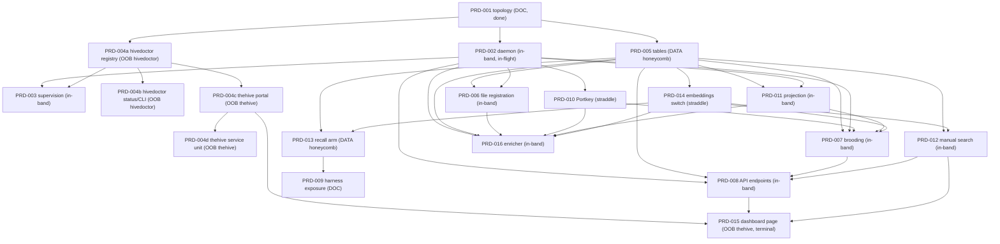

# PRD-003 to PRD-016 Dependency Map (Hivenectar Implementation)

> Category: Requirements | Version: 1.0 | Date: July 2026 | Status: Draft

The exhaustive dependency profile for the Hivenectar PRD set. For any PRD or sub-PRD, a reader (human or AI) can determine from this document whether it can start independently or is gated, and by exactly what. It is the analysis input to the companion [`PRD-003-016-WAVE-PLAN.md`](./PRD-003-016-WAVE-PLAN.md). The authoritative brief is [`MASTER-PRD-INDEX.md`](./MASTER-PRD-INDEX.md); the authored PRD content lives under [`backlog/`](./backlog/); the status ground truth is the consolidated QA report ([`reports/2026-07-01-prd-001-004-corpus-conformance-qa.md`](./reports/2026-07-01-prd-001-004-corpus-conformance-qa.md)) and the [`EXECUTION_LEDGER.md`](../ledger/EXECUTION_LEDGER.md).

---

## 1. Purpose and methodology

**Purpose.** Encode, per PRD and per sub-PRD, the upstream dependencies, downstream dependents, acceptance-criteria linkage, locus (which codebase the work lands in), authored state, blockers, and the deliberate spec gaps and DEFAULT-confirm flags each PRD carries. This is the map an execution driver reads to schedule work without re-deriving the graph.

**Methodology.**

1. Each dependency edge "X depends on Y" means Y must be substantially available before X can be implemented AND its acceptance criteria verified.
2. Every edge and every acceptance-criteria claim is grounded in a citation to `MASTER-PRD-INDEX.md` or to an authored PRD index file under `backlog/`. Cross-repo code is cited as a backtick file-path span (for example `honeycomb/src/daemon/runtime/memories/recall.ts`), never a link, per the documentation framework.
3. The graph was verified against the authored PRD text, not only against the master index. Where the authored PRDs contradict the brief that commissioned this map, the discrepancy is recorded in Section 7 and the corrected edge is the one encoded here.
4. Sub-PRD micro-dependencies are derived from each PRD index Features/Sub-features table plus the master index sub-PRD breakdown; where an authored sub-PRD file states a tighter dependency, that is used.

**Scan-time correction (read this first).** The commissioning brief asserted that PRD-005 through PRD-016 are unauthored (no folders, no acceptance criteria). That is false at scan time. All twelve have full folders under `backlog/` with an index file, sub-PRD files, and complete acceptance criteria at the same standard as PRD-001 to PRD-004; several also carry a `qa/` subfolder. The corpus corroborates this: the QA report Section 7 states "PRD-005 through PRD-016 were not modified," Section 4b states "PRD-005..016 had zero `honeycomb/hivedoctor/` references," and Section 5 places the `confidence` column and `skipped-deleted` enum "in PRD-005/PRD-006 territory." PRDs 001 to 004 also cross-link the 005 to 016 index files as existing targets. This document therefore records the true authored state and flags the discrepancy (Section 7, D-1). These files are treated as strictly read-only (they are another agent's active work).

---

## 2. Legend

| Token | Meaning |
|---|---|
| **Authored** | Folder + index + sub-PRDs present on disk under `backlog/`, with complete acceptance criteria. |
| **Index-only** | Exists only as a `MASTER-PRD-INDEX.md` description; no folder. (No PRD is in this state at scan time.) |
| **QA-PASS** | An independent quality pass recorded a PASS at the medium-and-above bar. |
| **QA-pending** | Authored but no QA report recorded yet. |
| **HARD dep** | Y must be substantially available before X is implemented and its ACs verified. |
| **SOFT dep** | Pattern reuse, contract citation, or data-presence relationship; X can be specified and largely built without Y, but a specific AC or end-to-end behavior needs Y. |
| **Locus DOC** | Documentation-only PRD; ships no code (lands in the `hivenectar` repo as a spec/decision record). |
| **Locus IN-BAND** | New code in the `hivenectar` daemon (this project's runnable process). |
| **Locus DATA** | Shared data or recall layer in the `honeycomb` repo. |
| **Locus STRADDLE** | New provider-switch/config logic the hivenectar daemon consumes, reusing or extending a `honeycomb` transport; exact repo placement is a design point to confirm. |
| **Locus OOB-HIVEDOCTOR** | Out-of-band work in the `hivedoctor` repo. |
| **Locus OOB-THEHIVE** | Out-of-band work in the `honeycomb` repo, in the new `thehive` package. |
| **Node status DONE** | Documentation deliverables complete and independently verified. |
| **Node status IN-FLIGHT** | An agent is actively working it (per the brief). |
| **Node status AUTHORED-BACKLOG** | Authored, in `backlog/`, awaiting QA and implementation. |

---

## 3. Status snapshot (all 16 PRDs)

| PRD | Title | Authored? | Lifecycle / QA | Node status | Locus | In/Out band | Effort | Priority |
|---|---|---|---|---|---|---|---|---|
| 001 | Three-daemon topology + ADR-0003 | Authored | backlog / QA-PASS, VERIFIED (ledger) | DONE | DOC | in-band (docs) | M | P0 |
| 002 | Hivenectar daemon | Authored | backlog / QA-PASS (double pass, both PASS) | IN-FLIGHT | IN-BAND | in-band | XL | P0 |
| 003 | Hivenectar supervision by hivedoctor | Authored | backlog / QA-PASS, W-1 open | AUTHORED-BACKLOG | IN-BAND (+ registry touch) | in-band | M | P0 |
| 004 | hivedoctor registry + thehive portal | Authored (a-d) | backlog / QA-PASS | AUTHORED-BACKLOG | OOB-HIVEDOCTOR + OOB-THEHIVE | out-of-band | L | P0 |
| 005 | Source Graph catalog tables | Authored | backlog / QA-pending | AUTHORED-BACKLOG | DATA | out-of-band (honeycomb catalog) | S | P0 |
| 006 | File registration protocol | Authored | backlog / QA-pending | AUTHORED-BACKLOG | IN-BAND | in-band | L | P0 |
| 007 | Brooding process | Authored | backlog / QA-pending | AUTHORED-BACKLOG | IN-BAND | in-band | L | P0 |
| 008 | Hivenectar daemon API endpoints | Authored | backlog / QA-pending | AUTHORED-BACKLOG | IN-BAND | in-band | L | P1 |
| 009 | Harness exposure via recall (doc) | Authored | backlog / QA-pending | AUTHORED-BACKLOG | DOC | in-band (docs) | XS | P1 |
| 010 | Portkey gateway integration | Authored | backlog / QA-pending | AUTHORED-BACKLOG | STRADDLE | in-band + honeycomb transport | M | P1 |
| 011 | Portable projection sync | Authored | backlog / QA-pending | AUTHORED-BACKLOG | IN-BAND | in-band | M | P1 |
| 012 | Manual Source Graph search | Authored | backlog / QA-pending | AUTHORED-BACKLOG | IN-BAND | in-band | M | P2 |
| 013 | Recall arm: source_graph_versions | Authored | backlog / QA-pending | AUTHORED-BACKLOG | DATA | out-of-band (honeycomb recall) | M | P0 |
| 014 | Embeddings provider switching | Authored | backlog / QA-pending | AUTHORED-BACKLOG | STRADDLE | in-band + honeycomb transport | M | P1 |
| 015 | Dashboard Source Graph page | Authored | backlog / QA-pending | AUTHORED-BACKLOG | OOB-THEHIVE | out-of-band | M | P1 |
| 016 | Enricher steady-state loop | Authored | backlog / QA-pending | AUTHORED-BACKLOG | IN-BAND | in-band | L | P1 |

Notes on the snapshot:

- **001** is marked DONE for its documentation deliverables (ADR-0003, the four-role contract, the process/health/infra contracts); all nine ACs are VERIFIED per the ledger. It changes no code.
- **002** carries a completed double quality pass (both PASS at medium-and-above) per the ledger; the brief states an agent is actively working it, so it is IN-FLIGHT and read-only. See Section 7, D-2, for the billing-block nuance and D-5 for the lifecycle-location observation.
- **003** is QA-PASS but retains one open Warning (W-1: honeycomb code references written as non-resolving markdown links) per the QA report Section 4 and the ledger.
- **004** is QA-PASS at the module level; all four sub-PRDs (004a-004d) are authored on disk, including `prd-004d-thehive-service-unit-and-registration.md` (8 ACs d-AC-1..d-AC-8, covered by the PRD-004 QA-PASS). An earlier "absent" reading of 004d was a stale-listing error, retracted after a 2026-07-01 disk check. See Section 7, D-3, and Section 8, B-2.
- **005 to 016** are authored and in backlog but carry no recorded QA report (only PRD-001 to PRD-004 have QA). QA-pending is the gate before their implementation begins (see the wave plan Wave 0).

---

## 4. Per-PRD dependency profiles (003 through 016)

Each profile lists: id and title; locus; authored state; effort and priority (from the PRD index); upstream dependencies (HARD/SOFT with reason and AC linkage); downstream dependents; sub-PRDs with micro-dependencies; acceptance criteria (verbatim IDs and text for the authored module ACs; for PRDs whose index states criteria as an unnumbered checklist, the criteria are quoted as authored); the start verdict; blockers and gaps; and the DEFAULT-confirm flags and deliberate spec gaps the PRD carries.

---

### PRD-003 - Hivenectar supervision by hivedoctor

- **Locus:** IN-BAND (hivenectar repo), with a cross-repo touchpoint (the installer appends one entry to hivedoctor's registry file). Source: [`prd-003 index`](./backlog/prd-003-hivenectar-supervision/prd-003-hivenectar-supervision-index.md) header "Codebase: hivenectar repo".
- **Authored:** yes. **QA:** PASS, W-1 open. **Effort:** M (3-8h). **Priority:** P0.

**Upstream dependencies:**

| Dep | Type | Reason (grounded) |
|---|---|---|
| 001 | HARD | Conforms to the process surface PRD-001b locked (port 3854, `~/.honeycomb/hivenectar.pid` / `.lock`, coarse health bit). Source: prd-003 index Overview and Related. |
| 002 | HARD | The daemon must exist to expose `/health`, write its PID/lock, and be started by the service unit; prd-003 index Non-Goals defers the shutdown path that removes the PID/lock to PRD-002. |
| 004a | HARD | prd-003 "consumes the registry (PRD-004 builds it)"; AC-4 appends hivenectar's entry to `~/.honeycomb/hivedoctor.daemons.json`, whose schema is 004a's deliverable. |

**Downstream dependents:** none (supervision is a leaf that makes the runtime reliable; nothing else is gated on it).

**Sub-PRDs and micro-dependencies:**

- `prd-003a-health-endpoint-and-pid-lock`: depends on 002 (the daemon that mounts `/health` and acquires the lock) and 001b (the locked port/paths/health-bit contract).
- `prd-003b-os-service-unit`: depends on 002 (the `hivenectar daemon` run command the unit launches) and the hivedoctor self-registration service-template pattern. It references thehive's service unit PRD-004c/004d in Non-Goals (see D-4).
- `prd-003c-registry-entry-and-watchdog-guards`: depends on 004a (the registry schema it writes into), 002 (hivenectar's own PID file the guards read), and 003a (the PID/lock it registers).

**Acceptance criteria (verbatim, module-level):**

- AC-1: "Given hivenectar is running, when hivedoctor probes `GET http://127.0.0.1:3854/health`, then it receives a `200` with a coarse `status: "ok"|"degraded"` body (a `503` + `degraded` when a sub-dependency is down)."
- AC-2: "Given hivenectar boots, when it acquires its single-instance lock, then it writes `~/.honeycomb/hivenectar.pid` and `~/.honeycomb/hivenectar.lock`, and a second start throws before binding port 3854."
- AC-3: "Given the OS boots (or the user logs in), when the registered service unit runs, then hivenectar starts; when it crashes, the OS restarts it."
- AC-4: "Given hivenectar's installer runs, then it appends one entry to `~/.honeycomb/hivedoctor.daemons.json` naming hivenectar with `healthUrl: http://127.0.0.1:3854/health` and `pidPath: ~/.honeycomb/hivenectar.pid`."
- AC-5: "Given hivenectar is healthy and its lock is held, when hivedoctor's restart rung checks, then it skips the restart (lock-held-and-healthy guard) - it does not start a second hivenectar that would hit the single-instance lock and exit."

**Can start independently?** No. **Gated by:** 001 (locked), 002 (in-flight), 004a (authored, not implemented).

**Blockers / gaps:** W-1 (code refs as markdown links) is open in PRD-003 only (QA report Section 4). References 004d in Non-Goals (which is authored and QA-passed; see B-2 and D-3/D-4).

**DEFAULT-confirm flags carried:** `/health` response shape, OS service unit names, startup grace (flagged in the sub-PRDs; prd-003 index Open questions).

---

### PRD-004 - hivedoctor daemon registry + thehive portal daemon (out-of-band)

- **Locus:** OOB-HIVEDOCTOR (004a, 004b) + OOB-THEHIVE (004c, 004d). Source: [`prd-004 index`](./backlog/prd-004-hivedoctor-registry-and-thehive/prd-004-hivedoctor-registry-and-thehive-index.md) Overview "work in two other codebases".
- **Authored:** yes, all four sub-PRDs 004a-004d on disk (see D-3). **QA:** PASS. **Effort:** L (1-3d). **Priority:** P0.

**Upstream dependencies:**

| Dep | Type | Reason (grounded) |
|---|---|---|
| 001 | HARD | "It is foundational: it lands early, and every other supervised daemon supervises against the registry this PRD delivers." Conforms to the PRD-001 topology + port contract. Source: prd-004 index Overview + Related (cites PRD-001). |

**Downstream dependents:** 003 (registers into the registry), 015 (thehive hosts the dashboard page). Internally, 004b, 004c depend on 004a; 004d depends on 004c.

**Sub-PRDs and micro-dependencies:**

- `prd-004a-hivedoctor-registry-config-and-supervisor-instances`: depends on 001 only. Root of the supervision registry. Depended on by 003c, 004b, 004c.
- `prd-004b-hivedoctor-status-and-cli`: depends on 004a (reports over the N registered daemons).
- `prd-004c-thehive-portal-daemon`: depends on 004a (registered + supervised like the others); SOFT-runtime-fetches PRD-008 endpoints and reuses honeycomb's `src/dashboard/web/` code; hosts PRD-015. Source: prd-004 index Goals + Non-Goals.
- `prd-004d-thehive-service-unit-and-registration`: depends on 004c. Authored + QA-passed (8 ACs d-AC-1..d-AC-8); see D-3.

**Acceptance criteria (verbatim, module-level):**

- AC-1: "Given hivedoctor's registry file lists honeycomb + thehive + hivenectar, when hivedoctor boots, then it spawns one independent supervisor instance per registry entry, each probing its own `healthUrl` on its own `probeIntervalMs`."
- AC-2: "Given two daemons are registered, when daemon A fails its `/health` and is restarted, then daemon B's incident log, remediation state, and consecutive-restart-failure count are untouched."
- AC-3: "Given thehive is registered and healthy, when the device boots, then thehive serves the unified dashboard on its port without waiting for any workload daemon to be healthy."
- AC-4: "Given thehive is updateable independently of hivedoctor, when thehive is upgraded, then hivedoctor's process is not restarted and its own supervisor instances keep running."
- AC-5: "Given a new workload daemon ships, when its installer runs, then the installer appends one entry to the registry file and does NOT touch hivedoctor's code or restart hivedoctor to register."
- AC-6: "Given hivedoctor's loopback status page and CLI, when an operator runs `hivedoctor status`, then the output reports every registered daemon's health, not just one."

**Can start independently?** 004a: yes, after 001 (which is locked). 004b/004c: gated by 004a. 004d: gated by 004c (authored + QA-passed; no authoring gate remains).

**Blockers / gaps:** none at the file level (004d is authored + QA-passed; B-2 / D-3). Registry file path `~/.honeycomb/hivedoctor.daemons.json` and thehive port 3853 are inherited defaults pending confirmation; 004d's thehive service-unit-name flags await sign-off (subsumed by B-7).

**DEFAULT-confirm flags carried:** registry file path and per-daemon schema (via 003 AC-4 and 004a), thehive port 3853 and PID/lock paths (from PRD-001), thehive service unit names (004d, when authored).

---

### PRD-005 - Source Graph catalog tables and lazy schema healing

- **Locus:** DATA (honeycomb repo). It registers two `CatalogTable` entries appended to the honeycomb `CATALOG` aggregation. Source: [`prd-005 index`](./backlog/prd-005-source-graph-catalog-tables/prd-005-source-graph-catalog-tables-index.md) Goals.
- **Authored:** yes. **QA:** pending. **Effort:** S. **Priority:** P0. **Role:** root of the data pipeline.

**Upstream dependencies:**

| Dep | Type | Reason (grounded) |
|---|---|---|
| 001 | HARD | PRD-005 conforms to the PRD-001 topology/tenancy contract: it declares `scope: tenant` with `org_id`/`workspace_id`/`project_id` per decision #1/#3, and 005 is scheduled after 001 (Wave A). Source: prd-005 index Related + MASTER-PRD-INDEX decision #3. |

**Downstream dependents (HARD unless noted):** 006, 007, 008, 011, 012, 013, 014, 016; SOFT for 010 (the `describe_model` column), 015 (reads `derived_from_nectar` as an edge source). Confirmed by each of those PRD index Related sections citing PRD-005. (PRD-014's 768-dim contract ties to the `FLOAT4[768]` `embedding` column in PRD-005b, so 005 to 014 is HARD, matching PRD-014's own upstream table.)

**Sub-PRDs and micro-dependencies:**

- `prd-005a-source-graph-table`: the identity + provenance ColumnDef[] + CatalogTable entry. No intra-set dep beyond 001's tenancy contract.
- `prd-005b-source-graph-versions-table`: the append-only ColumnDef[] + CatalogTable entry + the nullable 768-dim `embedding` column. This is the column PRD-013's semantic arm and PRD-014 tie to.
- `prd-005c-tenancy-and-project-id-filter`: the `project_id` soft-filter verification against `QueryScope`.

**Acceptance criteria (verbatim, as authored checklist):**

- "Both DDL blocks from `source-graph-schema.md` appear verbatim in 005a/005b; every column name and SQL type cross-checks against the source."
- "Each table's `ColumnDef[]` array satisfies the load-time guard (`schema.ts:80-100`): valid identifiers, no duplicates, and every `NOT NULL` column carries a `DEFAULT` (or is nullable, for the versions `embedding`)."
- "Both `CatalogTable` records declare `scope: tenant` and the columns carry `org_id` / `workspace_id` / `project_id`, mirroring `CODEBASE_COLUMNS`."
- "The `source-graph` catalog group is appended to `CATALOG`, so `REGISTRY` (`buildRegistry(CATALOG)`) picks up both tables' write patterns."
- "Both tables self-create on first write through `withHeal`; no DDL pre-step exists in the hivenectar boot sequence."
- "`project_id` is documented as a soft `WHERE` column filter inside the workspace partition, verified against `QueryScope` which carries only `org` + `workspace`."

**Can start independently?** Yes, after 001 (locked) and its own QA pass. It is the earliest data-layer work.

**Blockers / gaps:** none beyond QA-pending. C-2 in the QA report notes two corpus/PRD disagreements in PRD-005/PRD-006 territory (the `confidence` column and the `skipped-deleted` enum) remain open corpus edits.

**DEFAULT-confirm flags carried:** catalog group name `source-graph`; WritePattern for each table (`update-or-insert` / `append-only`); CatalogScope `tenant`.

---

### PRD-006 - File registration protocol

- **Locus:** IN-BAND. **Authored:** yes. **QA:** pending. **Effort:** L. **Priority:** P0.

**Upstream dependencies:**

| Dep | Type | Reason (grounded) |
|---|---|---|
| 005 | HARD | The protocol writes the `source_graph` / `source_graph_versions` rows PRD-005 owns. prd-006 index Non-Goals: "The tables this protocol writes - PRD-005." |
| 002 | HARD | The worker loop that runs the intake + ladder is PRD-002's; prd-006 index Non-Goals: "The daemon process, worker harness ... - PRD-002 (this PRD specifies the algorithm the worker runs)." |

**Downstream dependents:** 007 (SOFT: brooding reuses the ladder's `git ls-files` discovery), 016 (HARD: the enricher consumes the version rows re-association appends).

**Sub-PRDs and micro-dependencies:**

- `prd-006a-fswatch-intake-and-debounce`: mirrors `honeycomb/src/daemon/runtime/services/file-watcher.ts`; depends on 002 (worker) for where it runs.
- `prd-006b-event-to-ladder-step-classification`: depends on 006a (the debounced burst).
- `prd-006c-copy-event-detection`: depends on 005 (writes `derived_from_nectar` / `fork_content_hash`) and 006b.
- `prd-006d-reassociation-ladder`: depends on 005 (version rows), 006b/006c, and carries the TLSH fuzzy step; holds two deliberate spec gaps.

**Acceptance criteria (verbatim, selected authored checklist items):**

- "The watcher is `node:fs.watch` (directory-level) + `setTimeout`/`clearTimeout` debounce; `chokidar` is NOT a dependency."
- "The classification (006b) maps every debounced path to exactly one of: new path ... changed path ... or missing path ... the three inputs the ladder consumes."
- "The copy detector (006c) mints a fresh nectar N2 and sets `source_graph.derived_from_nectar = N1` + `fork_content_hash = H1` when a new path's content matches an existing file's current content."
- "The ladder (006d) carries all 5 steps verbatim ... (1) path+mtime+size exact, (2) path match + content changed, (3) exact content-hash match to a missing file, (4) TLSH fuzzy match to a missing file, (5) mint new - first match wins."
- "Step-4 fuzzy matches carry a `confidence` field; matches below the high-confidence band are surfaced to `honeycomb hivenectar review-matches` for human confirmation, NOT auto-claimed."
- "The TLSH confidence threshold is configurable and empirically tuned; no numeric threshold is pinned (deliberate spec gap preserved)."
- "The `review-matches` command is specified; its accept/reject flag syntax is flagged as a default-pending-implementation, not invented."
- "Pruning is a separate, explicit, human-triggered operation ... 30-day grace default; the ladder never deletes or reuses nectars."

**Can start independently?** No. **Gated by:** 005, 002.

**Blockers / gaps:** QA-pending. Carries two deliberate spec gaps (TLSH threshold, `review-matches` sub-flag syntax) that must not be filled without user authorization.

**DEFAULT-confirm flags carried:** `debounceMs = 500`; TLSH implementation (native addon or WASM); prune grace 30 days.

---

### PRD-007 - Brooding process

- **Locus:** IN-BAND. **Authored:** yes. **QA:** pending. **Effort:** L. **Priority:** P0.

**Upstream dependencies:**

| Dep | Type | Reason (grounded) |
|---|---|---|
| 005 | HARD | Writes `source_graph` + `source_graph_versions`. prd-007 index Non-Goals + Related. |
| 002 | HARD | The worker (002b) drives brooding; the CLI (002c) invokes it. prd-007 index Non-Goals. |
| 010 | HARD | "batched or solo LLM calls through Portkey (model choice + transport owned by PRD-010)." The describe step cannot run or be AC-verified without the Portkey routing. prd-007 index Overview + Non-Goals. |
| 014 | HARD | "embed `title + ' ' + description` (provider owned by PRD-014)." The embed step depends on the provider switch. prd-007 index Overview + Non-Goals. |
| 011 | HARD | Brooding is trigger #1 for the projection; it "regenerate `.honeycomb/nectars.json` (owned by PRD-011)." prd-007 index Overview. |
| 006 | SOFT | Reuses the ladder's `git ls-files` discovery (shared with cold-catch-up). prd-007 index Non-Goals + Related. |

**Downstream dependents:** 008 (HARD: the `/api/source-graph/build` endpoint triggers a brood), 013 (SOFT: real recall hits need brooded rows), 016 (SOFT: enricher is everything after brooding; shares discovery + populates the same tables).

**Sub-PRDs and micro-dependencies:**

- `prd-007a-discovery-and-content-hash-precheck`: depends on 006 discovery + 011 projection (the fresh-clone shortcut compares against the committed projection).
- `prd-007b-bucketing-and-llm-call-shapes`: depends on 010 (the batch/solo calls route through Portkey).
- `prd-007c-resumability-state-machine`: depends on 005b (`describe_status`).
- `prd-007d-cli-surface-and-dry-run`: depends on 002c (CLI dispatch); `--dry-run` needs no LLM call.

**Acceptance criteria (verbatim, selected authored checklist items):**

- "Brooding runs in the fixed discover -> pre-check -> bucket -> describe -> embed -> persist -> regenerate-projection order, mirroring `runGraphBuild`'s discover->extract->persist composition."
- "A file whose `content_hash` matches a committed projection entry inherits its nectar + description and makes no LLM call - the fresh-clone shortcut."
- "The four buckets and their thresholds match `brooding-pipeline.md` exactly: skip-binary ... skip-too-large (`> 256 KB`), batch (`<= 4 KB`/file, `<= 100 KB`/batch, 30-50 files/call), solo (`> 4 KB` but `<= 256 KB`)."
- "The cost math is carried verbatim - ~$3.05/2000 files = $0.65 input + $2.40 output; ~2.15M input tokens; ~318 calls ..."
- "Brooding is resumable via `source_graph_versions.describe_status` with no lockfile and no partial-state marker ..."
- "`brood --dry-run` runs discovery + bucketing, prints the estimated call count + cost, and exits without any LLM call."
- "Brooding does not block daemon readiness and runs in the background after the daemon accepts requests."

**Can start independently?** No. **Gated by:** 005, 002, 010, 014, 011 (and shares 006 discovery). This is the PRD whose forward dependency on 010/014 drives the ordering correction (Section 7, D-6).

**Blockers / gaps:** QA-pending. Depends on 010 and 014, which the master index linear order lists after 007 (D-6).

**DEFAULT-confirm flags carried:** discovery command `git ls-files --cached --others --exclude-standard -z`; batch size cap 40.

---

### PRD-008 - Hivenectar daemon API endpoints

- **Locus:** IN-BAND. **Authored:** yes. **QA:** pending. **Effort:** L (1-3d). **Priority:** P1.

**Upstream dependencies:**

| Dep | Type | Reason (grounded) |
|---|---|---|
| 002 | HARD | The route group mounts on the daemon PRD-002 produces; prd-008 index "attaches handlers to a group PRD-002 mounts." |
| 005 | HARD | The endpoints read/write the `source_graph` / `source_graph_versions` tables. prd-008 index Non-Goals + Related. |
| 012 | HARD | The search endpoint (008b) "delegates to PRD-012's search engine." prd-008 index Overview + AC. This is a co-dependency: 008b mounts 012's engine, 012b's endpoint is the handler 008b mounts (they land together). |
| 007 | HARD | `/api/source-graph/build` triggers a brood (the PRD-007 pipeline). prd-008 index Non-Goals: "008c owns the `build` endpoint that triggers a brood." |

**Downstream dependents:** 015 (HARD: the dashboard page fetches these endpoints), 004c (SOFT-runtime: thehive's aggregation `wire` binds to these endpoints).

**Sub-PRDs and micro-dependencies:**

- `prd-008a-route-group-scaffolding`: depends on 002 (the Hono app + `ROUTE_GROUPS` scaffolding).
- `prd-008b-search-endpoint`: co-dependent with 012 (mounts `searchSourceGraph`).
- `prd-008c-build-status-projection-endpoints`: depends on 007 (build), 016/enricher status (via the `describe_status` counts), and 011 (projection read/regenerate).

**Acceptance criteria (verbatim, selected authored checklist items):**

- "The hivenectar daemon mounts a `/api/source-graph` route group in its `ROUTE_GROUPS`-equivalent list (`protect: true`) ..."
- "A `mountSourceGraphApi(daemon, options)` module attaches handlers to `daemon.group("/api/source-graph")` once after `createDaemon(...)`, mirroring `mountGraphApi` ..."
- "Every `/api/source-graph/*` endpoint inherits the daemon's permission middleware ... an unfilled path returns the root 501 scaffold ..."
- "`/api/source-graph/search` delegates to PRD-012's search engine and returns the same result shape the CLI emits ..."
- "`/api/source-graph/build`, `/api/source-graph/status`, and the projection read/regenerate endpoints resolve scope per-request ... and reach storage solely through the injected storage client."

**Can start independently?** No. **Gated by:** 002, 005; co-develops with 012; needs 007 for the build endpoint's downstream behavior.

**Blockers / gaps:** QA-pending. The brief listed a SOFT dependency 008 -> 013; the authored PRD-008 declares PRD-013 a Non-Goal and explicitly distinct (D-7). No 008 -> 013 edge is encoded.

**DEFAULT-confirm flags carried:** route group path `/api/source-graph` with session-protect middleware.

---

### PRD-009 - Harness exposure via recall (documentation)

- **Locus:** DOC. **Authored:** yes. **QA:** pending. **Effort:** XS (< 1h). **Priority:** P1.

**Upstream dependencies:**

| Dep | Type | Reason (grounded) |
|---|---|---|
| 013 | HARD | "owns the recall arm this PRD's propagation claim depends on." The document verifies that the extended recall surfaces in each harness, which requires 013's arm to exist. The master index defers 009 to after 013. Source: prd-009 index Related + MASTER-PRD-INDEX "Dependencies". |
| 001c | SOFT | Cites the deploy-time tenancy invariant PRD-001c owns. prd-009 index Non-Goals. |

**Downstream dependents:** none (terminal documentation).

**Sub-PRDs:** `prd-009a-decision-record-and-propagation-verification` (the only sub-PRD; documentation-only).

**Acceptance criteria (verbatim, module-level):**

- AC-1: "The decision record states, in present tense, that Hivenectar ships no harness hooks/connectors/hook-config and gains exposure solely through PRD-013's recall arm ..."
- AC-2: "The PRD maps each of the three priority harnesses (Claude Code, Codex, Cursor) to (a) its connector ... (b) its hook-config/handler seam ... and (c) the single `recallMemories` call site that serves it ..."
- AC-3: "The PRD cites the exact insertion point (`recall.ts:2113-2118` `arms` array) PRD-013 extends ..."
- AC-4: "The PRD states the deploy-time tenancy invariant ... and cites PRD-001c as the owner, and names the failure mode ..."
- AC-5: "The PRD ships no code and changes no Deep Lake table; it contains no TODO/OPEN QUESTION and no value invented for a deliberate spec gap."

**Can start independently?** The document can be drafted early, but AC-3 verification ("the arm PRD-013 extends") is only truthful once 013 lands. Per the master index it is deferred to after 013.

**Blockers / gaps:** the master index explicitly defers 009 to after 013, which interacts with the "no deferrals" mandate (Section 8, B-4). The PRD-013 index cross-links PRD-009 with a stale folder slug (D-8).

**DEFAULT-confirm flags carried:** none (prd-009 index Open questions: "None").

---

### PRD-010 - Portkey gateway integration

- **Locus:** STRADDLE. New routing/config logic the hivenectar daemon consumes, reusing honeycomb's shipped Portkey transport. Source: prd-010 index Overview.
- **Authored:** yes. **QA:** pending. **Effort:** M (3-8h). **Priority:** P1.

**Upstream dependencies:**

| Dep | Type | Reason (grounded) |
|---|---|---|
| 002 | HARD | The daemon makes the brooding/enricher calls; the routing is exercised inside the daemon. prd-010 index Overview (brooding + enricher calls). |
| 005 | SOFT | Populates the `describe_model` audit column on `source_graph_versions`, owned by PRD-005. prd-010 index Data model changes. |

**Downstream dependents:** 007 (HARD: brooding LLM calls route through Portkey), 016 (HARD: enricher model calls route through Portkey).

**Sub-PRDs and micro-dependencies:**

- `prd-010a-portkey-transport-reuse`: reuses `buildPortkeyHeaders` + `PORTKEY_BASE_URL`; depends on 002 for where the calls originate.
- `prd-010b-model-selection-and-describe-model`: default Gemini 2.5 Flash; `brood --force --model <new>`; the `describe_model` audit column (SOFT dep on 005b).
- `prd-010c-semantic-cache-and-guardrails`: documents the Portkey-server-side story; carries the decision #6 no-client-toggle deliberate gap.

**Acceptance criteria (verbatim, module-level):**

- AC-1: "Given Portkey is enabled + keyed, when the brooding/enricher call runs, then it POSTs `https://api.portkey.ai/v1/chat/completions` with the `x-portkey-api-key` + `x-portkey-config` headers from `buildPortkeyHeaders`."
- AC-2: "Given no explicit model is set, when a description is generated, then the requested model resolves to Gemini 2.5 Flash (`activeModel` default)."
- AC-3: "Given the operator runs `brood --force --model <new>`, then every non-skipped row is reset to `pending` and re-described under the new model, with `describe_model` stamped to the new id."
- AC-4: "Given any description is produced, then the `source_graph_versions.describe_model` column records the model that produced it."
- AC-5: "Given semantic caching / guardrails are in effect, then no client vault key enables or disables either; both are Portkey-server-side via the `portkey.config` id (DECISION #6)."

**Can start independently?** No (needs 002). It should land no later than 007/016, which depend on it (D-6).

**Blockers / gaps:** QA-pending. Carries the decision #6 deliberate gap (no client-side cache toggle) which must not be "resolved" by adding a toggle.

**DEFAULT-confirm flags carried:** default model Gemini 2.5 Flash (via `activeModel` / `portkey.config`). Decision #6: semantic cache and guardrails are Portkey-server-side, no client toggle (a deliberate gap, not a DEFAULT to fill).

---

### PRD-011 - Portable projection sync

- **Locus:** IN-BAND. **Authored:** yes. **QA:** pending. **Effort:** M (3-8h). **Priority:** P1.

**Upstream dependencies:**

| Dep | Type | Reason (grounded) |
|---|---|---|
| 005 | HARD | The projection denormalizes the latest described version per nectar from the `source_graph` / `source_graph_versions` tables. prd-011 index Data model changes + Related. |
| 002 | HARD | The daemon writes the projection atomically and validates it on load. prd-011 index Goals (atomic write, validation-on-load); the CLI extends PRD-002c. |

**Downstream dependents (co-dependent triggers):** 007 (trigger #1: end of brooding), 016 (trigger #2: end of an enricher cycle that wrote new descriptions). 007 and 016 invoke 011's writer; 011's triggers #1/#2 are sourced from 007/016. They co-develop: 011's atomic-write primitive must exist for 007's end-of-brood trigger.

**Sub-PRDs and micro-dependencies:**

- `prd-011a-format-generation-triggers-atomic-write`: depends on 005 (source of truth) + 002 (writer).
- `prd-011b-validation-on-load-fresh-clone-inheritance`: depends on 002 (boot-time load) + 005 (schema).
- `prd-011c-rebuild-projection-cli-and-invariant`: depends on 002c (CLI) + 005 (scan source).

**Acceptance criteria (verbatim, module-level):**

- AC-1: "Given brooding completes, then a complete `.honeycomb/nectars.json` is written atomically (temp + rename) at the project root."
- AC-2: "Given an enricher cycle writes one or more new descriptions, then the projection is rewritten atomically with the newly-described versions substituted in."
- AC-3: "Given the operator runs `honeycomb hivenectar rebuild-projection`, then the file is regenerated from a single `source_graph_versions` scan ... and written atomically."
- AC-4: "Given the daemon loads a projection whose `version` exceeds its own schema version, then the projection is ignored with a warning and the daemon falls back to full brooding."
- AC-5: "Given the daemon loads a projection whose `project.org_id`/`workspace_id`/`project_id` does not match the current context, then the projection is ignored with a warning and never partially loaded."
- AC-6: "Given a fresh clone with a current projection, when the daemon boots, then every file whose content hash matches the projection inherits its nectar and description with zero LLM calls and zero fuzzy matches ..."
- AC-7: "Given `honeycomb hivenectar rebuild-projection`, then the output is byte-identical to the source-of-truth projection modulo `generated_at`."

**Can start independently?** No. **Gated by:** 005, 002. Its writer must precede 007/016's end-of-cycle triggers.

**Blockers / gaps:** QA-pending.

**DEFAULT-confirm flags carried:** projection path `.honeycomb/nectars.json`; projection write debounce 30s.

---

### PRD-012 - Manual Source Graph search

- **Locus:** IN-BAND (the `searchSourceGraph` engine + `hivenectar search` CLI). **Authored:** yes. **QA:** pending. **Effort:** M (3-8h). **Priority:** P2.

**Upstream dependencies:**

| Dep | Type | Reason (grounded) |
|---|---|---|
| 005 | HARD | Reads `source_graph_versions` (latest described version per nectar). prd-012 index Overview + Related. |
| 014 | HARD | The semantic arm embeds the query via the embed client PRD-014 owns; when embeddings are off, only the lexical arm runs. prd-012 index Overview + Non-Goals. |
| 008 | HARD (co-dependent) | The `/api/source-graph/search` endpoint is the handler PRD-008b mounts; 012b specifies the endpoint that 008b hosts. They land together. prd-012 index Overview + Non-Goals. |

**Downstream dependents:** 008 (008b mounts the engine), 015 (the dashboard search box calls the endpoint).

**Sub-PRDs and micro-dependencies:**

- `prd-012a-lexical-semantic-search-over-source-graph`: depends on 005 (table) + 014 (query vector). Independently mirrors the honeycomb `recall.ts` arm builders (this is a shared pattern with PRD-013, not a dependency on it; see D-7).
- `prd-012b-cli-and-endpoint`: co-dependent with 008b (the endpoint handler) and depends on 012a (the engine).

**Acceptance criteria (verbatim, selected authored checklist items):**

- "The `searchSourceGraph` engine runs a guarded lexical arm over `title + ' ' + description + ' ' + concepts` and, when embeddings are available, a guarded `<#>` vector arm over `embedding`, both scoped by `org_id`/`workspace_id`/`project_id` and filtered to the latest described version per nectar."
- "The engine applies the latest-per-nectar subquery (`MAX(seq)` join) and the `describe_status = 'described'` filter ..."
- "Every identifier routes through `sqlIdent` and the search term through `sqlLike` ... no value is hand-quoted."
- "A missing `source_graph_versions` table (fresh workspace) degrades to `{ hits: [], sources: [], degraded: true }`, never a 500 ..."
- "When embeddings are off / the query embed returns null, the engine runs the lexical arm only and returns `degraded: true` ..."
- "`hivenectar search <query>` (CLI) and `/api/source-graph/search` (endpoint) return the identical result shape (two clients of the one engine)."

**Can start independently?** No. **Gated by:** 005, 014; co-develops with 008b.

**Blockers / gaps:** QA-pending.

**DEFAULT-confirm flags carried:** search result default LIMIT 20; CLI command `hivenectar search <query>` (proposed).

---

### PRD-013 - Recall arm: add source_graph_versions to the fused recall

- **Locus:** DATA (honeycomb repo; extends `honeycomb/src/daemon/runtime/memories/recall.ts`). **Authored:** yes. **QA:** pending. **Effort:** M. **Priority:** P0. **Role:** the load-bearing agent-facing integration.

**Upstream dependencies:**

| Dep | Type | Reason (grounded) |
|---|---|---|
| 005 | HARD | Reads the `source_graph_versions` table (PRD-005b). prd-013 index Overview + Non-Goals. |
| 014 | HARD | The semantic arm scores the 768-dim `embedding` column PRD-014 produces; 013c is a BM25-only fallback, so the arm is partial without 014. prd-013 index Goals + Non-Goals + Related. |
| 007 / 016 | SOFT (data presence) | The arm code needs only the table to pass its fail-soft ACs, but end-to-end value (real hits for "where is the login logic") needs brooded/enriched rows. |

**Downstream dependents:** 009 (HARD: the documentation PRD verifies this arm propagates to all harnesses).

**Sub-PRDs and micro-dependencies:**

- `prd-013a-lexical-arm-builder-and-weight`: depends on 005 (table + `project_id` scoping via 005c).
- `prd-013b-semantic-arm-over-embedding`: depends on 014 (the 768-dim vector) + 005b (the `embedding` column).
- `prd-013c-graceful-bm25-fallback`: depends on 013a; degrades cleanly when 014 is off.

**Acceptance criteria (verbatim, selected authored checklist items):**

- "`"source_graph_versions"` is a member of the `RecallSource` union (`recall.ts:169`); `readSource` recognizes it (rather than defaulting it to `"sessions"`)."
- "`buildSourceGraphVersionsArmSql` mirrors `buildMemoriesArmSql` ... every identifier routes through `sqlIdent`, the search term through `sqlLike` ..."
- "The lexical arm carries the latest-per-nectar `MAX(seq)` subquery, the `describe_status = 'described'` filter, and the `project_id` conjunct ..."
- "`ARM_CLASS_WEIGHT` scores `source_graph_versions` as the distilled `memory` class ...; the RRF contribution is `1.0 / (RRF_K + rank)`."
- "The arm runs in the `Promise.all` ... and is appended to the `arms` array ...; its hits fuse with the other three via `fuseHits`."
- "Given an injected `EmbedClient` whose query embed is a 768-dim vector, a `source_graph_versions` semantic-arm spec in `SEMANTIC_ARMS` runs `<#>` cosine over `embedding` ..."
- "Given embeddings are off ... the lexical arm runs alone and `degraded` is `true` - no error, no quality cliff ..."
- "Given the `source_graph_versions` table is absent ... the arm returns empty for that arm only; the `memories`/`memory`/`sessions` arms still answer - the per-arm fail-soft contract holds."

**Can start independently?** No. **Gated by:** 005, 014 (code); real-hit verification needs data from 007/016.

**Blockers / gaps:** QA-pending. The prd-013 index cross-links PRD-009 with a stale folder slug (D-8).

**DEFAULT-confirm flags carried:** `ARM_CLASS_WEIGHT` for `source_graph_versions` = 1.0; the arm's per-arm LIMIT (matches the clamped caller limit, default 20).

---

### PRD-014 - Embeddings provider switching

- **Locus:** STRADDLE. The `EmbedProvider` switch the hivenectar daemon consumes; the Cohere path is modeled on honeycomb's `honeycomb/src/daemon/runtime/recall/rerank-portkey.ts`; it abstracts the hard-wired nomic consts at `honeycomb/embeddings/src/index.ts`. Exact repo placement is a design point to confirm. Source: prd-014 index Overview + MASTER-PRD-INDEX decision #5.
- **Authored:** yes. **QA:** pending. **Effort:** M (3-8h). **Priority:** P1.

**Upstream dependencies:**

| Dep | Type | Reason (grounded) |
|---|---|---|
| 005 | HARD | The 768-dim contract ties to the `FLOAT4[768]` `embedding` column in PRD-005b; a dimension change is a schema event. prd-014 index Data model changes + Related. |
| 010 | SOFT | The Cohere-via-Portkey transport reuses the Portkey auth pattern PRD-010 establishes. prd-014 index Related ("reuses the auth pattern from" PRD-010). It models directly on `rerank-portkey.ts`, so this is a pattern relation, not a hard build gate. |

**Downstream dependents:** 007 (HARD: brooding embeds), 012 (HARD: query vector), 013 (HARD: semantic arm), 016 (HARD: enricher embeds).

**Sub-PRDs and micro-dependencies:**

- `prd-014a-embed-provider-strategy-and-config`: extends the vault `embeddings.enabled` boolean into a provider selector.
- `prd-014b-cohere-via-portkey-transport`: modeled on `rerank-portkey.ts`; honors 768-dim or recall's `embed.dim_rejected` guard discards.
- `prd-014c-provider-switch-and-bm25-fallback`: the switch verification + BM25-only fallback.

**Acceptance criteria (verbatim, module-level):**

- AC-1: "Given no explicit provider selection, when an embedding is computed, then the local nomic daemon path runs (the default)."
- AC-2: "Given the operator selects the Cohere-via-Portkey provider, when an embedding is computed, then it POSTs to the Portkey embeddings endpoint via the rerank-transport pattern ..."
- AC-3: "Given either provider returns a vector that is not exactly 768-dim, then recall's `embed.dim_rejected` guard discards it (the column stays NULL) ..."
- AC-4: "Given embeddings are off ... then the embedding column is left NULL and recall falls back to BM25 over title/description - no error, no quality cliff."

**Can start independently?** After 005 (the dim contract) and its own QA pass; it needs no other in-set PRD to build, though it relates to 010's pattern. It should land no later than 007/012/013/016, which depend on it (D-6).

**Blockers / gaps:** QA-pending. The 768-dim value is fixed and load-bearing; changing it is out of scope (not a DEFAULT to flip).

**DEFAULT-confirm flags carried:** the provider selector extends `embeddings.enabled` (no parallel enable mechanism). The 768 dimension is fixed, not a default.

---

### PRD-015 - Dashboard Source Graph page

- **Locus:** OOB-THEHIVE (route registry + page component land in thehive, a honeycomb-repo daemon per PRD-004c). **Authored:** yes. **QA:** pending. **Effort:** M (3-8h). **Priority:** P1. **Role:** terminal consumer.

**Upstream dependencies:**

| Dep | Type | Reason (grounded) |
|---|---|---|
| 004c | HARD | The page is hosted by thehive; its `RouteEntry` lands in the shared `ROUTES` list thehive reads. prd-015 index Overview + Non-Goals. |
| 008 | HARD | The page hydrates from hivenectar's `/api/source-graph/*` endpoints through thehive's aggregation `wire`. prd-015 index Goals + AC-5. |
| 012 | HARD | The search box calls `/api/source-graph/search` with PRD-012's semantics. prd-015 index Goals + AC-4. |
| 005 | SOFT | Reads `derived_from_nectar` from the `source_graph` table as the file-graph edge source. prd-015 index Non-Goals + Data model changes. |

**Downstream dependents:** none (terminal).

**Sub-PRDs and micro-dependencies:**

- `prd-015a-route-registry-and-sourcegraphpage`: depends on 004c (thehive host + the shared `ROUTES` list).
- `prd-015b-file-graph-visualization`: depends on 005 (the `derived_from_nectar` column) + 008 (the file-graph payload endpoint).
- `prd-015c-search-box-and-status-widgets`: depends on 012 (search) + 008 (status/build) via thehive aggregation.

**Acceptance criteria (verbatim, module-level):**

- AC-1: "Given thehive is running and serving the shared `ROUTES` list ..., when the operator navigates to `/source-graph`, then the `SourceGraphPage` mounts via `matchRoute` and a "Source Graph" nav item appears in the sidebar - added by ONE `RouteEntry`, with no sidebar or router hand-edit."
- AC-2: "Given `SourceGraphPage` takes the shared `PageProps` ..., when it mounts, then it hydrates via the shared `wire` + `usePoll` recipe ... mirroring `GraphPage`."
- AC-3: "Given the file-graph panel, when it renders, then each node is a nectar (a file) and each edge is a `derived_from_nectar` provenance link ..."
- AC-4: "Given the search box, when the operator submits a query, then it calls hivenectar's `/api/source-graph/search` (PRD-012) through thehive's aggregation `wire`, and the file graph highlights / filters to matching nectars."
- AC-5: "Given the status/queue/cost widgets, when the page hydrates, then they read hivenectar's `/api/source-graph/status` + `/build` (PRD-008) ..."
- AC-6: "Given hivenectar is down but thehive is up, when the operator opens `/source-graph`, then thehive renders the shell + page chrome with the source marked unreachable, rather than blanking the dashboard."
- AC-7: "Given the codebase-graph density failure ..., when the Source Graph is added, then it is a NEW route (`/source-graph`), NOT a third graph on `/graph` ..."

**Can start independently?** No. **Gated by:** 004c, 008, 012. It is the deepest terminal consumer in the graph.

**Blockers / gaps:** QA-pending. The boot-on-start thehive host depends on 004c + 004d, both of which are authored and QA-passed; no file-level blocker remains.

**DEFAULT-confirm flags carried:** route `/source-graph`; page label `Source Graph`; icon (pick from thehive's icon set at implementation).

---

### PRD-016 - Enricher steady-state loop + meaningful-change heuristic

- **Locus:** IN-BAND. **Authored:** yes. **QA:** pending. **Effort:** L (1-3d). **Priority:** P1.

**Upstream dependencies:**

| Dep | Type | Reason (grounded) |
|---|---|---|
| 002 | HARD | Runs as a background loop inside the hiveantennae daemon. prd-016 index Overview. |
| 005 | HARD | Operates on the `source_graph_versions` rows (reads/updates `describe_status`, `describe_model`, embeddings). prd-016 index Data model changes. |
| 006 | HARD | Consumes the version rows re-association appends; the 500ms watcher intake debounce is the file-registration intake. prd-016 index Non-Goals + AC-2. |
| 010 | HARD | Each enricher model call routes through Portkey. prd-016 index Non-Goals + AC-5. |
| 014 | HARD | Embeds `title + ' ' + description` via the configured provider. prd-016 index Non-Goals. |
| 011 | HARD (co-dependent) | The end of an enricher cycle that wrote new descriptions is trigger #2 for the projection; the enricher invokes 011's writer. prd-011 index Goals (trigger #2). |

**Downstream dependents:** 011 (trigger #2 source; co-dependent).

**Sub-PRDs and micro-dependencies:**

- `prd-016a-queue-poll-debounce-meaningful-change`: depends on 005 (the pending queue) + 006 (the 500ms intake debounce).
- `prd-016b-model-call-and-describe-model-audit`: depends on 010 (Portkey transport) + 014 (embed).
- `prd-016c-failure-handling-persistent-alert`: depends on 008 (SOFT: per-cycle observability surfaces via `/api/source-graph/status`).

**Acceptance criteria (verbatim, module-level):**

- AC-1: "Given `source_graph_versions` rows with `describe_status = 'pending'`, when the enricher cycle runs, then it selects the latest pending version per nectar (grouped by nectar, ordered by `MIN(observed_at)`) scoped to the project."
- AC-2: "Given multiple `(eventType, filename)` events on the same path within the 500ms window, then they collapse to a single "the file at this path changed" signal entering re-association."
- AC-3: "Given a new version row whose token Jaccard similarity to the prior version is >= 0.85, then the change is deemed cosmetic: the new row inherits the prior `title`/`description`/`concepts`/`embedding` and `describe_model = inherited-from:<prev_content_hash>`, with no LLM call."
- AC-4: "Given a new version row whose token Jaccard similarity to the prior version is < 0.85, then the change is deemed meaningful and the row enters the pending queue."
- AC-5: "Given a description produced by an enricher model call, then `describe_model` records the producing model id."
- AC-6: "Given a batch fails all Portkey retries, then its version rows are marked `describe_status = 'failed'` and retried solo (smaller batch) on the next cycle."
- AC-7: "Given 5 consecutive failed cycles (default), then a dashboard alert is raised and further enrichment stops until an operator acknowledges."

**Can start independently?** No. **Gated by:** 002, 005, 006, 010, 011, 014. One of the most heavily gated PRDs (six upstream dependencies).

**Blockers / gaps:** QA-pending.

**DEFAULT-confirm flags carried:** enricher poll interval 30s; watcher intake debounce 500ms; `REDESCRIBE_THRESHOLD` 0.85; persistent-failure alert 5 consecutive cycles.

---

## 5. Consolidated dependency adjacency table

HARD edges unless marked (S) for SOFT. "Depends on" = upstream that must precede. "Depended on by" = downstream gated on it.

| PRD | Depends on | Depended on by |
|---|---|---|
| 001 | (corpus ADR-0001/0002 only) | 002, 003, 004a, 005, and transitively all |
| 002 | 001 | 003, 006, 007, 008, 010, 011, 016 |
| 003 | 001, 002, 004a | (none) |
| 004a | 001 | 003, 004b, 004c |
| 004b | 004a | (none) |
| 004c | 004a; 008 (S runtime); honeycomb dashboard reuse | 004d, 015 |
| 004d | 004c | (none) |
| 005 | 001 | 006, 007, 008, 010 (S), 011, 012, 013, 014, 015 (S), 016 |
| 006 | 005, 002 | 007 (S), 016 |
| 007 | 005, 002, 010, 011, 014, 006 (S) | 008, 013 (S data), 016 (S) |
| 008 | 002, 005, 007, 012 | 015, 004c (S runtime) |
| 009 | 013, 001c (S) | (none) |
| 010 | 002, 005 (S) | 007, 016 |
| 011 | 005, 002 | 007, 016 (co-dependent triggers) |
| 012 | 005, 014, 008 (co-dependent) | 008, 015 |
| 013 | 005, 014; 007/016 (S data) | 009 |
| 014 | 005, 010 (S) | 007, 012, 013, 016 |
| 015 | 004c, 008, 012, 005 (S) | (none) |
| 016 | 002, 005, 006, 010, 011, 014 | 011 (co-dependent trigger) |

---

## 6. Dependency graph

Edges shown are HARD dependencies. SOFT edges (005 to 010, 005 to 015, 006 to 007, 007/016 to 013 for data presence, 008 runtime to 004c) are omitted from the graph for readability and are captured in Section 5. The HARD edges 001 to 005 and 005 to 014 are drawn in the graph and are not omitted.

---

## 7. Discrepancies found versus the commissioning brief

Each item states the brief's claim, the corpus reality, and the resolution encoded in this map.

- **D-1 (critical): PRDs 005 to 016 are authored, not unauthored.** Brief: "PRD-005 through PRD-016: NOT AUTHORED ... No folders, no ACs." Reality: all twelve have folders, index files, sub-PRD files, and complete acceptance criteria under `backlog/`; corroborated by the QA report Sections 4b/5/7 and by PRD-001 to PRD-004 cross-links. Resolution: the status snapshot and every profile record the true authored state; the wave plan reframes Wave 0 from "author 005-016" to "QA 005-016 to the 001-004 standard" (they are QA-pending, not unwritten). Files left untouched (another agent's active work).
- **D-2: PRD-002 double-QA completed, it was not left blocked.** Brief: "the two-model double-QA on PRD-002 was BLOCKED by an external billing error." Reality: the ledger records several dispatch failures on a flapping billing error, then a successful retry; both passes (one on `claude-opus-4-8-thinking-xhigh-fast`, one on `gpt-5.5-medium-fast`) returned PASS at medium-and-above. Resolution: recorded as QA-PASS with the transient-block history noted; the risk register keeps the billing-flakiness as a process risk, not an open PRD-002 blocker.
- **D-3 (retracted): 004d exists and is QA-passed.** An earlier reading called `prd-004d-thehive-service-unit-and-registration.md` absent. That was a stale-listing error, retracted after a 2026-07-01 disk check: the file is present (9241 bytes, dated 2026-06-30, 8 ACs d-AC-1..d-AC-8) and is covered by the PRD-004 QA-PASS. Resolution: the "absent" claim is withdrawn everywhere; blocker B-2 is downgraded to LOW (residual: its thehive service-unit-name DEFAULT flags await sign-off, subsumed by B-7).
- **D-4: PRD-003 references 004d.** Confirmed: prd-003 index Non-Goals names "PRD-004c/004d"; the sub-PRDs 003b/003c reference the thehive service unit pattern. Encoded as a note on 003 and as blocker B-2.
- **D-5 (observation): PRD-002 lifecycle location.** The brief calls PRD-002 in-progress; per library schema v2, an actively implemented PRD lives in `in-work/`, but PRD-002 is still under `backlog/`. The ledger shows its documentation the-smoker run shipped. Observation only; not corrected here (read-only). Recorded so a driver reconciles lifecycle-location with the "in-flight" claim.
- **D-6: ordering correction (010/014 before 007/016).** The master index linear order (bottom of `MASTER-PRD-INDEX.md`) lists 010 + 014 after 007 + 011 + 016. But PRD-007 delegates its model call to PRD-010 and its embed to PRD-014, and PRD-016 calls the model via PRD-010 and embeds via PRD-014; their acceptance criteria cannot be verified without 010/014. Resolution: 010 and 014 are encoded as HARD upstream dependencies of 007 and 016; the wave plan lands 010/014 no later than the pipeline PRDs. Presented as a topological refinement, in the same spirit as the master index's own six decisions, not as an error in prior work.
- **D-7: 008 does not depend on 013.** Brief listed 008 -> 013 (soft). The authored PRD-008 declares PRD-013 a Non-Goal and explicitly distinct ("This PRD's search endpoint is a standalone search tool, distinct from the fused recall arm"). Similarly, PRD-012 and PRD-013 both independently mirror the honeycomb `recall.ts` arm builders; that is a shared pattern, not a 012 -> 013 dependency. Resolution: no 008 -> 013 edge and no 012 -> 013 edge are encoded.
- **D-8 (existing-file link defect, flagged not fixed): PRD-013 index stale cross-link to PRD-009.** The prd-013 index Related section links PRD-009 as `../prd-009-harness-exposure-via-recall-extension/prd-009-harness-exposure-via-recall-extension-index.md`, but the folder on disk is `prd-009-harness-exposure-via-recall`. The link does not resolve. Flagged for the owning agent; not modified here.

---

## 8. Blockers and gaps register

Severity scale: HIGH (blocks a wave gate), MEDIUM (blocks a specific PRD or needs sign-off before implementation), LOW (hygiene / observation).

| ID | Severity | Blocker / gap | Affected PRDs | Owner type | Resolution path |
|---|---|---|---|---|---|
| B-1 | HIGH | PRDs 005 to 016 authored but QA-pending; implementation cannot be verified to the 001-004 bar until each passes QA. | 005-016 | quality-worker-bee | Run the quality pass per PRD (parallelizable) as Wave 0. |
| B-2 | LOW | PRD-004d (thehive OS service unit + registration) is authored and QA-passed (the earlier "absent" finding is retracted, verified against disk). Residual: its thehive service-unit-name DEFAULT flags await sign-off, subsumed by B-7/R-7. | 004d | user | Sign off the thehive service-unit-name DEFAULT flags (tracked under B-7). |
| B-3 | HIGH | Out-of-band cross-repo work cannot fully complete inside `hivenectar`: 004a/004b land in the `hivedoctor` repo; 004c/004d/015 land in the `honeycomb`/`thehive` package; 005 and 013 land in the `honeycomb` data/recall layer. | 004a-d, 005, 013, 015; 010/014 straddle | cross-repo coordination (human + owning-repo agents) | Sequence out-of-band PRDs with the owning repos; the `hivenectar` repo tracks them but cannot merge them. |
| B-4 | MEDIUM | PRD-009 is explicitly deferred to after PRD-013 in the master index, which conflicts with a "no deferrals" mandate unless sequenced last. | 009 | driver + user | Sequence 009 as the final integration document after 013; if "no deferrals" is strict, record explicit user authorization for the ordering. |
| B-5 | MEDIUM | Ordering correction: 010/014 must land no later than 007/016 (D-6). If the master index linear order is followed literally, 007/016 ACs cannot be verified. | 007, 016, 010, 014 | driver | Adopt the corrected topological order in the wave plan. |
| B-6 | MEDIUM | W-1 (honeycomb code refs as non-resolving markdown links) remains open in PRD-003. | 003 | library-worker-bee (per the QA remediation recipe) | Convert the remaining PRD-003 link tokens to backtick spans per the QA report Section 4 recipe. |
| B-7 | MEDIUM | DEFAULT-confirm flags require user sign-off before implementation: ports 3853/3854, PID/lock paths, `/health` shape (001); config path, poll interval, bind host (002); `/health` response shape, service unit names, startup grace (003); registry path and per-daemon schema (003/004a); catalog group name, write patterns (005); debounceMs, TLSH impl, prune grace (006); discovery command, batch cap (007); route group path (008); default model (010); projection path, write debounce (011); search LIMIT, CLI name (012); arm class weight, arm LIMIT (013); provider selector (014); route, label, icon (015); poll, debounce, threshold, alert count (016). | all | user | Collect sign-off per DEFAULT before its PRD enters implementation; the flags themselves are authored, only the values await confirmation. |
| B-8 | MEDIUM | Deliberate spec gaps must not be filled without explicit user authorization: TLSH confidence threshold (006d), `review-matches` sub-flag grammar (006d), symbol/directory nectars (out of scope v1, no PRD), Portkey client-side cache toggle (010c, decision #6: none). | 006, 010; global | user | Keep unresolved; surface as decisions only. |
| B-9 | LOW | Two corpus/PRD disagreements remain open corpus edits in PRD-005/PRD-006 territory: the `confidence` column and the `skipped-deleted` enum (QA report Section 5, C-2). | 005, 006 | knowledge-worker-bee (corpus owner) | Reconcile the corpus vs the PRD in a corpus edit; out of scope for this map. |
| B-10 | LOW | PRD-013 index cross-links PRD-009 with a stale folder slug (D-8); the link does not resolve. | 013 | owning agent | Correct the slug to `prd-009-harness-exposure-via-recall`. Flagged, not fixed here. |
| B-11 | LOW | PRD-002 is marked in-flight but sits in `backlog/`, not `in-work/` (D-5). | 002 | the-smoker / driver | Move the folder to `in-work/` if it is actively implemented, per lifecycle-equals-location. |

---

*This map is analysis, not a PRD. It records the dependency state as of the scan; the companion [`PRD-003-016-WAVE-PLAN.md`](./PRD-003-016-WAVE-PLAN.md) turns it into an ordered, gated execution plan. Verified afterward by an independent quality-worker-bee pass against the master index and corpus.*
