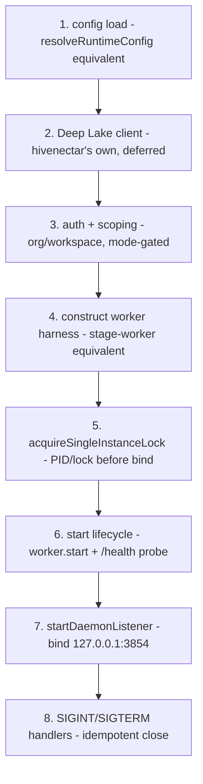
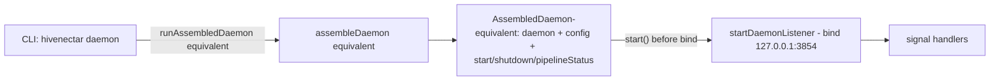

# PRD-002a: Hivenectar Bootstrap and Composition Root

> Parent: [`prd-002-hivenectar-daemon-index.md`](./prd-002-hivenectar-daemon-index.md)

## Overview

This sub-PRD defines the **bootstrap sequence** and the **composition root** of the hivenectar daemon — the ordered construction that takes a bare OS process to a fully-wired, listening, single-instance-guarded daemon. It mirrors honeycomb's `assembleDaemon` composition root ([`honeycomb/src/daemon/runtime/assemble.ts`](../../../../honeycomb/src/daemon/runtime/assemble.ts)) and the `runAssembledDaemon` lifecycle ([`honeycomb/src/daemon/index.ts:150-187`](../../../../honeycomb/src/daemon/index.ts)), scoped to Hivenectar's job surface rather than session capture.

The composition root is the single module that constructs the live Deep Lake client, the auth context, the worker harness (002b), the `/health` route, and the single-instance PID/lock guard, then wires them into a `AssembledDaemon`-equivalent exposing `start()` / `shutdown()` / `pipelineStatus()`. It is **constructed-and-started, not auto-listening**: importing the module never binds a socket (the honeycomb invariant at [`honeycomb/src/daemon/runtime/listen.ts:4-11`](../../../../honeycomb/src/daemon/runtime/listen.ts) — "Importing the runtime does not auto-listen"); only an explicit call from the CLI (`hivenectar daemon`, 002c) starts the socket. A test builds the harness with a fake storage client and drives `runOnce()` / `start()` without touching the network, mirroring how honeycomb's stage-worker is "constructed-and-tested, not auto-started by the bootstrap" ([`honeycomb/src/daemon/runtime/pipeline/stage-worker.ts:22-27`](../../../../honeycomb/src/daemon/runtime/pipeline/stage-worker.ts)).

The load-bearing ordering constraint, lifted verbatim from `runAssembledDaemon`, is **lock + services + health-probe BEFORE the socket bind** ([`honeycomb/src/daemon/index.ts:152-164`](../../../../honeycomb/src/daemon/index.ts)). A double-start fails fast at the lock *before* the port is bound, and a bind failure (`EADDRINUSE`) rolls the lifecycle back so no stale lock or warm-but-useless daemon survives ([`honeycomb/src/daemon/index.ts:159-164`](../../../../honeycomb/src/daemon/index.ts)).

## Goals

- Define the **bootstrap sequence** in a fixed order with a Honeycomb citation for every step: config load → Deep Lake client → auth/scoping → worker start → socket bind → signal handlers.
- Specify the **composition-root seam**: a single `assembleDaemon`-equivalent that constructs the live storage client (hivenectar's own), the auth context, the worker, the `/health` route, and the PID/lock guard, exposing `start()`/`shutdown()`/`pipelineStatus()`.
- Confirm the daemon **boots without importing honeycomb's in-process runtime** — patterns mirrored, modules not imported (decision #4).
- Confirm the daemon **boots lazily** — no Deep Lake DDL pre-step, no "brood before ready" gate; the daemon accepts requests before brooding finishes (the corpus's "does not block daemon readiness" invariant, [`knowledge/private/ai/brooding-pipeline.md`](../../../knowledge/private/ai/brooding-pipeline.md) "What brooding does not do").
- Pin the **config-file path** and **bind host** as flagged defaults, inheriting the port (3854) + PID/lock filenames from [PRD-001](../prd-001-three-daemon-topology/prd-001b-hivenectar-process-and-health.md).

## Non-Goals

- The single-instance lock + graceful-shutdown *implementation contract* (PID/lock acquire/release, SIGINT/SIGTERM drain detail) — [`prd-002d`](./prd-002d-single-instance-lock-and-shutdown.md). This PRD states the *ordering* (lock before bind) and *delegates* the mechanism.
- The worker harness internals (watch → re-associate → mint/enrich) — [`prd-002b`](./prd-002b-hiveantennae-worker.md). This PRD constructs and starts it.
- The CLI surface — [`prd-002c`](./prd-002c-hivenectar-cli-surface.md). This PRD defines the function the CLI calls.
- The API route scaffolding (`/api/source-graph/*`) — PRD-008. This PRD mounts only the unprotected `/health` route.
- The Deep Lake client's *scoping contract* (org + workspace, project_id as column filter) — [`prd-001b`](../prd-001-three-daemon-topology/prd-001b-hivenectar-process-and-health.md). This PRD constructs the client; PRD-001b defines its scope shape.
- The Deep Lake table DDL — PRD-005. The client self-heals the tables on first write; there is no boot-time DDL pre-step.

---

## The bootstrap sequence

The sequence runs in this fixed order. Each step cites the honeycomb pattern it mirrors.

### Step 1 — Config load

The daemon resolves its runtime config (host, port, mode, poll interval, runtime dir, provider keys) from the environment, overriding a config-file default. This mirrors honeycomb's `resolveRuntimeConfig(provider)` ([`honeycomb/src/daemon/runtime/config.ts:143`](../../../../honeycomb/src/daemon/runtime/config.ts)) which resolves config from a `RuntimeConfigProvider` (defaulting to the env provider). hivenectar's resolver adds a config-file layer:

| Property | Value | Citation / status |
|---|---|---|
| Config file | `~/.honeycomb/hivenectar.json` | **DEFAULT — confirm before implementation** (mirrors honeycomb's config convention under `~/.honeycomb`, [`honeycomb/src/daemon/runtime/auth/credentials-store.ts:71`](../../../../honeycomb/src/daemon/runtime/auth/credentials-store.ts) `LEGACY_CREDENTIALS_DIR_NAME = ".honeycomb"`) |
| Resolution precedence | env override → config file → built-in defaults | mirrors `resolveRuntimeConfig` ([`honeycomb/src/daemon/runtime/config.ts:143`](../../../../honeycomb/src/daemon/runtime/config.ts)) |

The config-file layer holds values that are operator-tunable per the corpus: the `REDESCRIBE_THRESHOLD` (default 0.85, [`knowledge/private/ai/enricher-and-llm-model.md`](../../../knowledge/private/ai/enricher-and-llm-model.md) "the threshold is configurable and tunable per-repo via `~/.honeycomb/hivenectar.json`"), the worker poll interval (default 30s), the prune grace period (default 30 days, [`knowledge/private/ai/identity-and-reassociation.md`](../../../knowledge/private/ai/identity-and-reassociation.md)), and the TLSH fuzzy-match band (configurable, default tuned during brooding — a deliberate spec gap; no number is pinned here).

### Step 2 — Deep Lake client (hivenectar's own)

The composition root constructs hivenectar's **own** Deep Lake client — it does not import honeycomb's in-process `createStorageClient`. This is ADR-0002's negative consequence #1, restated as the contract in [`prd-001b`](../prd-001-three-daemon-topology/prd-001b-hivenectar-process-and-health.md). The client surface mirrored is the single Deep Lake entry point honeycomb uses: org resolution on every query, a forced `QueryScope` carrying only `org` + `workspace`, a per-statement timeout, SQL tracing, and token redaction ([`honeycomb/src/daemon/storage/client.ts:1-60`](../../../../honeycomb/src/daemon/storage/client.ts)).

The client is the **deferred/lazy** variant — it never throws at construction when no credential resolves, so the daemon boots before guided-setup login and builds a real connected client on the first query after the credential lands (mirroring honeycomb's `createLazyStorageClient` choice documented at [`honeycomb/src/daemon/runtime/assemble.ts`](../../../../honeycomb/src/daemon/runtime/assemble.ts) — "the production storage client is the DEFERRED variant"). The client self-heals the `source_graph` / `source_graph_versions` tables on first write via `withHeal` (PRD-005); there is **no boot-time DDL pre-step**.

### Step 3 — Auth + scoping

The daemon resolves its tenancy scope (`org` + `workspace`, with `project_id` as a column filter inside the workspace partition — PRD-005's locked model) from the same credential provider the storage client connected through, so the client and the scope can never disagree (the bug honeycomb's `assembleDaemon` explicitly closes by resolving the provider "ONCE here so the storage client AND the daemon's own tenancy scope are derived from the SAME source" ([`honeycomb/src/daemon/runtime/assemble.ts`](../../../../honeycomb/src/daemon/runtime/assemble.ts))). The auth context is mode-gated (`local` open / `team`+`hybrid` real), mirroring honeycomb's `authForMode` ([`honeycomb/src/daemon/runtime/assemble.ts:796-806`](../../../../honeycomb/src/daemon/runtime/assemble.ts)). The deploy-time tenancy invariant — hivenectar's resolved org must match honeycomb's — is stated in [`prd-001c`](../prd-001-three-daemon-topology/prd-001c-shared-infra-consumption.md); a mismatch is surfaced, not swallowed.

### Step 4 — Worker harness construction

The composition root constructs the hiveantennae worker (002b) — a lease-based harness mirroring honeycomb's `createStageWorker` ([`honeycomb/src/daemon/runtime/pipeline/stage-worker.ts`](../../../../honeycomb/src/daemon/runtime/pipeline/stage-worker.ts)). The harness takes the storage client + the handler map + an optional logger/clock, and is **constructed, not started** at this step (consistent with honeycomb's construction seam at [`honeycomb/src/daemon/runtime/pipeline/stage-worker.ts:22-27`](../../../../honeycomb/src/daemon/runtime/pipeline/stage-worker.ts)). It exposes `runOnce()` (the deterministic unit a test drives), `start()` (the continuous poll loop), and `stop()` (idempotent). It is driven by the adaptive poll loop ([`honeycomb/src/daemon/runtime/services/poll-loop.ts`](../../../../honeycomb/src/daemon/runtime/services/poll-loop.ts)).

### Step 5 — Single-instance lock (before the bind)

The composition root acquires the single-instance PID/lock guard **before** the socket bind. This is the load-bearing ordering from `runAssembledDaemon` ([`honeycomb/src/daemon/index.ts:152-155`](../../../../honeycomb/src/daemon/index.ts) — "Acquire the lock + start services + the health probe BEFORE binding the socket"). The guard writes `~/.honeycomb/hivenectar.pid` + `~/.honeycomb/hivenectar.lock`; a live PID throws before the bind so the port is never double-bound; a stale PID is reclaimed. The mechanism is [`prd-002d`](./prd-002d-single-instance-lock-and-shutdown.md); the paths inherit from [PRD-001](../prd-001-three-daemon-topology/prd-001-three-daemon-topology-index.md).

### Step 6 — Start lifecycle

`start()` writes the PID/lock, starts the cached `/health` probe refresher, and starts the worker's services (the poll loop). It does **not** bind the socket (mirroring honeycomb's `AssembledDaemon.start()` at [`honeycomb/src/daemon/runtime/assemble.ts`](../../../../honeycomb/src/daemon/runtime/assemble.ts) — "Does NOT bind the socket (that is `startDaemon`)"). Brooding, if it triggers, runs **in the background** after this step — the daemon does not gate readiness on brooding (the corpus invariant: brooding "does not block daemon readiness" ([`knowledge/private/ai/brooding-pipeline.md`](../../../knowledge/private/ai/brooding-pipeline.md) "What brooding does not do")).

### Step 7 — Socket bind

`startDaemonListener`-equivalent binds the Hono app to `127.0.0.1:3854` via `@hono/node-server`, capturing the actual bound port from the listener callback (mirroring [`honeycomb/src/daemon/runtime/listen.ts`](../../../../honeycomb/src/daemon/runtime/listen.ts) — `serve({ fetch, hostname, port }, info => …)`). The bind happens after services start so the daemon does not accept requests before the worker is warm (the honeycomb contract at [`honeycomb/src/daemon/runtime/listen.ts`](../../../../honeycomb/src/daemon/runtime/listen.ts): "The bind happens AFTER services start"). A bind failure (`EADDRINUSE`) rolls the lifecycle back — drain services, stop the health probe, release the lock — and re-throws (mirroring [`honeycomb/src/daemon/index.ts:159-164`](../../../../honeycomb/src/daemon/index.ts)).

| Property | Value | Citation / status |
|---|---|---|
| Host | `127.0.0.1` (loopback) | **DEFAULT — confirm before implementation** (mirrors [`honeycomb/embeddings/src/index.ts:67`](../../../../honeycomb/embeddings/src/index.ts) `EMBED_HOST = "127.0.0.1"`) |
| Port | 3854 | CONFIRMED (inherited from [PRD-001](../prd-001-three-daemon-topology/prd-001b-hivenectar-process-and-health.md); next free after thehive=3853) |

### Step 8 — Signal handlers

`SIGINT`/`SIGTERM` handlers are registered once; they invoke the idempotent `close()` (drain services → close socket → remove PID/lock). A second signal is ignored. This is [`prd-002d`](./prd-002d-single-instance-lock-and-shutdown.md); the registration pattern mirrors [`honeycomb/src/daemon/index.ts:176-184`](../../../../honeycomb/src/daemon/index.ts).

---

## The composition-root seam

The composition root returns an `AssembledDaemon`-equivalent ([`honeycomb/src/daemon/runtime/assemble.ts:649-670`](../../../../honeycomb/src/daemon/runtime/assemble.ts)) with the same shape:

| Member | Purpose | Mirrors |
|---|---|---|
| `daemon` | The Hono app + wired real services. Never auto-listens. | [`honeycomb/src/daemon/runtime/assemble.ts:651`](../../../../honeycomb/src/daemon/runtime/assemble.ts) |
| `config` | The resolved runtime config. | [`honeycomb/src/daemon/runtime/assemble.ts:654`](../../../../honeycomb/src/daemon/runtime/assemble.ts) |
| `start()` | Write PID/lock, start `/health` probe, start services. No bind. Idempotent. | [`honeycomb/src/daemon/runtime/assemble.ts:660`](../../../../honeycomb/src/daemon/runtime/assemble.ts) |
| `shutdown()` | Drain services, stop health probe, remove PID/lock. Idempotent. | [`honeycomb/src/daemon/runtime/assemble.ts:667`](../../../../honeycomb/src/daemon/runtime/assemble.ts) |
| `pipelineStatus()` | The cached coarse health bit for `/health` + diagnostics. | [`honeycomb/src/daemon/runtime/assemble.ts:669`](../../../../honeycomb/src/daemon/runtime/assemble.ts) |

The `/health` route is mounted unprotected (no auth, no session), mirroring honeycomb's unprotected `/health` route group ([`honeycomb/src/daemon/runtime/server.ts:72`](../../../../honeycomb/src/daemon/runtime/server.ts) `{ path: "/health", protect: false, session: false }`), and returns the coarse `ok`/`degraded`/`unconfigured` `PipelineStatus` bit ([`honeycomb/src/daemon/runtime/health.ts:42`](../../../../honeycomb/src/daemon/runtime/health.ts)). This is the bit hivedoctor probes (PRD-003); the API route groups PRD-008 adds mount *after* `/health`.

---

## User stories

### US-002a.1 — The daemon boots in a fixed order
**As a** maintainer, **when** I read the bootstrap, **I** see config → client → auth → worker → lock → start → bind → signals in that order, **so that** the lock is acquired before the port is bound and a double-start fails fast.

- Acceptance: the bootstrap sequence runs in the fixed order above, each step citing its honeycomb mirror.
- Acceptance: the single-instance lock is acquired before the socket bind (mirroring [`honeycomb/src/daemon/index.ts:152-155`](../../../../honeycomb/src/daemon/index.ts)).

### US-002a.2 — A bind failure rolls the lifecycle back
**As an** operator, **when** port 3854 is already in use, **the** daemon drains services, stops the health probe, removes the lock, and re-throws, **so that** no stale lock or warm-but-useless daemon survives.

- Acceptance: a `startDaemonListener` bind failure triggers `assembled.shutdown()` before re-throwing (mirroring [`honeycomb/src/daemon/index.ts:159-164`](../../../../honeycomb/src/daemon/index.ts)).

### US-002a.3 — The daemon boots without importing honeycomb's runtime
**As a** maintainer, **when** I inspect hivenectar's imports, **I** see mirrored patterns, not honeycomb's in-process modules, **so that** the process boundary ADR-0002 established holds.

- Acceptance: the daemon reuses honeycomb's composition-root *pattern* (`assembleDaemon`, `acquireSingleInstanceLock`, `startDaemon`) but imports no honeycomb runtime module (decision #4).

### US-002a.4 — The daemon boots before brooding finishes
**As an** agent, **when** I query the daemon during a brood, **I** get responses (whatever is described so far), **so that** brooding does not gate readiness.

- Acceptance: brooding runs in the background after `start()`; the daemon accepts requests before brooding completes (the corpus "does not block daemon readiness" invariant).

### US-002a.5 — The daemon boots with no Deep Lake DDL pre-step
**As a** maintainer, **when** the daemon boots on a fresh workspace, **the** tables self-heal on first write, **so that** there is no boot-time provisioning step.

- Acceptance: no DDL pre-step exists in the boot sequence; the client self-heals `source_graph` / `source_graph_versions` via `withHeal` on first write (PRD-005).

### US-002a.6 — A test drives the harness without the network
**As a** maintainer, **when** I write a test, **I** build the worker with a fake storage client and drive `runOnce()` / `start()`, **so that** the unit suite never binds a socket.

- Acceptance: importing the composition-root module never binds a socket (mirroring [`honeycomb/src/daemon/runtime/listen.ts:4-11`](../../../../honeycomb/src/daemon/runtime/listen.ts)); the harness is constructed-and-tested, not auto-started (mirroring [`honeycomb/src/daemon/runtime/pipeline/stage-worker.ts:22-27`](../../../../honeycomb/src/daemon/runtime/pipeline/stage-worker.ts)).

---

## Implementation notes

- Composition root to mirror: [`honeycomb/src/daemon/runtime/assemble.ts:1957`](../../../../honeycomb/src/daemon/runtime/assemble.ts) (`assembleDaemon` — config resolve → log store → logger → runtime dir → storage client → tenancy/scope → vault → …).
- `AssembledDaemon` shape (start/shutdown/pipelineStatus, no auto-listen): [`honeycomb/src/daemon/runtime/assemble.ts:649-670`](../../../../honeycomb/src/daemon/runtime/assemble.ts).
- Lifecycle entry (lock before bind, bind-failure rollback, signal handlers): [`honeycomb/src/daemon/index.ts:150-187`](../../../../honeycomb/src/daemon/index.ts) (`runAssembledDaemon`, the `onSignal` handler, `process.once("SIGINT"/"SIGTERM", …)`).
- Listen/bind path (services start before bind, actual-port capture, loud EADDRINUSE): [`honeycomb/src/daemon/runtime/listen.ts`](../../../../honeycomb/src/daemon/runtime/listen.ts) (`startDaemon`, `serve({ fetch, hostname, port })`).
- Config resolver: [`honeycomb/src/daemon/runtime/config.ts:143`](../../../../honeycomb/src/daemon/runtime/config.ts) (`resolveRuntimeConfig`).
- Storage client surface (org resolution, forced scope, timeout, tracing, redaction): [`honeycomb/src/daemon/storage/client.ts:1-60`](../../../../honeycomb/src/daemon/storage/client.ts).
- Deferred/lazy storage client (boots before creds, builds on first query): honeycomb's `createLazyStorageClient` documented at [`honeycomb/src/daemon/runtime/assemble.ts`](../../../../honeycomb/src/daemon/runtime/assemble.ts).
- `/health` coarse bit + unprotected route: [`honeycomb/src/daemon/runtime/health.ts:42`](../../../../honeycomb/src/daemon/runtime/health.ts) (`PipelineStatus`); [`honeycomb/src/daemon/runtime/server.ts:72`](../../../../honeycomb/src/daemon/runtime/server.ts).
- `isDaemonMainEntry` guard (only direct execution auto-listens): [`honeycomb/src/daemon/index.ts:194-217`](../../../../honeycomb/src/daemon/index.ts).
- Runtime dir + `LEGACY_CREDENTIALS_DIR_NAME = ".honeycomb"`: [`honeycomb/src/daemon/runtime/auth/credentials-store.ts:71`](../../../../honeycomb/src/daemon/runtime/auth/credentials-store.ts); [`honeycomb/src/daemon/runtime/assemble.ts:688-690`](../../../../honeycomb/src/daemon/runtime/assemble.ts).

No open questions. The config-file path (`~/.honeycomb/hivenectar.json`) and bind host (`127.0.0.1`) are flagged defaults above; the port and PID/lock paths are inherited from [PRD-001](../prd-001-three-daemon-topology/prd-001b-hivenectar-process-and-health.md).
