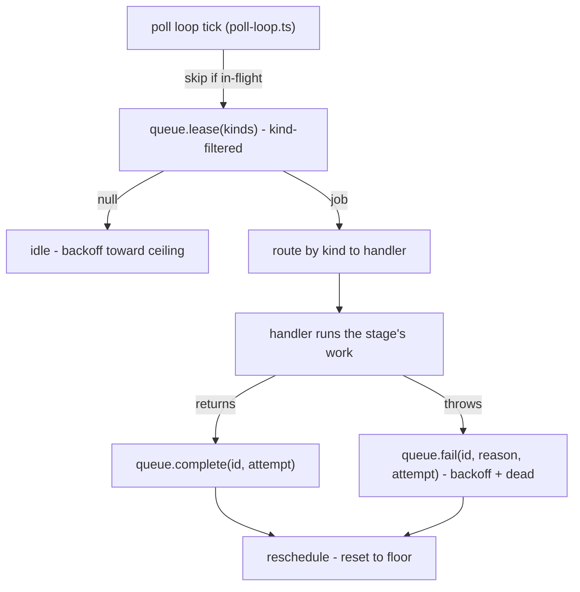

# PRD-002b: The Hiveantennae Worker

> Parent: [`prd-002-hivenectar-daemon-index.md`](./prd-002-hivenectar-daemon-index.md)

## Overview

This sub-PRD defines the **hiveantennae worker** — the steady-state loop that drives the semantic-memory pipeline: **watch → re-associate → mint/enrich**. It is the daemon's primary job, built on honeycomb's lease-based worker harness (`honeycomb/src/daemon/runtime/pipeline/stage-worker.ts`) and driven by the adaptive poll loop (`honeycomb/src/daemon/runtime/services/poll-loop.ts`). The worker owns the *loop*; the *mechanics* it invokes are owned by sibling PRDs — the file-event intake + re-association ladder (PRD-006), the brooding pipeline (PRD-007), the enricher steady-state + meaningful-change heuristic (PRD-016), and the projection regen (PRD-011).

The worker is the engine behind the corpus's four operating modes ([`knowledge/private/overview.md`](../../../knowledge/private/overview.md)):

| Mode | Trigger | What the worker does |
|---|---|---|
| **Brooding** | First run, or missing `.honeycomb/nectars.json` | Full scan → batched description → initial projection write (PRD-007) |
| **Live watch** | `node:fs.watch` event during editing | Re-associate → append version → enqueue lazy enrich (PRD-006 + PRD-016) |
| **Cold catch-up** | Daemon boot after offline changes | Walk disk → run re-association ladder → batch-enrich drift (PRD-006 + PRD-016) |
| **Projection sync** | End of brood/enrich/catch-up | Regenerate `.honeycomb/nectars.json` from Deep Lake (PRD-011) |

The load-bearing design decision, mirrored from honeycomb's stage-worker, is that the worker is a **lease-based harness over a durable queue**, not an in-memory event loop. A handler that throws routes to `queue.fail` (backoff + dead semantics); a worker that **crashes** mid-handler never calls `complete`/`fail`, so the lease goes stale and the queue's reaper reclaims the job for retry (`honeycomb/src/daemon/runtime/pipeline/stage-worker.ts:8-13`). This is what makes the daemon crash-safe: a `SIGKILL` or OOM mid-description loses no work — the lease reclaims, the next boot re-enqueues.

## Goals

- Specify the worker as a **lease-based harness** mirroring `createStageWorker` (`honeycomb/src/daemon/runtime/pipeline/stage-worker.ts`): `runOnce()` (lease + run one job) + `start()`/`stop()` (the continuous loop) + kind-filtered lease.
- Specify the **adaptive poll loop** driver (`honeycomb/src/daemon/runtime/services/poll-loop.ts`): tick → skip-if-in-flight → one lease pass → reschedule, with idle → slow / lease → fast backoff.
- Map the worker's **handlers** to the four operating modes and to the sibling-PRD mechanics each invokes, with citations to the corpus doc that names each mode.
- Pin the **poll interval** default (30s) as a flagged default and confirm it matches the enricher's interval in the corpus.
- Confirm the worker is **crash-safe** (stale-lease reclamation) and **non-blocking** to recall (a query during enrichment sees whatever is described so far).

## Non-Goals

- The re-association ladder algorithm (the 5 steps, TLSH, copy-event detection) — **PRD-006**. This worker *drives* the ladder; PRD-006 owns it.
- The brooding pipeline mechanics (discovery, bucketing, batch/solo LLM calls, cost math) — **PRD-007**. This worker hosts brooding as one mode; PRD-007 owns the pipeline.
- The enricher queue-poll query + the meaningful-change (Jaccard) heuristic — **PRD-016**. This worker hosts the enricher loop; PRD-016 owns the heuristic.
- The projection format + regeneration triggers + atomic write — **PRD-011**.
- The Portkey transport + model client the handlers call — **PRD-010**.
- The embeddings provider the handlers call — **PRD-014**.
- The CLI commands that trigger brooding/enriching externally — [`prd-002c`](./prd-002c-hivenectar-cli-surface.md). This worker is the steady-state loop; the CLI is the manual trigger surface.
- The daemon's bootstrap/assembly — [`prd-002a`](./prd-002a-hivenectar-bootstrap-and-composition-root.md). This PRD is the worker the composition root constructs at step 4.

---

## The worker harness

The worker mirrors honeycomb's `PipelineStageWorker` (`honeycomb/src/daemon/runtime/pipeline/stage-worker.ts:191-260`) exactly in shape. The construction seam is the same: the harness takes the queue + a handler map + an optional logger/clock, and is **constructed-and-tested, not auto-started** by the bootstrap (`honeycomb/src/daemon/runtime/pipeline/stage-worker.ts:22-27`).

### The lease → route → run → complete/fail loop

`runOnce()` is the single deterministic unit a test asserts against (`honeycomb/src/daemon/runtime/pipeline/stage-worker.ts:208-214`):

1. **Lease** the next runnable job, **filtered by kind** — the harness leases ONLY its own job kinds so a foreign job in the shared queue is left for its own worker (`honeycomb/src/daemon/runtime/pipeline/stage-worker.ts:208-211`, and the `leaseKinds` invariant documented at `honeycomb/src/daemon/runtime/pipeline/stage-worker.ts:125-133`). Returns `false` when nothing is leasable.
2. **Route** the leased job by its `kind` discriminator to the registered handler (`honeycomb/src/daemon/runtime/pipeline/stage-worker.ts:225-227`).
3. **Run** the handler. It returns on success; **throws to fail** (the harness converts the throw to `queue.fail(id, message)` — never a swallowed catch, `honeycomb/src/daemon/runtime/pipeline/stage-worker.ts:29-34`).
4. **Complete or fail** through the queue's lifecycle. The handler never touches the queue; completion/failure is the harness's job (`honeycomb/src/daemon/runtime/pipeline/stage-worker.ts:31-34`).

A handler that throws routes to `queue.fail` (the queue applies backoff and, at max attempts, walks the job to `dead`); a worker that **crashes** mid-handler never calls `complete`/`fail`, so the lease goes stale and the queue's reaper reclaims the job for retry (`honeycomb/src/daemon/runtime/pipeline/stage-worker.ts:8-13`). This is the crash-safety contract.

### The handler's contract

A handler mirrors honeycomb's `StageHandler` (`honeycomb/src/daemon/runtime/pipeline/stage-worker.ts:100-108`): it receives the job (id + kind + the tenancy/scope envelope + the stage's input payload), does the stage's work, and returns on success / throws on failure. It does **not** touch the queue. The tenancy envelope carries `org` + `workspace` + `agentId` + an optional `projectId` (`honeycomb/src/daemon/runtime/pipeline/stage-worker.ts:61-80`) — threaded from capture through every stage so a write stays within tenancy. hivenectar's handlers thread the same envelope, with `project_id` as the column filter inside the workspace partition (PRD-005).

---

## The adaptive poll loop

The continuous `start()` loop is driven by the shared poll-loop runner (`honeycomb/src/daemon/runtime/services/poll-loop.ts`), wired through `buildWorkerPollLoop` (`honeycomb/src/daemon/runtime/pipeline/stage-worker.ts:204-207`). The loop's shape (`honeycomb/src/daemon/runtime/services/poll-loop.ts:5-11`):

1. **Tick** → run one lease pass (`runOnce()`).
2. **Skip if in-flight** — the "skip a tick if the previous run is still in flight" overlap guard (`honeycomb/src/daemon/runtime/services/poll-loop.ts:24-29`).
3. **Reschedule** — feed the outcome to the backoff state machine (empty → step toward the ceiling, leased → reset to the floor) and re-arm a fresh one-shot timer.

The poll loop owns no Deep Lake access and no wall clock — it calls the injected `tick()` and `setTimer`/`clearTimer`, keeping it unit-testable with a manual-clock fake (`honeycomb/src/daemon/runtime/services/poll-loop.ts:30-35`). The overlap guard composes with backoff: a skipped tick does NOT feed the state machine (`honeycomb/src/daemon/runtime/services/poll-loop.ts:24-29`).

| Property | Value | Citation / status |
|---|---|---|
| Poll interval (floor) | 30s | **DEFAULT — confirm before implementation** (matches the enricher's default interval in [`knowledge/private/ai/enricher-and-llm-model.md`](../../../knowledge/private/ai/enricher-and-llm-model.md): "The enricher loop runs on a configurable interval (default 30 seconds)") |
| Backoff ceiling | adaptive (idle → slow) | mirrors the poll-loop backoff (`honeycomb/src/daemon/runtime/services/poll-loop.ts:17-22`) |
| Timer seam | injected `setTimer`/`clearTimer` | mirrors `honeycomb/src/daemon/runtime/pipeline/stage-worker.ts:146-149` |

> The 30s floor is the enricher's interval, not the pipeline stage-worker's flat 1000ms default (`honeycomb/src/daemon/runtime/pipeline/stage-worker.ts:171` `DEFAULT_POLL_INTERVAL_MS = 1_000`). hivenectar's job is description-maintenance, not the sub-second extraction pipeline; the 30s cadence coalesces rapid-fire edits naturally (the corpus's enricher-queue debounce, [`knowledge/private/ai/enricher-and-llm-model.md`](../../../knowledge/private/ai/enricher-and-llm-model.md) "Enricher queue debounce").

---

## The handlers (mapped to the four modes)

The worker holds a handler map keyed by job kind. hivenectar's kinds are scoped to its job surface (description-maintenance + identity), distinct from honeycomb's `memory_*` kinds (`honeycomb/src/daemon/runtime/pipeline/stage-worker.ts:44-50`). Each handler invokes a sibling-PRD mechanic:

| Job kind | Mode | Handler invokes | Owner PRD |
|---|---|---|---|
| brood / batch-describe | Brooding | discovery → bucketing → batch/solo LLM call → write rows → embed → projection | PRD-007 |
| re-associate (path-changed / new-path / missing-path) | Live watch + Cold catch-up | the 5-step ladder → append version / mint nectar / carry nectar | PRD-006 |
| enrich (pending describe) | Live watch + Cold catch-up | the meaningful-change heuristic → model call (or inherit) → embed | PRD-016 |
| projection-sync | Projection sync | regenerate `.honeycomb/nectars.json` atomically | PRD-011 |

The kind-filtered lease (`honeycomb/src/daemon/runtime/pipeline/stage-worker.ts:208-211`) guarantees the worker leases ONLY its own kinds — a honeycomb `memory_extraction` job in a shared queue is never grabbed and failed here. The four modes are not four separate workers; they are four trigger shapes that produce jobs on the queue, all consumed by one harness.

### Mode entry points

- **Brooding** triggers automatically the first time the daemon runs against a project with no `source_graph` rows or no `.honeycomb/nectars.json`, or on explicit `brood` (002c) ([`knowledge/private/ai/brooding-pipeline.md`](../../../knowledge/private/ai/brooding-pipeline.md) "Triggering brooding"). It runs in the background; the daemon does not gate readiness on it.
- **Live watch** enters when the `node:fs.watch` intake (PRD-006) emits a debounced "the file at this path changed" signal, producing a re-associate job ([`knowledge/private/overview.md`](../../../knowledge/private/overview.md); [`knowledge/private/ai/enricher-and-llm-model.md`](../../../knowledge/private/ai/enricher-and-llm-model.md) "Watcher intake debounce").
- **Cold catch-up** enters at daemon boot: the worker walks disk, runs the re-association ladder against Deep Lake's known paths, and batch-enqueues drift ([`knowledge/private/overview.md`](../../../knowledge/private/overview.md)).
- **Projection sync** runs at the end of brood/enrich/catch-up, regenerating the projection from Deep Lake ([`knowledge/private/overview.md`](../../../knowledge/private/overview.md); [`knowledge/private/data/portable-registry.md`](../../../knowledge/private/data/portable-registry.md)).

---

## Crash-safety and non-blocking guarantees

Two invariants the worker preserves, both lifted from the corpus:

1. **Crash-safe (stale-lease reclamation).** A `SIGKILL` or OOM mid-handler never calls `complete`/`fail`, so the lease goes stale and the queue's reaper reclaims the job for retry on the next boot (`honeycomb/src/daemon/runtime/pipeline/stage-worker.ts:8-13`). No description work is lost; the brood is resumable because every mint + write is a committed Deep Lake write, and brooding state is fully derivable from `describe_status` — there is no "brood in progress" lockfile ([`knowledge/private/ai/brooding-pipeline.md`](../../../knowledge/private/ai/brooding-pipeline.md) "Resumability").
2. **Non-blocking to recall.** A query during enrichment sees whatever has been described so far; undescribed files are simply absent from semantic results ([`knowledge/private/ai/enricher-and-llm-model.md`](../../../knowledge/private/ai/enricher-and-llm-model.md) "It does not block recall"). There is no read-lock, no "enrichment in progress" state.

---

## User stories

### US-002b.1 — The worker leases only its own job kinds
**As a** maintainer, **when** a honeycomb `memory_extraction` job sits in a shared queue, **the** hiveantennae worker leaves it queued, **so that** it is not grabbed and failed as an unknown kind.

- Acceptance: the worker's `lease()` is filtered by its own kinds (mirroring `honeycomb/src/daemon/runtime/pipeline/stage-worker.ts:208-211` + the `leaseKinds` invariant at `:125-133`).
- Acceptance: a leased job whose kind is not a hivenectar kind is failed with a clear reason, never silently completed (mirroring `honeycomb/src/daemon/runtime/pipeline/stage-worker.ts:225-230`).

### US-002b.2 — A crashed worker loses no work
**As an** operator, **when** the daemon is `SIGKILL`ed mid-description, **the** stale lease is reclaimed and the job retried on next boot, **so that** no description work is lost.

- Acceptance: a crash mid-handler leaves the lease stale; the queue's reaper reclaims it (mirroring `honeycomb/src/daemon/runtime/pipeline/stage-worker.ts:8-13`).
- Acceptance: brooding resumes from `describe_status` with no lockfile ([`knowledge/private/ai/brooding-pipeline.md`](../../../knowledge/private/ai/brooding-pipeline.md) "Resumability").

### US-002b.3 — A handler throw is never swallowed
**As a** maintainer, **when** a handler throws, **the** harness routes it to `queue.fail`, **so that** backoff + dead semantics apply.

- Acceptance: a throw becomes `queue.fail(id, reason, attempt)`; no swallowed catch (mirroring `honeycomb/src/daemon/runtime/pipeline/stage-worker.ts:29-34, 248-255`).

### US-002b.4 — The poll loop coalesces rapid edits
**As a** developer, **when** I save a file five times in a minute, **the** 30s poll loop processes only the latest pending version, **so that** intermediate saves are never described.

- Acceptance: the worker's poll floor is 30s (DEFAULT); the enricher's "latest pending version per nectar" semantics skip intermediate version rows ([`knowledge/private/ai/enricher-and-llm-model.md`](../../../knowledge/private/ai/enricher-and-llm-model.md) "Enricher queue debounce").

### US-002b.5 — Recall is not blocked during enrichment
**As an** agent, **when** I query during an enrich cycle, **I** get whatever is described so far, **so that** there is no read-lock or "in progress" state.

- Acceptance: enrichment does not block recall; undescribed rows are absent from results ([`knowledge/private/ai/enricher-and-llm-model.md`](../../../knowledge/private/ai/enricher-and-llm-model.md) "It does not block recall").

### US-002b.6 — A test drives the worker with a manual clock
**As a** maintainer, **when** I write a test, **I** inject `setTimer`/`clearTimer` and a fake queue, **so that** the poll loop is deterministic.

- Acceptance: the loop owns no wall clock; the timer seam is injected (mirroring `honeycomb/src/daemon/runtime/services/poll-loop.ts:30-35` + `honeycomb/src/daemon/runtime/pipeline/stage-worker.ts:146-149`).

---

## Implementation notes

- Worker harness to mirror: `honeycomb/src/daemon/runtime/pipeline/stage-worker.ts` — `createStageWorker`, `PipelineStageWorker` (`:191-260`), `runOnce()` (`:208-214`), `processLeased` (`:218-260`), the `StageHandler` contract (`:100-108`), the `StageJob` + `PipelineJobScope` envelope (`:61-98`), the kind filter (`:125-133`), the crash-safety comment (`:8-13`).
- Poll-loop driver: `honeycomb/src/daemon/runtime/services/poll-loop.ts` — the shared runner (`:5-11`), the overlap guard (`:24-29`), the no-clock/no-I/O invariant (`:30-35`); wired via `buildWorkerPollLoop` (`honeycomb/src/daemon/runtime/pipeline/stage-worker.ts:204-207`).
- Four operating modes: [`knowledge/private/overview.md`](../../../knowledge/private/overview.md) (the modes table + the hiveantennae flowchart).
- Brooding resumability (no lockfile, derivable from `describe_status`): [`knowledge/private/ai/brooding-pipeline.md`](../../../knowledge/private/ai/brooding-pipeline.md) "Resumability".
- Enricher 30s interval + queue debounce + non-blocking-to-recall: [`knowledge/private/ai/enricher-and-llm-model.md`](../../../knowledge/private/ai/enricher-and-llm-model.md).
- Re-association ladder (the mechanic the re-associate handler invokes): [`knowledge/private/ai/identity-and-reassociation.md`](../../../knowledge/private/ai/identity-and-reassociation.md) (owned by PRD-006).

No open questions. The poll interval (30s) is a flagged default above; the handler mechanics are owned by PRD-006/007/011/016.
