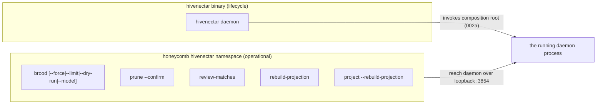

# PRD-002c: Hivenectar CLI Surface

> Parent: [`prd-002-hivenectar-daemon-index.md`](./prd-002-hivenectar-daemon-index.md)

## Overview

This sub-PRD documents the **CLI surface** an operator uses to drive the hivenectar daemon. It is a documentation PRD for the command *invocations*; the *mechanics* each command invokes are owned by sibling PRDs (brooding → PRD-007, projection regen → PRD-011, pruning/review → PRD-006, model swap → PRD-010). The surface has two entry binaries: the bare **`hivenectar`** binary (owns `daemon`, the lifecycle verb) and the **`honeycomb hivenectar <verb>`** sub-command namespace (owns the operational verbs that mint/prune/review/rebuild). The split mirrors how honeycomb separates the daemon lifecycle verb (`daemon start|stop|status`, [`honeycomb/src/cli/index.ts`](../../../../honeycomb/src/cli/index.ts)) from the storage/operational verbs that reach the daemon over loopback.

Every command below is named in the corpus. This PRD enumerates each with its invocation, its flags, the mechanic it invokes, the owner PRD for that mechanic, and the corpus doc that names it. It does not design the brooding/enricher internals — it documents the surface that invokes them.

## Goals

- Enumerate **every CLI command the corpus names** with invocation, flags, and a citation to the corpus doc that names it.
- Map each command to the **owner PRD** for the mechanic it invokes, so implementation PRDs (006/007/010/011/016) own the behavior and this PRD owns only the invocation surface.
- Specify the **two entry binaries** (`hivenectar` lifecycle vs `honeycomb hivenectar <verb>` operational) and confirm they mirror honeycomb's lifecycle/operational split.
- Confirm the CLI is a **thin client** that reaches the daemon over loopback for operational verbs (mirroring honeycomb's `DaemonClient` loopback posture, [`honeycomb/src/cli/index.ts`](../../../../honeycomb/src/cli/index.ts)) and invokes the composition root directly only for `daemon`.

## Non-Goals

- The brooding pipeline mechanics (discovery, bucketing, batch/solo calls, `--dry-run` cost-math internals) — **PRD-007**. This PRD documents the `brood` invocation + flags.
- The re-association ladder + the prune grace-period logic + the `review-matches` accept/reject surface — **PRD-006**. The `review-matches` sub-flag syntax is a deliberate spec gap (no `--accept`/`--reject` flags invented here).
- The projection format + atomic-write + rebuild logic — **PRD-011**. This PRD documents the `rebuild-projection` invocation.
- The Portkey transport + model-selection internals — **PRD-010**. This PRD documents the `--model <new>` flag surface.
- The daemon bootstrap the `daemon` verb invokes — [`prd-002a`](./prd-002a-hivenectar-bootstrap-and-composition-root.md). This PRD documents the verb.
- The worker the commands enqueue into — [`prd-002b`](./prd-002b-hiveantennae-worker.md).
- The HTTP API endpoints (`/api/source-graph/*`) — PRD-008. The CLI verbs and the API endpoints are parallel surfaces over the same mechanics.

---

## The two entry binaries

| Entry | Owns | Mirrors |
|---|---|---|
| `hivenectar` (bare binary) | The `daemon` lifecycle verb — invokes the composition root (002a) directly | honeycomb's daemon lifecycle verb ([`honeycomb/src/cli/index.ts`](../../../../honeycomb/src/cli/index.ts) "daemon start|stop|status drives the daemon lifecycle") |
| `honeycomb hivenectar <verb>` (sub-command namespace) | The operational verbs (brood/prune/review/rebuild) — reach the running daemon over loopback `:3854` | honeycomb's storage verbs reaching the daemon over the loopback `DaemonClient` ([`honeycomb/src/cli/index.ts`](../../../../honeycomb/src/cli/index.ts) "storage verbs reach the daemon through the real loopback DaemonClient") |

The CLI is a **thin client** (mirroring honeycomb's "Thin client only: imports the unified dispatcher + the CLI-side composition root, never the daemon core or any DeepLake path" at [`honeycomb/src/cli/index.ts`](../../../../honeycomb/src/cli/index.ts)). The operational verbs do not import the daemon core; they reach the already-running daemon over loopback.

---

## Command catalog

### `hivenectar daemon`

**Invocation:** `hivenectar daemon`

**What it does:** Starts the runnable daemon process. Invokes the composition root (002a): config load → Deep Lake client → auth/scoping → worker start → socket bind (`127.0.0.1:3854`) → signal handlers, with the single-instance lock acquired before the bind (002d). This is the only command that opens a socket.

**Mechanic owner:** [`prd-002a`](./prd-002a-hivenectar-bootstrap-and-composition-root.md) (bootstrap) + [`prd-002d`](./prd-002d-single-instance-lock-and-shutdown.md) (lock + shutdown).

**Named in corpus:** the runnable process is "`hivenectar daemon`" ([`MASTER-PRD-INDEX.md`](../../MASTER-PRD-INDEX.md) CLI table) — "the runnable process."

---

### `honeycomb hivenectar brood`

**Invocation:** `honeycomb hivenectar brood`

**What it does:** Triggers a full brood — discovers files, bucketing by size/type, batched LLM description, writes `source_graph` + `source_graph_versions` rows, embeds, regenerates `.honeycomb/nectars.json`. Respects existing descriptions (only `pending`/undescribed files are described).

**Mechanic owner:** PRD-007 (the brooding pipeline).

**Named in corpus:** [`knowledge/private/ai/brooding-pipeline.md`](../../../knowledge/private/ai/brooding-pipeline.md) "Triggering brooding" — `honeycomb hivenectar brood # full brood, respects existing descriptions`.

---

### `honeycomb hivenectar brood --force`

**Invocation:** `honeycomb hivenectar brood --force`

**What it does:** Re-describes every file, ignoring existing descriptions. Sets all non-skipped rows back to `describe_status = 'pending'` so the enricher/brooder re-describes them.

**Mechanic owner:** PRD-007 (force re-describe).

**Named in corpus:** [`knowledge/private/ai/brooding-pipeline.md`](../../../knowledge/private/ai/brooding-pipeline.md) — `honeycomb hivenectar brood --force # re-describe every file, ignore existing`; [`knowledge/private/ai/enricher-and-llm-model.md`](../../../knowledge/private/ai/enricher-and-llm-model.md) "An operator who swaps models and wants to re-describe everything runs `honeycomb hivenectar brood --force --model <new>`."

---

### `honeycomb hivenectar brood --force --model <new>`

**Invocation:** `honeycomb hivenectar brood --force --model <new>`

**What it does:** A model-swap re-describe. Forces re-description of every non-skipped file using a different model than the default (Gemini 2.5 Flash). The `--model` flag selects the model for the brood; the `describe_model` column records which model produced each description.

**Mechanic owner:** PRD-007 (the brood) + PRD-010 (model selection + `describe_model` audit).

**Named in corpus:** [`knowledge/private/ai/enricher-and-llm-model.md`](../../../knowledge/private/ai/enricher-and-llm-model.md) — "runs `honeycomb hivenectar brood --force --model <new>`, which sets all non-skipped rows back to `pending`."

---

### `honeycomb hivenectar brood --limit N`

**Invocation:** `honeycomb hivenectar brood --limit N` (e.g. `--limit 100`)

**What it does:** Broods at most `N` pending files — a cost cap. Bounds the number of LLM calls so an operator can sanity-check a subset before committing to the full brood.

**Mechanic owner:** PRD-007 (cost cap).

**Named in corpus:** [`knowledge/private/ai/brooding-pipeline.md`](../../../knowledge/private/ai/brooding-pipeline.md) — `honeycomb hivenectar brood --limit 100 # brood at most 100 pending files (cost cap)`.

---

### `honeycomb hivenectar brood --dry-run`

**Invocation:** `honeycomb hivenectar brood --dry-run`

**What it does:** Runs discovery and bucketing, prints the estimated call count and cost, and exits **without making any LLM calls**. The recommended first step on any new project to sanity-check cost before committing.

**Mechanic owner:** PRD-007 (cost preview / `--dry-run`).

**Named in corpus:** [`knowledge/private/ai/brooding-pipeline.md`](../../../knowledge/private/ai/brooding-pipeline.md) — `honeycomb hivenectar brood --dry-run # show buckets and cost estimate, no LLM calls`; "It is the recommended first step on any new project to sanity-check the cost before committing to it."

---

### `honeycomb hivenectar prune --confirm`

**Invocation:** `honeycomb hivenectar prune --confirm`

**What it does:** Removes nectars whose latest version's path has been missing for longer than the configurable grace period (default 30 days). Conservative and human-triggered — the `--confirm` flag is required because pruning is irreversible (a nectar, once pruned, is gone from the history chain). The grace period exists because a "missing" file might be on a branch checked out elsewhere or might return after a merge.

**Mechanic owner:** PRD-006 (conservative orphan pruning + 30-day grace).

**Named in corpus:** [`knowledge/private/ai/identity-and-reassociation.md`](../../../knowledge/private/ai/identity-and-reassociation.md) "Re-association does not delete nectars" — "`honeycomb hivenectar prune --confirm` removes nectars whose latest version's path has been missing for longer than a configurable grace period (default 30 days). ... Pruning is conservative and human-triggered."

---

### `honeycomb hivenectar review-matches`

**Invocation:** `honeycomb hivenectar review-matches`

**What it does:** Surfaces low-confidence TLSH fuzzy matches (re-association ladder step 4) for human confirmation. A fuzzy match below the "high" confidence band is **not** silently claimed; instead the candidate is surfaced here for an operator to confirm or reject. Low-confidence matches that are rejected mint a fresh nectar instead.

**Mechanic owner:** PRD-006 (the TLSH fuzzy step + confidence-scored review surface).

**Named in corpus:** [`knowledge/private/ai/identity-and-reassociation.md`](../../../knowledge/private/ai/identity-and-reassociation.md) step 4 — "it surfaces the candidate match to the dashboard (or to an interactive `honeycomb hivenectar review-matches` command) for human confirmation."

> **Deliberate spec gap (preserved).** The `review-matches` *sub-flag syntax* (the accept/reject flag surface) is unspecified on purpose ([`MASTER-PRD-INDEX.md`](../../MASTER-PRD-INDEX.md) "Deliberate spec gaps preserved"; [`knowledge/private/ai/identity-and-reassociation.md`](../../../knowledge/private/ai/identity-and-reassociation.md)). This PRD names the bare command only; no `--accept`/`--reject` flags are invented. The TLSH confidence threshold is likewise "configurable, default tuned during brooding" — no numeric threshold is pinned here.

---

### `honeycomb hivenectar rebuild-projection`

**Invocation:** `honeycomb hivenectar rebuild-projection`

**What it does:** Explicitly regenerates `.honeycomb/nectars.json` from Deep Lake. One of the projection's three generation triggers (the others are end-of-brood and end-of-enricher-cycle, which fire automatically). Useful after a manual Deep Lake edit or to verify the projection matches the source of truth.

**Mechanic owner:** PRD-011 (the explicit `rebuild-projection` trigger + atomic write + projection-not-sidecar enforcement).

**Named in corpus:** [`MASTER-PRD-INDEX.md`](../../MASTER-PRD-INDEX.md) CLI table — `honeycomb hivenectar rebuild-projection # explicit projection regen`; [`knowledge/private/data/portable-registry.md`](../../../knowledge/private/data/portable-registry.md) (the projection's three generation triggers).

---

### `honeycomb hivenectar project --rebuild-projection`

**Invocation:** `honeycomb hivenectar project --rebuild-projection`

**What it does:** The project-scoped variant of `rebuild-projection` — regenerates the projection scoped to a specific project (filtering by `project_id`) rather than the whole workspace. This is the per-project view of the same regen mechanic.

**Mechanic owner:** PRD-011 (project-scoped projection regen).

**Named in corpus:** [`MASTER-PRD-INDEX.md`](../../MASTER-PRD-INDEX.md) CLI table — `honeycomb hivenectar project --rebuild-projection # project-scoped variant`.

---

## User stories

### US-002c.1 — An operator starts the daemon
**As an** operator, **when** I run `hivenectar daemon`, **the** daemon boots, binds `127.0.0.1:3854`, and serves `/health`, **so that** hivedoctor can supervise it.

- Acceptance: `hivenectar daemon` invokes the composition root (002a) and is the only command that opens a socket.
- Acceptance: the daemon acquires the single-instance lock before binding (002d).

### US-002c.2 — An operator previews brooding cost before committing
**As an** operator, **when** I run `honeycomb hivenectar brood --dry-run`, **I** see the bucket counts and cost estimate with no LLM calls, **so that** I can sanity-check cost first.

- Acceptance: `--dry-run` runs discovery + bucketing, prints the estimate, and exits without LLM calls ([`knowledge/private/ai/brooding-pipeline.md`](../../../knowledge/private/ai/brooding-pipeline.md)).

### US-002c.3 — An operator re-describes after a model swap
**As an** operator, **when** I swap models, **I** run `honeycomb hivenectar brood --force --model <new>`, **so that** every non-skipped file is re-described by the new model.

- Acceptance: `--force --model <new>` sets non-skipped rows to `pending` and records the model in `describe_model` ([`knowledge/private/ai/enricher-and-llm-model.md`](../../../knowledge/private/ai/enricher-and-llm-model.md)).

### US-002c.4 — An operator caps brooding cost
**As an** operator, **when** I run `honeycomb hivenectar brood --limit 100`, **only** 100 pending files are brooded, **so that** I bound the spend.

- Acceptance: `--limit N` caps the number of pending files brooded ([`knowledge/private/ai/brooding-pipeline.md`](../../../knowledge/private/ai/brooding-pipeline.md)).

### US-002c.5 — An operator prunes orphans deliberately
**As an** operator, **when** I run `honeycomb hivenectar prune --confirm`, **nectars** missing past the 30-day grace period are removed, **so that** the history chain is not polluted by long-gone files.

- Acceptance: `prune --confirm` requires confirmation and honors the 30-day grace period ([`knowledge/private/ai/identity-and-reassociation.md`](../../../knowledge/private/ai/identity-and-reassociation.md)).

### US-002c.6 — An operator reviews low-confidence matches
**As an** operator, **when** I run `honeycomb hivenectar review-matches`, **I** see the low-confidence TLSH candidates, **so that** a mis-association does not corrupt the history chain.

- Acceptance: `review-matches` surfaces step-4 fuzzy matches below the confidence band ([`knowledge/private/ai/identity-and-reassociation.md`](../../../knowledge/private/ai/identity-and-reassociation.md) step 4).
- Acceptance: the sub-flag syntax is a deliberate gap; only the bare command is named.

### US-002c.7 — An operator rebuilds the projection explicitly
**As an** operator, **when** I run `honeycomb hivenectar rebuild-projection`, **the** projection regenerates from Deep Lake, **so that** the committed `.honeycomb/nectars.json` matches the source of truth.

- Acceptance: `rebuild-projection` is one of the three generation triggers and writes atomically (PRD-011).
- Acceptance: `project --rebuild-projection` is the project-scoped variant (filters by `project_id`).

---

## Implementation notes

- CLI entry/dispatcher pattern to mirror: [`honeycomb/src/cli/index.ts`](../../../../honeycomb/src/cli/index.ts) (the thin-client `main` that parses global flags → routes through a dispatcher with fully-bound `RuntimeDeps`; the lifecycle/operational split).
- Loopback daemon-client posture (operational verbs reach the daemon over loopback): [`honeycomb/src/cli/index.ts`](../../../../honeycomb/src/cli/index.ts) "storage verbs reach the daemon through the real loopback DaemonClient."
- Brood + flags (`--force`, `--limit`, `--dry-run`): [`knowledge/private/ai/brooding-pipeline.md`](../../../knowledge/private/ai/brooding-pipeline.md) "Triggering brooding."
- Model-swap brood (`--force --model <new>`): [`knowledge/private/ai/enricher-and-llm-model.md`](../../../knowledge/private/ai/enricher-and-llm-model.md) "It does not re-describe on model swap automatically."
- `prune --confirm` + 30-day grace: [`knowledge/private/ai/identity-and-reassociation.md`](../../../knowledge/private/ai/identity-and-reassociation.md) "Re-association does not delete nectars."
- `review-matches` + the confidence-band review surface: [`knowledge/private/ai/identity-and-reassociation.md`](../../../knowledge/private/ai/identity-and-reassociation.md) step 4.
- `rebuild-projection` + `project --rebuild-projection`: [`MASTER-PRD-INDEX.md`](../../MASTER-PRD-INDEX.md) CLI table; [`knowledge/private/data/portable-registry.md`](../../../knowledge/private/data/portable-registry.md) (the three generation triggers).
- Deliberate spec gaps (TLSH threshold, `review-matches` sub-flag syntax): [`MASTER-PRD-INDEX.md`](../../MASTER-PRD-INDEX.md) "Deliberate spec gaps preserved."

No open questions. The command *invocations* are all corpus-named; the *mechanics* are owned by PRD-006/007/010/011/016. The `review-matches` sub-flag syntax and the TLSH threshold are preserved deliberate gaps.
