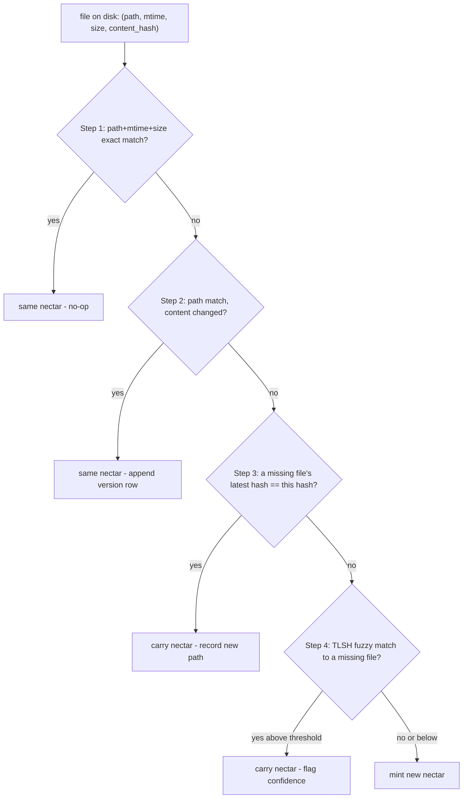

# PRD-006d: The Re-association Ladder (5 Steps + TLSH + Review Surface + Prune)

> **Status:** Backlog
> **Priority:** P0
> **Effort:** XL

## Overview

This sub-PRD owns the **re-association ladder** — the hardest algorithm in the system. Given a classified path (006b: new / changed / missing) and its on-disk content, the ladder decides which existing nectar (if any) the file is, or mints a new one. It is evaluated top-down per file, **first match wins**, and it carries all 5 steps verbatim from [`knowledge/private/ai/identity-and-reassociation.md`](../../../knowledge/private/ai/identity-and-reassociation.md) § "The re-association ladder".

The ladder is the source of move reconstruction: `fs.watch` delivers no correlated move semantics (006a), so the ladder's step 3 (exact content-hash match to a missing file) and step 4 (TLSH fuzzy match) reconstruct moves from the uncorrelated event stream plus the missing-files set (006b). The ladder is also the source of the **no-guess** contract: step 4 fuzzy matches below the high-confidence band are surfaced to `honeycomb hivenectar review-matches` for human confirmation, never auto-claimed — "a mis-association is worse than a new nectar because it corrupts the history chain" (`identity-and-reassociation.md`). This sub-PRD specifies the ladder, the confidence-scored review surface, and the conservative prune that is the only path by which a nectar is ever deleted.

## Goals

- Carry the 5-step ladder verbatim from `identity-and-reassociation.md`: (1) path+mtime+size exact, (2) path match + content changed, (3) exact content-hash match to a missing file, (4) TLSH fuzzy match to a missing file, (5) mint new — first match wins.
- Specify the step-3 and step-4 move reconstruction over the missing-files set (built in 006b), which makes `fs.watch`'s lack of move semantics cost nothing.
- Specify the step-4 TLSH fuzzy step: scored (not binary), confidence-banded, with the threshold **configurable and empirically tuned** — no numeric threshold pinned (deliberate spec gap).
- Specify the `honeycomb hivenectar review-matches` confidence-scored review surface; the accept/reject flag syntax is a flagged implementation decision (deliberate spec gap).
- Specify the conservative `honeycomb hivenectar prune --confirm` operation (30-day grace default) — the only nectar-deletion path; the ladder never deletes or reuses nectars.

## Non-Goals

- The intake/debounce that triggers a cycle — 006a.
- The new/changed/missing classification that feeds the ladder — 006b.
- The copy-event specialization of step 5 — 006c.
- The enricher loop that fills `title`/`description`/`embedding` after the ladder appends a `pending` version row — PRD-016.
- The portable projection the ladder consults on a fresh clone — PRD-011.
- A minhash/LSH pre-filter for very large monorepos — named as a possible v2 optimization in `brooding-pipeline.md`; v1 ships the size-bucket optimization only.

## The ladder (carried verbatim from `identity-and-reassociation.md`)

The ladder is evaluated top-down per classified file. First match wins; the file exits at the matching step. The flowchart is the corpus's:



Steps 1 and 2 consume the **changed-path** class; steps 3, 4, and 5 (plus the copy detector, 006c) consume the **new-path** class; the **missing-path** class feeds the missing-files set that steps 3 and 4 consult. (Step 1's fast path is resolved in the classifier, 006b, so `UNCHANGED` files never enter the ladder; the ladder receives only genuine `CHANGED` and `NEW` paths.)

### Step 1 — `(path, mtime, size)` exact match

The fast path. If a file at a known path has the same mtime and size as the last observed version, the daemon treats it as unchanged without reading or hashing the content. This is "the same optimization rsync uses," covers the vast majority of files on a typical boot, and is resolved in the classifier (006b) before the ladder runs. The mtime/size pair is read from `source_graph_versions.mtime_observed` and `source_graph_versions.size_bytes` for the latest version of each nectar (PRD-005b). The check is a single SELECT against the latest-version index, scoped by tenancy and path.

> mtime is mutable (`touch`, `rsync`, `git checkout` can change it without changing content). Step 1 is a fast-path cache key only — any path that is a candidate for steps 2–5 is content-hashed before a decision is made (`identity-and-reassociation.md` § "What re-association explicitly does not do").

### Step 2 — path match, content changed

The path exists in Deep Lake under some nectar, but the content hash differs. This is a normal edit. The daemon:

1. Reads the file, computes `sha256(content)`.
2. Appends a new `source_graph_versions` row with `(nectar, content_hash, seq = prev_seq + 1)`, the new path/metadata, and `title`/`description`/`embedding = NULL` (`describe_status = 'pending'`).
3. Updates `source_graph.last_update_date`.
4. Enqueues a lazy enrich job for the new version (PRD-016).

The nectar is unchanged. The previous version row stays in place — the history chain is append-only.

### Step 3 — exact content-hash match to a missing file

The move detector. The daemon consults the **missing-files set** (006b: known nectars whose latest path no longer exists on disk). When a new path's content hash exactly matches a missing nectar's **latest** version hash, the daemon concludes the file was moved (or renamed) without modification. The action:

1. Append a new `source_graph_versions` row for the existing nectar with the new path and the same `content_hash` (the composite key `(nectar, content_hash)` is unique, but `seq` increments and `path` differs, so the row is new).
2. The previous version row's path is now stale but retained as history.
3. Enqueue no enrich job — the content is unchanged, so the existing description still applies.
4. Remove the nectar from the missing-files set (resolved).

Exact-hash matching is high-confidence. There is no ambiguity; the only failure mode is a coincidental `sha256` collision, which is cryptographically negligible. This is the step that reconstructs ordinary moves from uncorrelated `fs.watch` events: a rename arrives as a `rename` at the old path (→ missing) plus an observation at the new path (→ new), and step 3 carries the nectar when the new content matches the missing file's latest hash.

### Step 4 — fuzzy content match (TLSH) to a missing file

The hard case: the file was moved **and** edited while the daemon was offline (or between settles), so the content hash matches nothing. The daemon computes a **TLSH** (Trend Micro Locality-Sensitive Hash) fingerprint of the file and compares it against the TLSH fingerprints of missing files. TLSH is purpose-built for "are these two files near-duplicates" and tolerates small edits, whitespace changes, and reformatting that break a cryptographic hash.

The pseudocode (carried from `identity-and-reassociation.md`; the actual impl is a native addon or WASM build — see TLSH implementation default below):

```typescript
import { tlshHash, tlshDiff } from "tlsh";

function bestFuzzyMatch(
  newFileFingerprint: string,
  candidateMissing: Array<{ nectar: string; fingerprint: string }>,
): { nectar: string; distance: number } | null {
  let best: { nectar: string; distance: number } | null = null;
  for (const candidate of candidateMissing) {
    const distance = tlshDiff(newFileFingerprint, candidate.fingerprint);
    if (!best || distance < best.distance) best = { nectar: candidate.nectar, distance };
  }
  return best && best.distance <= FUZZY_THRESHOLD ? best : null;
}
```

#### The match is scored, not binary

The `source_graph_versions` row appended for a fuzzy match carries a `confidence` field (1 − normalized distance). The match is banded:

- **High-confidence band** (above the configurable high threshold): the daemon carries the nectar, appends the version row with the new path + new content hash, sets `confidence`, and enqueues an enrich job (the content changed). The missing entry is resolved.
- **Below the high band**: the daemon does **not** silently claim the nectar. It surfaces the candidate match to the review surface (`review-matches`) for human confirmation. The new path is held as a pending candidate; the missing entry stays in the missing-files set until reviewed or pruned.
- **No match / below the low cutoff**: the file proceeds to step 5 (mint new).

#### TLSH confidence threshold — DELIBERATE SPEC GAP (NOT pinned)

> **The TLSH confidence threshold is configurable, default tuned during brooding — NO numeric value is pinned here.**

This is a deliberate spec gap preserved per [`hivenectar-stinger` guide 00 § Principle 3](../../../../../.agents/skills/hivenectar-stinger/guides/00-principles.md): `identity-and-reassociation.md` states the default is "configurable, default tuned during brooding" with **no number**. This sub-PRD does NOT commit a threshold (no `0.75`, no `0.4`, no distance band). The threshold is:

- **Configurable** — exposed as a daemon config value, adjustable per workspace/project.
- **Empirically tuned during brooding** — the brooding pass (PRD-007) calibrates the band against the actual codebase's near-duplicate distribution; the tuned value persists as the workspace default.
- **Banded, not single-cutoff** — there is a high-confidence band (auto-carry) and a below-high region (review surface); the exact band edges are the tuned values, not pinned numbers.

A PRD or implementation that commits a numeric TLSH threshold violates Principle 3 and is a hallucination.

#### TLSH implementation — DEFAULT

> **TLSH implementation: native addon OR WASM build — DEFAULT — confirm before implementation.**

`identity-and-reassociation.md` names both options in the pseudocode comment ("actual TLSH impl is a native addon or WASM build"). This PRD flags both and commits to neither:

- **Native addon** — faster per-comparison (the `brooding-pipeline.md` cost note measures TLSH work in microseconds per comparison on native), but adds a native build dependency per platform.
- **WASM build** — portable, no per-platform native build, but slower per-comparison.

Both honor the same `tlshHash` / `tlshDiff` interface the pseudocode assumes. The choice is an implementation decision flagged for confirmation; the ladder algorithm is identical either way.

#### The size-bucket optimization (v1)

Per `brooding-pipeline.md` § "What does not scale": the fuzzy match is O(N × M) where N is missing files and M is on-disk files. v1 ships one optimization carried from the corpus: **TLSH fingerprints are bucketed by size** — only files within ±20% size are compared, cutting the search space by ~95% and keeping a 100K-file cold boot under a minute. A minhash-based LSH pre-filter is named as a possible v2 optimization if monorepo cold-boot latency becomes a measured problem; it is out of scope for v1.

#### Step 4 fires in both modes

This step primarily fires after cold restart with offline changes, but it is not limited to that mode. `identity-and-reassociation.md` § "Step 4" states: "Hivenectar mirrors Honeycomb's `node:fs.watch` pattern, which reports uncorrelated `(eventType, filename)` observations rather than a rich move object. During live operation the debounced event stream updates the missing-files and new/changed-files sets; step 3 reconstructs ordinary moves by exact hash, and step 4 handles move-and-edit cases when exact hash evidence is not enough."

### Step 5 — nothing matches

The file is genuinely new. Mint a fresh nectar (ULID, per the minting contract), write the `source_graph` row, append the initial `source_graph_versions` row (`describe_status = 'pending'`), and enqueue enrichment (PRD-016). The copy detector (006c) is a specialization of step 5 that runs first: if the new path's hash matches an existing file's **current** content, the daemon mints a fresh nectar with `derived_from_nectar` + `fork_content_hash` instead of a bare mint. If the copy detector misses, the bare step-5 mint runs.

## Re-association does not delete nectars

A nectar, once minted, is never deleted by the ladder. If a file on disk has no re-association candidate (step 5), the daemon mints a new nectar — it does not scan for "orphaned" nectars whose paths are missing and reuse them. Orphaned nectars (the file was deleted, not moved) remain in Deep Lake as history. The ladder is append-only-ish: nectars are minted freely, pruned rarely, never reused. This is what makes the history chain trustworthy (`identity-and-reassociation.md` § "Re-association does not delete nectars").

## The confidence-scored review surface

Step 4's below-high-band matches and any other low-confidence candidate are surfaced for human review — the daemon does not guess. The surface is the `review-matches` command:

```bash
honeycomb hivenectar review-matches
```

The command lists pending candidate matches (new path ↔ candidate missing nectar, with the computed `confidence` / TLSH distance and a diff preview), and lets the operator accept or reject each. An accepted match carries the nectar to the new path (as step 4 would have at high confidence); a rejected match leaves the new path to be minted fresh (step 5) and leaves the missing entry in the missing-files set.

> **`review-matches` sub-flag syntax — DELIBERATE SPEC GAP.**

Per [`hivenectar-stinger` guide 00 § Principle 3](../../../../../.agents/skills/hivenectar-stinger/guides/00-principles.md), the corpus names only the bare command `honeycomb hivenectar review-matches`; the accept/reject flag syntax is unspecified. This PRD specifies the command and its surface (list candidates, accept/reject each, with confidence + diff preview) but does **not** invent the flag syntax — no `--accept`/`--reject`/`--all` flags are committed. The accept/reject flag surface is a flagged implementation decision:

- **DEFAULT — confirm before implementation**: the accept/reject interaction is an interactive prompt (list → choose → confirm) by default, with optional flag-based batch forms deferred to the implementation. The bare command's behavior (list pending candidates) is specified; the flag grammar is not.

The review surface exists because "re-association does not guess … Low-confidence fuzzy matches are surfaced for human review, NEVER auto-claimed. A mis-association is worse than a new nectar because it corrupts the history chain" (`identity-and-reassociation.md`). The `review-matches` command is the human-in-the-loop gate the corpus requires; it is the only path by which a below-high-band TLSH match becomes a carried nectar.

## The conservative prune

Deletion of nectar records is a separate, explicit, human-triggered operation, distinct from the ladder:

```bash
honeycomb hivenectar prune --confirm
```

`prune --confirm` removes nectars whose latest version's path has been missing for longer than a configurable grace period. The grace period exists because a file that is "missing" might be on a branch checked out elsewhere, or might return after a merge. Pruning is conservative and human-triggered (`identity-and-reassociation.md` § "Re-association does not delete nectars").

> **Prune grace period: 30 days — DEFAULT — confirm before implementation.**

The 30-day default is carried from `identity-and-reassociation.md` ("default 30 days") and from the spec'd CLI surface in [`MASTER-PRD-INDEX.md`](../../../MASTER-PRD-INDEX.md) ("conservative orphan pruning, 30-day grace"). The value is configurable and flagged, not load-bearing on the algorithm — the ladder never prunes; `prune --confirm` is the sole deletion path and it requires the explicit `--confirm` flag (no dry-run-as-default ambiguity: the bare `prune` without `--confirm` is a preview/list, the `--confirm` is the destructive act).

## Live watch vs cold catch-up

The ladder is the same algorithm in both modes; only the *distribution* of steps differs. Carried from `identity-and-reassociation.md` § "Live watch vs cold catch-up":

| Step | Live watch frequency | Cold catch-up frequency |
|---|---|---|
| 1 (exact path/mtime/size) | rare (the watcher already knows nothing changed) | **dominant** — most files are untouched |
| 2 (path match, content changed) | **dominant** — normal edits | common — offline edits |
| 3 (exact hash → missing file) | common — debounced events plus the missing-files set reconstruct ordinary moves | common — offline renames |
| 4 (fuzzy TLSH match) | rare — live move-and-edit or incomplete event evidence | occasional — offline move-and-edit |
| 5 (mint new) | common — new files | occasional — genuinely new files |

Cold catch-up is the hard case because the daemon has only the final disk state with no event stream to correlate — steps 3 and 4 do their work there, and the `confidence` field earns its keep because the daemon cannot ask a human in real time, so it surfaces low-confidence matches for review instead of guessing. Brooding (PRD-007) is the degenerate cold-catch-up case (no Deep Lake rows → every path hits step 5).

## What the ladder explicitly does not do

Carried from `identity-and-reassociation.md` § "What re-association explicitly does not do":

- **It does not guess.** Step 4 fuzzy matches below the high-confidence band are surfaced for review, not auto-claimed.
- **It does not trust mtime alone.** mtime+size is a fast-path cache key only; any candidate for steps 2–5 is content-hashed first.
- **It does not run during live edits.** The watcher debounces (006a); re-association runs on the debounced state.
- **It does not cross project boundaries.** Re-association is scoped by `project_id` (PRD-005c).
- **It does not delete or reuse nectars.** Only `prune --confirm` deletes; the ladder never reuses an orphaned nectar for a new file.

## Acceptance Criteria

- [ ] The ladder carries all 5 steps verbatim from `identity-and-reassociation.md` § "The re-association ladder": (1) path+mtime+size exact, (2) path match + content changed, (3) exact content-hash match to a missing file, (4) TLSH fuzzy match to a missing file, (5) mint new — first match wins.
- [ ] Step 1's fast path is resolved in the classifier (006b); the ladder receives only `CHANGED` and `NEW` paths.
- [ ] Step 2 appends a `source_graph_versions` row with `seq = prev_seq + 1`, `title`/`description`/`embedding = NULL`, `describe_status = 'pending'`, and enqueues an enrich job (PRD-016).
- [ ] Step 3 consults the missing-files set (006b), carries the nectar on exact `sha256` match to a missing nectar's latest hash, appends a new version row with the new path, enqueues no enrich job, and removes the missing entry from the set.
- [ ] Step 4 computes a TLSH fingerprint, compares against missing files (size-bucketed, ±20%), and produces a scored `confidence` match.
- [ ] Step 4's high-confidence band carries the nectar + enqueues enrich; the below-high band surfaces to `review-matches`; no-match falls through to step 5.
- [ ] **The TLSH confidence threshold is configurable and empirically tuned during brooding; NO numeric threshold is pinned** (deliberate spec gap preserved — no `0.75`/`0.4` committed).
- [ ] The TLSH implementation (native addon OR WASM) is flagged **DEFAULT — confirm before implementation**; the ladder algorithm is identical either way.
- [ ] `honeycomb hivenectar review-matches` lists pending candidates with confidence + diff preview and accepts/rejects each; the accept/reject flag syntax is a flagged implementation decision, NOT invented (deliberate spec gap).
- [ ] `honeycomb hivenectar prune --confirm` is the sole nectar-deletion path; the ladder never deletes or reuses nectars; the grace period defaults to 30 days (flagged DEFAULT), configurable; bare `prune` is a preview, `--confirm` is destructive.
- [ ] All lookups are scoped by `org_id` + `workspace_id` + `project_id` (PRD-005c); re-association never crosses project boundaries.

## Related

- [PRD-006 index](./prd-006-file-registration-protocol-index.md) — module scope + the deliberate spec gaps + defaults.
- [PRD-006a](./prd-006a-fswatch-intake-and-debounce.md) — the intake that triggers a ladder cycle.
- [PRD-006b](./prd-006b-event-to-ladder-step-classification.md) — the classifier + missing-files set the ladder consumes.
- [PRD-006c](./prd-006c-copy-event-detection.md) — the step-5 specialization (copy → fresh nectar + `derived_from_nectar`).
- [PRD-005b](../prd-005-source-graph-catalog-tables/prd-005b-source-graph-versions-table.md) — `source_graph_versions` columns the ladder appends (`seq`, `content_hash`, `mtime_observed`, `size_bytes`, `describe_status`, `confidence`).
- [`knowledge/private/ai/identity-and-reassociation.md`](../../../knowledge/private/ai/identity-and-reassociation.md) — the authoritative ladder (§ "The re-association ladder"), the no-guess/no-delete contract (§ "What re-association explicitly does not do"), the live-vs-cold distribution (§ "Live watch vs cold catch-up"), and the prune contract (§ "Re-association does not delete nectars").
- [`knowledge/private/ai/brooding-pipeline.md`](../../../knowledge/private/ai/brooding-pipeline.md) § "What does not scale" — the TLSH O(N×M) cost + the v1 size-bucket (±20%) optimization.
- [`knowledge/private/architecture/ADR-0001-minted-nectar-over-source-embedded-serial.md`](../../../knowledge/private/architecture/ADR-0001-minted-nectar-over-source-embedded-serial.md) — the identity decision forcing the ladder + the no-guess/no-delete invariants.
- [`MASTER-PRD-INDEX.md`](../../../MASTER-PRD-INDEX.md) — the spec'd CLI surface (`prune --confirm`, `review-matches`) + the deliberate spec gaps register.
