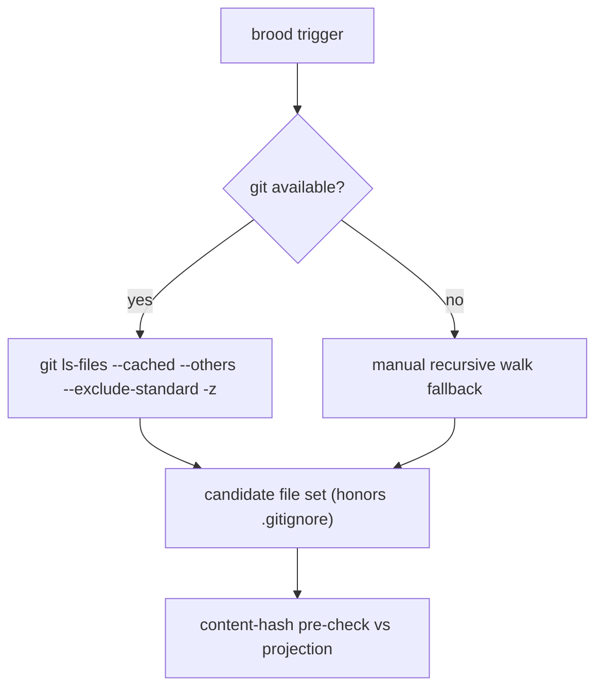
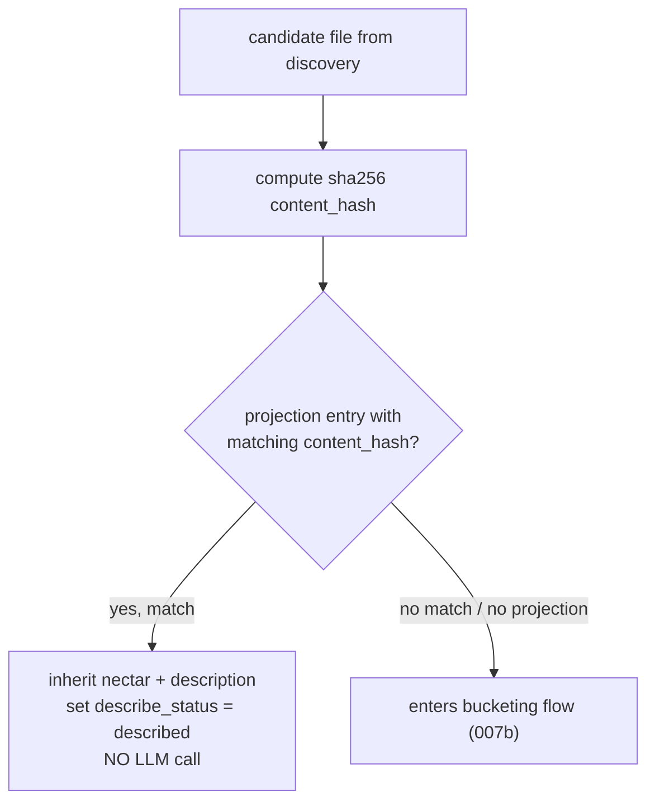

# PRD-007a: Discovery + Content-Hash Pre-Check

> Parent: [`prd-007-brooding-process-index.md`](./prd-007-brooding-process-index.md)

## Overview

The first two stages of the brooding pipeline: **discovery** (enumerate the files to brood) and the **content-hash pre-check** (the fresh-clone shortcut that skips the LLM cost entirely when a committed projection already describes a file's content). Both are carried verbatim from [`knowledge/private/ai/brooding-pipeline.md`](../../../knowledge/private/ai/brooding-pipeline.md) § "File discovery."

Discovery reuses the existing CodeGraph discovery logic **verbatim** — Hivenectar does not maintain its own ignore list, because that would be a drift source. If a file is in the CodeGraph's discovery set, it is in Hivenectar's; if it is not, it is not. The one addition is the content-hash pre-check against the portable projection: a file whose `content_hash` matches a projection entry inherits that nectar and description without re-brooding. This is how a fresh clone pays $0 — every file's content hash matches the committed `.honeycomb/nectars.json` and no LLM call is made.

The composition mirrors Honeycomb's `runGraphBuild` (`honeycomb/src/daemon/runtime/codebase/api.ts:234-261`), whose step 1 is "Aggregate: discover → tree-sitter extract → NetworkX node-link snapshot." Brooding's discover step produces the candidate set; the content-hash pre-check narrows it; only the survivors enter the bucketing flow in [007b](./prd-007b-bucketing-and-llm-call-shapes.md).

## Goals

- Define discovery to **reuse the CodeGraph's `git ls-files` discovery verbatim** — same command, same `.gitignore` honoring, same manual recursive walk fallback — citing [`brooding-pipeline.md`](../../../knowledge/private/ai/brooding-pipeline.md) as the source.
- Define the **content-hash pre-check** against the committed projection: a `content_hash` match inherits the nectar + description and makes no LLM call; only files with no projection match enter bucketing.
- Confirm Hivenectar adds **no new ignore list** (it would drift from the CodeGraph's), carrying the projection-not-sidecar discipline from [`knowledge/private/data/portable-registry.md`](../../../knowledge/private/data/portable-registry.md).

## Non-Goals

- The bucketing logic that consumes the discovered files — [007b](./prd-007b-bucketing-and-llm-call-shapes.md).
- The projection's on-disk format, validation-on-load, and atomic-write — [PRD-011](../../in-work/prd-011-portable-projection/prd-011-portable-projection-index.md). This sub-PRD consumes the projection as a *read* for the pre-check; PRD-011 owns its write contract.
- The live-watch `node:fs.watch` intake — [PRD-006a](../../completed/prd-006-file-registration-protocol/prd-006a-fswatch-intake-and-debounce.md). Discovery here is a full-scan enumeration, not the watcher's debounced event stream.
- The re-association ladder that runs during cold-catch-up — [PRD-006d](../../completed/prd-006-file-registration-protocol/prd-006d-reassociation-ladder.md). Discovery is shared; the ladder is a different mode.
- The `--force` flag's effect (it bypasses the "respect existing descriptions" behavior, not the pre-check semantics) — [007d](./prd-007d-cli-surface-and-dry-run.md).

---

## Discovery



### The discovery command *(DEFAULT — confirm before implementation)*

Carried verbatim from [`brooding-pipeline.md`](../../../knowledge/private/ai/brooding-pipeline.md) "File discovery":

```
git ls-files --cached --others --exclude-standard -z
```

- `--cached` — files already tracked in the index.
- `--others` — untracked files on disk.
- `--exclude-standard` — honor `.gitignore`, `.git/info/exclude`, and the user's `core.excludesfile` exactly, so discovery matches what the operator expects to be in the repo.
- `-z` — NUL-delimited output, so paths with spaces, quotes, or newlines are handled safely (no shell-word-splitting bugs).

This is the **DEFAULT** command pending implementation confirmation. It is the exact command the corpus names ("`git ls-files --cached --others --exclude-standard -z` to honor `.gitignore` exactly"), and it matches the CodeGraph discovery the corpus says Hivenectar reuses.

### Manual recursive walk fallback

When git is unavailable (no `.git` directory, git not on PATH, non-git workspace), discovery falls back to a manual recursive directory walk that applies the **same per-repo ignore file** the CodeGraph uses (`~/.honeycomb/graph-ignore.json`, carried from [`brooding-pipeline.md`](../../../knowledge/private/ai/brooding-pipeline.md)). The fallback exists so a scratch directory with no git history still broods; the git path is the common case.

### No new ignore list

Hivenectar maintains **no** ignore list of its own. [`brooding-pipeline.md`](../../../knowledge/private/ai/brooding-pipeline.md) states this explicitly: "Hivenectar does not maintain its own ignore list — that would be a drift source." The ignore logic is inherited wholesale from the CodeGraph. This is the projection-not-sidecar discipline (`knowledge/private/data/portable-registry.md`): Hivenectar points at the single source of truth for "what files are in this repo," it does not become a second one.

### Output of discovery

Discovery produces the **candidate file set**: a list of repo-relative paths (forward slashes) with their stat metadata (size, ext, mtime). This set is the input to the content-hash pre-check below, and — for the files that survive the pre-check — to the bucketing in [007b](./prd-007b-bucketing-and-llm-call-shapes.md).

---

## Content-hash pre-check (the fresh-clone shortcut)

After discovery, every candidate file is sha256-hashed and compared against the committed portable projection (`.honeycomb/nectars.json`) **if one exists** — from a prior brood or a teammate's commit. The pre-check is the mechanism that makes brooding cheap on a fresh clone.



### Match → inherit (no LLM call)

A file whose `content_hash` matches a projection entry **inherits** that entry's nectar and description verbatim and makes **no LLM call**. The inherited row is written to `source_graph` (the nectar) and `source_graph_versions` (the description) with `describe_status = 'described'` and `describe_model` carried from the projection entry (so the audit trail survives the clone). This is how a fresh clone pays **$0**: [`brooding-pipeline.md`](../../../knowledge/private/ai/brooding-pipeline.md) states "a clone of the same repo pays $0 if `.honeycomb/nectars.json` is committed, because every file's content hash matches the projection and no LLM call is made."

### No match → bucketing

A file with no projection match (no projection exists at all, or its content hash is absent from the projection) enters the bucketing flow in [007b](./prd-007b-bucketing-and-llm-call-shapes.md), where it is bucketed by size/type and either described (batch/solo) or skipped (binary/too-large).

### Interaction with `--force`

The pre-check consults the **projection** for content-hash inheritance; `--force` controls whether *existing descriptions* are re-described, not whether the projection shortcut is taken. The exact `--force` semantics (re-describe every non-skipped file, ignore existing descriptions) are specified in [007d](./prd-007d-cli-surface-and-dry-run.md).

---

## Composition with the rest of the pipeline

Discovery + pre-check is steps 1–2 of the pipeline. The full order (from the index, mirroring `runGraphBuild` at `honeycomb/src/daemon/runtime/codebase/api.ts:234-261`):

1. **Discover** (this sub-PRD) — `git ls-files` + walk fallback → candidate set.
2. **Pre-check** (this sub-PRD) — content-hash match → inherit, no LLM; survivors → bucket.
3. **Bucket** ([007b](./prd-007b-bucketing-and-llm-call-shapes.md)) — four buckets by size/type.
4. **Describe** ([007b](./prd-007b-bucketing-and-llm-call-shapes.md)) — batch or solo LLM call via Portkey (PRD-010).
5. **Embed** ([007b](./prd-007b-bucketing-and-llm-call-shapes.md)) — 768-dim over `title + ' ' + description` (PRD-014).
6. **Persist** — append `source_graph` + `source_graph_versions` rows (PRD-005).
7. **Regenerate projection** (PRD-011) — atomic write of `.honeycomb/nectars.json`.

Resumability across this whole flow is specified in [007c](./prd-007c-resumability-state-machine.md).

---

## User stories

### US-007a.1 — A fresh clone broods for $0
**As an** operator, **when** I clone a repo whose `.honeycomb/nectars.json` is committed and run `brood`, **every** file's content hash matches the projection and **no** LLM call is made, **so that** the clone is free.

- Acceptance: a `content_hash` match against the projection inherits the nectar + description and makes no LLM call ([`brooding-pipeline.md`](../../../knowledge/private/ai/brooding-pipeline.md) "File discovery").
- Acceptance: only files with no projection match enter bucketing.

### US-007a.2 — A non-git directory still broods
**As an** operator, **when** I run `brood` against a scratch directory with no `.git`, **discovery** falls back to a manual recursive walk, **so that** Hivenectar is not git-only.

- Acceptance: the manual walk fallback applies the same `~/.honeycomb/graph-ignore.json` the CodeGraph uses ([`brooding-pipeline.md`](../../../knowledge/private/ai/brooding-pipeline.md) "File discovery").

### US-007a.3 — Discovery honors my `.gitignore`
**As an** operator, **when** I run `brood`, **files** in my `.gitignore` (build output, `node_modules`, secrets) are excluded, **so that** brooding cost is not wasted on files I do not track.

- Acceptance: the discovery command is `git ls-files --cached --others --exclude-standard -z` and honors `.gitignore` exactly ([`brooding-pipeline.md`](../../../knowledge/private/ai/brooding-pipeline.md)).

---

## Implementation notes

- Discovery reuses the CodeGraph discovery verbatim — the same logic documented in `honeycomb/library/knowledge/private/data/codebase-graph.md` (the main Honeycomb corpus, not this repo's tree), as cited by [`brooding-pipeline.md`](../../../knowledge/private/ai/brooding-pipeline.md). Hivenectar does **not** reimplement it; it points at the shared module (the projection-not-sidecar discipline, [`knowledge/private/data/portable-registry.md`](../../../knowledge/private/data/portable-registry.md)).
- The content-hash pre-check reads the projection's `content_hash` field; the projection format + validation-on-load is owned by [PRD-011](../../in-work/prd-011-portable-projection/prd-011-portable-projection-index.md) (this sub-PRD assumes a validated projection).
- The sha256 `content_hash` is the same field stored on `source_graph_versions.content_hash` ([PRD-005b](../../completed/prd-005-source-graph-catalog-tables/prd-005b-source-graph-versions-table.md)) — discovery computes it; the version row stores it; the pre-check compares it. One hash, three uses.
- The discover→pre-check composition mirrors `runGraphBuild`'s step 1 ("Aggregate: discover → tree-sitter extract") at `honeycomb/src/daemon/runtime/codebase/api.ts:247-248`: brooding discovers, then narrows, before any extraction/description work.

No open questions. The discovery command + pre-check are carried from [`brooding-pipeline.md`](../../../knowledge/private/ai/brooding-pipeline.md); the only flagged default is the discovery command itself (DEFAULT — confirm before implementation).

## Related

- [PRD-007 index](./prd-007-brooding-process-index.md)
- [PRD-007b](./prd-007b-bucketing-and-llm-call-shapes.md) — bucketing consumes the survivors of the pre-check.
- [PRD-007c](./prd-007c-resumability-state-machine.md) — resumability of the full flow.
- [`knowledge/private/ai/brooding-pipeline.md`](../../../knowledge/private/ai/brooding-pipeline.md) — the authoritative discovery + pre-check description.
- `honeycomb/library/knowledge/private/data/codebase-graph.md` — the CodeGraph discovery reused verbatim (main Honeycomb corpus, not this repo's tree).
- [`knowledge/private/data/portable-registry.md`](../../../knowledge/private/data/portable-registry.md) — the projection the pre-check reads + the projection-not-sidecar discipline.
- [PRD-005b](../../completed/prd-005-source-graph-catalog-tables/prd-005b-source-graph-versions-table.md) — the `content_hash` column this stage computes.
- [PRD-011](../../in-work/prd-011-portable-projection/prd-011-portable-projection-index.md) — owns the projection the pre-check consults.
- `honeycomb/src/daemon/runtime/codebase/api.ts:234-261` — `runGraphBuild`, the discover→extract→persist composition to mirror.
