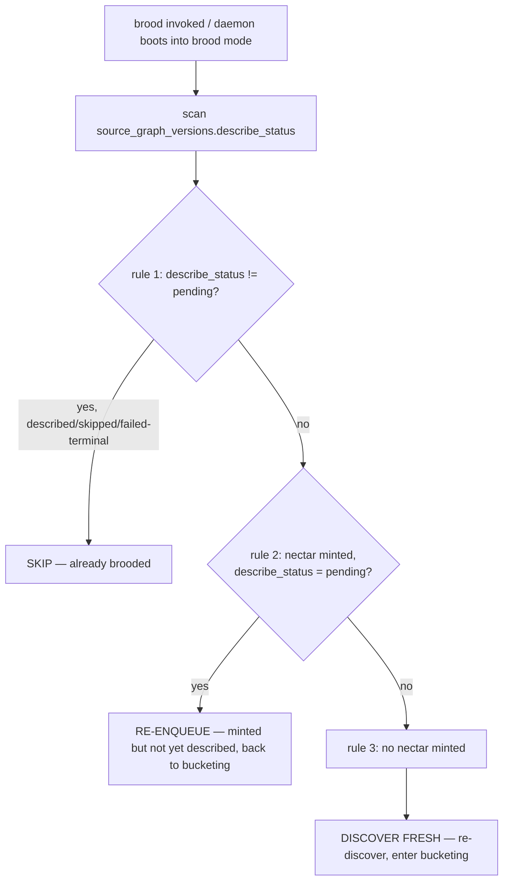

# PRD-007c: Resumability State Machine

> Parent: [`prd-007-brooding-process-index.md`](./prd-007-brooding-process-index.md)

## Overview

Brooding is **resumable**. A brood can be killed mid-flight (laptop closed, process crashed, operator Ctrl-C) and the next boot picks up exactly where it left off, with no lost work and no duplicate description cost. The state of the brood is **fully derivable** from the `source_graph_versions.describe_status` column — there is no "brood in progress" lockfile and no partial-state marker.

This sub-PRD carries the resumability contract verbatim from [`knowledge/private/ai/brooding-pipeline.md`](../../../knowledge/private/ai/brooding-pipeline.md) § "Resumability." The core design choice is that every nectar mint and every description write is a **committed Deep Lake write, not an in-memory accumulation** — so the table itself is the resumption log. This is the same append-only/resumable pattern Honeycomb uses for the pollinating loop and the skillify miner, carried verbatim from the source doc.

The three rules (skip already-brooded / re-enqueue minted-not-described / discover fresh) and the absence of a lockfile are the entire state machine. There are no transitions to invent — the `describe_status` column ([PRD-005b](../prd-005-source-graph-catalog-tables/prd-005b-source-graph-versions-table.md)) is the single source of truth, and the brooder's resumption logic is a read over it.

## Goals

- Carry the **resumability contract verbatim** from [`brooding-pipeline.md`](../../../knowledge/private/ai/brooding-pipeline.md): committed writes (not in-memory), no lockfile, no partial-state marker.
- Define the **three resumption rules** a next-boot brooder applies, using `describe_status` as the discriminator.
- Confirm the design reuses Honeycomb's **append-only/resumable pattern** (the pollinating loop + skillify miner), as the source doc states.
- Confirm resumability does **not** require the daemon to block readiness and does **not** require operator intervention on crash.

## Non-Goals

- The `describe_status` column's DDL and its full value set — [PRD-005b](../prd-005-source-graph-catalog-tables/prd-005b-source-graph-versions-table.md). This sub-PRD *reads* the column; PRD-005 owns its definition.
- The bucketing + describe mechanics that *produce* the `describe_status` transitions — [007b](./prd-007b-bucketing-and-llm-call-shapes.md). This sub-PRD owns how a resumed brood *reads* prior state, not how a fresh describe *writes* it.
- The enricher's failure → `failed` → retry-solo path + persistent-failure alert — [PRD-016](../prd-016-enricher-steady-state/prd-016-enricher-steady-state-index.md). Brooding shares the `failed` status value but the enricher owns the steady-state retry loop.
- The projection regeneration that happens at end-of-brood / on graceful interruption — [PRD-011](../prd-011-portable-projection/prd-011-portable-projection-index.md). Resumability governs *when* the projection regenerates; PRD-011 owns *how*.
- The single-instance PID/lock that prevents two daemons — [PRD-002d](../prd-002-hivenectar-daemon/prd-002d-single-instance-lock-and-shutdown.md). That lock is about the *process*, not the *brood* — a brood has no lock of its own.

---

## The design: the table is the resumption log

The load-bearing design choice, carried verbatim from [`brooding-pipeline.md`](../../../knowledge/private/ai/brooding-pipeline.md) § "Resumability":

> "Brooding is resumable. Every nectar mint and every description write is a committed Deep Lake write, not an in-memory accumulation. If the daemon is killed mid-brood (laptop closed, process crashed, user Ctrl-C), the next boot picks up where it left off."

Two consequences follow:

1. **No lockfile.** There is no "brood in progress" lockfile or partial-state marker. The source doc states this verbatim: "There is no 'brood in progress' lockfile or partial-state marker. The state of the brood is fully derivable from `source_graph_versions.describe_status`." This is deliberate: a lockfile would be a second source of truth that can drift from the table (a lockfile left behind by a crash would falsely block a resumed brood). The column is authoritative.
2. **Committed writes.** Because every mint and every description is a committed Deep Lake write, a kill at any point leaves the table in a consistent state: every row that was written is durable, and every row that was not written is absent. There is no "half-described" row — a description either committed (with a non-`pending` status) or it did not.

This mirrors the append-only/resumable pattern Honeycomb uses elsewhere. [`brooding-pipeline.md`](../../../knowledge/private/ai/brooding-pipeline.md) states: "This is the same append-only/resumable pattern Honeycomb uses for the pollinating loop and the skillify miner."

---

## The three resumption rules

On a resumed brood (next boot after a kill, or any brood invoked against a project that already has `source_graph` / `source_graph_versions` rows), the brooder applies three rules, carried verbatim from [`brooding-pipeline.md`](../../../knowledge/private/ai/brooding-pipeline.md):

### Rule 1 — Skip already-brooded files

> "Files already brooded have `describe_status != 'pending'` and are skipped."

A file whose latest version row has a terminal `describe_status` (`described`, `skipped-binary`, `skipped-too-large`) is fully done and is skipped on resume. This is what makes a resumed brood cheap: it does not re-pay for work the killed brood already committed.

### Rule 2 — Re-enqueue minted-but-not-described files

> "Files minted but not yet described have `describe_status = 'pending'` and are re-enqueued."

A file whose nectar was minted (the `source_graph` identity row exists) and whose version row exists but is still `pending` was mid-bucket when the kill happened. On resume it is re-enqueued into the bucketing flow ([007b](./prd-007b-bucketing-and-llm-call-shapes.md)) — it is *not* re-minted (the nectar is stable) and it is *not* skipped (no description was committed).

### Rule 3 — Discover fresh

> "Files not yet minted are discovered fresh and enter the bucketing flow."

A file with no `source_graph` identity row at all was never reached by the killed brood. On resume it is discovered fresh ([007a](./prd-007a-discovery-and-content-hash-precheck.md)) and enters bucketing as if for the first time.

---

## `describe_status` as the single discriminator

The whole state machine keys off one column: `source_graph_versions.describe_status` ([PRD-005b](../prd-005-source-graph-catalog-tables/prd-005b-source-graph-versions-table.md)). Its values and what a resumed brood does with each:

| `describe_status` | Meaning | Resume action |
|---|---|---|
| `pending` | Nectar minted, version row written, not yet described | **Re-enqueue** (rule 2) |
| `described` | Description committed (batch or solo) | **Skip** (rule 1) |
| `skipped-binary` | Binary — minted, no description by design | **Skip** (rule 1) |
| `skipped-too-large` | Oversized — minted, no description by design | **Skip** (rule 1) |
| `failed` | A describe attempt failed (e.g. malformed batch entry) | Re-enqueueable (see below) |

The `failed` value is produced by the batch call's malformed-entry fallback ([007b](./prd-007b-bucketing-and-llm-call-shapes.md): "malformed entries are re-tried solo or marked `describe_status = 'failed'`"). A `failed` row is re-enqueueable on a subsequent brood — brooding treats it as work-not-yet-done rather than a permanent terminal state, so an operator can re-run `brood` to retry failed descriptions. (The steady-state *persistent*-failure alert — 5 cycles — is the enricher's concern, owned by [PRD-016](../prd-016-enricher-steady-state/prd-016-enricher-steady-state-index.md); brooding does not implement a cycle counter.)

---

## Why no lockfile

A "brood in progress" lockfile is deliberately absent. The rationale, drawn from the source doc's design and the projection-not-sidecar discipline ([`knowledge/private/data/portable-registry.md`](../../../knowledge/private/data/portable-registry.md)):

- **Drift risk.** A lockfile is a second source of truth about brood state, alongside the table. A crash that leaves the lockfile behind (no graceful removal) would falsely signal "a brood is in progress" and could block a legitimate resumed brood. The table is authoritative because the table is what the writes actually mutate.
- **Already-durable.** Because every mint and description is a committed Deep Lake write, the table *already* records exactly which files are done. A lockfile would duplicate that information less reliably.
- **Consistency with Honeycomb.** The pollinating loop and the skillify miner — the two Honeycomb subsystems the source doc names as using the same pattern — are likewise resumable from their tables without a lockfile. Mirroring that pattern keeps Hivenectar consistent with the codebase it composes with.

The single-instance *process* lock ([PRD-002d](../prd-002-hivenectar-daemon/prd-002d-single-instance-lock-and-shutdown.md)) is unrelated: it prevents two daemon processes from running, not two broods from resuming. A brood resuming after a crash is exactly the intended behavior; a second daemon double-binding the port is not.

---

## Graceful interruption + projection regeneration

On a graceful interruption (Ctrl-C, or a signal the daemon's shutdown path catches per [PRD-002d](../prd-002-hivenectar-daemon/prd-002d-single-instance-lock-and-shutdown.md)), the daemon regenerates `.honeycomb/nectars.json` from Deep Lake before exiting. [`brooding-pipeline.md`](../../../knowledge/private/ai/brooding-pipeline.md) § "Projection regeneration" states: "At the end of brooding (or on graceful interruption), the daemon regenerates `.honeycomb/nectars.json` from Deep Lake." This means a Ctrl-C mid-brood does not lose the work done so far — the projection reflects every committed description up to the interruption point, and the next boot resumes the rest. The projection write itself (atomic temp + rename, validation) is owned by [PRD-011](../prd-011-portable-projection/prd-011-portable-projection-index.md).

---

## User stories

### US-007c.1 — A killed brood resumes without lost work
**As an** operator, **when** I Ctrl-C a brood halfway through, **the** daemon regenerates the projection from committed work and exits; on the next `brood`, **it** skips the described files, re-enqueues the pending ones, and discovers the rest fresh, **so that** no work is redone and none is lost.

- Acceptance: the three resumption rules hold (skip / re-enqueue / discover-fresh) keyed off `describe_status` ([`brooding-pipeline.md`](../../../knowledge/private/ai/brooding-pipeline.md) "Resumability").
- Acceptance: no lockfile is created or consulted.

### US-007c.2 — A crash leaves no stale state blocking a resume
**As an** operator, **when** the daemon crashes mid-brood (no graceful exit), **the** next `brood` still resumes, **because** the brood state is derived from the table, not a lockfile that the crash left behind.

- Acceptance: there is no "brood in progress" lockfile or partial-state marker ([`brooding-pipeline.md`](../../../knowledge/private/ai/brooding-pipeline.md)).

### US-007c.3 — A failed description can be retried
**As an** operator, **when** a file's description failed (`describe_status = 'failed'`), **I** can re-run `brood` to retry it, **so that** a transient failure does not leave a file undescribed.

- Acceptance: a `failed` row is re-enqueueable; brooding does not treat it as a permanent terminal state.

---

## Implementation notes

- The resumption read is a scan over `source_graph_versions` filtered by `describe_status` + tenancy (`org_id`/`workspace_id`/`project_id`, per [PRD-005c](../prd-005-source-graph-catalog-tables/prd-005c-tenancy-and-project-id-filter.md)). The brooder joins to `source_graph` only to distinguish "minted but pending" (rule 2) from "not minted at all" (rule 3) — i.e. a nectar exists in `source_graph` but its latest version is `pending`, versus no nectar exists.
- "Latest version per nectar" is `ORDER BY seq DESC LIMIT 1` ([PRD-005b](../prd-005-source-graph-catalog-tables/prd-005b-source-graph-versions-table.md) — the `seq` monotonic counter), so the resume scan keys off the *latest* version row's status, not any historical one.
- The committed-write durability relies on the Deep Lake client's write semantics (each mint + each description is a committed append), the same property Honeycomb's pollinating loop and skillify miner depend on (the pattern the source doc names).
- Do **not** add a brood lockfile. Do **not** add a "brood in progress" boolean column. The source doc is explicit that the state is *fully derivable* from `describe_status`; any additional marker would violate the design and introduce drift.

No open questions. The three rules + the no-lockfile design are carried verbatim from [`brooding-pipeline.md`](../../../knowledge/private/ai/brooding-pipeline.md) § "Resumability"; no defaults are flagged in this sub-PRD.

## Related

- [PRD-007 index](./prd-007-brooding-process-index.md)
- [PRD-007a](./prd-007a-discovery-and-content-hash-precheck.md) — rule 3 (discover fresh) reuses this discovery.
- [PRD-007b](./prd-007b-bucketing-and-llm-call-shapes.md) — rules 2 + failed-retry re-enter this bucketing; this sub-PRD reads the `describe_status` values 007b writes.
- [PRD-007d](./prd-007d-cli-surface-and-dry-run.md) — `--force` re-describes by resetting non-skipped rows to `pending` (the inverse of rule 1).
- [`knowledge/private/ai/brooding-pipeline.md`](../../../knowledge/private/ai/brooding-pipeline.md) — the authoritative resumability contract.
- [PRD-005b](../prd-005-source-graph-catalog-tables/prd-005b-source-graph-versions-table.md) — the `describe_status` column + `seq` counter this state machine reads.
- [PRD-005c](../prd-005-source-graph-catalog-tables/prd-005c-tenancy-and-project-id-filter.md) — the tenancy scope of the resume scan.
- [PRD-011](../prd-011-portable-projection/prd-011-portable-projection-index.md) — the projection regeneration on graceful interruption.
- [PRD-016](../prd-016-enricher-steady-state/prd-016-enricher-steady-state-index.md) — owns the steady-state `failed` retry loop + persistent-failure alert.
- [PRD-002d](../prd-002-hivenectar-daemon/prd-002d-single-instance-lock-and-shutdown.md) — the *process* lock (distinct from the absent *brood* lock) + the graceful-shutdown path that triggers projection regen.
