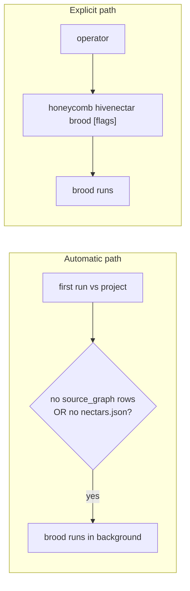

# PRD-007d: CLI Surface + Dry-Run

> Parent: [`prd-007-brooding-process-index.md`](./prd-007-brooding-process-index.md)

## Overview

The operator-facing surface that triggers and controls brooding: the **`brood` command**, the **`--force`** flag (re-describe everything), the **`--limit N`** flag (cost cap), the **`--dry-run`** flag (cost preview with no LLM calls), and the two **triggering paths** (automatic on first run with no `source_graph` rows, or explicit invocation). All four surface elements are carried verbatim from [`knowledge/private/ai/brooding-pipeline.md`](../../../knowledge/private/ai/brooding-pipeline.md) § "Triggering brooding."

This sub-PRD owns the **brooding-specific** CLI behavior. The *invocation dispatch* (the two entry binaries — bare `hivenectar` lifecycle vs `honeycomb hivenectar <verb>` operational, the loopback thin-client posture) is owned by [PRD-002c](../prd-002-hivenectar-daemon/prd-002c-hivenectar-cli-surface.md); this sub-PRD owns what the `brood` verb and its flags *do* when invoked. The `--model <new>` flag's model-selection mechanic is owned by [PRD-010](../prd-010-portkey-gateway/prd-010-portkey-gateway-index.md); this sub-PRD documents only that `--force --model <new>` is the model-swap re-describe path.

The `--dry-run` cost preview is this sub-PRD's distinctive deliverable: it consumes the cost math from [007b](./prd-007b-bucketing-and-llm-call-shapes.md) and prints it to the operator *before* any LLM call is made, as the corpus's recommended first step on any new project.

## Goals

- Carry the **`brood` command + its three flags (`--force`, `--limit N`, `--dry-run`) verbatim** from [`brooding-pipeline.md`](../../../knowledge/private/ai/brooding-pipeline.md) "Triggering brooding," including each command's one-line behavior.
- Define the **two triggering paths**: automatic (first run against a project with no `source_graph` rows or no `.honeycomb/nectars.json`) and explicit (operator-invoked).
- Specify the **`--dry-run` cost-preview behavior**: runs discovery + bucketing, prints the estimated call count + cost, exits without any LLM call.
- Specify **`--force`** (re-describe every file, ignore existing) and **`--limit N`** (brood at most N pending files, cost cap) against the resumability state machine in [007c](./prd-007c-resumability-state-machine.md).

## Non-Goals

- The CLI *invocation dispatch* — the two entry binaries, the loopback thin-client posture, the global-flag parsing — [PRD-002c](../prd-002-hivenectar-daemon/prd-002c-hivenectar-cli-surface.md). This sub-PRD owns the `brood` verb's behavior; 002c owns how the verb is reached.
- The `--model <new>` flag's model-selection mechanic + the `describe_model` audit — [PRD-010](../prd-010-portkey-gateway/prd-010-portkey-gateway-index.md). `--force --model <new>` is named here as the model-swap re-describe path; PRD-010 owns what `<new>` resolves to and how the model is selected.
- The bucketing, prompt shapes, and cost-math internals that `--dry-run` *displays* — [007b](./prd-007b-bucketing-and-llm-call-shapes.md). This sub-PRD owns the *preview surface*; 007b owns the numbers.
- The HTTP API endpoint that maps to brooding (`POST /api/source-graph/build`) — [PRD-008](../prd-008-hivenectar-api-endpoints/prd-008-hivenectar-api-endpoints-index.md). The CLI verb and the API endpoint are parallel surfaces over the same mechanic.
- The `rebuild-projection` / `prune` / `review-matches` commands — those are not brood commands; they are owned by [PRD-011](../prd-011-portable-projection/prd-011-portable-projection-index.md) and [PRD-006](../prd-006-file-registration-protocol/prd-006-file-registration-protocol-index.md) respectively, and documented in [002c](../prd-002-hivenectar-daemon/prd-002c-hivenectar-cli-surface.md).

---

## Triggering brooding

Brooding triggers on two paths, both carried from [`brooding-pipeline.md`](../../../knowledge/private/ai/brooding-pipeline.md):

### Automatic triggering

[`brooding-pipeline.md`](../../../knowledge/private/ai/brooding-pipeline.md) states: "Brooding triggers automatically the first time hiveantennae runs against a project with no `source_graph` rows (or no `.honeycomb/nectars.json`)." The automatic trigger is the default onboarding path — an operator adds a project, the daemon notices there is no source graph, and brooding begins in the background. It does **not** block daemon readiness (per the corpus's ADR-0007 reference, "brooding runs in the background after the daemon is accepting requests").

### Explicit triggering

The operator can invoke brooding directly with the `brood` command and any combination of its flags. Explicit invocation is how an operator re-broods after projection loss, sanity-checks a subset (`--limit`), previews cost (`--dry-run`), or forces a full re-describe (`--force`).

---

## Command catalog

### `honeycomb hivenectar brood`

**Invocation:** `honeycomb hivenectar brood`

**What it does:** A full brood. Discovers files, runs the content-hash pre-check, buckets survivors, makes batch/solo LLM calls, writes `source_graph` + `source_graph_versions` rows, embeds, and regenerates `.honeycomb/nectars.json`. Respects existing descriptions — only `pending` / undescribed files are described (rule 1 of the resumability state machine, [007c](./prd-007c-resumability-state-machine.md)).

**Carried from:** [`brooding-pipeline.md`](../../../knowledge/private/ai/brooding-pipeline.md) — `honeycomb hivenectar brood # full brood, respects existing descriptions`.

---

### `honeycomb hivenectar brood --force`

**Invocation:** `honeycomb hivenectar brood --force`

**What it does:** Re-describes **every file, ignoring existing descriptions**. [`brooding-pipeline.md`](../../../knowledge/private/ai/brooding-pipeline.md) states verbatim: `honeycomb hivenectar brood --force # re-describe every file, ignore existing`. Mechanically, `--force` resets all non-skipped rows back to `describe_status = 'pending'` so the brooder re-describes them — it is the inverse of the resumability rule 1 (skip-already-brooded): `--force` opts out of the skip. Skipped rows (`skipped-binary`, `skipped-too-large`) remain skipped, because no description is possible for them regardless.

**Carried from:** [`brooding-pipeline.md`](../../../knowledge/private/ai/brooding-pipeline.md) "Triggering brooding"; [`knowledge/private/ai/enricher-and-llm-model.md`](../../../knowledge/private/ai/enricher-and-llm-model.md) "An operator who swaps models and wants to re-describe everything runs `honeycomb hivenectar brood --force --model <new>`."

---

### `honeycomb hivenectar brood --force --model <new>`

**Invocation:** `honeycomb hivenectar brood --force --model <new>`

**What it does:** The **model-swap re-describe path**. Forces re-description of every non-skipped file using a different model than the default (Gemini 2.5 Flash), and records the model in the `describe_model` column for each row. [`knowledge/private/ai/enricher-and-llm-model.md`](../../../knowledge/private/ai/enricher-and-llm-model.md) states: "runs `honeycomb hivenectar brood --force --model <new>`, which sets all non-skipped rows back to `pending`." The model is **not** swapped automatically on a config change — the operator must run this explicitly.

> **Mechanic owner:** the `--model <new>` flag's resolution + the `describe_model` audit are owned by [PRD-010](../prd-010-portkey-gateway/prd-010-portkey-gateway-index.md). This sub-PRD documents the flag's *effect* (force + re-describe with a chosen model); PRD-010 owns what `<new>` resolves to.

---

### `honeycomb hivenectar brood --limit N`

**Invocation:** `honeycomb hivenectar brood --limit N` (e.g. `--limit 100`)

**What it does:** Broods **at most `N` pending files** — a cost cap. [`brooding-pipeline.md`](../../../knowledge/private/ai/brooding-pipeline.md) states verbatim: `honeycomb hivenectar brood --limit 100 # brood at most 100 pending files (cost cap)`. Bounds the number of LLM calls so an operator can sanity-check a subset before committing to the full brood. Combined with the resumability state machine ([007c](./prd-007c-resumability-state-machine.md)), `--limit` lets an operator brood in bounded chunks across multiple invocations — each chunk's work is committed, and the next `--limit` run resumes from there.

**Carried from:** [`brooding-pipeline.md`](../../../knowledge/private/ai/brooding-pipeline.md) "Triggering brooding."

---

### `honeycomb hivenectar brood --dry-run`

**Invocation:** `honeycomb hivenectar brood --dry-run`

**What it does:** Runs **discovery and bucketing, prints the estimated call count and cost, and exits without making any LLM call.** [`brooding-pipeline.md`](../../../knowledge/private/ai/brooding-pipeline.md) states verbatim: `honeycomb hivenectar brood --dry-run # show buckets and cost estimate, no LLM calls`. It is the corpus's **recommended first step on any new project** to sanity-check the cost before committing to it.

`--dry-run` consumes the cost math from [007b](./prd-007b-bucketing-and-llm-call-shapes.md): it discovers the candidate set, runs the content-hash pre-check to subtract the projection-inherited files, buckets the survivors, and prints the bucket counts, the estimated call count, and the estimated dollar cost — all derived from the same `BATCH_FILE_SIZE` / `MAX_DESCRIBE_SIZE` thresholds and the same per-bucket token math, without ever calling the model.

**Carried from:** [`brooding-pipeline.md`](../../../knowledge/private/ai/brooding-pipeline.md) "Triggering brooding" — "It is the recommended first step on any new project to sanity-check the cost before committing to it."

---

## The `--dry-run` cost preview

The `--dry-run` flag is this sub-PRD's distinctive deliverable, so its behavior is specified precisely:

1. **Discover** — run the [007a](./prd-007a-discovery-and-content-hash-precheck.md) discovery (`git ls-files` + walk fallback) to get the candidate set.
2. **Pre-check** — run the content-hash pre-check against the projection to subtract inherited files (those that would pay $0).
3. **Bucket** — bucket the survivors into the four buckets using the [007b](./prd-007b-bucketing-and-llm-call-shapes.md) thresholds (skip-binary / skip-too-large / batch / solo).
4. **Estimate** — compute the estimated call count (batch calls + solo calls) and the estimated cost from the [007b](./prd-007b-bucketing-and-llm-call-shapes.md) cost math, applied to this project's actual bucket counts.
5. **Print** — display the bucket counts, the estimated call count, and the estimated cost.
6. **Exit** — exit **without making any LLM call.** No `source_graph` or `source_graph_versions` rows are written; the projection is not regenerated. The run is read-only with respect to the description layer.

The preview is therefore a *projection* of what a real brood would cost this specific project, not a recital of the 2000-file reference table from [007b](./prd-007b-bucketing-and-llm-call-shapes.md). It uses the same per-bucket economics but the actual file counts the discovery found.

---

## Interaction with resumability

All four surface elements interact with the resumability state machine in [007c](./prd-007c-resumability-state-machine.md):

| Surface | Resumability interaction |
|---|---|
| `brood` (no flags) | Applies all three rules: skip already-brooded, re-enqueue pending, discover fresh. The default, "respects existing descriptions" path. |
| `brood --force` | Overrides rule 1 (skip): resets non-skipped rows to `pending` so they are re-described. Skipped rows stay skipped. |
| `brood --limit N` | Bounds the work per invocation; resumability makes multi-invocation brooding safe (each chunk commits). |
| `brood --dry-run` | No interaction — reads only, writes nothing, changes no `describe_status`. |

---

## User stories

### US-007d.1 — An operator previews cost before committing
**As an** operator, **when** I run `honeycomb hivenectar brood --dry-run` on a new project, **I** see the bucket counts and cost estimate with no LLM calls, **so that** I can sanity-check cost before committing.

- Acceptance: `--dry-run` runs discovery + pre-check + bucketing, prints the estimate, and exits without any LLM call ([`brooding-pipeline.md`](../../../knowledge/private/ai/brooding-pipeline.md) "Triggering brooding").

### US-007d.2 — An operator caps brooding cost
**As an** operator, **when** I run `honeycomb hivenectar brood --limit 100`, **only** 100 pending files are brooded, **so that** I bound the spend and can brood the rest later.

- Acceptance: `--limit N` caps the number of pending files brooded; the work commits so the next invocation resumes ([`brooding-pipeline.md`](../../../knowledge/private/ai/brooding-pipeline.md); [007c](./prd-007c-resumability-state-machine.md)).

### US-007d.3 — An operator re-describes after a model swap
**As an** operator, **when** I swap models, **I** run `honeycomb hivenectar brood --force --model <new>`, **so that** every non-skipped file is re-described by the new model and recorded in `describe_model`.

- Acceptance: `--force` re-describes every non-skipped file; `--model <new>` selects the model and is recorded in `describe_model` ([`knowledge/private/ai/enricher-and-llm-model.md`](../../../knowledge/private/ai/enricher-and-llm-model.md)).

### US-007d.4 — Brooding starts automatically on a fresh project
**As an** operator, **when** I add a project with no source graph, **brooding** triggers automatically in the background, **so that** I do not have to invoke it manually for the first scan.

- Acceptance: the automatic trigger fires when no `source_graph` rows (or no `.honeycomb/nectars.json`) exist ([`brooding-pipeline.md`](../../../knowledge/private/ai/brooding-pipeline.md) "Triggering brooding").
- Acceptance: the automatic trigger does not block daemon readiness.

### US-007d.5 — An operator forces a full re-describe
**As an** operator, **when** I run `honeycomb hivenectar brood --force`, **every** non-skipped file is re-described, **so that** stale descriptions are refreshed.

- Acceptance: `--force` resets non-skipped rows to `pending` and re-describes them; skipped rows stay skipped ([`brooding-pipeline.md`](../../../knowledge/private/ai/brooding-pipeline.md)).

---

## Implementation notes

- The command + flag surface is carried verbatim from [`brooding-pipeline.md`](../../../knowledge/private/ai/brooding-pipeline.md) "Triggering brooding." Each invocation's one-line behavior in this sub-PRD matches the source doc's code-block comments.
- The CLI is a **thin client** that reaches the running daemon over loopback `:3854` for the operational verbs (mirroring honeycomb's loopback `DaemonClient` posture), per [PRD-002c](../prd-002-hivenectar-daemon/prd-002c-hivenectar-cli-surface.md). The brood mechanic executes daemon-side; the CLI dispatches to it.
- `--dry-run` is the only flag that produces no daemon-side mutation; the others (`brood`, `--force`, `--limit`) execute the full pipeline stages (007a → 007b → embed → persist → regenerate projection).
- The automatic trigger's "no `source_graph` rows OR no `.honeycomb/nectars.json`" condition is checked at daemon startup / project registration, not on every boot — brooding does **not** run on every daemon boot ([`brooding-pipeline.md`](../../../knowledge/private/ai/brooding-pipeline.md) "What brooding does not do").
- The `--model` flag's mechanic (what model id `<new>` resolves to, how Portkey routes it, how `describe_model` is set) is owned by [PRD-010](../prd-010-portkey-gateway/prd-010-portkey-gateway-index.md); this sub-PRD names only the flag's *effect*.
- The CLI invocation dispatch — `honeycomb hivenectar` as the operational namespace, reaching the daemon over loopback — mirrors `honeycomb/src/cli/index.ts` (the thin-client `main` + lifecycle/operational split documented in [PRD-002c](../prd-002-hivenectar-daemon/prd-002c-hivenectar-cli-surface.md)).

No open questions. The command + flag surface is carried verbatim from [`brooding-pipeline.md`](../../../knowledge/private/ai/brooding-pipeline.md); no defaults are flagged in this sub-PRD (the discovery command default lives in [007a](./prd-007a-discovery-and-content-hash-precheck.md), the batch-size-cap default in [007b](./prd-007b-bucketing-and-llm-call-shapes.md)).

## Related

- [PRD-007 index](./prd-007-brooding-process-index.md)
- [PRD-007a](./prd-007a-discovery-and-content-hash-precheck.md) — `--dry-run`'s discover + pre-check stages.
- [PRD-007b](./prd-007b-bucketing-and-llm-call-shapes.md) — `--dry-run`'s bucketing + the cost math it displays.
- [PRD-007c](./prd-007c-resumability-state-machine.md) — how `--force` / `--limit` interact with the resume rules.
- [`knowledge/private/ai/brooding-pipeline.md`](../../../knowledge/private/ai/brooding-pipeline.md) — the authoritative "Triggering brooding" + "What brooding does not do."
- [`knowledge/private/ai/enricher-and-llm-model.md`](../../../knowledge/private/ai/enricher-and-llm-model.md) — the `--force --model <new>` model-swap path + the no-automatic-swap rule.
- [PRD-002c](../prd-002-hivenectar-daemon/prd-002c-hivenectar-cli-surface.md) — the CLI *invocation dispatch* (entry binaries, loopback thin-client) this verb lives in.
- [PRD-008](../prd-008-hivenectar-api-endpoints/prd-008-hivenectar-api-endpoints-index.md) — the parallel HTTP endpoint (`POST /api/source-graph/build`).
- [PRD-010](../prd-010-portkey-gateway/prd-010-portkey-gateway-index.md) — owns the `--model <new>` flag's model-selection mechanic.
