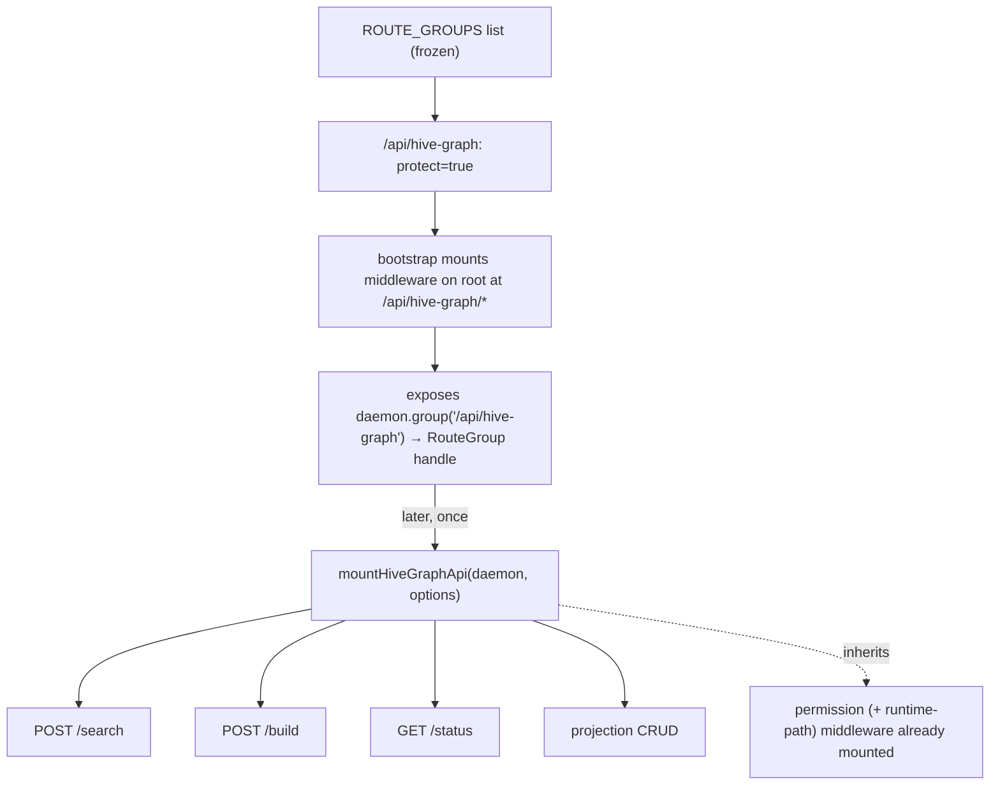

# PRD-008a: Route Group Scaffolding

> Parent: [`prd-008-nectar-api-endpoints-index.md`](./prd-008-nectar-api-endpoints-index.md)

## Overview

This sub-PRD owns the **mounting of the `/api/hive-graph` route group** through nectar's own in-repo router seam layered over the existing `node:http` request handler (`src/server.ts`) and the **handler-attachment contract** every 008b/008c endpoint conforms to. It DEFINES a minimal `RouteGroup` abstraction (and the `mountHiveGraphApi(daemon, options)` attach point) that mirrors honeycomb's Hono-based `ROUTE_GROUPS` pattern across the process boundary (`ADR-0002`) while honoring nectar's zero-runtime-dependency invariant (`AGENTS.md`); it does not import honeycomb's Hono runtime. It does not own any endpoint's behavior: it owns the *shape* the endpoints are attached into, so 008b/008c and every later handler fill a group that is already protected, already mounted at the right base path, and already exposes the `group()` accessor.

The pattern is the one honeycomb's daemon bootstrap establishes and documents as its central seam. The bootstrap declares a frozen `ROUTE_GROUPS` list of `{ path, protect, session }` specs and mounts each group's middleware on the root app at `${path}/*` **before** any handler exists, then exposes a `group(path)` accessor returning a `basePath` router bound to the root so a later module attaches handlers and they **inherit** the already-mounted middleware (`honeycomb/src/daemon/runtime/server.ts:68-106` the `ROUTE_GROUPS` list; `honeycomb/src/daemon/runtime/server.ts:306-328` the scaffolding loop; `honeycomb/src/daemon/runtime/server.ts:205-214` the `group()` accessor contract). The defining property — why this shape and not `app.route(base, subApp)` — is that `app.route` **copies** a sub-app's routes at call time, so a handler a later module adds to the sub-app *after* bootstrap is never picked up; mounting middleware on the root at `${base}/*` and returning `app.basePath(base)` keeps the binding live, so a handler attached later runs the already-mounted middleware without re-wiring auth (the a-AC-6 property, `honeycomb/src/daemon/runtime/server.ts:293-305`). Nectar mirrors this pattern in its own in-repo seam over `node:http` (`src/server.ts`): the group is mounted in the nectar daemon's `ROUTE_GROUPS`-equivalent list and exposed via its own `group()` accessor, which returns nectar's own `RouteGroup` handle, not a Hono router.

The handler-attachment pattern is `mountGraphApi`: a module takes the constructed daemon + options, resolves the group once (`daemon.group(GRAPH_GROUP)`), and attaches handlers at paths **relative** to the group (`/build`, `/`, `/:id`) — the group base is stripped (`honeycomb/src/daemon/runtime/codebase/api.ts:304-347`). Nectar ships `mountHiveGraphApi(daemon, options)` with the identical shape, scoped to `/api/hive-graph`.

## Goals

- Mount the `/api/hive-graph` group in the nectar daemon's `ROUTE_GROUPS`-equivalent list as `{ path: "/api/hive-graph", protect: true, session: <per default> }`, mirroring honeycomb's frozen `ROUTE_GROUPS` (`honeycomb/src/daemon/runtime/server.ts:68-106`).
- Scaffold and inherit the group's **protection middleware** on the in-repo seam (the group is `protect: true`; the shipped daemon has none today beyond the unprotected `/health`, `src/server.ts`), so every 008b/008c endpoint is session-protected without each handler re-wiring auth (the a-AC-6 property, `honeycomb/src/daemon/runtime/server.ts:293-305`).
- Specify the **`group()` accessor contract** for the nectar daemon: `daemon.group("/api/hive-graph")` returns the `basePath` router (or `undefined` for an unknown group), and handlers register at paths relative to the group, mirroring `honeycomb/src/daemon/runtime/server.ts:205-214`.
- Specify `mountHiveGraphApi(daemon, options)` as the single attach module modeled on `mountGraphApi` (`honeycomb/src/daemon/runtime/codebase/api.ts:304-347`), with scope resolution per-request and build-failure-as-data-body error handling.
- Confirm the group sits **beside** the daemon's non-protected diagnostics endpoints (`/health`, `/api/status`, which get no permission middleware — `honeycomb/src/daemon/runtime/server.ts:69-70, 309`) and never shadows them.

## Non-Goals

- The behavior of any individual endpoint — **008b** (search), **008c** (build/status/projection). This sub-PRD owns the mounting shape only.
- The daemon bootstrap / `createDaemon` / socket bind — **PRD-002** + the bootstrap the daemon owns. This sub-PRD assumes the constructed daemon exposes a `group()` accessor.
- The RBAC/authenticator policy logic itself (the gate's internals) is the mirrored honeycomb pattern (`honeycomb/src/daemon/runtime/middleware/permission.ts`); 008a scaffolds the protection-middleware mount on the in-repo seam (the shipped daemon has none today) but does not design that gate logic.
- The `runtime-path` middleware for session capture — owned by the daemon (`honeycomb/src/daemon/runtime/middleware/runtime-path.ts`); this sub-PRD only inherits it where the group is `session: true`.

---

## The `ROUTE_GROUPS` pattern nectar mirrors

Honeycomb's daemon declares its route-group surface as a frozen array of specs and mounts every group at bootstrap, even those with no handler yet. The nectar daemon mirrors this: its own `ROUTE_GROUPS`-equivalent list includes the `/api/hive-graph` entry, so the group exists and is protected from the first boot, before `mountHiveGraphApi` attaches any handler.



The `RouteGroupSpec` shape nectar mirrors (`honeycomb/src/daemon/runtime/server.ts:57-61`):

```ts
interface RouteGroupSpec {
  readonly path: string;
  readonly protect: boolean;
  readonly session: boolean;
}
```

A group enters the frozen list once; the `protect` bit mounts the permission middleware at `${path}/*` on the root, and the `session` bit additionally mounts the runtime-path middleware **ahead** of permission (so a path-reject fails closed before any session handler) (`honeycomb/src/daemon/runtime/server.ts:315-323`). The two diagnostics endpoints (`/health`, `/api/status`) are the only `protect: false` entries and are skipped by the middleware loop (`honeycomb/src/daemon/runtime/server.ts:69-70, 309`).

---

## Permission-middleware inheritance (the load-bearing property)

Every handler attached to `/api/hive-graph` inherits the protection middleware the bootstrap mounted at `/api/hive-graph/*`. The shipped nectar daemon has no protection middleware today (only the unprotected `/health`, `src/server.ts`), so 008a scaffolds that protection-middleware mount on the in-repo seam, mirroring honeycomb's permission mount; the RBAC/authenticator policy internals are the mirrored honeycomb pattern and are not re-designed here. This is the a-AC-6 seam honeycomb documents and relies on: a later module calls `daemon.group("/api/hive-graph").post("/search", h)` and the handler `h` runs behind the already-mounted gate, with no auth wiring in the handler itself (`honeycomb/src/daemon/runtime/server.ts:293-305`).

This is why the shape is `app.basePath(base)` and not `app.route(base, subApp)`: `app.route` copies the sub-app's routes at call time, so a handler added to the sub-app *after* the bootstrap loop is never reflected. Mounting middleware on the root at `${base}/*` and returning a `basePath` router bound to the root keeps the binding live — a handler attached later is picked up, runs the mounted middleware, and an unfilled path falls through to the root 501 scaffold (registered as `notFound`) rather than reaching a handler with no protection (`honeycomb/src/daemon/runtime/server.ts:297-305, 385-400`).

The permission gate is mode-aware: honeycomb resolves it through a `mountPermission(groupPath)` thunk that reflects the daemon's mode (`local` / `team` / `hybrid`), selecting either the legacy header-resolved adapter or the injected `authenticator` + `policy` pair, both defaulting fail-closed (always-unauthenticated → 401, default-deny → 403) (`honeycomb/src/daemon/runtime/server.ts:254-263`). The nectar daemon inherits the same mode-aware resolution; this sub-PRD does not re-design the gate, only confirms the group sits behind it.

---

## The `group()` accessor contract

The constructed daemon exposes a `group(path)` accessor returning the scaffolded `RouteGroup` handle for a route group, or `undefined` for an unknown group path, mirroring honeycomb's accessor contract (`honeycomb/src/daemon/runtime/server.ts:205-214`). The group base is **stripped**: a handler registers at the path **relative** to the group (`/search`, not the full `/api/hive-graph/search`).

`RouteGroup` is nectar's own minimal, zero-dependency analogue of the `basePath` router honeycomb gets from Hono: a route-group handle exposing `.get(subpath, handler)` / `.post(subpath, handler)` that register each handler at the path relative to the group base on the daemon's `node:http` request dispatcher (`src/server.ts`) and run the group's already-mounted middleware chain. It mirrors the honeycomb accessor's contract without importing Hono (`ADR-0002`).

```ts
// The in-repo router seam over node:http (src/server.ts); NOT the Hono class.
group(path: string): RouteGroup | undefined;
```

`mountHiveGraphApi` mirrors `mountGraphApi`'s one-line group resolution + no-op-on-unknown-group guard (`honeycomb/src/daemon/runtime/codebase/api.ts:304-306`):

```ts
export function mountHiveGraphApi(daemon: Daemon, options: MountHiveGraphOptions): void {
  const group = daemon.group("/api/hive-graph");
  if (group === undefined) return; // unknown daemon shape → no-op attach
  // ... 008b/008c handlers attach to `group` at paths relative to /api/hive-graph
}
```

The no-op-on-unknown-group guard means the attach module is safe to call against a daemon whose `ROUTE_GROUPS` list does not yet include the group (a daemon built before this PRD lands) — it attaches nothing rather than throwing.

---

## Per-request scope resolution

Each handler resolves the tenant scope per-request, mirroring `mountGraphApi`'s `resolveScope` (`honeycomb/src/daemon/runtime/codebase/api.ts:309-310`):

```ts
const resolveScope = (c: Context): QueryScope | null =>
  resolveScopeOrLocalDefault(c, daemon.config.mode, options.defaultScope);
```

A request with no resolvable scope returns the `NO_ORG_BODY` 400 (mirroring `honeycomb/src/daemon/runtime/codebase/api.ts:319-320`) before the handler reaches storage. Every handler reaches storage **solely** through the injected storage client — the daemon is the only DeepLake client, and no handler opens DeepLake (`honeycomb/src/daemon/runtime/server.ts:13-16` FR-6).

---

## User stories

### US-008a.1 — The group exists and is protected from first boot

**As a** operator, **I want to** the `/api/hive-graph` group mounted and protected the moment the daemon boots, **so that** even an endpoint whose handler is not yet attached inherits the permission gate rather than answering unprotected.

**Acceptance criteria:**
- AC-008a.1.1 Given the daemon has booted, then the nectar daemon's `ROUTE_GROUPS`-equivalent list contains `{ path: "/api/hive-graph", protect: true }`, mirroring `honeycomb/src/daemon/runtime/server.ts:68-106`.
- AC-008a.1.2 Given the group is mounted, then the permission middleware is mounted on the root at `/api/hive-graph/*`, mirroring `honeycomb/src/daemon/runtime/server.ts:306-328`.
- AC-008a.1.3 Given a path under `/api/hive-graph/*` with no handler attached, then it falls through to the root 501 scaffold, mirroring `honeycomb/src/daemon/runtime/server.ts:385-400` — it never answers with no protection.

### US-008a.2 — `group()` returns the `RouteGroup` handle for handler attachment

**As a** the implementer of `mountHiveGraphApi`, **I want to** `daemon.group("/api/hive-graph")` to return a `RouteGroup` handle, **so that** I attach handlers at paths relative to the group and they inherit the middleware.

**Acceptance criteria:**
- AC-008a.2.1 Given the group is mounted, then `daemon.group("/api/hive-graph")` returns a `RouteGroup` (nectar's in-repo router seam over `node:http`, `src/server.ts`), not `undefined`, mirroring honeycomb's `basePath`-router accessor contract (`honeycomb/src/daemon/runtime/server.ts:205-214`) without importing Hono.
- AC-008a.2.2 Given an unknown group path, then `daemon.group(path)` returns `undefined`, mirroring `honeycomb/src/daemon/runtime/server.ts:210, 214`.
- AC-008a.2.3 Given a handler attached via `group.post("/search", h)`, then it registers on the root at the full `/api/hive-graph/search` path and runs the already-mounted permission middleware, mirroring `honeycomb/src/daemon/runtime/server.ts:324-328`.

### US-008a.3 — `mountHiveGraphApi` is a safe no-op on an unknown group

**As a** operator booting a daemon built before this PRD, **I want to** `mountHiveGraphApi` to attach nothing rather than crash, **so that** the daemon boots cleanly.

**Acceptance criteria:**
- AC-008a.3.1 Given `daemon.group("/api/hive-graph")` returns `undefined`, then `mountHiveGraphApi` returns without attaching (no throw), mirroring `honeycomb/src/daemon/runtime/codebase/api.ts:305-306`.

---

## Implementation notes

- **Mirror, not import.** Per `ADR-0002` (the process-boundary decision; not `MASTER-PRD-INDEX.md` decision #4, which is the unrelated file-watcher choice), the nectar daemon mirrors honeycomb's `ROUTE_GROUPS` pattern in its own composition root; it does not import honeycomb's `server.ts`. The `ROUTE_GROUPS`-equivalent list is nectar's own frozen array in its own bootstrap ([`prd-002a`](../../completed/prd-002-nectar-daemon/prd-002a-nectar-bootstrap-and-composition-root.md)).
- **Reconciliation with PRD-002a.** PRD-002a's original spec sketched a Hono-based daemon bound via `@hono/node-server`; the shipped PRD-002 implementation diverged and is a zero-runtime-dependency `node:http` server (`src/server.ts`, only the unprotected `/health` today, per `AGENTS.md`'s "Zero runtime dependencies by design" invariant). PRD-008 follows the shipped reality: the `ROUTE_GROUPS`-equivalent list, the `RouteGroup` handle, the `group()` accessor, and the protection-middleware mount are nectar's own in-repo abstraction layered over `node:http`, mirroring honeycomb's Hono-based pattern across the process boundary (`ADR-0002`) rather than importing it or adding a `hono` runtime dependency. This PRD does not edit PRD-002a or the corpus; it records the reconciliation here so an implementer builds against the real, shipped daemon surface.
- **Mount once, attach once.** The group is mounted in the bootstrap (the `ROUTE_GROUPS` loop); handlers are attached once after `createDaemon(...)` by `mountHiveGraphApi`. The two phases never contend on a shared file (the seam's whole point — `honeycomb/src/daemon/runtime/server.ts:9-12`).
- **Diagnostics endpoints stay unprotected.** `/health` and `/api/status` are the daemon's own `protect: false` entries (`honeycomb/src/daemon/runtime/server.ts:69-70`) owned by the bootstrap/PRD-002; this sub-PRD does not add them and does not shadow them (exact `/api/status` registers before the `/api/*` groups).
- **Storage reached through the client only.** Scope-resolved storage access mirrors `mountGraphApi`'s `resolveScope` + injected `storage` (`honeycomb/src/daemon/runtime/codebase/api.ts:309-310`); no handler opens DeepLake directly (`honeycomb/src/daemon/runtime/server.ts:13-16` FR-6).
- **Session bit.** Whether the group is `session: true` (inheriting the runtime-path middleware ahead of permission) follows the default flagged below; the `protect` bit is `true` regardless.

---

## Flagged defaults

- **[DEFAULT — confirm before implementation]** Route group path `/api/hive-graph` with inherited session-protect middleware. The path mirrors honeycomb's `/api/graph` group (`honeycomb/src/daemon/runtime/server.ts:84`); the session-protect posture mirrors honeycomb's capture surfaces (`/api/memories`, `/memory`, `/api/hooks` are `protect: true, session: true` at `honeycomb/src/daemon/runtime/server.ts:72-74`). Whether `/api/hive-graph` is `session: true` (runtime-path ahead of permission) or `session: false` (permission only, like `/api/graph` at `honeycomb/src/daemon/runtime/server.ts:84`) is the one bit to confirm. From the daemon's session-protect convention, confirm.

---

## Related

- [`./prd-008-nectar-api-endpoints-index.md`](./prd-008-nectar-api-endpoints-index.md)
- [`./prd-008b-search-endpoint.md`](./prd-008b-search-endpoint.md) — the search handler this scaffolding receives.
- [`./prd-008c-build-status-projection-endpoints.md`](./prd-008c-build-status-projection-endpoints.md) — the build/status/projection handlers this scaffolding receives.
- [`../../completed/prd-002-nectar-daemon/prd-002a-nectar-bootstrap-and-composition-root.md`](../../completed/prd-002-nectar-daemon/prd-002a-nectar-bootstrap-and-composition-root.md) — the daemon composition root that exposes `group()`.
- [`../../MASTER-PRD-INDEX.md`](../../MASTER-PRD-INDEX.md) — PRD-008 brief.
- `ADR-0002` — the mirror-not-import decision.
- `honeycomb/src/daemon/runtime/server.ts:68-106` — `ROUTE_GROUPS`.
- `honeycomb/src/daemon/runtime/server.ts:205-328` — `group()` accessor + scaffolding loop + permission inheritance.
- `honeycomb/src/daemon/runtime/codebase/api.ts:304-347` — `mountGraphApi` (the handler-attachment pattern to mirror).
