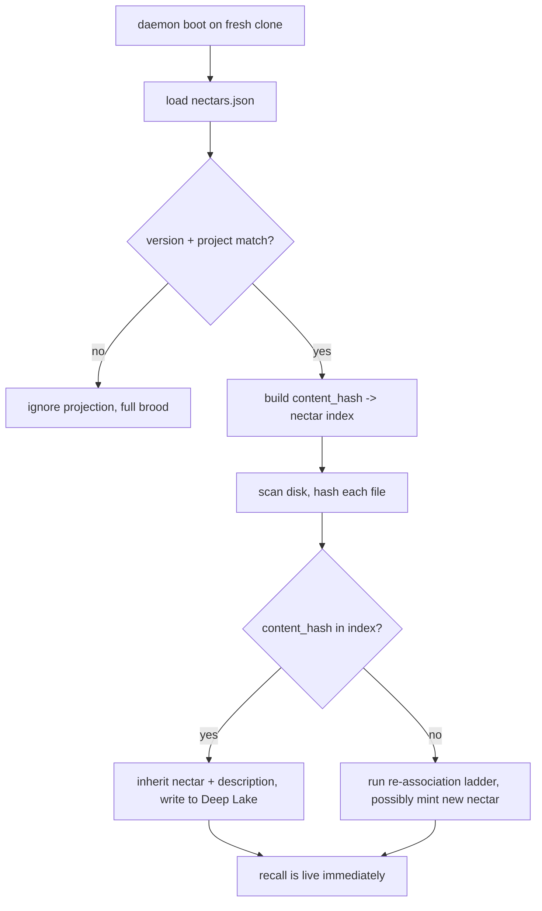

# PRD-011b: Validation on load and fresh-clone inheritance

> **Status:** Backlog
> **Priority:** P1
> **Effort:** M (3-8h)
> **Schema changes:** None

---

## Overview

When hiveantennae boots and finds `.honeycomb/nectars.json`, the boot path is a zero-LLM shortcut: validate the projection, build a content-hash → nectar index, scan disk, and inherit any file whose hash matches — writing the inherited rows to the local Deep Lake so recall is live immediately. This sub-PRD owns the four-point validation-on-load contract (`version`, `project` triple, ULID validity, sha256 validity) and the fresh-clone inheritance path that makes a current projection achieve zero LLM calls and zero fuzzy matches. Validation gates the whole path: a projection that fails any check is ignored with a warning and never partially loaded.

---

## Goals

- On load, the daemon validates four things: `version` is one it can read (≤ its own schema version); the `project` triple matches the current context; every nectar key is a syntactically valid ULID; every `content_hash` is a syntactically valid sha256.
- A projection that fails any validation check is ignored with a warning, and the daemon falls back to full brooding. The projection is never partially loaded.
- A fresh clone with a current projection inherits every file whose content hash matches the projection's index — nectar + description carried over, written to the local Deep Lake, with zero LLM calls and zero fuzzy matches.
- Recall is live immediately after inheritance; the brooding cost was paid by whoever first brooded the project, and the clone pays nothing.

## Non-Goals

- The file format and atomic write (PRD-011a).
- The `rebuild-projection` CLI and the enforcement rules (PRD-011c).
- Deep Lake cloud sync. The projection is the offline path; cloud sync is complementary and out of scope here (`data/portable-registry.md` § What the portable registry explicitly does not do).
- Reverse-syncing projection state back to a remote Deep Lake beyond the clone-local inheritance write. The reverse direction happens only on a fresh clone, only for nectars the local Deep Lake lacks.

---

## The validation-on-load contract

From `data/portable-registry.md` § Validation on load, the daemon validates four things when it loads a projection:

1. **`version` is one it knows how to read** (≤ its own schema version). A higher version means a newer daemon produced the file; the daemon refuses to load it and falls back to full brooding.
2. **`project.org_id`, `project.workspace_id`, `project.project_id` match the current context.** A mismatch means the projection is from a different project (the repo was templated from another project, or the file was committed by mistake) and is ignored.
3. **Every nectar key is a syntactically valid ULID.**
4. **Every `content_hash` is a syntactically valid sha256.**

A projection that fails validation is ignored with a warning, and the daemon falls back to full brooding. The projection is **never partially loaded** — the four checks are a single gate, not a per-entry filter.

The version field doubles as a forward-compat signal: `version` is bumped on incompatible format changes, and old daemon versions refuse to load a higher version and fall back to brooding (`data/portable-registry.md` § What it contains).

---

## The fresh-clone inheritance path

From `data/portable-registry.md` § How it is used on a fresh clone, the boot path when the daemon finds `.honeycomb/nectars.json` present:

A fresh clone with a current projection typically achieves **zero LLM calls and zero fuzzy matches**: every file's content hash matches the projection, every nectar is inherited, every description is carried over. The daemon writes the inherited rows to Deep Lake (the local Deep Lake instance, which is the substrate for this clone's recall) and is immediately ready to serve semantic queries. The brooding cost was paid by whoever first brooded the project; the clone pays nothing.

### Stale files enter the ladder

When the projection is stale (files on disk have content hashes not in the projection), those files enter the re-association ladder (`knowledge/private/ai/identity-and-reassociation.md`). The projection's content-hash index is the "known nectars" map that step 3 of the ladder consults; a content-hash match against a projection entry inherits that nectar directly without needing Deep Lake cloud sync. The ladder itself is owned by PRD-006; this PRD owns only the index the ladder consults.

### Inheritance writes to local Deep Lake only

The inheritance write goes to the clone's local Deep Lake, and only for nectars the local Deep Lake does not already have (`data/portable-registry.md` § What the portable registry explicitly does not do). Sync is one-directional Deep Lake → projection on the generation side; the reverse is a clone-local inheritance, not a bidirectional channel.

---

## User stories

### US-011b.1 — Reject a mismatched-project projection

**As a** teammate, **I want to** a projection from a different project context to be ignored, **so that** a mis-committed or templated file does not pollute my clone's identity map.

**Acceptance criteria:**
- AC-011b.1.1 Given a loaded projection whose `project.org_id`/`workspace_id`/`project_id` does not match the current context, then the projection is ignored with a warning.
- AC-011b.1.2 Given a mismatched-project projection, then the daemon falls back to full brooding and never writes any of its entries to Deep Lake.

### US-011b.2 — Reject a future-version projection

**As a** operator on an older daemon, **I want to** a projection with a higher `version` than I understand to be ignored, **so that** I fall back to brooding rather than misreading an incompatible format.

**Acceptance criteria:**
- AC-011b.2.1 Given a loaded projection whose `version` exceeds the daemon's own schema version, then the projection is ignored with a warning.
- AC-011b.2.2 Given a future-version projection, then the daemon falls back to full brooding.

### US-011b.3 — Reject syntactically invalid entries

**As a** teammate, **I want to** a projection with a malformed nectar or content hash to be rejected wholesale, **so that** a single corrupt entry never partially loads.

**Acceptance criteria:**
- AC-011b.3.1 Given a loaded projection where any nectar key is not a syntactically valid ULID, then the projection is ignored with a warning and never partially loaded.
- AC-011b.3.2 Given a loaded projection where any `content_hash` is not a syntactically valid sha256, then the projection is ignored with a warning and never partially loaded.

### US-011b.4 — Inherit a current projection with zero LLM calls

**As a** teammate on a fresh clone, **I want to** every matching file to inherit its nectar and description, **so that** recall is live immediately with no brooding cost.

**Acceptance criteria:**
- AC-011b.4.1 Given a fresh clone with a current projection, when the daemon boots and the projection validates, then a content-hash → nectar index is built from `files`.
- AC-011b.4.2 Given a file on disk whose content hash matches an index entry, then the nectar and description are inherited and written to local Deep Lake with zero LLM calls.
- AC-011b.4.3 Given all files match, then zero LLM calls are made and zero fuzzy matches are run, and recall is live immediately.

---

## Implementation notes

- **Validation is a single gate, not a per-entry filter.** The four checks all-or-nothing; a projection that fails any one is ignored wholesale and the daemon broods (`data/portable-registry.md` § Validation on load — "never partially loaded").
- **ULID validation is syntactic.** A 26-char Crockford-base32 ULID check is enough; the daemon does not need to verify the embedded timestamp. The corpus's validation lists "syntactically valid ULID" (`data/portable-registry.md` § Validation on load).
- **sha256 validation is syntactic.** A `sha256-` prefix + 64 hex chars check; the daemon does not re-hash file contents during validation (that happens in the disk-scan step). Corpus: "syntactically valid sha256."
- **The index is `content_hash → nectar`.** Built once from `files` after validation passes; the disk scan hashes each file and looks up the hash. A hit inherits; a miss enters the re-association ladder (PRD-006).
- **Inheritance is additive to local Deep Lake.** It writes only nectars the local Deep Lake lacks (`data/portable-registry.md` § What the portable registry explicitly does not do); it never overwrites or deletes.

---

## Flagged defaults

- **[DEFAULT — confirm before implementation]** Projection path: `.honeycomb/nectars.json` at the project root (`data/portable-registry.md` § The file format).
- **[DEFAULT — confirm before implementation]** Projection write debounce: 30s, carried from the enricher cycle cadence (`data/portable-registry.md` § The commit discipline). Confirm the window before implementation.

---

## Related

- [`./prd-011-portable-projection-index.md`](./prd-011-portable-projection-index.md)
- [`./prd-011a-format-generation-triggers-atomic-write.md`](./prd-011a-format-generation-triggers-atomic-write.md) — the format this validates.
- [`./prd-011c-rebuild-projection-cli-and-invariant.md`](./prd-011c-rebuild-projection-cli-and-invariant.md) — `rebuild-projection` to regenerate a projection validation can reject as stale.
- [`../../../knowledge/private/data/portable-registry.md`](../../../knowledge/private/data/portable-registry.md) — AUTHORITATIVE: the validation-on-load contract + the fresh-clone inheritance flowchart.
- [`../../../knowledge/private/ai/identity-and-reassociation.md`](../../../knowledge/private/ai/identity-and-reassociation.md) — the re-association ladder that stale files enter; the projection's content-hash index is step-3's "known nectars" map.
- [`../../backlog/prd-006-file-registration-protocol/`](../../backlog/prd-006-file-registration-protocol/) — the re-association ladder owner.
