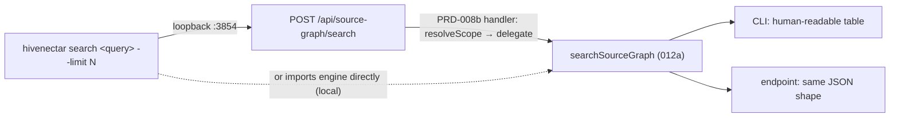

# PRD-012b: CLI and Endpoint Surface

> Parent: [`prd-012-manual-source-graph-search-index.md`](./prd-012-manual-source-graph-search-index.md)

## Overview

This sub-PRD owns the two client surfaces of the `searchSourceGraph` engine (012a): the **`hivenectar search <query>` CLI command** and the **`/api/source-graph/search` endpoint**. The two are parallel clients of the one engine — they pass the same query, scope, and limit, and they render the identical result shape. The endpoint's *handler* (scope resolution, delegation, failure-as-data) is owned by [PRD-008b](../prd-008-hivenectar-api-endpoints/prd-008b-search-endpoint.md); this sub-PRD owns the *command surface* + the contract the handler and the CLI both honor. The CLI is a thin client that reaches the daemon over loopback for the search (mirroring honeycomb's operational-verbs-reach-the-daemon posture, [`prd-002c`](../prd-002-hivenectar-daemon/prd-002c-hivenectar-cli-surface.md)).

`hivenectar search` is the proposed command named in the [`MASTER-PRD-INDEX.md`](../../MASTER-PRD-INDEX.md) CLI table ("`hivenectar search` (proposed) — manual source-graph search"). It enters the operational-verb namespace alongside `brood`, `prune`, `review-matches`, and `rebuild-projection`, and like them it reaches the running daemon over loopback rather than importing the daemon core.

## Goals

- Specify the **`hivenectar search <query>` CLI command** — its invocation, its flags (`--limit`, `--json`), its loopback-to-daemon posture, and its rendering of the engine result.
- Specify the **`/api/source-graph/search` endpoint contract** the PRD-008b handler implements: request shape, response shape, error bodies — identical to what the CLI emits.
- Confirm the two surfaces are **clients of the one engine** (012a) and return the identical result shape, so the dashboard search box and the terminal render identically.
- Confirm the CLI is a **thin client** that reaches the daemon over loopback (mirroring the operational-verb posture in [`prd-002c`](../prd-002-hivenectar-daemon/prd-002c-hivenectar-cli-surface.md)), not a process that imports the search engine directly.

## Non-Goals

- The search engine itself — **012a**. Both surfaces call it.
- The HTTP handler implementation (scope resolution, delegation, failure-as-data) — **PRD-008b**. This sub-PRD owns the *contract* the handler honors.
- The route-group scaffolding / permission inheritance for `/api/source-graph/search` — **PRD-008a**.
- The dashboard page that hosts the search box — **PRD-015**.
- The other CLI commands (`brood`, `prune`, `review-matches`, `rebuild-projection`) — **PRD-002c** / their owner PRDs.

---

## The CLI command

### `hivenectar search <query>`

**Invocation:** `hivenectar search <query> [--limit N] [--json]`

**What it does:** Runs the standalone source-graph search (012a's `searchSourceGraph`) over the latest described version per nectar, reaches the running daemon over loopback, and renders the ranked file descriptions.

**Flags:**
- `--limit N` — the result cap; default 20 (the engine's `DEFAULT_RECALL_LIMIT`, [`honeycomb/src/daemon/runtime/memories/recall.ts:129`](../../../../honeycomb/src/daemon/runtime/memories/recall.ts)).
- `--json` — emit the raw engine JSON (the same shape the endpoint returns) instead of a human-readable table; useful for piping.

**Entry binary / namespace:** the operational-verb namespace (reaches the daemon over loopback `:3854`), mirroring the `brood`/`prune`/`review-matches`/`rebuild-projection` posture in [`prd-002c`](../prd-002-hivenectar-daemon/prd-002c-hivenectar-cli-surface.md). It is a thin client: it imports the unified dispatcher + the CLI-side composition root, never the daemon core or any DeepLake path.

**Rendering (default, non-`--json`):** a ranked table — one row per hit, columns `path`, `title`, and a truncated `description`, with a `degraded` footer note when the semantic arm did not run. The exact column layout is an implementation detail; the data is the engine's `SourceGraphHit[]`.

**Named in corpus:** the proposed command in [`MASTER-PRD-INDEX.md`](../../MASTER-PRD-INDEX.md) CLI table ("`hivenectar search` (proposed) — manual source-graph search").

---

## The endpoint contract

The `/api/source-graph/search` endpoint (handler owned by [PRD-008b](../prd-008-hivenectar-api-endpoints/prd-008b-search-endpoint.md)) honors this contract, identical to the CLI's `--json` output:

### Request

`POST /api/source-graph/search`

```json
{ "query": "everything associated with logins", "limit": 20 }
```

- `query` — the search string (required; empty → empty/degraded floor).
- `limit` — optional; default 20.

### Response `200 OK`

```json
{
  "hits": [
    { "source": "hivenectar", "id": "<nectar>", "path": "src/middleware/session-refresh.ts",
      "title": "...", "body": "...", "concepts": "[...]", "content_hash": "..." }
  ],
  "sources": ["hivenectar"],
  "degraded": false
}
```

### Errors

- `400` `NO_ORG_BODY` — no resolvable scope (mirrors [`honeycomb/src/daemon/runtime/codebase/api.ts:319-320`](../../../../honeycomb/src/daemon/runtime/codebase/api.ts)).
- `401` / `403` — handled by the inherited permission middleware ([`server.ts:255-258`](../../../../honeycomb/src/daemon/runtime/server.ts)).
- `500` `{ error: "search_failed", reason }` — the engine threw (mirrors [`codebase/api.ts:324-329`](../../../../honeycomb/src/daemon/runtime/codebase/api.ts)).

---

## One engine, two clients



The CLI and the endpoint are interchangeable: `hivenectar search "logins" --json` and `curl -XPOST .../api/source-graph/search -d '{"query":"logins"}'` return byte-identical JSON. The dashboard's search box (PRD-015) is a third client of the same endpoint.

---

## User stories

### US-012b.1 — Search from the terminal

**As a** operator, **I want to** run `hivenectar search <query>`, **so that** I find files by description without leaving the terminal.

**Acceptance criteria:**
- AC-012b.1.1 Given a query, when I run `hivenectar search "<query>"`, then the CLI reaches the daemon over loopback and renders the engine's ranked hits (path, title, truncated description).
- AC-012b.1.2 Given `--limit N`, then the cap is passed to the engine; absent, then the default 20 applies ([`recall.ts:129`](../../../../honeycomb/src/daemon/runtime/memories/recall.ts)).
- AC-012b.1.3 Given `--json`, then the CLI emits the raw engine JSON (the same shape the endpoint returns), not the human-readable table.

### US-012b.2 — Search from the dashboard

**As a** operator, **I want to** search from the dashboard's search box, **so that** I get the same results the CLI gives, rendered in the UI.

**Acceptance criteria:**
- AC-012b.2.1 Given a query, when the dashboard `POST`s to `/api/source-graph/search`, then the handler delegates to the engine and returns the identical JSON the CLI's `--json` emits.
- AC-012b.2.2 Given `degraded: true` in the result, then the dashboard renders the degraded note (same signal the CLI footer shows).

### US-012b.3 — CLI is a thin loopback client

**As a** operator, **I want to** the CLI to reach the running daemon, **so that** search reflects the daemon's live state (the latest descriptions), not a stale local index.

**Acceptance criteria:**
- AC-012b.3.1 Given the daemon is running, then the CLI reaches it over loopback `:3854` and never imports the daemon core or any DeepLake path, mirroring the operational-verb posture in [`prd-002c`](../prd-002-hivenectar-daemon/prd-002c-hivenectar-cli-surface.md).
- AC-012b.3.2 Given the daemon is not running, then the CLI reports the daemon-unreachable error clearly (it does not fall back to a local index).

---

## Implementation notes

- **Two clients, one engine, one shape.** The CLI and the endpoint both call `searchSourceGraph` (012a) and both return its result unchanged; the only difference is rendering (table vs JSON). The endpoint handler is owned by PRD-008b; this sub-PRD owns the contract + the CLI.
- **Default limit flows from the engine.** Neither surface invents its own default; both inherit 20 from `DEFAULT_RECALL_LIMIT` ([`recall.ts:129`](../../../../honeycomb/src/daemon/runtime/memories/recall.ts)), clamped by `resolveRecallLimit` ([`recall.ts:303-308`](../../../../honeycomb/src/daemon/runtime/memories/recall.ts)).
- **Thin-client posture.** The CLI reaches the daemon over loopback like the other operational verbs ([`prd-002c`](../prd-002-hivenectar-daemon/prd-002c-hivenectar-cli-surface.md)); it does not embed the search engine. A `--json` flag makes the CLI's output identical to the endpoint's for scripting.
- **Endpoint handler is PRD-008b's.** This sub-PRD specifies the *contract* (request/response/error shapes) the handler honors; the handler's scope-resolution + failure-as-data implementation is owned by [PRD-008b](../prd-008-hivenectar-api-endpoints/prd-008b-search-endpoint.md) (mirroring [`codebase/api.ts:318-330`](../../../../honeycomb/src/daemon/runtime/codebase/api.ts)).
- **Daemon-unreachable is an honest error.** The CLI does not fabricate results when the daemon is down; it surfaces the loopback failure (mirroring the thin-client posture — no local DeepLake fallback).

---

## Flagged defaults

- **[DEFAULT — confirm before implementation]** CLI command `hivenectar search <query>`. The proposed command is named in [`MASTER-PRD-INDEX.md`](../../MASTER-PRD-INDEX.md) CLI table ("`hivenectar search` (proposed) — manual source-graph search"); the `<query>` positional + `--limit`/`--json` flags follow the operational-verb conventions in [`prd-002c`](../prd-002-hivenectar-daemon/prd-002c-hivenectar-cli-surface.md). From the corpus's proposed command, confirm.

---

## Related

- [`./prd-012-manual-source-graph-search-index.md`](./prd-012-manual-source-graph-search-index.md)
- [`./prd-012a-lexical-semantic-search-over-source-graph.md`](./prd-012a-lexical-semantic-search-over-source-graph.md) — the engine both surfaces call.
- [`../prd-008-hivenectar-api-endpoints/prd-008b-search-endpoint.md`](../prd-008-hivenectar-api-endpoints/prd-008b-search-endpoint.md) — owns the `/api/source-graph/search` handler that honors this contract.
- [`../prd-008-hivenectar-api-endpoints/prd-008a-route-group-scaffolding.md`](../prd-008-hivenectar-api-endpoints/prd-008a-route-group-scaffolding.md) — owns the route group the endpoint mounts on.
- [`../prd-002-hivenectar-daemon/prd-002c-hivenectar-cli-surface.md`](../prd-002-hivenectar-daemon/prd-002c-hivenectar-cli-surface.md) — the operational-verb namespace + thin-loopback-client posture `search` joins.
- [`../../MASTER-PRD-INDEX.md`](../../MASTER-PRD-INDEX.md) — the CLI table entry naming `hivenectar search`.
- [`../../../knowledge/private/data/recall-integration.md`](../../../knowledge/private/data/recall-integration.md) — the search contract both surfaces honor.
- `honeycomb/src/daemon/runtime/memories/recall.ts:129, 303-308` — `DEFAULT_RECALL_LIMIT` + `resolveRecallLimit` (the limit clamp both surfaces inherit).
- `honeycomb/src/daemon/runtime/codebase/api.ts:318-330` — the handler shape (scope → delegate → failure-as-data) the endpoint mirrors.
