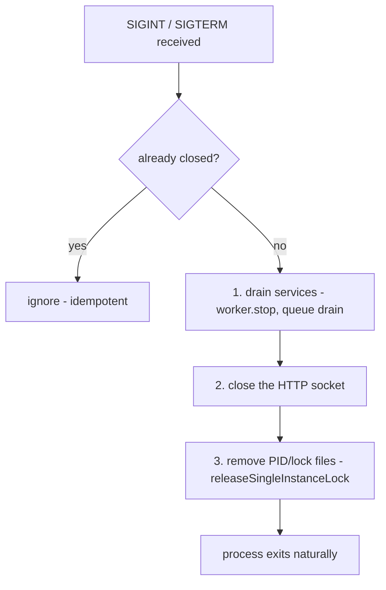

# PRD-002d: Single-Instance Lock and Graceful Shutdown

> Parent: [`prd-002-nectar-daemon-index.md`](./prd-002-nectar-daemon-index.md)

## Overview

This sub-PRD defines the **single-instance PID/lock guard** and the **graceful shutdown** path for the nectar daemon. It is the mechanism contract that 002a's bootstrap *orders* (lock before bind) and that 002c's `nectar daemon` *relies on* (a second start refuses; a restart leaves no stale lock). It mirrors honeycomb's `acquireSingleInstanceLock` / `releaseSingleInstanceLock` (`honeycomb/src/daemon/runtime/assemble.ts:715-756`) and the `runAssembledDaemon` close path (`honeycomb/src/daemon/index.ts:166-187`).

The guard's purpose is twofold, both inherited from honeycomb's `DaemonAlreadyRunningError` contract (`honeycomb/src/daemon/runtime/assemble.ts:672-685`): (1) a second `nectar daemon` start **throws before the socket bind** so port 3854 is never double-bound; (2) a stale lock (the recorded PID is dead) is **reclaimed** so a crashed daemon never wedges the next start. nectar's filenames differ from honeycomb's (`daemon.pid`/`daemon.lock`) so the two daemons' locks coexist in the same `~/.honeycomb` dir — a single `ls ~/.honeycomb/*.pid` enumerates every live daemon, the same convenience honeycomb's PID file provides (`honeycomb/src/daemon/runtime/assemble.ts:726-727`).

The graceful shutdown path is the contract doctor's restart rung relies on (PRD-003): a clean restart leaves no `nectar.lock` behind, so the next `acquireSingleInstanceLock` does not falsely report "already running."

## Goals

- Specify the **single-instance lock acquire** mirroring `acquireSingleInstanceLock` (`honeycomb/src/daemon/runtime/assemble.ts:715-732`): mkdir the runtime dir, read the existing PID, `isPidAlive` probe, throw on live / reclaim on stale.
- Specify the **`DaemonAlreadyRunningError`-equivalent** thrown before the bind, mirroring `honeycomb/src/daemon/runtime/assemble.ts:672-685`.
- Specify the **PID-alive probe** (`isPidAlive`, signal-0; `ESRCH` → stale, `EPERM` → alive-but-other-user), mirroring `honeycomb/src/daemon/runtime/assemble.ts:692-705`.
- Specify the **graceful shutdown** path: drain services → close the socket → remove the PID/lock files, idempotent, registered once on SIGINT/SIGTERM (mirroring `honeycomb/src/daemon/index.ts:166-187`).
- Confirm the PID/lock filenames are **distinct from honeycomb's** so the two daemons' locks coexist, and that the paths inherit from [PRD-001](../prd-001-three-daemon-topology/prd-001b-nectar-process-and-health.md).

## Non-Goals

- The bootstrap *ordering* (lock before bind, bind-failure rollback) — [`prd-002a`](./prd-002a-nectar-bootstrap-and-composition-root.md). This PRD owns the lock/shutdown *mechanism*; 002a owns where in the sequence it runs.
- The OS service unit (launchd/systemd/schtasks) that sends SIGTERM on stop — **PRD-003b**.
- doctor's watchdog-war guards against this lock (the restart rung respecting `~/.honeycomb/nectar.pid`) — **PRD-003c**. This PRD defines the lock nectar writes; PRD-003c defines doctor reading it.
- The worker's in-flight job draining semantics (stale-lease reclamation) — [`prd-002b`](./prd-002b-hiveantennae-worker.md). The shutdown *drains* the worker; the queue's reaper handles the in-flight lease.
- The port (3854) and the runtime dir (`~/.honeycomb`) — inherited from [PRD-001](../prd-001-three-daemon-topology/prd-001b-nectar-process-and-health.md); not re-registered here.

---

## The single-instance lock

The lock mirrors `acquireSingleInstanceLock` (`honeycomb/src/daemon/runtime/assemble.ts:715-732`) step for step:

1. **mkdir** the runtime dir (`~/.honeycomb`, recursive) — `honeycomb/src/daemon/runtime/assemble.ts:716`.
2. **Read** the existing PID from the lock file via `readPidFile` (absent/unreadable/garbage → `null`) — `honeycomb/src/daemon/runtime/assemble.ts:720, 734-745`.
3. **Probe** whether that PID is alive via `isPidAlive` (signal 0; `ESRCH` → stale/no-such-process, `EPERM` → alive-but-other-user, else alive) — `honeycomb/src/daemon/runtime/assemble.ts:692-705`.
4. **Throw** a `DaemonAlreadyRunningError`-equivalent if a lock exists AND its PID is alive — **before** the socket bind (`honeycomb/src/daemon/runtime/assemble.ts:720-723`).
5. **Stamp** this process's PID into both the lock and PID files (fresh start or stale reclaim) — `honeycomb/src/daemon/runtime/assemble.ts:725-730`.

| Property | Value | Citation / status |
|---|---|---|
| Runtime dir | `~/.honeycomb` | `honeycomb/src/daemon/runtime/auth/credentials-store.ts:71` `LEGACY_CREDENTIALS_DIR_NAME = ".honeycomb"`; resolved at `honeycomb/src/daemon/runtime/assemble.ts:688-690` |
| Lock file | `~/.honeycomb/nectar.lock` | inherited from [PRD-001b](../prd-001-three-daemon-topology/prd-001b-nectar-process-and-health.md); **DEFAULT — confirm before implementation** |
| PID file | `~/.honeycomb/nectar.pid` | inherited from [PRD-001b](../prd-001-three-daemon-topology/prd-001b-nectar-process-and-health.md); **DEFAULT — confirm before implementation** |
| Error thrown | `DaemonAlreadyRunningError`-equivalent (carries `existingPid`) | mirrors `honeycomb/src/daemon/runtime/assemble.ts:672-685` |

The lock and PID files carry the same value: the lock is what the guard checks; the PID file is the operator-facing convenience (`cat ~/.honeycomb/nectar.pid`), mirroring honeycomb's comment at `honeycomb/src/daemon/runtime/assemble.ts:726-727`. The filenames are distinct from honeycomb's (`daemon.pid`/`daemon.lock`, `honeycomb/src/daemon/runtime/assemble.ts:184,186`) so the two daemons' locks coexist — a single `ls ~/.honeycomb/*.pid` enumerates every live daemon.

> **Why a distinct lock, not a shared one.** Two daemons cannot share one lock file — that would make the second one refuse to start. doctor already reads `~/.honeycomb/daemon.pid` to respect honeycomb's lock during restart (`doctor/src/config.ts:53,155`). nectar's supervision entry (PRD-003c) points doctor at `~/.honeycomb/nectar.pid` instead, so the restart rung respects the right daemon's lock.

---

## The graceful shutdown path

The shutdown mirrors the `close()` in `runAssembledDaemon` (`honeycomb/src/daemon/index.ts:166-172`) and `releaseSingleInstanceLock` (`honeycomb/src/daemon/runtime/assemble.ts:748-756`):

1. **Drain services** — `worker.stop()` (the idempotent poll-loop stop, [`prd-002b`](./prd-002b-hiveantennae-worker.md)) and the queue drain. In-flight jobs are left to the queue's reaper (stale-lease reclamation, [`prd-002b`](./prd-002b-hiveantennae-worker.md)); the drain does not block on a hung handler indefinitely.
2. **Close the HTTP socket** — stop accepting new requests (mirroring `running.close()` at `honeycomb/src/daemon/index.ts:170`, which "closes the socket + calls daemon.stopServices()").
3. **Remove the PID/lock files** — `releaseSingleInstanceLock`-equivalent, which `rmSync`s both files with `force: true` and never throws (a missing lock on shutdown is fine — the goal already holds) (`honeycomb/src/daemon/runtime/assemble.ts:748-756`).

### The signal-handler registration

The handlers are registered **once**; a `closed` flag makes `close()` idempotent so a second signal is ignored (mirroring `honeycomb/src/daemon/index.ts:166-169` — `if (closed) return; closed = true;`). The registration mirrors honeycomb exactly:

- `process.once("SIGINT", () => onSignal("SIGINT"))` and `process.once("SIGTERM", () => onSignal("SIGTERM"))` (`honeycomb/src/daemon/index.ts:183-184`).
- The `onSignal` handler invokes the idempotent `close()` and writes a structured stop line to stderr (mirroring `honeycomb/src/daemon/index.ts:176-182` — `process.stderr.write(...)`); it does not re-raise — the process exits naturally once the loop drains.

### Bind-failure rollback

A bind failure (`EADDRINUSE` on `127.0.0.1:3854`) after a clean lock acquire rolls the lifecycle back: `assembled.shutdown()` drains services, stops the health probe, and **removes the PID/lock** so a failed start leaves nothing dangling, then re-throws the real cause (mirroring `honeycomb/src/daemon/index.ts:159-164`). This is why the lock is acquired before the bind: a failed bind must clean up the lock it just wrote.

---

## User stories

### US-002d.1 — A second start refuses to double-bind
**As an** operator, **when** I start a second `nectar daemon` while one is running, **the** second start throws before binding the port, **so that** port 3854 is never double-bound.

- Acceptance: a live `~/.honeycomb/nectar.lock` PID throws a `DaemonAlreadyRunningError`-equivalent before the socket bind (mirroring `honeycomb/src/daemon/runtime/assemble.ts:720-723`).
- Acceptance: the error carries the existing PID (mirroring `honeycomb/src/daemon/runtime/assemble.ts:672-685`).

### US-002d.2 — A stale lock is reclaimed
**As an** operator, **when** the daemon crashed and I start it again, **the** stale lock is reclaimed, **so that** a crashed daemon does not wedge the next start.

- Acceptance: a dead recorded PID (`ESRCH` on the signal-0 probe) is reclaimed; the new PID is stamped (mirroring `honeycomb/src/daemon/runtime/assemble.ts:692-705, 725-730`).
- Acceptance: `EPERM` (alive, other user) is treated as alive, not stale (mirroring `honeycomb/src/daemon/runtime/assemble.ts:702-703`).

### US-002d.3 — A restart leaves no stale lock
**As** doctor, **when** I restart nectar, **the** graceful shutdown removes `~/.honeycomb/nectar.lock`, **so that** the next start is not falsely blocked.

- Acceptance: SIGTERM drains services, closes the socket, and removes the PID/lock files (mirroring `honeycomb/src/daemon/index.ts:166-172` + `honeycomb/src/daemon/runtime/assemble.ts:748-756`).

### US-002d.4 — A second signal is ignored
**As an** operator, **when** I send SIGINT twice, **the** second is ignored, **so that** the drain is not interrupted.

- Acceptance: `close()` is idempotent (`closed` flag); handlers are registered once with `process.once` (mirroring `honeycomb/src/daemon/index.ts:166-169, 183-184`).

### US-002d.5 — A bind failure cleans up the lock
**As an** operator, **when** port 3854 is in use, **the** failed start removes the lock it just wrote, **so that** no stale lock survives.

- Acceptance: a bind failure triggers `assembled.shutdown()` (drain + remove lock) before re-throwing (mirroring `honeycomb/src/daemon/index.ts:159-164`).

### US-002d.6 — The two daemons' locks coexist
**As an** operator, **when** both honeycomb and nectar run, **both** PID files sit in `~/.honeycomb`, **so that** `ls ~/.honeycomb/*.pid` enumerates every live daemon.

- Acceptance: nectar uses `nectar.pid`/`nectar.lock`; honeycomb uses `daemon.pid`/`daemon.lock` (`honeycomb/src/daemon/runtime/assemble.ts:184,186`); both live under `~/.honeycomb`.

---

## Implementation notes

- Single-instance lock acquire + release: `honeycomb/src/daemon/runtime/assemble.ts:715-756` (`acquireSingleInstanceLock`, `releaseSingleInstanceLock`, `readPidFile`).
- PID-alive probe (signal 0, `ESRCH`/`EPERM`): `honeycomb/src/daemon/runtime/assemble.ts:692-705` (`isPidAlive`).
- `DaemonAlreadyRunningError`: `honeycomb/src/daemon/runtime/assemble.ts:672-685`.
- Graceful shutdown close path + signal handlers: `honeycomb/src/daemon/index.ts:166-187` (`close`, `onSignal`, `process.once("SIGINT"/"SIGTERM", …)`).
- Bind-failure rollback: `honeycomb/src/daemon/index.ts:159-164`.
- Runtime dir + lock/pid filenames: `honeycomb/src/daemon/runtime/assemble.ts:184,186,688-690,726-727`; `honeycomb/src/daemon/runtime/auth/credentials-store.ts:71`.
- doctor's read of the daemon PID (the contract PRD-003c generalizes to nectar): `doctor/src/config.ts:53,155`.

No open questions. The PID/lock filenames (`~/.honeycomb/nectar.{pid,lock}`) are inherited defaults from [PRD-001b](../prd-001-three-daemon-topology/prd-001b-nectar-process-and-health.md), flagged above.
